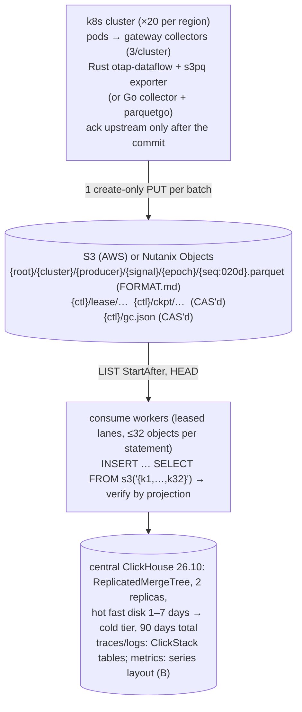

# Decisions: edge → S3 → ClickHouse telemetry pipeline (otel-chdb spike)

The architecture decision record for this spike. It gathers findings that are
spread over about twenty READMEs, several of which changed direction more than
once. Where a README and this file disagree, the README is the evidence and
this file is the summary. Section 5 lists the places where the READMEs
disagreed with each other, and how each was resolved.

- **Branch:** `claude/brave-pascal-0fecgh`, head `7125a72` (2026-09-26).
- **Scope:** the spike commits from `8156caa` (chdb-go vendored) to `7125a72`
  (edge sorting). Earlier commits on the branch belong to oscope itself.
- **Labels,** as in the READMEs: **[M]** measured in the spike, **[E]**
  estimate, **[D]** from docs or source, **[Q]** Quint model. Nearly every [M]
  was taken on one shared 4-vCPU box against SeaweedFS on localhost. The
  exceptions are the idle-box runs in `bench/clean` and `bench/sorting`.
- **Commit hashes** point at the commit that added or last changed the
  evidence.

## The pipeline in one picture



## Decision index

| # | Decision | Status |
|---|---|---|
| [D1](#d1-edge-publisher-rust-otap-dataflow-exporter-go-parquetgo-not-chdb) | Edge publisher: Rust otap-dataflow exporter where it can run, Go `s3pq` (parquetgo) for Go collectors, not chDB | accepted; **Go path kept** (2026-09-26); its gaps closed the same day (s3pq: manifest-less for every signal, layout B, row-identical with Rust through the consumer) |
| [D2](#d2-transfer-format-parquet-read-with-s3-not-native-parts) | Transfer format: Parquet read with `s3()`, not native parts on `s3_plain_rewritable` | accepted; traces/logs land in ClickStack 2.39.1's DDL minus the four mapKeys indexes (option 2, 2026-09-27): insert 2.4–2.6×, merges 2.0× the old tables |
| [D3](#d3-commit-protocol-manifest-less-create-only-slots) | Commit protocol: manifest-less create-only slots | accepted; manifests and the S3-native log superseded |
| [D4](#d4-awss3exporter-stock-rejected-patched-prototyped-own-exporter-preferred) | awss3exporter: stock rejected, patched version prototyped, own exporter built | stock rejected; **own exporter `s3pq` built and deployed (2026-09-26)**; awss3inline superseded |
| [D5](#d5-otap-variants-otap-only-as-an-input-transport) | OTAP: only as an input transport; never stored | accepted |
| [D6](#d6-no-edge-to-central-fast-path) | No edge-to-central fast path | accepted |
| [D7](#d7-metrics-series-table-layout-b-not-the-clickstack-tables) | Metrics: series-table layout B; wire-size ordinal rejected | accepted; built in both edges (Go: 2026-09-26) |
| [D8](#d8-consumer-leases-and-checkpoints-on-s3) | Consumer: leases and checkpoints on S3 | accepted; idle-lane LIST backoff, load-based balancing (2026-09-26); event notifications designed, not built |
| [D9](#d9-consumer-time-bound-on-inserts-plus-a-server-side-deadline) | Consumer: time bound plus a server-side deadline | accepted; margin ≥ 20 s (TTL 75 s) enforced, unanswered statements and error answers that may still commit waited out (2026-09-26, after the replicated run measured commits 19 s past the time limit) |
| [D10](#d10-consumer-multi-object-statements-squashed-to-one-block) | Consumer: multi-object statements squashed to one block | accepted; linger built, off by default (2026-09-26) |
| [D11](#d11-consumer-count-check-and-repair-not-dedup-tokens) | Consumer: count check and repair, not dedup tokens | accepted; the check reads the batch's partitions ± a copy horizon (2026-09-26), 3 days, with a horizon audit reporting late copies; edge replays keep `received_at` (2026-09-27), so the horizon now covers sender resends only |
| [D12](#d12-consumer-gc-and-checkpoint-compaction) | Consumer: GC and checkpoint compaction | accepted; GC keeps the slot below the position (2026-09-26) |
| [D13](#d13-replicated-central-plain-replicatedmergetree-no-zero-copy) | Replicated central: plain ReplicatedMergeTree, zero-copy rejected, sync before checks | accepted; the fleet-scale consumer run on it (2026-09-26/27): exactly once, margin raised to 20 s, audit syncs; replicated DDL now ClickStack's with the rollups, derived from the consumer's (2026-09-27); insert CPU paid once per shard, +9% per statement (2026-09-27) |
| [D14](#d14-storage-tiers) | Storage tiers: hot 1–7 days, then cold | accepted; cold medium open |
| [D15](#d15-metrics-downsampling) | Metrics downsampling: 5-minute rollups | proposed; not built |
| [D16](#d16-edge-sorting-off-service-affine-routing-on-at-n--8) | Edge sorting off; service-affine routing at N ≥ 8 | accepted; routing built as `deploy/components/routing`, measured locally, not deployed |
| [D17](#d17-lake--hybrid-cold-tier) | Lake / hybrid cold tier | exploratory |
| [D18](#d18-s3-client-and-credentials) | S3 client and credentials | accepted; amended 2026-09-28: the consumer takes the credential chain and a region, `s3()` gets per-statement temporary credentials or the server's own; every role's policy answers 404 for a missing key (`ListBucket` under `StringLikeIfExists`) |
| [D19](#d19-durable-buffer-at-the-edge) | Durable buffer at the edge | accepted: Go persistent queue; Rust Quiver on in the deployed publisher (`backpressure`); `received_at` = entry into the buffer, kept across replays (2026-09-27); **retention bounds custody age, not cap ÷ rate** (model, 2026-09-27) |
| [D20](#d20-pbt-defect-fixes-in-chdbexporter) | PBT defect fixes in chdbexporter | 1–3 fixed; 4–7 open |
| [D21](#d21-entity-catalog-resource_id-at-the-edges-announcements-in-the-data-object) | Entity catalog: `resource_id` at both edges, announcements in the data object | **built** (2026-09-28): `resource_id` on every trace/log row and the announcement lane; central keeps `ResourceAttributes` (the schema switch and the rewrite proxy not decided) |
| [D22](#d22-query-service-sql-rebuilt-from-the-tree-scope-as-table-filters-labels-on-every-result) | Query service: OIDC + audit, SQL rebuilt from the tree, scope as `additional_table_filters`, `complete_through` on every result, a presigned lake plan | **first slice built** (2026-09-28, [`query/`](query/README.md)): central queries and lake plans for both UIs; the UIs and the alert evaluator are not wired yet |
| [D23](#d23-alert-evaluator-gated-on-the-query-services-label-state-by-compare-and-swap-an-outbox-ledger) | Alert evaluator: rules as data through the query service, evaluated only on `complete` windows, "cannot evaluate" pages, compare-and-swap state on S3 (two replicas, no lease), an outbox ledger with stable dedup keys | **built** (2026-09-28, [`alerts/`](alerts/README.md)): R-S3, AMBIGUITY X5/X6/X11 partly; tested against a fake Alertmanager |
| [D24](#d24-lake-ui-first-slice-plan-range-read-in-the-page-completeness-on-every-view) | Lake UI: a static page on `/v1/plan`, hyparquet range reads (footer, then only the needed column chunks), X8's re-plan rules as a tested state machine, completeness computed for every row, bucket and point | **first slice built** (2026-09-28, [`lakeui/`](lakeui/README.md)): logs, trace by id, a gauge chart; Playwright against the real stack |
| [D28](#d28-mosaic-vgplot--duckdb-wasm-for-the-lake-uis-analytical-views-fed-by-the-range-reader-proposed) | Mosaic (vgplot + DuckDB-WASM) for the lake UI's analytical, cross-filtered views, fed by lakeui's range reader; hyparquet-only stays for search and trace | **deferred** by the owner (2026-09-28); spike kept as evidence: [`lakeui/mosaic/`](lakeui/mosaic/README.md), [research/mosaic.md](research/mosaic.md) |
| [D30](#d30-the-basis-answers-at-a-named-custody-time) | The basis: every query and plan answer names a custody time per cluster (an HMAC-protected token); a request at a basis reads only rows received before it (strictly), so its answer never changes; deltas between bases; the alert evaluator re-checks evaluated windows for late rows (`on_late`); one basis per dashboard refresh and per lake UI run; caches keyed on it | **built** (2026-09-28): `query/internal/basis`, the service, the lake plan, the adapter and fork patch 0003, the lake UI, the evaluator; [research/bitemporal.md](research/bitemporal.md) §3 |
| [D33](#d33-hyperdx-through-the-query-service-fully-scoped-dictionaries-labelled-samples-a-performance-settings-allow-list-cluster-on-the-rollups-the-users-token-server-side) | HyperDX through the query service, fully: the catalog's dictionaries by name with every lookup guarded per caller, `resource_kv` served, a labelled sample mode, a performance-settings allow-list in configuration, a cluster column on the key/value rollups, the user's token on user-started server-side queries, `total_rows` as 0/1 for restricted callers | **built** (2026-09-28): owner decisions of 2026-09-28; the rwproxy chain 69/69 through the service |
| [D32](#d32-the-entity-catalog-as-bitemporal-events-resolved-at-query-time-proposed) | Entity catalog as append-only bitemporal events (assert / retract / unknown from the controller, the overseer, announcements), resolved by a backwards replay with one precedence rule (the controller within a trust window, then system time; announcements fill only what the authority does not know), a materialised current view | **proposed** (2026-09-28): model, reference resolver and fleet replay [`entities/bitemp/`](entities/bitemp/README.md); no storage change; owner to decide |
| [D34](#d34-centrals-partition-key-todatereceived_at-late_part-late-parts-in-partitions-of-their-own) | Central's traces and logs partitioned by `(toDate(received_at), late_part)`: an object-constant column from the edges' `oscope-part`, statements that never mix parts, the range check on the first element (an exact key list), an online-copy-then-pause migration | **built** (2026-09-28): owner decision; 1.9× fewer granules per 5-minute window merged, 5.6× before the merges, through the real consumer; migration pause 3.9 s |
| [D35](#d35-dead-lane-retirement-a-proof-of-empty-custody-then-quarantine-below-the-bound-built) | Dead-lane retirement: a lane leaves `complete_through` only on an orderly close (drained) or an operator's evidence (volume deleted, no PUT in flight, every slot passed); +inf until a later epoch; below R quarantine, never ingest | **built** (2026-09-29): the orderly close (both edges), its retirement, +inf, the quarantine, `consume retire-lane` and `consume admit` into recovered tables (FORMAT.md §3.1, `model/retirement.qnt`) |
| [D36](#d36-langfuse-shaped-llm-traces-one-store-content-by-reference-facts-resolved-at-a-basis) | Langfuse-shaped LLM traces: OTLP only on the same lanes; the edge offloads large values by per-tenant content hash into a payload part of the same object; LLM spans stay `otel_traces` rows with typed `llm_spans`/`llm_scores` views and `llm_payloads`; scores, corrections and prices as facts resolved at a basis; a separate content right; LLM views in the HyperDX fork | **accepted** (2026-09-29); **phase 1 built** (2026-09-29: both edges' offloader, the payload part, the consumer's payloads-first, `llm_payloads`/`llm_spans`/`llm_scores`, the route alias for Langfuse's path in both edges); phase 2 not built: [research/langfuse.md](research/langfuse.md) (STPA first), spike [`langfuse/spike/`](langfuse/spike/README.md) |
| [D37](#d37-the-tenant-from-a-users-entra-identity-for-producers-outside-kubernetes-a-device-forwarder-and-an-authenticated-ingress-proposed) | Producers outside Kubernetes (developer tools on Windows/Mac, later CI/serverless): a device forwarder gets an Entra token through the platform broker (MSAL.NET); a Go ingress verifies it, maps the identity to `(devtools, dev-<team>)` by policy, stamps tenant and person over producer claims deterministically, and commits as an edge with its own lanes (D11 copies, D35 close); per-user caps; query grants as `(cluster, namespace)` pairs | **proposed** (2026-09-29); ingress prototype built and tested against a fake issuer: [research/entra-ingress.md](research/entra-ingress.md) (STPA first), [`ingress/`](ingress/README.md) |
| [D38](#d38-grants-as-explicit-role-cluster-namespace-tuples-environments-as-buckets-cedar-as-the-source-compiled-to-tuples-and-prefixtag-iam-partly-built) | Grants: explicit `(role, cluster, namespace)` tuples combined as a union, never a product (CAST 52; built); environments as a bucket (or account) each with a cluster registry that gates writes; Cedar policies as the source, compiled to per-environment query-service tuples and prefix/principal-tag IAM, other policies refused with a reason and the output checked against Cedar; person facts scoped by a `resolve_person` tuple | **partly built** (2026-09-29): tuples in the query service; `grants/` compiler prototype; the rest proposed: [research/grants.md](research/grants.md) (STPA first) |
| [D39](#d39-stpa-data-as-normalized-records-the-control-structure-as-one-document-tables-and-diagrams-generated-from-them-accepted-built) | STPA data as normalized records (one fact, one home; adapted from stpa-workbench v0, whose strict form is an export) and the control structure as one document where duplicate links cannot be written; controllers hold their process model and control algorithm; STPA.md's tables, the diagrams (overview plus a detail per controller, in the PRD style) and the label catalogue generated and checked in CI; UCA-10/12 feedback flaws; H-8 the availability hazard; OSCAL a later export | **accepted; built** (2026-09-29): 222 records, stpa/structure.yaml |
| [D40](#d40-the-device-forwarder-as-built-the-tools-200-means-held-in-memory-a-pure-queue-core-yarp-for-each-attempt-proposed) | The device forwarder (D37 as revised): the tool is answered at once from a bounded in-memory queue (200 = held, best effort); a pure queue core with every outcome classified (a lost answer is unknown); YARP sends each attempt; MSAL broker behind an interface; tested on three OSes and end to end against the Go ingress | **proposed** (2026-10-01); built and tested in CI with the broker faked: [`forwarder/`](forwarder/README.md), research/entra-ingress.md §10b |

---

## 1. Context and requirements

### 1.1 Deployment targets

Every S3 client in the pipeline must work in all three. The evidence for each
client is in [D18](#d18-s3-client-and-credentials).

| Target | Store | Credentials | TLS | What is unknown |
|---|---|---|---|---|
| EKS | AWS S3 | IRSA (`AWS_ROLE_ARN` + web-identity token) or EKS Pod Identity (container credentials + token file) | public CAs | real EKS/STS never used: all [M] is against local stand-ins |
| Nutanix | Nutanix Objects, custom https endpoint, path-style | static keys | **private CA** | **whether `If-None-Match: *` is supported and atomic**; HEAD/LIST consistency; `x-amz-meta-*` and CRC32 trailer handling ([`awss3/README.md`](awss3/README.md) §Deployment, [`model/S3NATIVE.md`](model/S3NATIVE.md) §9) |
| Outside AWS | AWS S3 | IAM Roles Anywhere: `aws_signing_helper` as `credential_process`, or `serve` (IMDSv2 emulation) | public CAs | a real `aws_signing_helper` was never run |

### 1.2 Fleet and rates, per region

The fleet is 15–20 Kubernetes clusters of about 200 nodes and about 3,000 pods.
The sizing uses the calculator's mid scenario, which takes the top of that
range. Only the fleet shape comes from requirements; the per-pod rates are
estimates ([risk 2](#4-open-risks-and-unknowns-ranked)).

| Input | Mid scenario | Provenance |
|---|---|---|
| clusters × nodes × pods | 20 × 200 × 3,000 (4,000 nodes, 60,000 pods) | requirement (upper end of 15–20) |
| spans / s per pod (after sampling) | 10 | [E] calculator default |
| logs / s per pod, per node | 3, 5 | [E] |
| active series per pod, per node | 500, 2,000 (38 M series) | [E] |
| export interval | 30 s | [E] |
| resulting rows / s | 600k spans, 200k logs, 1.27 M points: **2.07 M** | derived |
| gateway publishers per cluster | 3 (60 per region) | [E] |
| edge batch | 10,000 rows per object | design choice |

### 1.3 Retention

| Tier | Requirement | Calculator default |
|---|---|---|
| total | 90 days | 90 |
| fast disk (hot) | 1–7 days | 1 |
| raw metrics | not stated | 14 days, then 5-minute rollups ([D15](#d15-metrics-downsampling)) |
| series table | as long as any point or rollup refers to it | TTL on `LastSeen` ([`metrics-layout/README.md`](metrics-layout/README.md) §Downsampling) |

### 1.4 Correctness requirements (Quint models)

These invariants are the correctness contract. "Checked in code" means a
quint-connect or quintgo test replays model traces through the implementation.

**CI (2026-09-27)** runs these checks, not only the author's box
([`../ci/README.md`](../ci/README.md)): `ci.yml` on every push (`go vet`
and `go test -race` in the fast Go modules, clippy, the Rust unit tests
with the consumer's ClickHouse/S3 tests, and the Rust integration tests
`determinism`, `otap_view`, `metrics`, `series`); `nightly.yml` daily
(conformance for both layouts and `go_faults.sh`, `faults.sh` and a
consumer soak, the three quint-connect MBT suites at seed 0x5eed, the
model checks through `ci/model-check.sh` and `parquetgo/modelcheck`, and
the chDB tests). A CI run is on SeaweedFS and a single ClickHouse in
Docker, like the [M] here: it guards against regressions, it does not
retire the risks of §4.

| Model | Invariants the design must keep | Checked | Checked in code |
|---|---|---|---|
| `model/edgePublish.qnt` (manifests; now superseded) | `commitImpliesData`, `onlyCommittedIngested`, `batchIngestedAtMostOnce`, `payloadIngestedAtMostOnce`, `sealMatchesManifests` | 5,000 × 40-step simulation; Apalache ≤ 8–10 steps ([`model/README.md`](model/README.md), `1307816`) | quintgo conformance and model-seeded PBT ([`PBT.md`](PBT.md), `38c641e`) |
| `model/partLifetime.qnt` (native parts; now moot) | `noReadOfDeleted`, `noLeakAfterExit`, `noDoubleCount`; the rule **`old_parts_lifetime` > max query + refresh interval** | Apalache ≤ 10–12 steps | server test `TestOldPartsLifetimeProtectsServerQueries` (`2f1f3c2`) |
| `model/s3Inline.qnt` (**the commit protocol in use**) | `payloadIngestedAtMostOnce`, `epochNoDuplicatePayload`, `onlyCommittedIngested`, `noCommitLost`, `ackedImpliesCommitted`, `noPayloadLost`, `gapNeverTakenForLoss`, `consumerNeverSkipsCommitted`, `noCommitAfterClose`; since 2026-09-27 module `s3InlineReceived`: `replayKeepsReceivedAt` (every copy carries its custody day) and at-most-once under a check limited to HORIZON days | 3,000 × 80 steps, two seeds; Apalache ≤ 6 steps (8 partial); 6 mutations caught ([`awss3/README.md`](awss3/README.md), `0855334`); `s3InlineReceived` 3,000 × 80 at HORIZON 1 and 0, mutant `restampOnReplay` caught (`484f22f`) | `tests/mbt_s3inline.rs`: 300 traces, 16,981 steps; 3 code mutants caught ([`otap-rs/README.md`](otap-rs/README.md), `060e963`) |
| `model/s3InlineMetrics.qnt` | `reqAckedImpliesAllCommitted`, `noObjectLost` (a request is acked only when all its objects commit) | 3,000 × 60; mutant `ackOnAny` caught | `tests/mbt_s3inline_metrics.rs`: 300 traces, 23,968 steps |
| `model/s3InlineConsumer.qnt` | `atMostOnce`, `onlyCommittedIngested`, `neverSkipsCommitted`, `noCommitAfterClose`, `announcedOnlyAfterCommit`; since 2026-09-26 over release, the commit slack, daily partitions and the check's range; the horizon audit's `auditSilent` (designs) and `dupAudited` (`noHorizon`) | 5,000 × 60 on five design instances; mutants by simulation `noTimeBound`, `noVerify`, `gcTombs`, `announceEarly`, `releaseInFlight`, `errorSettles`; by scripted counterexample runs `releaseInFlight`, `keeperOverrun`, `noHorizon`, `wallRange`, `gcReopens`, `errorSettles` ([`otap-rs/README.md`](otap-rs/README.md) §Consumer at fleet scale). **2026-09-27, custody day:** an object's received day is its request's custody day (`pDay`, stamped once per incarnation); new instance `noHorizonReplays` (HORIZON 0, edge replays only) passes safety and `auditSilent`; `noHorizon` now needs sender resends; new mutant `restamp` (the edge before `8efc34f`) breaks `atMostOnce` by a scripted run; all verdicts as expected except that random simulation (20,000 × 60, seed 0x5eed) found none of the six mutants that need about a dozen specific steps (`releaseInFlight`, `keeperOverrun`, `errorSettles`, `noHorizon`, `restamp`, `gcReopens`), each caught by its scripted run (`otap-rs/results/consumer/custody/model.txt`); quint-connect on all five instances passes after the change (`custody/mbt.txt`) | `tests/mbt_s3inline_consumer.rs`; code mutants `no_time_bound`, `no_verify` (`1b5ce6c`), `release_in_flight`, `wall_range` |
| `model/s3InlineConsumerCompact.qnt` | the above plus `neverSkipsCommittedCompact`, `noCommitBelowFloor`, `floorSound`, `viewFloorSound`, `bounded` | 5,000 × 60; `compactBound` 20,000 × 150; mutants `earlyCompact`, `floorOnly` | code mutant `early_compact` (`9f2c75d`) |
| `model/fastPath.qnt` | `onlyCommittedIngested`, `batchIngestedAtMostOnce`, `noLostBehindCheckpoint` | 1,500 × 40, 23 scenarios; Apalache ≤ 10 steps ([`model/FASTPATH.md`](model/FASTPATH.md), `bd1ae88`) | not applicable: not built ([D6](#d6-no-edge-to-central-fast-path)) |
| `model/s3Native.qnt` (superseded) | 13 invariants, including `noWriteFromFencedWriter`, `gcKeepsLiveData`, `nsSingleWriter` | 3,000 × 120; Apalache ≤ 6 steps ([`model/S3NATIVE.md`](model/S3NATIVE.md), `30210a5`) | `s3cas` protocol tests only |
| `model/completeness.qnt` (open scenario: `complete_through` and the alert evaluator; [research §5.4](research/central-optional.md#54-complete_through-a-watermark-for-deterministic-alerts)) | `completeSound` (every request with `received_at` below the published watermark is ingested), `evalWithinComplete`, `okMeansNoErrors`, `noSilentOk`, `resultLabeled`, `wmBounded` | 20,000 × 80; 11 witnesses reached; mutants `lastReceived`, `listTimeIdle`, `maxNotPrefix`, `noBirth`, `evalPastComplete`, `noDataOk`, `unlabeledFallback` caught by simulation and by scripted runs; `noHeartbeat` safe but stalls every window (scripted) (`cadd7a1`); since D29 also per cluster (`clusterSound`, the rule's cluster scope; mutants `scopeMax`, `clusterSplit`). **Finding:** §5.4's rules are unsound (an open requirement, recorded under [D19](#d19-durable-buffer-at-the-edge)) | the watermark: `consumer::tests::complete_through_*` (D19); the evaluator side (`evalWithinComplete`, `noDataOk`, `noSilentOk`): `alerts/` (D23), gated on the query service's label |
| `model/alertEvaluator.qnt` ([`alerts/`](alerts/README.md), D23) | `evalOnlyComplete`, `resolvedAfterFiringAck`, `noLostEpisode`, `nextMonotone` (two replicas, compare-and-swap with lost answers and writes, a pager that loses answers) | 20,000 × 40; 2 witnesses reached; mutants `evalPastCt`, `ackOnNoAnswer`, `blindWrite` caught (`model/alert_model.sh`, nightly). Since D30 also late data: `noDoubleCount`, `lateNeverResolves`, `lateOnlyIfHolds`; 3 more witnesses; mutants `lateDouble`, `lateResolves` caught | `alerts/internal/runner/sim_test.go` (two-replica simulation), `simlate_test.go` (with late rows), `internal/engine/prop_test.go` |
| `model/entityCatalog.qnt` (open scenario: [`entities/`](entities/README.md), STPA LS-5) | `noPermanentOrphan`, `announcedAfterCommit`; `exactAtQuery` (controller up, G ≥ D + LAG); `exactAfterLag` (announcements in the data lane) | 20,000 × 60 on four instances (`sameObject`, as built, since 2026-09-28); mutants `noAnnounce`, `announceEarly`, `sameObjectEarly`, `shortGrace`. **Finding:** a separate announcement lane closes only the permanent gap: rows can land before their announcement (`exactAfterLag` fails); announcements ahead of their rows in the data lane bound the gap to the dictionary lag | **built** ([D21](#d21-entity-catalog-resource_id-at-the-edges-announcements-in-the-data-object)): `tests/dst/fleet.rs` checks `sameLane` (no row lands before its resource's announcement) and announcements exactly once under the fault menu (`hegel_dst` rule `announce`); `entities/scripts/announce_e2e.py` (a pod the controller never saw exact 34.7–59.1 s after its rows, with `LIFETIME(MIN 30 MAX 60)`) |
| `model/retention.qnt` (open scenario: STPA LS-10, R-S6) | `acceptedVisible` (an acked request is never inserted into an expired partition), `noEdgeDrop`, `custodyAgeBounded` | 20,000 × 50; 6 witnesses; mutants `retentionShort`, `cutDuringOutage`, `capSized` (retention sized as cap ÷ rate) caught; `dropOldest` keeps `acceptedVisible` and breaks `noEdgeDrop`. **Finding:** D19's retention rule was wrong ([D19](#d19-durable-buffer-at-the-edge)) | not applicable (a sizing rule) |
| `model/sealer.qnt` (open scenario: the lake's snapshot log, [research §5.1](research/central-optional.md#51-the-sealer-is-a-consumer-group-with-a-table-log-sink)) | `monotone`, `repeatableAsOf`, `atMostOncePerSnapshot`, `neverSkipsSealed`, `wmSound` | 20,000 × 40; 5 witnesses; mutants `blindCommit`, `noRebase`, `wmFromList`, `noDedup` (`abe3e97`) | not built |

The four open-scenario models run from `model/open_models.sh` (quint 0.32,
Rust evaluator), a row per check with its expected verdict: every row as
expected at seed 0x5eed (`abe3e97`; the script has 82 rows, the commit
message counts 86) [Q]. 2026-09-28: the `entityCatalog` rows rerun with the
built design (`sameObject`) and its mutant (`sameObjectEarly`): 26 rows,
all as expected; the script now has 89 rows. 2026-09-28 (D29): the
`completeness` rows rerun with the per-cluster watermark: 46 rows (14 new),
all as expected; the script now has 103 rows. They are sampled simulations
and scripted runs of small instances, not proofs; only `entityCatalog`'s
ingest rule is mirrored in code (`tests/dst/fleet.rs` `sameLane`), and CI's
`ci/model-check.sh` runs `consumer_model.sh`, not this script.

Assumptions every model makes, and which the code must therefore guarantee:

- **Atomic create-only PUT and CAS on the store** (`ATOMIC_COND`). This holds
  for single-part PUT on SeaweedFS 4.47 [M]. It fails for multipart completion
  on SeaweedFS [M]. It is unknown for Nutanix.
- **Read-your-writes on central** for the count check. On a replicated central
  this needs `SYSTEM SYNC REPLICA … LIGHTWEIGHT` ([D13](#d13-replicated-central-plain-replicatedmergetree-no-zero-copy)).
- **A bounded zombie lifetime and a bounded PUT lifetime,** which GC relies on
  ([D12](#d12-consumer-gc-and-checkpoint-compaction)).
- **Worker insert time bound** (`ZOMBIE_INSERT_BOUNDED`). This is enforced by
  the worker's own clock and by the server-side fence ([D9](#d9-consumer-time-bound-on-inserts-plus-a-server-side-deadline)).
- **A commit lands by fence + budget + slack, and the margin covers the
  slack** (`SLACK ≤ MARGIN`; the worker refuses to start otherwise, [D9](#d9-consumer-time-bound-on-inserts-plus-a-server-side-deadline)).
- **A worker acts on a lane only once its statements are gone:** verify,
  retry and release wait out an unanswered statement, and (2026-09-26) an
  error answer that may come with a commit still resolving: "answered" is
  not "gone" on a replicated central ([D9](#d9-consumer-time-bound-on-inserts-plus-a-server-side-deadline)).
- **The slack is real:** on a replicated central a commit landed 19.0 s
  past a 10 s time limit [M], so slack and margin are 20 s (the Keeper
  session timeout minus the budget; [D9](#d9-consumer-time-bound-on-inserts-plus-a-server-side-deadline)).
- **A copy of a request is received within the check's horizon of its
  original** (3 days; `HORIZON ≥ MAX_DAY` in the model, [D11](#d11-consumer-count-check-and-repair-not-dedup-tokens)).
  **Edge-buffer replays meet it by construction since 2026-09-27:**
  `received_at` is the time the request entered the edge's durable
  custody and a replay keeps it ([D19](#d19-durable-buffer-at-the-edge)),
  so the replay is in its original's partition whatever the outage
  (`replay_received.sh`, a 4-day outage: 3/3 replays skipped; the old
  binary: 3 copies ingested twice, 3 audit WARNs) [M]; in the consumer
  model `noHorizon` (HORIZON 0) holds for edge replays and fails only for
  sender resends [Q]. **The residual:** new custody of the same bytes (a
  sender that resends after its own long outage, or to another
  publisher). The consumer can't enforce it, so it watches for it: the
  horizon audit reports every copy ingested twice because of it
  (`auditLate` in the model; `consumer_late_copies_total`).
- **A bounded custody age** (2026-09-27, `model/retention.qnt`): the TTL
  by `received_at` exceeds the longest time a request stays in an edge's
  custody (backlog + outage with its flaps + drain), not the buffer's cap
  ÷ its rate ([D19](#d19-durable-buffer-at-the-edge)). The edge can't
  enforce it; it is a sizing rule plus an alert on the oldest request in
  custody.
- **Small domains and bounded depth.** A ✓ in simulation is not a proof.
  Apalache goes to 6–12 steps only.

---

## 2. Decisions

### D1. Edge publisher: Rust otap-dataflow exporter, Go parquetgo, not chDB

**Status:** accepted: chDB rejected for publishing; Rust where the Rust engine
can run; Go where the edge must stay a Go collector. **The Go path is kept**
(decided 2026-09-26 by the project owner), and since the same day the Go edge
is the `s3pq` exporter (`parquetgo/s3pqexporter` on `parquetgo/edge`), which
publishes what the Rust edge publishes.

**Decision.** Publish ClickStack-shaped Parquet from a native writer at the
edge. The Rust exporter (`otap-rs`, `urn:otel:exporter:s3pq`) walks the OTLP
protobuf bytes directly through otap-dataflow's zero-copy views. `parquetgo`
does the same job for Go collectors. chDB stays an option only for edges that
must answer SQL locally.

**Alternatives.** chDB in the collector (`chdbexporter`, with a chdb-go fork
for binary-safe inserts); arrow-go as the Go engine; the Go and Rust OTAP
variants ([D5](#d5-otap-variants-otap-only-as-an-input-transport)).

**Evidence** (per 10k-row batch, publishing to S3):

| | chDB exporter | Go `parquetgo` | Rust `otap-s3pq` | Source |
|---|---|---|---|---|
| edge CPU, traces / logs (loaded box) | 105 / 79 ms | 74 / 52 ms | 45 / 33 ms | [`parquetgo/README.md`](parquetgo/README.md) (`de81419`); [`otap-rs/README.md`](otap-rs/README.md) (`060e963`) |
| edge CPU, traces / logs (idle box) | – | 68 / 48 ms | 40 / 29 ms | [`bench/clean/README.md`](bench/clean/README.md) block 1 (`c9376ac`) |
| peak RSS | 390 / 353 MB | 108 / 142 MB | 38 / 32 MB in process; 58 / 51 MB whole engine | same |
| binary | 9.2 MB + 566 MB `libchdb.so` (glibc) | 15.7 MB static | 44.1 MB (glibc, thin LTO) | same |
| object size, traces / logs | 308 / 181 KB (local) | 265 / 155 KB | 131 / 76 KB (bloom on TraceId only) | same |
| S3 requests per batch | 2 PUTs (object + manifest) | 2 PUTs | 1 create-only PUT | same |
| arrow-go engine, for reference | – | 145–149 ms, 628k allocations per batch | – | [`parquetgo/README.md`](parquetgo/README.md) |

- **Rows are identical** across chDB, both Go engines and Rust: checksum and
  `EXCEPT` in both directions, on testgen and on hostile data. The Rust path
  passes 28 of 28 checks ([`otap-rs/README.md`](otap-rs/README.md) §Correctness).
- **Central ingest is at parity** within about ±10% (318 against 265 ms of
  server CPU for 10 traces batches; the 9-run re-run gave 287 against 259). The
  Rust objects read half the bytes.
- **The Rust gain comes from reading OTLP bytes directly, not from OTAP.**
  Going through OTAP record batches first costs 71 / 47 ms.
- **Go `s3pq` (2026-09-26), loaded box:** 43 / 29 ms per 10k spans / logs
  (same run: manifest publisher 40 / 28); 39 ms per 10k metric points in
  layout B against 64 ms for the ClickStack tables with manifests; one
  create-only PUT per object (metrics: 4 PUTs against 10); objects 26–28%
  larger than Rust's, same rows (`parquetgo/compare/results/edge-bench.md`).
- **Go `s3pq` = Rust through the consumer** (`conformance/`, 2026-09-26):
  layout B 228 checks, ClickStack tables 187, 0 failures, on testgen, nasty,
  duplicate-key and a new hostile set (unicode, 1 MiB values, 1,000-entry
  maps, out-of-range enums, extreme histograms, exemplars); same content
  keys, metadata, footers and schema. One known difference, from the Rust
  side: span kinds outside the enum (Rust `Unspecified` via otap-dataflow's
  view; Go and contrib `''`).

**Consequences.**

- There are two edge implementations that must stay row-identical. Keep the
  server-side conformance tests in CI: `conformance/run.sh` (both edges
  through the Rust consumer, both layouts), `conformance/go_faults.sh`,
  `parquetgo/modelcheck` (Go runs against `s3Inline.qnt` /
  `s3InlineMetrics.qnt`), `otap-rs/scripts/correctness.py`. The arrow-go page
  split ([UPSTREAM_ISSUES.md](UPSTREAM_ISSUES.md) U5) and parquet-go's
  untruncated statistics (a 1 MiB value put 2 MiB into the footer, fixed by
  cutting them to 64 bytes) show that writer drift is a real risk.
- The Rust build pins upstream otel-arrow at `5db8358` plus two local patches.
  It needs Rust 1.98.1 (577 MB of toolchain), 395 crates, and an 11-minute
  clean release build ([`otap-rs/README.md`](otap-rs/README.md) §Build).
- The saving is not where the money is. 28 ms saved per traces batch is about
  1.4 cores fleet-wide at 500 producers [E]. Central dominates cost.

**Is the Go path frozen? Decided 2026-09-26: no. The Go path is kept, and
its gaps are closed** (same day). The project owner decided to keep Go as a
supported edge for collectors that must stay Go. The Go edge is now the
`s3pq` exporter (built into `otelcol-s3pq`, `awss3/collector/builder-config.yaml`;
deployed by `deploy/base/go`):

- **Manifest-less for every signal:** `parquetgo/commit` ports the Rust lane
  (`PUT If-None-Match: *` at `{root}/{cluster}/{producer}/{namespace}/{epoch}/{seq:020d}.parquet` (format v2),
  HEAD on a 412 or no answer, epochs named at the first write, tombstone
  halts) with the Rust keys, epoch names, `x-amz-meta-oscope-*` metadata and
  BLAKE3 content keys; a metrics request is acked only when every object has
  committed.
- **Layout B:** `parquetgo/series.go` promotes `metrics-layout/seriesenc`
  (identical to it in prototype mode) with the Rust defaults (merged number
  points, exemplar attributes, BYTE_STREAM_SPLIT, no statistics); series
  announced only after the series object commits.
- **Checked:** row-identical with Rust through the consumer
  (`conformance/`); the Rust fault scenarios pass through the Go edge
  (`conformance/go_faults.sh`); real Go runs conform to `s3Inline.qnt` (30
  runs, 1,558 steps, lane state checked per step) and `s3InlineMetrics.qnt`
  (30 runs, 748 steps), and the mutants RetryNewKey, NoHalt and AckOnAny are
  rejected (`parquetgo/modelcheck`); the deployed config survives a SIGKILL
  with every request once (`deploy/results/go-edge-s3pq.txt`).
- **What stays different:** Go objects are 26–28% larger (parquet-go's zstd
  and V2 pages); the ClickStack layout walks the request once per type
  (87 ms per 10k points, slower than the old 64 ms; layout B is the
  default); a request not in Go's canonical protobuf encoding gets a
  different content key than in Rust. The consumer is Rust-only and serves
  both edges. A Go edge's durable buffer is the collector's persistent queue
  ([D19](#d19-durable-buffer-at-the-edge)), and sorting is off everywhere
  ([D16](#d16-edge-sorting-off-service-affine-routing-on-at-n--8)).

**Open risks.** otap-dataflow is pre-1.0. Its OTAP receiver closes the whole
stream on one undecodable batch (U10). Edges that must be `otelcol-contrib`
builds can't use Rust. The Go edge links parquet-go v0.32.0, whose writer
`Reset` needs a workaround (`TestReusedWriterIdentical`) and which writes a
column and offset index where the Rust layout-B objects have none.

---

### D2. Transfer format: Parquet read with `s3()`, not native parts

**Status:** accepted (`7a1ea50`).

**Decision.** The edge ships one Parquet object per batch. Central ingests it
with `INSERT … SELECT FROM s3()`. Native MergeTree parts on
`s3_plain_rewritable` disks, attached read-only at central, are rejected as the
transfer path.

**Alternatives.** chDB writing `s3_plain_rewritable` tables that central
attaches and reads (built and tested: `452131c`, `2f1f3c2`); both at once.

**Evidence** ([`bench/central/REPORT.md`](bench/central/REPORT.md), `7a1ea50`; [`README.md`](README.md) §Publishing):

| | native parts | Parquet |
|---|---|---|
| central `INSERT … SELECT`, 50 batches: wall / query CPU | 1.49 s / 1.78 s | 1.72 s / 2.12 s (+10% CPU) |
| read for 1 batch | 7.49 MB, 19 GETs (merged part) | 0.26 MB, 1 GET + 1 HEAD |
| edge S3 writes per batch | 51 (compact parts), 75 (wide) | 4.7 by chDB's counter; **2 PUTs** by proxy count ([`parquetgo/README.md`](parquetgo/README.md)) |
| standing cost | 3 LIST + 1 GET per part per table per refresh; +5.7 ms CPU/s per table | none |
| retry after the writer merged the source | **all 80k rows re-inserted** | not applicable: objects are immutable |
| reader with `refresh_parts_interval = 0` | broke about 14 min after a merge | not applicable |
| objects leaked on writer exit | 1,814 objects, 36.5 MB for a 7.2 MB part | none |
| stored size | 1× | 2.2× (while in transit) |
| estimated edge PUT cost, 500 producers | $33k / month | $3k / month [E] |

**Consequences.**

- The partLifetime rules (`old_parts_lifetime` > query + refresh, reader
  leases) no longer bind, because nothing reads live native parts.
- Central pays about 0.4 µs/row for type conversion.
- **The central tables (2026-09-27, option 2; `e784242`, `3c5985e`):**
  traces and logs are ClickStack 2.39.1's DDL minus the four text indexes
  on `mapKeys()` (`idx_res_attr_key`, `idx_span_attr_key`,
  `idx_scope_attr_key`, `idx_log_attr_key`), with its key-value rollup.
  HyperDX 2.39.1 live finds map keys through the `*_attr_items` indexes
  instead: all 46 key-discovery statements rewritten that way, the same
  keys, the rest of its SQL identical; the nine scenarios cost 0.12× the
  old tables' server time, the same as the full DDL [M]. The price
  against the pre-alignment tables: insert 2.4–2.6× (full DDL 2.9–3.5×),
  merges 2.0×; stored bytes spans −20 to −25%, logs ±3% [M, loaded box]
  ([`hyperdx/README.md`](hyperdx/README.md) §Schema, §Option 2;
  `hyperdx/results/schema3-*`). Sizing in [§3](#3-current-sizing-summary),
  the insert cost as a risk in [§4](#4-open-risks-and-unknowns-ranked).
  HyperDX's filter panel lists the envelope columns (`producer_id`,
  `content_key`, …) as facets; hiding them (ALIAS or naming) is open.
- The format is ClickHouse-version independent, and a lakehouse can read it.
  Spark needs `nanosAsLong` for `TIMESTAMP(NANOS)` ([`parquetgo/README.md`](parquetgo/README.md) §Correctness).

**Open risks.** Parquet needs a writer/reader conformance test (U5).

---

### D3. Commit protocol: manifest-less create-only slots

**Status:** accepted (`bd1ae88`, `060e963`). Per-batch manifests
(`452131c`) and the S3-native shared log with a fence entry (`30210a5`) are
**superseded**. The S3-native log is kept on paper for native tables, which D2
rejects.

**Decision.** Each batch is its own commit record. It is written at
`{root}/{cluster}/{producer}/{signal}/{epoch}/{seq:020d}.parquet` with
`PUT If-None-Match: *`, and its description goes in `x-amz-meta-oscope-*`
and the Parquet footer. The keys, metadata and control objects are
specified once, in [FORMAT.md](FORMAT.md) (format v2).

- **Cluster first (format v2, 2026-09-27).** The key starts with the
  cluster, so write access can be scoped by prefix
  ([D18](#d18-s3-client-and-credentials), STPA R-S7); a lane is
  `{cluster}/{producer}/{signal}`. Version 1
  (`{root}/{producer}/{signal}/…`) is a clean break, not read: no real data
  existed, and a transition reader would keep two namings, two discovery
  walks and two policy sets alive for nothing. `{ctl}/format.json` and
  `oscope-format: 2` on every object guard it (FORMAT.md §5).

- On a 412 or no answer, the writer HEADs the slot:
  - ours → done;
  - free → resend identical bytes;
  - another batch → learn it, next slot;
  - tombstone → halt and start a new epoch.
- The consumer closes a superseded, quiet epoch by racing a zero-byte
  create-only tombstone into its first free slot.
- Epochs are one per lane per incarnation. A lane never abandons a slot, so a
  live epoch has no gaps.

**Alternatives.**

| Alternative | Why not |
|---|---|
| Table → Parquet → manifest JSON per batch, `_sealed.json` per generation (`chdbexporter/publish.go`) | The model found F1 (an ambiguous manifest PUT plus the queue's retry ingests the request twice), F2 (orphan rows for live readers), F3 (the seal undercounts) and F4 (dedup-window eviction at the consumer) ([`model/README.md`](model/README.md), `1307816`). Two PUTs per batch. |
| Content-derived batch ids plus listing seals (the model's first fix) | Closes F1 within a generation only; cross-epoch copies and F4 still need the consumer (`b3b76f1`, `a6d7daa`) |
| S3-native: one shared log per producer, lease CAS, fence entry, replay on start | Closes F1–F3 and PBT 1–3 [Q], but costs a data PUT plus a log PUT, a startup replay, and leaves orphans to sweep. It is the only option for native tables. |
| Keeper/etcd `Coordinator` for the control plane | Fallback if a store lacks atomic conditional writes ([`model/S3NATIVE.md`](model/S3NATIVE.md) §9) |

**Evidence.**

- **Store probes** ([`model/S3NATIVE.md`](model/S3NATIVE.md) §2, `s3cas/`, `30210a5`): 16 goroutines × 20 rounds of `If-None-Match` on one key gave exactly 1 winner every round. 20 of 20 cancelled PUTs had landed and resolved by read-back. Conditional **multipart** completion was **not** atomic: 4–8 winners out of 8 (U4).
- **Model:** 9 invariants hold. The mutations `plainPut`, `nonAtomicCond`, `retryNewKey`, `noHalt`, `skipGaps` and `noCheckCentral` each break something ([`awss3/README.md`](awss3/README.md), `0855334`).
- **Collector demo, SIGKILL plus a fault proxy:** stock awss3exporter stored 29 objects, 1,450 rows for 1,000 spans. The inline design stored 21 objects in 3 epochs, and central got exactly 1,000 ([`awss3/README.md`](awss3/README.md) §Test results).
- **Rust faults** (ambiguous, slow and dropped PUTs, crash, zombie): 60,000 rows and 6 contents in central in every scenario ([`otap-rs/README.md`](otap-rs/README.md) §Fault tests, `060e963`).

**Consequences.**

- **One PUT per batch.** Discovery is by `LIST StartAfter`. There is one HEAD
  per object for stats: LIST returns no metadata, and `ParquetMetadata` does
  not expose footer key-value pairs (U19).
- **Store requirements:** atomic single-part `If-None-Match`, read-after-write
  HEAD and LIST, and user metadata. IAM must grant `s3:PutObject`,
  `s3:GetObject` and **`s3:ListBucket`**; without it a HEAD of a missing key
  answers 403 and the writer stalls.
- **No multipart.** Keep objects under the 16 MiB transfermanager threshold,
  or call PutObject directly, as both appenders do.
- **Duplicates are expected, and bounded:** a request in flight at a crash is
  committed again in the next epoch. Central removes it
  ([D11](#d11-consumer-count-check-and-repair-not-dedup-tokens)). Any reader
  that bypasses central must deduplicate by `oscope-content`.
- **A copy keeps its `received_at` (2026-09-27, `8efc34f`, `1fa3651`).**
  The envelope's `received_at`, which partitions central by day and bounds
  the consumer's check, is when the request entered the edge's durable
  custody: the Quiver WAL write (Rust; patch 0003 keeps it in the segment
  manifest, the exporter reads the pdata's `ingestion_time`) or the Go
  persistent queue's enqueue (`s3pq` stamps client metadata
  `x-s3pq-received-at` before the sending queue; `file_storage` persists
  it). Retries and replays carry it, so a copy committed in a later epoch
  lands in its original's `toDate(received_at)` partition. Without a
  buffer, custody passes at the commit, so it is the exporter's receive
  time. Content keys and rows are unchanged
  ([D19](#d19-durable-buffer-at-the-edge)).
- **Deleted slots reopen** (`If-None-Match` succeeds on a deleted key). GC
  must respect the zombie bound ([D12](#d12-consumer-gc-and-checkpoint-compaction)).

**Open risks.**

- Nutanix atomicity is unknown ([risk 1](#4-open-risks-and-unknowns-ranked)).
- The fallback without conditional writes (close epochs by time) is not
  modelled [E].
- The content key hashes the request bytes. A client that re-batches after a
  restart (`sending_queue.batch` after the queue) defeats it, and central then
  ingests both copies ([`awss3/README.md`](awss3/README.md) §Requirements,
  [`otap-rs/README.md`](otap-rs/README.md) §Remaining gaps).

---

### D4. awss3exporter: stock rejected, patched prototyped, own exporter preferred

**Status:** stock awss3exporter **rejected**; the "commit protocol as a
marshaler" idea **rejected**; patched `awss3inline` was the working
prototype and is **superseded** (2026-09-26) by our own Go exporter, `s3pq`
(`parquetgo/s3pqexporter`), the README's recommendation
([`awss3/README.md`](awss3/README.md) §Recommendation). A marshaler returns
one byte slice per request, while a metrics request is up to five objects in
five lanes with one acknowledgement, plus a series object whose announcement
waits for its commit. For Rust, our own exporter is built.

**Evidence** ([`awss3/README.md`](awss3/README.md), v0.161.0 source [S] and demos [M], `bd1ae88`):

| Property of stock awss3exporter | Effect |
|---|---|
| key = `…_{randInt()}` or uuidv7, new on **every attempt** | an exporterhelper retry after an ambiguous PUT always leaves a duplicate: 2 objects per slow PUT; 9 of 29 in the demo [M] |
| default key space of about 9×10⁸ | about 290 silent overwrites a year at 1,000 objects/min in one partition [E]; use `uuidv7` |
| partition from `now` at each `Upload` | a retry can land in another time partition |
| marshaler interface `Marshal(pdata) ([]byte, error)` | no context, key, retry flag or upload result; can't set metadata or conditional headers; a separate manifest would be written *before* the data |
| `sending_queue.batch` runs after the queue | batch content, and its hash, changes across a restart |
| `retry_on_failure.max_elapsed_time` default 300 s | the item is **deleted** from the persistent queue after the last failure |

What works: the `parquetencoding/` extension writes ClickStack Parquet with the
manifest fields in the footer, and stock awss3exporter can use it. The
`key_mode: sequence` patch is +110/−2 lines plus a 285-line appender
(`inline/log.go`).

**Consequences.**

- **Go collector config for any of these:**
  - `sending_queue` on `file_storage`;
  - `retry_on_failure.max_elapsed_time: 0`;
  - `timeout` of at least the p99 PUT latency;
  - batch **before** the queue, not with `sending_queue.batch`;
  - **and acknowledge only after the batch is persisted (2026-09-27).**
    The `batch` processor is asynchronous: the receiver acks a request as
    soon as the batcher holds it, before the queue write, so a SIGKILL loses
    acknowledged data (kind: 1–5 of 32 requests per kill; locally 10 of 32
    per signal on the Go edge, [`deploy/results/go-batch.txt`](deploy/results/go-batch.txt)).
    So **agents never batch in front of a persistent queue** (no `batch`
    processor, no `sending_queue.batch`; a queue item is the sender's
    request), and **publishers batch after the sender's hop and before their
    own durable buffer, answering each request only once the batch holding
    it is written**: Rust, `processor:batch` in front of Quiver (acks
    propagate after the WAL write); Go, `s3pq`'s own `batch` (10,000 items
    or 1 s, a larger request split deterministically at 10,000; each caller
    returns once the merged request is in the `file_storage` queue).
  - A batch persisted as one queue item replays byte-identical: same
    content key, same `received_at` (the time the merged request was
    enqueued, [D19](#d19-durable-buffer-at-the-edge)). The window it keeps:
    a sender resending a request whose batch was written but whose answer
    was lost puts it in a new batch (milliseconds; 0 duplicates in the
    local kill tests).
- **Upstreamable, in increasing ambition:**
  1. Content-Type and metadata from encoding extensions;
  2. `if_none_match` plus a content-derived key;
  3. `key_mode: sequence` (U15).
- `s3pq` enforces the Go config rules in its validation: it refuses
  `retry_on_failure.max_elapsed_time` ≠ 0 and any `sending_queue.batch`;
  its `batch` block is the batch step before the queue.

**Open risks.** `otelcol/config.edge.yaml` (the chDB edge, retired as a
publisher: D1; **marked deprecated** in its header, 2026-09-27, with what a
revival must change) still batches with the `batch` processor before its
queue, so it has the ack-before-persist window above; `max_elapsed_time: 0` and
`seal_optimize: false` are right
([§5](#5-contradictions-and-stale-statements), item 16).

---

### D5. OTAP variants: OTAP only as an input transport

**Status:** accepted (`2ab9d09`, `4cd7692`).

**Decision.** Store only flat ClickStack Parquet. OTAP is accepted as an input
protocol at a Rust edge. Its tables are never stored for central to join.

**Evidence** ([`otap/README.md`](otap/README.md), Go otel-arrow v0.57.0, per 10k spans; [`otap-rs/README.md`](otap-rs/README.md) §Inputs):

| Option | Edge CPU (traces) | Bytes on S3 | Central CPU vs flat | Verdict |
|---|---|---|---|---|
| a. OTAP star tables as Parquet, joined at central | 144 ms (Go) | 475 KB, 8 PUTs | **3.1–3.6×** | rejected |
| b. flatten OTAP at the edge → ClickStack Parquet | 213 ms (Go, pqarrow); **49 ms (Rust, OTAP input)** | 354 KB (Go) / 131 KB (Rust) | ≈1× | accepted, Rust only |
| c. same rows as Arrow IPC | 121 ms | 1,456 KB (5.5×) | 1.6× | rejected |
| d. raw OTAP IPC payloads, decoded in SQL | 7 ms | 109 KB | **5.2×**, single-threaded only; loses CBOR map bodies (750 of 3,000 logs) | rejected |
| Go: pdata → OTAP conversion alone | +188 ms | – | – | – |
| Rust: OTLP → OTAP, then walk | 71 ms (vs 45 direct) | – | – | rejected: the direct walk is cheaper |

- **Rust inputs** (idle-ish box, 10k items): traces cost 31.3 ms over
  OTLP/HTTP, 33.3 ms over OTLP/gRPC and 42.3 ms over OTAP/gRPC. OTAP costs the
  edge **14–55% more** than OTLP.
- **Correctness:** OTAP input gives the same rows except for order. The
  producer sorts rows and map entries. The hostile datasets **close the whole
  OTAP stream** (U10).

**Consequences.**

- OTAP's gain is on the wire into the edge, not at a ClickStack edge.
- Records from the OTAP receiver need `decode_transport_optimized_ids()`. The
  exporter missed this once, and one metrics batch drove the edge to 13.5 GB
  and the OOM killer.
- Upstream's parquet exporter has no acks and holds batches for minutes. Its
  ClickHouse exporter renders values differently from contrib. Neither is used.

**Open risks.** A poison batch on an OTAP stream stalls a resending client
(U10). The Go OTAP decoder silently drops data (U3); a Go edge must not decode
OTAP through the library unguarded.

---

### D6. No edge-to-central fast path

**Status:** accepted (`bd1ae88`; confirmed by `060e963` and `1b5ce6c`).

**Decision.** Edges talk only to S3. Visibility comes from a short consumer
poll. Edges never insert into ClickHouse.

**Alternative.** After the S3 commit, the exporter also sends the same bytes
once to central with `async_insert`. The importer then waits a grace
`G > D + R + B` and checks the target before inserting.

**Evidence** ([`model/FASTPATH.md`](model/FASTPATH.md)):

- **It is safe in exactly one shape** [Q]: fire after the commit, one shot, a
  strict grace, and a full count check with repair. `fireBeforeCommit`,
  `fastPathRetries`, `noGrace`, `graceNoMargin`, `checkAnyRow`, `tokenOnly`,
  `ledgerCheck`, `markerWait` and `claimsNoCheck` each fail.
- **It saves no central work** (the same insert, moved), and it **doubles edge
  upstream bytes**.
- It needs per-edge ClickHouse credentials, row validation, a pinned
  `async_insert` dedup behaviour, and `G` of about 30–60 s on the slow path.
- **Measured visibility without it:**

| Consumer poll | Visible p50 / p90 | Server CPU per object | Objects per statement | Source |
|---|---|---|---|---|
| 200 ms | 211 / 320 ms (clean: 221 p50) | 22.4 ms | 1.01 | [`otap-rs/README.md`](otap-rs/README.md) §Steady state; [`bench/clean/README.md`](bench/clean/README.md) block 5 |
| 1 s | 663 / 1,061 ms (clean: 666 p50) | 8.9 ms | 3.71 | same |

**Consequences.** Visibility is traded against batching. A 200 ms poll gives
sub-second visibility but one object per statement, at about 9× the server CPU
per object of a 32-object statement.

**Worth adopting regardless, and adopted in [D10](#d10-consumer-multi-object-statements-squashed-to-one-block) and [D11](#d11-consumer-count-check-and-repair-not-dedup-tokens):**

- the projection check;
- the Parquet reader's single-block limits;
- the batch-constant partition key `toDate(received_at)`;
- a pinned `deduplicate_insert = enable`.

**When to revisit.** A sub-second SLO that must hold while the consumer
batches. Even then, an S3-event-driven importer comes first.

---

### D7. Metrics: series-table layout B, not the ClickStack tables

**Status:** accepted as the default (`a8d94ea`, `4cd7692`). The ClickStack
tables (A) remain selectable (`metrics_layout: clickstack_tables`).
**Per-epoch series ordinal: rejected** (`ad77824`). BYTE_STREAM_SPLIT, no
statistics, and gauge+sum merged into one points table: accepted.

**Decision.** The edge computes a 64-bit series id (xxh3 over a canonical
encoding) and sends:

- narrow per-type points objects (`metrics_number_points` for gauge and sum,
  plus histogram, exponential-histogram and summary points);
- a `metrics_series` object for series not yet announced in the current hour.

A series counts as announced **only after its series object commits**. Central
keeps the maps once per series in an `AggregatingMergeTree`. Compatibility
views return exactly contrib's `otel_metrics_*` rows.

**Evidence:**

| | A: ClickStack tables | **B: series table** | Source |
|---|---|---|---|
| central insert µs/point (idle box) | 4.47 | **1.18** | [`bench/clean/README.md`](bench/clean/README.md) (`c9376ac`) |
| central insert µs/point (loaded, same data) | 7.85 + 18 ms/object | 1.15 + 16 ms/object | [`metrics-layout/README.md`](metrics-layout/README.md) (`a8d94ea`) |
| merge µs/point at 10⁴ parts (idle) | 19.4 | **4.1** | `bench/clean` block 3 |
| stored B/point | 26.4 | **6.7** (+38.4 B per series row) | `bench/clean` block 4 |
| Rust edge µs/point, fleet data | 5.04 | **1.76** | [`otap-rs/README.md`](otap-rs/README.md) (`4cd7692`) |
| Parquet B/point on the wire, Rust writer | 19.8 | **18.1** after the wire encodings (−8%) | `otap-rs` §Wire size (`ad77824`) |
| objects per request | 5 | 4, plus a series object on 0.8% of requests | same |
| mid scenario, central vCPU | 263 (5 shards × 2) | **91** (2 × 2) | calculator ([§3](#3-current-sizing-summary)) |

- **Rejected alternatives** ([`metrics-layout/README.md`](metrics-layout/README.md)):
  - B-central, with the id computed in ClickHouse: 24 µs/point, worse than A.
  - ClickHouse TimeSeries (experimental): 60 µs/point, and floats only.
  - Prometheus TSDB: 4.2 µs and 7.2 B native, but no HyperDX.
- **Wire-size ordinal:** a per-epoch u32 in place of the 8-byte id saves about
  40% of wire bytes (−8.0 B/point on the fleet). It costs **+43% central
  statement CPU** at 1 object per statement (+11.6 ms) and +26% at 32. It also
  makes points lanes depend on the series lane: a lost mapping stalls a lane
  for good. Wire bytes into S3 cost nothing per byte, and central CPU is what B
  exists to save, so it was rejected.
- **Correctness:** Rust = Go prototype, id for id, on 1.32 M fleet rows.
  Views = contrib rows on testgen, hostile and duplicate-key data (230 PASS).
  The consumer soak had 0 points without a series row.
  Go (2026-09-26): the promoted encoder (`parquetgo/series.go`) writes the
  prototype's objects value for value in prototype mode, and the Rust edge's
  rows, id for id, with its defaults, through the consumer (`conformance/`,
  `otel_metrics_series` 11,539 rows and every points table equal).

**Consequences.**

- **HyperDX degrades through the views** ([risk 4](#4-open-risks-and-unknowns-ranked)):
  - its chart SQL is 12–18% cheaper;
  - resource-attribute filters cost 1.6–2.1× A;
  - the metric-name picker scans: 1.26 s against 0.08 s;
  - rollup acceleration does not apply;
  - nothing can write through the views, so every metric must arrive on the
    edge path.
- **Late series:** a point shows with empty maps for seconds (`ANY LEFT JOIN`).
- **The 64-bit id:** about a 3% chance of any collision among 10⁹ series ever
  seen [E]. A collision merges two series' attributes.
- **Ids follow the pinned attribute rendering** (`parquetgo/attrjson.go`,
  `otap-rs` `render.rs`, shared vectors). On 2026-09-29 (AMBIGUITY E10,
  owner: follow Go 1.27) it moved from Go 1.26's `\ufffd` escape to Go
  1.27's raw U+FFFD for invalid UTF-8 in map and slice values: the ids of
  those series changed once at that commit ([FORMAT.md §5](FORMAT.md#5-versioning-and-compatibility)).
- **Long retention** needs a coarse time bucket in B's sort key [E, not
  measured].

---

### D8. Consumer: leases and checkpoints on S3

**Status:** accepted (`1b5ce6c`); idle-lane backoff and load-based
balancing added (`f923fa8`, `11b479d`, 2026-09-26).

**Decision.** A lane is one producer's signal namespace. Workers share lanes
through S3 objects written with conditional requests:

- `lease/{producer}/{signal}.json`: CAS'd `{owner, epoch, beat, ttl_ms}`. The
  epoch is a fencing counter, +1 per change of owner.
- `ckpt/{producer}/{signal}.json`: CAS'd `{lease_epoch, version, floor, epochs}`.
- `workers/{w}.json`: a heartbeat, for the fair share.

Taking a lane rewrites its checkpoint first, so every later CAS by the old
holder fails. Expiry is judged on the observer's own monotonic clock.

**Ambiguous takes and renewals (2026-09-30, STPA.md CAST-74, CAST-83).** A renewal whose
answer is lost and whose read-back shows the held version unchanged has not
applied *yet*; it may apply later. The holder keeps it as unsure and, before
its lapse check and its next renewal, reads the lease back; a stored doc
that is exactly one of its unsure renewals (owner, which names the
incarnation; lease epoch; beat, unique per renewal sent under one version)
is adopted, its window counting from that renewal's send, its ETag the
stored one. Identity is never the ETag: we never saw the ETag of a write
whose answer was lost (CAST-73). Adoption cannot make two holders: the
store names us, a takeover or release changes owner and epoch, and an
observer's expiry clock restarts no earlier than the late version applied,
after it was sent. The same for a take (CAST-83): a take whose answer is
lost and whose read-back shows the version it was conditional on (or no
lease, for a create; or a read-back that failed) is kept as unsure with that
version's ETag; a retry takes a beat above every unsure take
(`coord::take_after`). At the start of every step, in try_take's own read
before it judges the lane someone else's, and on a later take's 412, a
stored lease that is exactly one of them (our owner, which names the
incarnation, and the doc we wrote: epoch, beat, wall time;
`coord::own_late_take`) is adopted: held from that take's send, the
checkpoint fenced as after any take (`install_take`, the one path every take
goes through). Any other version ends the doubt: the take was conditional
on the version it replaced, so once that is gone it can only fail, and a
stored take of ours means nobody took the lane since, so adoption cannot
make two holders (the model's `oneHolder`). A take heard of after its own
window ended (sent more than TTL − margin ago) is given back at once, a
release CAS on it, instead of lapsing and idling the lane. A release with
no known outcome is sent again while the read-back shows our take, and
that take is never held again: the release may still land on it
(`give_back`, `giving_back`; nightly 53 found a fix that re-adopted it,
and two workers inserted under one lease). What stays: a
renewal that lands *after* the holder's window ended still costs the lane up
to TTL + margin (the lapsed holder no longer tracks it), as does a take
pending in a process that dies; and an ambiguous release must not be undone
(it may land and let another worker in).

**Fleet scale (2026-09-26):**

- **Load is balanced by weight,** not lane count: a base per lane plus its
  recent rows/s, exchanged in the heartbeats; the target is a water level
  (a lane heavier than an even split gets a worker to itself), with a
  ±20% band, one release per round, a 30 s minimum hold. `--balance count`
  keeps ⌈lanes / live workers⌉. A release is allowed only once none of the
  lane's statements can still land.
- **Idle lanes back off their LIST:** after 10 s without work, waits of
  1 s doubling to 30 s, jittered; work found puts a lane back on every
  poll. Lane directories are listed every 30 s instead of every 2 s.
- **Event notifications** (S3 → SQS/EventBridge) are designed as hints
  that wake a lane early, with LIST kept as the truth and the 30 s cap as
  the reconciliation; the seam (`discovery::Hints`) and the event parsing
  are built, the SQS client is not.

**Alternatives.** A catalog database; Keeper/etcd; a single consumer. The
S3-native design already had a CAS'd lease and checkpoint; this generalises it
to a fleet of workers.

**Evidence** ([`otap-rs/README.md`](otap-rs/README.md) §Consumer):

- **30-minute chaos soak:** 3 edges behind fault proxies and 3 workers on 21
  lanes. There were 29 worker SIGKILLs, 35 pauses past the lease and 30 edge
  SIGKILLs. 77,284 objects in 1,089 epochs. **Missing 0, partial 0, duplicated
  0, uncommitted 0.** 34 checkpoint CASes were lost to a new holder.
- **The first soak failed on liveness:** 43 committed batches were orphaned.
  A paused worker skipped its own expired leases while the others sat at their
  fair share. It is fixed, with a regression test. **The model missed it**,
  because quint-connect drives `coord`, not `Worker::balance`.
- **Fleet-scale LIST cost** ([`otap-rs/README.md`](otap-rs/README.md) §Consumer at fleet scale,
  `scripts/consumer_scale.sh`): 42 lanes (7 busy, 35 idle), one worker, 1 s
  poll, the previous binary (180 s) against this one (600 s): **2.87 M →
  0.65 M LISTs per lane per month** over all the worker's LISTs [M]; an
  idle lane's own LISTs 2.6 M → 156 k (the 10 s grace and the doubling
  included) and 86 k at the 30 s cap [E from M]; a busy lane's unchanged
  (one per poll); discovery per worker 11.4 M → 2.7 M.
- **Balancing:** a unit test with one 4,000 rows/s lane and eight of 25 on
  three workers settles with the heavy lane alone and the light ones 3–5 per worker,
  and stops moving; the randomized fleet (12 seeds) passes with load
  balancing, backoff and linger on. The model's `releaseInFlight` mutant
  (release with a statement in flight) breaks `atMostOnce`.

**Consequences.** Consumer workers are stateless and use S3 as the only
coordination store. S3 cost: one LIST per busy lane per poll and one per
idle lane per 30 s; per worker, two LISTs per `--discover` and one per
producer every 30 s; one checkpoint CAS per lane that advanced; **and one
lease renewal (CAS) per lane every TTL/3, now the largest cost of an idle
lane: 104 k PUTs a month at the 75 s TTL, about $0.52 (173 k, $0.86, at the
45 s TTL before the replicated run)** [E] (the LIST at the cap is about
$0.43).

**Open risks.**

- LIST pricing was measured locally (counts), not billed on AWS
  ([risk 3](#4-open-risks-and-unknowns-ranked)). Event notifications, which
  would take an idle lane's LIST to near zero, are not built; whether
  Nutanix Objects has them is unknown.
- Balancing uses rows/s as the load; a lane's cost also depends on its
  objects/s (fixed cost per statement). The weights were tested in unit
  tests and the soak, not on a real fleet.
- The consumer's own S3 faults were injected in in-memory tests only.

---

### D9. Consumer: time bound on inserts plus a server-side deadline

**Status:** accepted (`1b5ce6c`); margin ≥ 10 s enforced, unanswered
statements waited out (`f923fa8`, 2026-09-26); **margin ≥ 20 s and error
answers that may still commit waited out** after the replicated run
measured commits 19 s past the time limit (2026-09-26).

**Decision.** A statement starts only if `now + budget ≤ safe_until` for every
lane in it, and runs with `max_execution_time = budget`. The holder's window
counts from when it *sent* the lease write: `sent + ttl − margin`, so it closes
2 × margin before anyone may take over. The statement also carries a fence
evaluated on ClickHouse's clock:

```sql
WHERE now64(3) <= fromUnixTimestamp64Milli(sent_wall + ttl − margin − budget)
```

A statement that arrives late, for example after a GC pause or a SIGSTOP, is a
no-op and opens no objects.

**Why.** S3 CAS cannot fence a side effect in ClickHouse. Without the bound,
the model's `noTimeBound` mutant lets a paused worker's checked statement land
after the new holder inserted the same batch (`atMostOnce` ✗)
([`model/S3NATIVE.md`](model/S3NATIVE.md) §3; `otap-rs` §Model).

**Evidence.** The soak had 210 lanes lapse on their own clock and 0
duplicates. The code mutant `no_time_bound` is caught at trace 3, step 35.

**Consequences.**

- The server-side half needs the worker's and ClickHouse's **wall clocks
  within the margin**.
- **On a replicated central a commit can outlive the time limit by far
  more than one Keeper request** ([`central-replicated/README.md`](central-replicated/README.md)
  §Keeper overrun). The assumption until 2026-09-26 was
  `operation_timeout_ms` (10 s). Measured [M]: when the Keeper node a
  replica's session is on freezes or is partitioned, or the quorum is lost,
  the server's retry loop around the commit runs up to the session timeout
  (30 s) after the statement started, and the part lands when Keeper
  answers: **19.0 s past a 10 s `max_execution_time`** in a directed run,
  11.6 s past a 2 s one (14 of 2,363 statements) in a random mix of Keeper
  faults; every statement had answered within 29.0 s of its start. **Such
  a statement answers `TIMEOUT_EXCEEDED`** and lands all the same.
- **Enforced:** the worker refuses to start with a margin below 20 s (it was
  10 s), or below `--keeper-slack` (20 s), and on a replicated central with a
  slack below the replicas' Keeper session timeout minus the budget (read
  from `system.zookeeper_connection`), naming the reason and the fix;
  `--allow-short-margin` is for tests. A statement lands by
  `sent + ttl + slack` on the worker's clock (fence, the server clock up to
  a margin behind, budget, slack), and nobody takes over before
  `sent + ttl + margin`, hence `margin ≥ slack`. The model's commit slack
  (`cApply` by fence + BUDGET + SLACK) and its mutant `keeperOverrun`
  (SLACK > MARGIN breaks `atMostOnce`) record it.
- **Defaults now: TTL 75 s, margin 20 s, budget 10 s, slack 20 s**
  (budget + 2 × margin + TTL/3 ≤ TTL), `consume gc --delay` 115 s. A crashed
  worker's lanes are taken over after 95 s. History: TTL 30 s / margin 2 s
  (the code), "TTL 30 s and margin ≥ 10 s" (this section, which never fit a
  10 s budget), TTL 45 s / margin 10 s (the fleet-scale round). A shorter
  Keeper session timeout on the replicas would allow a shorter slack.
- **Unanswered statements (a gap, fixed 2026-09-26):** after an insert with
  no answer the worker killed it and verified at once, re-inserting what
  was missing. The KILL can reach the server before the statement, and a
  replicated commit can outlive the worker's HTTP timeout, so the first
  statement could land after the retry. Now its lanes are left alone
  (no check, verify, retry or release) until `sent + ttl + slack`. The
  model always required this (a worker verifies only once its statement is
  gone); the code didn't. Tested with statements that land as late as
  fence + budget + slack (`MemCentral`), and by the code mutant
  `release_in_flight`.
- **Error answers (a gap found on the replicated central, fixed
  2026-09-26):** a server's error answer settled a statement at once, but
  `TIMEOUT_EXCEEDED` (and `KEEPER_EXCEPTION`, `TABLE_IS_READ_ONLY` from the
  commit's retry loop) can come with a part that lands anyway, so the
  verify re-inserted it. Now only errors raised before anything is written
  settle at once (parse, analysis, access, admission, `TOO_MANY_PARTS`, the
  range assertion); every other error waits like an unanswered statement.
  Tested (`MemCentral::late_error_every`; the code mutant `ErrorSettles`
  duplicates) and modelled (the mutant `errorSettles` breaks `atMostOnce`
  by simulation and by a scripted run).
- The soak used a TTL of 6 s and a margin of 1 s (`--allow-short-margin`).

---

### D10. Consumer: multi-object statements squashed to one block

**Status:** accepted (`1b5ce6c`). This supersedes FASTPATH's "one object per
insert, token as backstop" importer shape. Linger added, off by default
(`f923fa8`, 2026-09-26).

**Decision.** Per table, across a worker's lanes, the consumer issues:

```sql
INSERT … SELECT …, transform(_path, …) FROM s3('…/{k1,…,k32}')
```

- A statement holds up to **32 objects, 16 MB and 200k rows**. An object over
  100k rows or 8 MB goes alone.
- Squashing is on, so a statement is **one part per partition** and atomic.
- `insert_deduplication_token` = a hash of the ordered key list, with
  `deduplicate_insert = enable` and `deduplicate_insert_select = force_enable`
  pinned.
- The table is partitioned by `toDate(received_at)`, which is constant per
  batch.

**Evidence** ([`otap-rs/README.md`](otap-rs/README.md) §Batching; [`bench/clean/README.md`](bench/clean/README.md) block 2):

| Objects per statement | Server CPU per small object (loaded) | Fixed ms per object (idle box) |
|---|---|---|
| 1 | 19.6 ms | 12–20 (`fixedMs` = 15.3) |
| 8, squashed | 4.3 ms | – |
| 32, squashed | **2.4 ms** | **about 2** |
| 32, one part per object | 9.0 ms | – |

- A full-key glob `s3('…/{k1,k2}')` issues **no LIST**.
- **Big objects:** a 150,000-point object (158 MB decoded) split into two
  blocks at a varying row, even with the single-block settings. A retry then
  re-inserted the tail, 3,477 rows in one run. Nothing of 100k points or fewer
  split in 60+ inserts ([`parquetgo/README.md`](parquetgo/README.md) §Correctness; U12).

**Consequences.**

- The token only covers an exact retry of the same statement. Exactly-once
  comes from D11.
- Batching needs several objects pending per table per poll. At a 200 ms poll
  with 7 lanes, statements averaged 1.01 objects. Get batching with more lanes
  per worker, a longer poll, or a linger.
- **Linger (built 2026-09-26, `--linger`, off by default):** a table whose
  pending objects don't fill a statement waits up to the linger from its
  oldest object's HEAD, never past a lane's window; HEADs are cached, so
  waiting costs no second HEAD. At 2 objects/s into one table [M]
  ([`otap-rs/README.md`](otap-rs/README.md) §Consumer at fleet scale):

  | linger | objects per statement | server CPU per object | visible p50 / max |
  |---|---|---|---|
  | 0 | 4.0 | 14.8 ms | 538 / 1,142 ms |
  | 1 s | 7.1 | 9.2 ms | 1,956 / 2,907 ms |
  | 3 s | 10.2 | 7.2 ms | 2,382 / 4,707 ms |

  (Server CPU is server-wide over the run, loaded box.) At fleet rates a
  worker's lanes of a table fill statements without it; it is for sparse
  tables.

---

### D11. Consumer: count check and repair, not dedup tokens

**Status:** accepted (`bd1ae88` for the design, `1b5ce6c` for the
implementation); the check's partition range (`f923fa8`, 2026-09-26); the
horizon 3 days and the horizon audit (`9f1d958`, `eed5d9c`, 2026-09-26);
edge replays keep `received_at`, so the horizon's assumption is down to
sender resends (2026-09-27, [D19](#d19-durable-buffer-at-the-edge)).

**Decision.**

1. **Before inserting,** one projection query per table, `content_key IN (…)`
   against an aggregating projection `by_content: content_key → count()`.
   Present objects are skipped: cross-epoch copies and retries.
2. **After the statement,** including after `KILL QUERY … SYNC` if the answer
   was lost, the same check verifies each object:
   - complete → done;
   - missing → re-insert one by one;
   - partial → row repair with `row_ordinal NOT IN …`;
   - more rows than committed → report `over_count`, never fix silently.
3. The checkpoint moves only past the verified prefix.

**Why not tokens.**

- The dedup window is a count (non-replicated: `non_replicated_deduplication_window`,
  default 0, **no** `_seconds` variant). Crashes and evictions defeat it (F4)
  [Q, M].
- In 26.10 `INSERT … SELECT` is **not deduplicated without a token**, and
  block ids depend on how a statement groups objects [M].
- Token dedup breaks when blocks form differently. Default Parquet chunking
  duplicated a 64,000-row batch (128,000 rows) [M] ([`model/FASTPATH.md`](model/FASTPATH.md) §4).

**Alternatives rejected** [Q, M] ([`model/FASTPATH.md`](model/FASTPATH.md) §2):

- a ledger MV: it fires on deduplicated attempts too, and it lags when the MV
  fails (8,000 rows in the target, none in the ledger);
- S3 ack markers;
- claims;
- tokens only;
- "any row present": it loses partial batches.

**Evidence.**

| Check | Cost | Source |
|---|---|---|
| projection, one batch, 10M-span table | 12.0 ms, 220 rows, 6.9 KB read | [`model/FASTPATH.md`](model/FASTPATH.md) §4 |
| projection, 100 batches in one query | 0.5 ms per batch | same |
| raw envelope scan, 100 batches | 544 ms, 99 MB | same |
| consumer check, 1 or 32 keys | under 1 ms | [`otap-rs/README.md`](otap-rs/README.md) §Batching |
| consumer check on replicated tables whose parts moved to S3 | 11 ms CPU and 5 S3 GETs | [`central-replicated/README.md`](central-replicated/README.md) |

The soak skipped 357 copies by the check, with `over_count` 0.

**Consequences.**

- Projections make lightweight `DELETE`/`UPDATE` throw unless
  `lightweight_mutation_projection_mode` is set. They are rejected on
  `ReplacingMergeTree` by default.
- The series lane has no check. Re-inserting into the `AggregatingMergeTree`
  is idempotent.
- **The check reads only the partitions the batch's rows can be in
  (2026-09-26).** Not a predicate on `received_at`: that makes 26.10 read
  the table instead of the projection [M]; `_partition_value.1 BETWEEN
  toDate(lo) AND toDate(hi)` keeps the projection [M]. The range comes from
  the data, not the clock: each object's `received_at` is constant and in
  its metadata, and **the insert asserts it on every row** (`throwIf`,
  before the object's block is written), so rows an insert wrote are
  provably in it. The pre-check reads the batch's days ± a **copy
  horizon** (3 days; it was 1 day), because a copy of a request (resent into a new epoch)
  has the same content key and may have a later `received_at` (since
  2026-09-27 only a copy in new custody: an edge replay keeps the original's); the verify reads the
  statement's own days and recounts over the horizon before re-inserting
  (a narrower count is only ever lower). No metadata, a failed assertion, a
  table partitioned otherwise, or `--check-horizon all`: every partition.
  On 90 daily partitions on S3 (180 parts) a check went from **2,320 S3
  GETs and 546 ms CPU to 56 and 12.8 ms** at 1 day (cold; warm 1,240 /
  275 → 32 / 7.3), and **116 and 24.9 ms at 3 days** [M] ([`otap-rs/README.md`](otap-rs/README.md) §The count check's partition range).
  Tested: a batch spanning midnight, an object received five days before
  the worker's clock with an earlier attempt already in central, a copy 20
  hours later, rows that don't match their metadata; the model's `noHorizon`
  and `wallRange` mutants break `atMostOnce`.
- **The horizon is an assumption, now watched (2026-09-26):** a copy
  received more than the horizon after its original is ingested twice.
  The default went from 1 day to **3 days** (an edge that committed,
  crashed before learning so, and replays its durable buffer after a long
  outage stamps a new `received_at`), and a **horizon audit** reports each
  such copy: keys of recent partitions also in another partition, from the
  content projection; for those only, repeated `row_ordinal`s and the
  ingestions per day and epoch from the table; a copy beyond the check's
  reach in either order is **late** (`consumer_late_copies_total`, a WARN
  with lane, epoch, key and ages), one within it **unexplained** (a bug).
  It runs beside GC or alone, never in a worker, once a day by default;
  failures are counted, never fatal. **Cost per run: about one unranged
  check** (90 days on S3: 1,716 GETs, 426 ms CPU cold; 18 M keys: 3.8 s
  CPU, 0.78 s at a 1/16 key sample) [M]; at fleet scale a full run is
  ~150 s of central CPU and ~20 GB of projection read [E], hence daily, or
  sampled hourly. Tested end to end (edge objects on S3, the worker, the
  audit: the copy 2 days late skipped, the one 5 days late ingested twice
  and reported, nothing else) and in the model (`auditSilent` on the
  designs, `dupAudited` under `noHorizon`). Not built: an edge-side
  warning; the real fix is stamping `received_at` before the durable
  buffer, so a replay keeps its original partition
  ([`otap-rs/README.md`](otap-rs/README.md) §The horizon audit).
- **The fix at the source is built (2026-09-27):** `received_at` is the
  edge's custody time and a replay keeps it
  ([D19](#d19-durable-buffer-at-the-edge)). Edge replays no longer depend
  on the horizon: a 4-day outage replayed 3/3 requests into their
  original's partition, the check skipped all three and the audit was
  silent; the old binary ingested the 3 twice and the audit reported
  each (96.0 h late) [M] (`otap-rs/results/replay-received/`). The
  horizon and the audit now cover new custody of the same bytes: a
  sender's resend after its own outage, or a resend to another
  publisher. The consumer model says the same [Q]: an object's received
  day is its request's custody day (`pDay`, stamped once per
  incarnation); with `RESTAMP` (the old edge) `noHorizon`'s failure comes
  back without any resend (mutant `restamp`), without it HORIZON 0 holds
  for edge replays (`noHorizonReplays`) and fails only with sender
  resends (`noHorizon`) ([`otap-rs/README.md`](otap-rs/README.md) §Model
  and model-based test).
- **The rollup follows the table (2026-09-27).** For traces and logs the
  consumer's `ensure()` creates ClickStack's key-value rollup
  (`<table>_kv_rollup_15m`) and its materialized view after the table
  (`central::create_rollups`). The rollup table has the same dedup
  window, so the view's block of an exact retry (same token) is
  deduplicated too: an insert through the consumer and its exact retry
  count each row once [M] (single node; and on the replicas, by the
  replicated window). A regrouped retry never happens: the check keeps
  it from inserting anything present.

---

### D12. Consumer: GC and checkpoint compaction

**Status:** accepted (GC `1b5ce6c`; compaction `9f2c75d`; the slot below
the position kept, `11b479d`, 2026-09-26).

**Decision.**

- **GC** (`consume gc`) runs separately and is safe to run concurrently.
  - Each run appends every lane's checkpoint position, with a timestamp, as a
    mark to the CAS'd `gc.json`.
  - It deletes data slots below the newest mark that is at least `--delay`
    old. The delay is lease TTL + margin + the longest a PUT can be in flight.
  - A closed epoch, **tombstone included**, is deleted only after `--zombie`,
    a bound on how long a fenced writer can live, and is then recorded as
    *retired*.
- **Checkpoint compaction.** An epoch leaves a lane's checkpoint once it is
  both closed there and retired by GC. A per-lane *floor* bounds discovery.
  Edges now name a lane's epoch at its **first write**, so an idle lane can't
  write under a name below the floor.

**Evidence** ([`otap-rs/README.md`](otap-rs/README.md) §Checkpoint compaction):

| 15-minute soak, an edge restart every 2–5 s | before | after |
|---|---|---|
| epochs made | 2,471 | 2,542 |
| checkpoint entries per lane (max) | 30 → 185, growing linearly | **13–31, flat** |
| largest checkpoint | 10,634 B, growing | 1,864 B |
| `gc.json` | 1.83 MB, growing | 197–228 KB, flat |
| exactly-once | PASS | PASS |

- Model mutants:
  - `gcTombs`: deleting a tombstone early lets a zombie re-create the slot;
  - `earlyCompact`: loses a late batch;
  - `floorOnly`: a plain low watermark is pinned by a gap and unbounded.
- The 30-minute soak ran 344 GC runs with 0 CAS conflicts.

**Consequences.** The bound in production is about 1–2 entries per lane at a
30 s quiet time, a 10-minute zombie bound and one restart an hour.

**GC keeps the slot below the position (a gap, fixed 2026-09-26).** The
consumer model at TTL 3 with writer faults broke `neverSkipsCommitted`,
before this round's changes too: a writer whose PUT's answer was lost is
`Unresolved` at that slot, and its next batch goes to the same slot,
create-only. If the first PUT landed late, was ingested, and GC deleted it
before the writer's next batch, that PUT succeeded on the deleted key:
committed and acked below the checkpoint, never ingested. `--delay` covers
a PUT's lifetime, not how long a lane may stay idle and unresolved. GC now
keeps each epoch's slot just below the position until the epoch retires
(one object per open epoch); the writer then gets 412, sees another batch,
and moves on. Mutant `gcReopens` (the old rule) breaks the invariant by a
scripted run; the design instance at TTL 3 with faults passes 5,000 × 60
[Q] ([`otap-rs/README.md`](otap-rs/README.md) §GC keeps the slot below the checkpoint).

**Open risks** ([risk 6](#4-open-risks-and-unknowns-ranked)):

- **Compaction waits for GC.** If `consume gc` stops, checkpoints grow again.
- `gc.json` is one object of size marks × lanes × entries; thousands of lanes
  want it sharded.
- A producer clock that steps back by more than about the zombie bound, or a
  writer that outlives the zombie bound, can leave a batch **uningested,
  never duplicated**. Nothing watches for this.

---

### D13. Replicated central: plain ReplicatedMergeTree, no zero-copy

**Status:** accepted (`1a88da1`); the fleet-scale consumer validated on
it on 2026-09-26/27 (below). **Zero-copy is rejected.** That commit's
title, "replicated central with zero-copy replication on S3", names the
experiment, not the decision; the verdict in
[`central-replicated/README.md`](central-replicated/README.md) (which now
says so under its title) rejects it.

**Decision.**

- **Replication:** ReplicatedMergeTree with 2 replicas, a 3-node Keeper, and
  **each replica keeps its own S3 copy** of the cold tier (`tiered_own`).
- **`allow_remote_fs_zero_copy_replication`: rejected.**
- **Consumer flags:**
  - `--sync-replica`: before a check that may follow statements committed on
    another replica, run `SYSTEM SYNC REPLICA <t> LIGHTWEIGHT`;
  - `--no-ddl`, so a missing replicated table never silently becomes a local
    one;
  - `--ch r1,r2` for failover.

**Evidence** ([`central-replicated/README.md`](central-replicated/README.md)):

| | Zero-copy | Plain, a copy per replica |
|---|---|---|
| tier status in 26.10 | **Experimental**: "not ready for production" | GA |
| orphaned blobs after faults | 4,120 (20 MB, 23% of live) in a 15-min chaos soak; 26% garbage at the end | 0 |
| other leaks | 137 Keeper lock nodes; 626 `ignored_` detached parts, one pointing at 24 deleted blobs | none |
| copies of cold data | 1 | 2 |
| lifecycle of 10 parts: PUT / GET | 377 / 1,449 | 754 / 2,100 |
| Keeper transactions, same lifecycle | 1,165 | 545 |
| merge CPU on S3 | 2.6 s on one replica | 2.5 s + 2.5 s |

**Check consistency** [M]:

| Setting | Effect on the post-insert check |
|---|---|
| **with** `--sync-replica`, 15-min soak (13 replica kills, 6 Keeper node kills, 3 quorum losses) | both replicas identical, exactly once; 815 syncs failed and deferred their check |
| **without** it, 5-min control | **7 batches duplicated**: they arrived by replication after the check |
| `select_sequential_consistency = 1` without quorum inserts | does nothing: r2 still answered 0 |
| `insert_quorum_parallel = 0` | makes it work, but serialises writers, and is refused with `async_insert = 1` |
| `SYSTEM SYNC REPLICA … LIGHTWEIGHT` | p50 24 ms, 1 ms CPU, 4 Keeper transactions |

- Replicated dedup works across replicas: the hashes live in Keeper.
- Replicated insert CPU measured **58.6–66.7 µs/row** under a load average of
  26–35, at 7.9 objects per statement. Treat that as an upper bound; the
  single-node figure is about 12 µs/row. **Re-measured 2026-09-27 at 31.3
  objects per statement (loaded box, load 2–6): replication adds 9% to an
  insert statement** (39.3 against 36.1 µs/row on the same server, all
  tables; traces 17.1 against 16.4, logs 15.9 against 14.4) and 2.1 Keeper
  transactions; +20% counting both replicas' whole CPU (checks, fetches,
  merges).

**Second run, the fleet-scale consumer (2026-09-26/27)** [M]
([`central-replicated/README.md`](central-replicated/README.md) §4): plain
replication (`tiered_own`), every fleet-scale feature on (the check's
partition range, load balancing, backoff, linger, the horizon audit beside
GC, metrics), production lease timing.

| | Result |
|---|---|
| two 15-min soaks: 4 replica kills, 13 replica network partitions, 13 Keeper leader stops, 6 Keeper node partitions, 3 node kills, 4 quorum losses, 3 worker pauses past the lease, worker and edge kills | **exactly once on both replicas**: 55,440 committed objects, 4.2 M rows; missing, partial, duplicated, uncommitted 0; every acked request once |
| the check's partition range on a replica | same counts on r1 and r2, answered from `by_content`; the sync waits for the whole table, so it covers every partition the check reads |
| the horizon audit on a replicated table | the same copies on both replicas when synced; **a lagging replica missed a late copy** → the audit now syncs (`--sync-replica`) and fails over between `--ch` replicas |
| Keeper overrun | **commits up to 19.0 s past a 10 s `max_execution_time`** (11.6 s past 2 s in a random fault mix), under Keeper faults, with the statement answering `TIMEOUT_EXCEEDED`; 3 such commits in the soaks. The 10 s margin was short by 9 s → **margin 20 s, TTL 75 s**, error answers that may come with a commit waited out ([D9](#d9-consumer-time-bound-on-inserts-plus-a-server-side-deadline)) |
| metrics | late and unexplained copies 0; lanes lapsed exactly for the paused workers; unsettled statements at the Keeper faults and partitions |

**Consequences.**

- Cold S3 bytes and PUTs double, and each replica merges its own S3 parts.
- **Insert CPU is paid once per shard** (2026-09-27): a part is parsed,
  indexed and run through the materialized views on the replica that
  inserts it, and the other replicas fetch it; every replica still merges
  its own copy. Measured overhead of replication on that one insert: +9%
  per statement, and about +20% counting both replicas' whole CPU
  (checks, fetches, merges) [M] (`094f9cb`,
  `central-replicated/results/bench-insert/`). The alternative,
  independent servers with a consumer group each on the same lanes, pays
  the insert on every server and multiplies the S3 GETs, with no Keeper.
  The calculator (v12) models both: the mid scenario is 139 vCPU with
  ReplicatedMergeTree against 151 independent ([§3](#3-current-sizing-summary)).
- The lease margin must cover how late a replicated commit can land: up to
  the Keeper session timeout after the statement started (19.0 s past a
  10 s budget measured), not the operation timeout as first assumed; the
  worker checks its slack against the replicas' session timeout at start
  ([D9](#d9-consumer-time-bound-on-inserts-plus-a-server-side-deadline)).
- On a replicated central an error answer to an insert does not end it:
  only errors raised before anything is written settle a statement.
- The horizon audit runs with `--sync-replica` (and `--ch` listing the
  replicas) on a replicated central.
- **The replicated DDL is derived, not copied (2026-09-27):**
  `central-replicated/scripts/ddl.py` rewrites the consumer's own
  statements (`consume --print-ddl`, `--print-rollups`): ClickStack
  2.39.1's traces/logs tables as ReplicatedMergeTree with the tiered TTL
  and storage settings, and their key-value rollups as
  ReplicatedSummingMergeTree (TTL on the 15-minute `Timestamp`, default
  policy) with the materialized views: three statements per traces/logs
  signal. The consumer runs with `--no-ddl` there and warns if a rollup is
  missing. Checked [M]: it parses (`clickhouse format -n`), applies on both
  replicas, and an exact retry counts once in the replicated rollup. The
  soaks above ran on the earlier, rollup-less DDL.
- A replica lost for good with parts nobody fetched stalls those tables'
  checks until the operator drops it (`SYSTEM DROP REPLICA`).
- `insert_quorum` is a **durability** choice, not an exactly-once one. With 2
  replicas, an acked batch sits on one replica's local disk until the other
  fetches it. **Open:** use quorum 2 of 3 replicas, or accept that window.

---

### D14. Storage tiers

**Status:** hot then cold, `toDate(received_at)` partitions and drop-only TTL
are **accepted**. The **cold medium is open**: local HDD (the calculator's
default) or S3 with a copy per replica (the replicated recommendation).

**Decision and evidence:**

| Aspect | Choice | Evidence |
|---|---|---|
| hot | fast disk, 1–7 days (calculator default 1) | requirement |
| move to cold | TTL MOVE, day-granular | about 1.3 ms CPU/MB to local disk, about 15 ms/MB to S3 [E by difference]: 0.01× and about 0.1× insert CPU ([`bench/merges/README.md`](bench/merges/README.md) §TTL costs, `a4cec67`) |
| `move_factor` | **0** on tiered policies | the default 0.1 on a disk over 90% full moved **every new part** to the cold volume, and merges there cost +19% |
| expiry | `ttl_only_drop_parts = 1`, day-granular | ≈ 0 merge CPU; a row-level TTL costs 0.24× insert |
| partition key | `toDate(received_at)`; traces and logs `(toDate(received_at), late_part)` since D34 | makes every batch one part and every insert atomic ([`model/FASTPATH.md`](model/FASTPATH.md) §6); `late_part` is object-constant too |
| hourly partitions | not adopted | −17–20% merge CPU at 1,100 parts, for 24× the partitions |
| cold copies | a copy per replica ([D13](#d13-replicated-central-plain-replicatedmergetree-no-zero-copy)) | one copy needs zero-copy, which is rejected |

**Cost of the cold medium at the mid scenario** (calculator, 2 replicas; list
prices [E]):

| Cold tier | Storage, all copies | Storage $/month |
|---|---|---|
| local HDD (default) | 992 TB | $45.2k |
| S3, a copy per replica | 992 TB | **$23.7k** |
| S3, one copy (zero-copy; rejected) | 504 TB | $12.5k |

**Open risks.**

- At the calculator's own prices, the default (local HDD) costs about 1.9× S3
  per replica. The default deserves a decision.
- With cold on S3, the consumer's check reads cold projections
  ([D11](#d11-consumer-count-check-and-repair-not-dedup-tokens)).

---

### D15. Metrics downsampling

**Status:** **proposed**. It is modelled in the calculator (on by default:
14 raw days, then 5-minute rollups) and prototyped as SQL. No materialized view
is wired into the consumer's DDL or `otap-rs/sql/`.

**Decision (proposed).** An `AggregatingMergeTree` rollup per series and
5-minute window (min, max, sum, count, last), fed by a materialized view and
kept for the whole retention. Raw points are kept 14 days.

**Evidence** ([`metrics-layout/README.md`](metrics-layout/README.md) §Downsampling, loaded box):

| Rollup | Build µs per raw point | Stored B per raw point |
|---|---|---|
| B, number | 0.41 | 0.94 |
| B, histogram (`argMaxState`, cumulative) | 1.71 | 2.7 |
| A, number | 8.8 | 4.2 |
| A, histogram | 11.9 | 6.2 |

The calculator charges 1 µs and 18 B per series window for B.

- **At the mid scenario:** 91 vCPU and 992 TB with rollups, against 85 vCPU and
  1,068 TB keeping all raw data.

**Consequences.**

- HyperDX queries the raw tables. Its rollup acceleration looks for
  MaterializedView engines on the source table and does not apply to views
  [D]. **Dashboards over older data must be rebuilt on the rollups.**
- The series table must outlive the points: TTL on `LastSeen`.

**Open risks.** Not built, and not re-measured on an idle box. Which
dashboards are acceptable at 5-minute resolution is undecided.

---

### D16. Edge sorting off; service-affine routing at N ≥ 8

**Status:** accepted (`7125a72`). Sorting code is in `otap-rs`, off by default
(`parquet.sort: {by: none}`). Routing is built as `deploy/components/routing` (loadbalancing gateway,
`routing_key: service`, 8 publishers) and measured locally
(`deploy/results/route-*.txt`); not deployed on a cluster.

**Evidence** ([`bench/sorting/README.md`](bench/sorting/README.md), idle box, 5 reps):

| Option | Edge CPU | Object size | Central insert | Read saving, 1 service × 1 hour |
|---|---|---|---|---|
| sort, 1 row group | +20–22% | −4 to −6% | 0% (traces) to −13% (logs) | **none** on ClickHouse's default `s3()` read path, which fetches ~1 MB objects whole |
| sort, 4 range row groups | +23–26% | −6 to −7.5% | – | 2× with ranged IO forced; 4–6× once footers are cached |
| sort, 16 row groups | +50–59% | +4 to +8% | +10–32% | only with cached footers |
| **route by service,** unsorted | 0 | 0 | 0 | **3–20×** fewer bytes: 1.94 → 0.65 GB/h at N = 3; 5.01 → 0.31 GB/h at N = 16 |

- **Sorting at the mid scenario:** about **+1.2 vCPU** at the edge for about
  0.1–0.3 vCPU saved at central. It is not the "about 1 ms" lake/DESIGN.md first
  assumed.
- **Routing's cost is load skew.** The busiest publisher carries 36% of a
  cluster at N = 8 (2.9× the mean) and 26% at N = 16 (4.1×).
- The fixed central cost grows with N either way: 1.2 → 9.6 vCPU at one object
  per statement, and 0.17 → 1.34 vCPU at 32.
- **With the real exporter** (v0.161.0, N = 8, 120 services): every service
  on exactly one publisher; busiest publisher 29% of traces (2.3×) and
  36.8% of logs (2.9×) [M: `deploy/results/`].
- **The skew is key granularity, not the ring.** The exporter's
  consistent-hash ring (CRC32, 200 virtual nodes per endpoint) is within
  ~7% of even [E]; a service is never split. The fix, if needed, is splitting
  hot services by trace id, not another placement function
  ([`deploy/README.md`](deploy/README.md) §The hash ring).

**Consequences.**

- Routing only matters if raw Parquet is queried, that is, in the lake option
  ([D17](#d17-lake--hybrid-cold-tier)). With central ingest alone, raw objects
  are deleted after ingest.
- Keep 32 objects per statement, and don't raise N without them.
- **Where the batching happens decides the object count and the
  duplicates.** Behind the gateway each agent request becomes up to N
  pieces. Publishers that batch them (`configs/edge-publisher.yaml`) give
  this section's object counts, but a gateway that dies with requests in
  flight makes the agents resend them, the publishers re-batch them, and
  central keeps both copies (two SIGKILLs: ~20% of that test's rows);
  graceful restarts duplicate nothing. Unbatched publishers are exact but
  write ~100× the objects at real agent batch sizes [E]. Exactness with
  batching needs piece-level identity at the publisher (not built).
- The loadbalancing exporter merges a publisher's pieces of a logs/metrics
  request in map order (U20); `deploy/collector/patches/0001` sorts them.
  Metrics without `service.name` are dropped under `routing_key: service`,
  so metrics bypass the gateway. Every ring change moves ~1/N of the
  services and duplicates in-flight requests; the ring Service publishes
  not-ready addresses, and the ring is keyed on StatefulSet pod hostnames so
  a publisher restart is not a ring change.

**Step 0 of the same work** (`0a04d57`): the 18–33% edge slowdown reported by
bench/clean block 1 was **a harness artefact, not a regression**.

---

### D17. Lake / hybrid cold tier

**Status:** **exploratory.** Research only; nothing built or measured
([`lake/DESIGN.md`](lake/DESIGN.md), `1a72daf`, updated in `7125a72`).

**Proposal.**

- ClickHouse keeps 1–7 days hot.
- A stateless **lake compactor**, the consumer's twin with the same lease and
  checkpoint code, rewrites each signal-hour into large Parquet files sorted by
  ClickStack's key, in two levels.
- The files are committed as **Iceberg v2** with create-only
  `vN.metadata.json`, so no catalog server is needed.
- HyperDX reads a hot ∪ cold view.
- Dashboards over old data come from edge-derived span metrics.
- Later (P2), an hourly and daily trace_id → file maplet.

**Estimates (all [E]):**

- compactor 15–20 vCPU;
- about 400 TB for 90 days, against 504 TB (one-copy cold) or 992 TB (the
  default);
- a 24-hour service search in 1–4 s;
- a 30-day trace lookup in 0.3–1 s with the maplet.

**Rejected within the note:**

- per-object edge sidecar indexes: every object holds most services;
- token blooms at the edge;
- a table format over raw slots: 7.8 M files a day;
- Tempo's schema, which is not HyperDX's;
- Quickwit, whose metastore we would have to adopt;
- DuckLake, which needs a SQL catalog.

**Risks named.** ClickHouse Iceberg pruning bugs (time zone #119173;
UUID/FLBA #118371, #120986); `version-hint` write bugs; predicate pushdown
through the `UNION ALL` view is unverified; content-key dedup would live in two
places.

**Note.** The calculator's lake mode modelled something different: raw edge
objects kept, served "through sidecar indexes and edge-built cubes", with no
compactor cost. This was fixed in the calculator, v10
([§5](#5-contradictions-and-stale-statements), item 19).

---

### D18. S3 client and credentials

**Status:** accepted (`a34a48f`, `1a927f6`, `4cd7692`).

**Decision.**

- **Go:** aws-sdk-go-v2 everywhere, replacing minio-go. It provides typed
  `IfNoneMatch`/`IfMatch` and a typed 412, the full credential chain, and the
  same stack contrib links. The switch costs +28 KB of binary; the credential
  chain costs +1.7 MB.
- **Rust:** object_store 0.13.2, plus this crate's `creds.rs`:
  - `credential_process`;
  - shared profiles;
  - AssumeRole chaining;
  - `AWS_CA_BUNDLE`;
  - SigV4.
- **chDB and ClickHouse:** their own AWS chain with empty keys.

**Evidence, against local stand-ins for STS, the Pod Identity agent, IMDS and
a private-CA TLS proxy** [M] ([`parquetgo/README.md`](parquetgo/README.md) §Credentials; [`otap-rs/README.md`](otap-rs/README.md) §Credentials):

| Mode | Go (SDK) | Rust (object_store + `creds.rs`) | chDB / ClickHouse 26.10 `s3()` |
|---|---|---|---|
| EKS IRSA | ✓ | ✓; STS must be https | ✓; the STS endpoint is hard-coded and `AWS_ENDPOINT_URL_STS` is ignored |
| EKS Pod Identity | ✓, refresh 5 min before expiry | ✓ | ✓ |
| Nutanix: static keys, path-style, private CA | ✓ `CABundle` / `AWS_CA_BUNDLE` | ✓ `ca_bundle` / `SSL_CERT_FILE` / `AWS_CA_BUNDLE` | ✓ keys; CA via `SSL_CERT_FILE` or `<openSSL><client><caConfig>`; **`AWS_CA_BUNDLE` ignored** |
| Roles Anywhere, `credential_process` | ✓ | ✓ (`creds.rs`; object_store has none) | **✗**: ClickHouse removed the process provider |
| Roles Anywhere, `aws_signing_helper serve` | ✓ | ✓ (maps `AWS_EC2_METADATA_SERVICE_ENDPOINT`) | ✓ |
| SSO profiles | supported by the SDK chain [D], not tested | refused, with a message | – |

**Consequences.**

- The central server needs `s3_allow_server_credentials_in_user_queries = 1`
  for the ingest user before keyless `s3()` works (26.10 default 0, Code 497).
  The alternative is `extra_credentials(role_arn = …)`.
- `SSL_CERT_FILE` *replaces* the default bundle. Point it at system roots plus
  the private CA.
- For Nutanix, consider `AWS_REQUEST_CHECKSUM_CALCULATION=when_required`: some
  S3-compatible stores reject the SDK's default CRC32 [D].
- Under an expired credential a writer gets 403 and must **keep the append
  unresolved**; a 403 says nothing about an earlier timed-out attempt
  ([`model/S3NATIVE.md`](model/S3NATIVE.md) §9).
- SigV4 needs a wall clock within 15 minutes.

**Open risks.** No real AWS, EKS, STS or `aws_signing_helper` was used. The
stand-ins issue empty session tokens, because SeaweedFS rejects foreign ones,
so the token header was never exercised against a store.

**Write-side ABAC: built with format v2 (2026-09-27; STPA R-S7, SEC-1..3).**
The layout is cluster-first ([D3](#d3-commit-protocol-manifest-less-create-only-slots),
[FORMAT.md](FORMAT.md)); the policies are in [`deploy/iam/`](deploy/iam/):
`edge-publisher.json` and `entity-controller.json` (create under
`${aws:PrincipalTag/cluster}` only, never delete, no `{ctl}`, deny a
session without the tag), `consumer.json` (read everything, write
`{ctl}` and tombstones), `gc.json` (delete slots, write its own control
objects), and `bucket-policy.json` (slots create-only, leases, checkpoints
and the watermark CAS). The entity aggregator drops a record whose cluster
key is not the one its lane's own cluster record binds (`clusterFilter`,
`TestClusterFilterRejectsForeignRecords`, and the gap test with a forged
record) [M].

- **SeaweedFS 4.47, demonstrated** [M] (`deploy/iam/seaweedfs_abac.sh`,
  `deploy/results/abac-seaweedfs.txt`, 16 of 16; 18 of 18 plus 2 INFO rows
  with the amended `ListBucket` statements, 2026-09-28): static identities with an
  attached policy (`s3.json` `policies` + `policyNames`) and
  `${aws:username}` in the resource, one identity per cluster named after
  it. An edge of cluster c1 creates, re-reads (HEAD 200, free slot 404) and
  gets 412 on its own slots; it gets 403 writing or reading c2's prefix,
  writing a lease or `watermark.json`, and deleting anything; the
  consumer identity writes control objects and deletes. The Rust publisher
  with c1's key registers 7 of 7 lanes as c1 and 0 of 7 claiming c2.
  Plain `actions` (`Write:bucket/prefix/*`) scope by prefix but include
  DELETE, so they are not enough. SeaweedFS's STS with `${jwt:…}`
  variables was not needed and not tested.
- **AWS:** policies written, **not run on AWS** [D]. With EKS Pod Identity
  the session carries `eks-cluster-name` as a principal tag
  automatically: substitute it for `cluster` (then `CLUSTER` must be the
  EKS cluster name); IRSA has no session tags from the service account, so
  use a role per cluster or `https://aws.amazon.com/tags` in the token.
- **Nutanix Objects: unverified** [D]. It has no STS; the fallback is one
  access key per cluster with a prefix-scoped bucket policy, still to be
  tried on a cluster.

**Amendment (2026-09-28): a missing key must answer 404 under every role's
policy.** S3 answers a GET or HEAD of a missing key with 404 only if the
caller has `s3:ListBucket` on the bucket, else 403 [D: S3 API reference,
`HeadObject`, *Permissions*: "If you have the `s3:ListBucket` permission on
the bucket, Amazon S3 returns an HTTP status code 404 Not Found error. If you
don't have the `s3:ListBucket` permission, Amazon S3 returns an HTTP status
code 403 Forbidden error."]. The policies granted `ListBucket` only under
`StringLike` on `s3:prefix`, and a HEAD or GET carries no `prefix`; IAM
evaluates a condition on a key absent from the request context as false [D:
IAM User Guide, *Condition operators*: "If the key that you specify in a
policy condition is not present in the request context, the values do not
match and the condition is false"]. AWS does not document which context the
implicit `ListBucket` check of a HEAD carries, so the prefix-scoped grant
very likely answered **403 for every missing key**, and 403 is unknown
(AMBIGUITY S5): an edge would leave a lane unresolved after any ambiguous PUT
(both edges map only 404 to "free": Rust `store.rs` `head`, Go
`awss3/inline` `Classify`), and the consumer would fail at start
(`ensure_format` reads a missing `format.json`) and on every first lease or
checkpoint read; GC and the entity controller likewise. The SeaweedFS
demonstration could not show it: its policy granted `ListBucket`
unconditionally, and **SeaweedFS 4.47 answers 404 for a missing key even with
no `ListBucket` at all**, and does not evaluate `StringLikeIfExists`
(`list-own` 403 under it) [M, 2026-09-28].

- **Fix:** every role keeps its `StringLike` grant (the real LISTs, and the
  one SeaweedFS understands) and adds the same prefixes under
  `StringLikeIfExists`: a request with no `s3:prefix` (the HEAD's implicit
  check) matches, a LIST of another cluster's prefix still does not. It
  answers 404 whichever of the two evaluation models AWS uses (no prefix in
  the context, or the key as prefix).
- **The edges keep 403 unknown.** A 403 also comes from an expired or
  revoked credential, for a slot that holds data; reading it as "free"
  would resend into a slot that may hold our own batch (S1) or another's.
- **Rejected: `ListBucket` with no condition.** Same 404, but a LIST of any
  prefix, other clusters' included.
- **Residual, accepted:** if AWS also leaves `s3:prefix` out of a LIST sent
  without a `prefix` parameter, `…IfExists` lets an edge list the bucket's
  key names (not read them). Key names carry cluster and producer names,
  epochs and slot counts, no telemetry. Write-side ABAC (`PutObject` and
  `GetObject` under `${aws:PrincipalTag/cluster}`, no delete, no control
  prefix) is unchanged. EKS-4 records whether that LIST is 200 or 403; a
  deployment that must hide key names across tenants uses a bucket (or an
  access point) per tenant.

**Amendment (2026-09-28): the consumer's credentials and region.**

- **Chain.** `consume` built its S3 client from `--key`/`--secret` only
  (default `otel`/`otelsecret`) and put the same keys into every `s3()`. It
  now uses the edge's `S3Config` chain (the smallest change: the mechanism
  was already in `store.rs` and `creds.rs`, tested by `tests/creds.rs`;
  there is no aws-sdk in the crate and none was added): `--key`/`--secret`
  [`--session-token`]; else `--profile`, `--role-arn`,
  `--credential-process`, or the environment's chain (keys, profile, IRSA,
  Pod Identity, IMDS). With nothing given or named and a loopback `http://`
  store, it keeps `otel`/`otelsecret` (the local scripts), and says so.
- **ClickHouse's `s3()`, `--ch-s3-auth pass`** (default): the consumer's
  own credential is resolved before **every** statement from the same
  provider (cached, refreshed 5 min before expiry) and passed as `key,
  secret, session_token`. ClickHouse 26.10 masks both the secret and the
  token as `[HIDDEN]` in its logs and in most error messages [M], but a
  syntax error answers with the raw statement from the failing position, so
  the consumer redacts both from every error it keeps (`sql.rs` `redact`).
  A credential that expires while the server reads is a 403 → `S3_ERROR`
  499: unsettled (AMBIGUITY C8), waited out and checked, never a silent
  failure. The token travels to ClickHouse with each statement: use TLS to
  it off-host.
- **`--ch-s3-auth server`**: no credentials in the statement; ClickHouse
  uses its own (an `<s3>` endpoint entry, `use_environment_credentials`, the
  ClickHouse pod's IRSA or Pod Identity role), and the consumer sets
  `s3_allow_server_credentials_in_user_queries = 1` per insert (without it:
  497, settled). The better choice on EKS where central has its own role: no
  secret crosses the wire.
- **Region.** `--region`, else `AWS_REGION`, `AWS_DEFAULT_REGION`, the
  active profile's `region`, else `us-east-1`; used for SigV4 and for the
  `s3://` endpoint, hence for the `s3()` URLs (ClickHouse reads the region
  from the host name) (`store::resolve_region`; signing checked by a
  captured `Authorization` header and against SeaweedFS with `eu-west-2`).

*The proposal as written before it was built:*
Today every edge in a bucket can write, and delete, any key its credentials
reach, so a compromised node can forge or delete another cluster's data or the
consumer's control objects. The fix is attribute-based access on session
credentials, with the key layout carrying the boundary:

- **Layout.** Put the cluster first: `{root}/{cluster}/{producer}/{signal}/{epoch}/{seq:020d}.parquet`
  for lanes, `{ctl}/…` for leases, checkpoints, tombstones and GC marks, and
  `{entities}/{cluster}/…` for entity lanes. Today's layout has no cluster
  segment (`{root}/{producer}/…`), so this is a layout change for the
  consumer's listing and GC.
- **Edge publishers:** `s3:PutObject` only, under `{root}/${aws:PrincipalTag/cluster}/*`;
  no `DeleteObject`, no access to `{ctl}`. Create-only is already enforced by
  `If-None-Match: *`; the policy adds that a publisher cannot write outside its
  cluster.
- **Entity controllers:** `PutObject` only under `{entities}/${aws:PrincipalTag/cluster}/*`.
  The aggregator rejects a record whose cluster differs from its key's.
- **Consumer, GC and sealer roles:** read all lanes; write and delete only under
  `{ctl}`; delete lanes only as GC. No edge role can touch `{ctl}`.
- **Where the tag comes from:** the `cluster` principal tag is set when the
  credentials are issued: an IRSA or Pod Identity role per cluster, or a session
  tag on `AssumeRoleWithWebIdentity` / Roles Anywhere. One policy per role
  serves all clusters through `${aws:PrincipalTag/cluster}`.
- **Portability.** Policy variables and session tags are AWS features. On
  SeaweedFS and Nutanix Objects, whether they are supported is unverified
  [D]; there the fallback is a separate credential per cluster scoped to its
  prefix, and the same separation of edge and consumer roles.
- **Read side** (viewers, the lake UI) uses the same attributes; see
  `research/lake-ui.md` when it lands.
- **Not covered:** isolation inside an object, and revoking a credential before
  it expires (keep sessions short).

---

### D19. Durable buffer at the edge

**Status:**

- **Go:** accepted. The collector's `sending_queue` on `file_storage` plus
  `retry_on_failure.max_elapsed_time: 0` gives at-least-once delivery across
  restarts ([`awss3/README.md`](awss3/README.md) §2).
- **Rust:** Quiver **on** in the deployed publisher
  (`configs/edge-publisher.yaml`, `deploy/base/rust`: 40 GiB cap on 50 Gi,
  `size_cap_policy: backpressure`); `configs/edge.yaml` stays the
  ack-after-commit baseline.
- **`received_at` is the time the request entered the buffer, kept across
  retries and replays (2026-09-27, `8efc34f`, `1fa3651`, tests `33c1800`,
  model `484f22f`).**

**Evidence** ([`otap-rs/README.md`](otap-rs/README.md) §Edge durability, `4cd7692`):

| | `edge.yaml` (ack after commit) | `edge-durable.yaml` (Quiver) |
|---|---|---|
| client ack | after the S3 commit, 36 ms | after the WAL write, **19 ms** |
| edge CPU per 10k-span request | 31.7 ms | **42.7 ms (+35%)** |
| local disk written per request | 0 | 6.3 MB (the 3.2 MB request, twice) |
| S3 down: acked before SIGKILL → committed after restart | nothing acked; the client keeps the data | **12 of 12** |
| exposure | none at the edge | a host crash loses the last **≤ 25 ms** of acked requests (the WAL fsync interval, not configurable) |

**Consequences.** Without the buffer, an S3 outage pushes back to the clients
(503) and custody stays with them. With it, custody moves to the edge's disk:
size `retention_size_cap` for the outage to ride out, at about 630 B per span.
Retention is sized for custody age, not for the cap (below).

**received_at across replays (2026-09-27)** [M]
([`otap-rs/README.md`](otap-rs/README.md) §received_at is the custody time):

- **Rust:** the Quiver WAL write. `patches/0003` keeps each bundle's
  ingestion time in the segment manifest and hands it to the exporter as
  the pdata's `ingestion_time`; `s3pq` writes it as `received_at`.
- **Go:** the enqueue. `s3pq` stamps client metadata `x-s3pq-received-at`
  before the sending queue; `file_storage` persists client metadata with
  the request, so a replay publishes the original value.
- **A merged request (Go `batch`, 2026-09-27)** carries **the time it was
  handed to the queue**, stamped after the merge in a context of its own.
  Not the min or the max of its members' arrival times: none of them is in
  custody until the merged request is written (none was acknowledged), and
  a stamp older than that start breaks both users of the value. The
  consumer's partition and count check need a replay to keep its value
  (it does: the stamp is persisted with the merged item), and
  `complete_through` (below; `model/completeness.qnt`) claims that a request with `received_at` below
  an object's `oscope-low` is already committed. A request still being
  merged is in no one's custody and so in no object's low; a stamp from its
  arrival could fall below a later object's low while it is not yet
  committed. The Rust batch step does the same: Quiver stamps the batch at
  its WAL write. Test: `TestBatchReceivedIsTheEnqueueTime`; replays after a
  SIGKILL mid-PUT kept it (`deploy/results/go-batch.txt`, killput).
- **Without a buffer** custody passes at the commit: the exporter's clock.
- Request bytes, content keys and rows are unchanged.

| crash/replay test (SIGKILL after the commits, before the ACKs) | replays keeping `received_at` | central rows (expected 40,000) | horizon-audit WARNs |
|---|---|---|---|
| Rust, restart with the clock 4 days ahead (`otap-rs/scripts/replay_received.sh`) | **3/3** | **40,000** | 0 |
| control: the Rust binary before the change | 0/3 (96 h later) | 70,000 (3 requests twice) | 3 |
| Go, `file_storage` queue (`conformance/go_replay.sh`) | **2/2** | **40,000** | 0 |

Cost: Rust within noise (25–30 against 26–28 ms CPU per 10k-span request;
disk unchanged; +8 B per bundle in the segment manifest); Go 1.5 µs,
624 B and 10 allocations per request, +45 B per request in the
`file_storage` record.

**TTL against custody age (2026-09-27)** [E, Q]. Partitions are dropped
by `received_at`, and a replay now keeps the time it entered the buffer:
a replay older than the TTL is inserted and then dropped at the next TTL
merge, acked and never visible, and one older than the hot tier goes to
cold at once (latency, not loss).

- ~~The TTL by `received_at` must exceed the longest outage the edge
  buffer rides out (`retention_size_cap` at the edge's rate).~~ **Wrong
  under `backpressure`** (`model/retention.qnt`, `cadd7a1`): a full buffer
  refuses new requests but keeps its oldest, so the oldest request's age
  at the replay is not bounded by cap ÷ rate (mutant `capSized` breaks
  `acceptedVisible`).
- **The rule (R-S6): the TTL by `received_at` must exceed the longest
  custody age**, the time the oldest request stays in an edge's buffer:
  the backlog before the outage + the outage with its flaps (a link back
  for a moment, not drained, down again, resets an outage clock while
  the oldest request keeps aging) + the drain after it. It is independent
  of the cap. A retention cut at runtime must stay above the same bound
  (`cutDuringOutage` breaks it).
- **Only `drop_oldest` bounds custody age by the cap, and it does so by
  losing acked data at the edge** (`dropOldest`: `acceptedVisible` holds,
  `noEdgeDrop` fails; 47 of 64 lost, measured below).
- At 90 days the rule does not bind for any plausible outage; it binds
  when retention (or the hot tier, for latency) is cut to days. What it
  needs is a measure: an edge metric and alert on the oldest
  `received_at` still in custody; neither `s3pq` exporter exports one
  today (Quiver's and `file_storage`'s own metrics not checked).
- **The lake sealer's dedup TTL** (research
  [§5.1](research/central-optional.md#51-the-sealer-is-a-consumer-group-with-a-table-log-sink))
  must likewise be at least the longest custody age, not the 3-day copy
  horizon: a replay older than it is sealed a second time.

**`complete_through`: implemented (format v2, 2026-09-27)** [M, Q].
What the model requires below is built; [FORMAT.md](FORMAT.md) §2–§3 is the
reference:

- **`x-amz-meta-oscope-low`** on every data object, both edges: the lowest
  of the send time, the `received_at` of the requests the exporter holds
  (its own included: lower, still sound) and the buffer's floor. Rust:
  Quiver publishes the oldest ingestion time over its unresolved segments
  and the open one on the pipeline thread (`patches/0006`,
  `otel_arrow_dfe_otap::custody`); `custody: durable_buffer` makes every
  low 0 until it has. Go: a custody ledger keyed by a custody id in the
  client metadata (persisted by `file_storage` with the request), and a
  probe per queue at start: until the probe comes out of the FIFO queue,
  requests persisted by the previous incarnation may be in it and every
  low is 0. Computed at encode time and cached with the bytes, so a resend
  carries the same value.
- **Heartbeat slots** (`oscope-kind: beat`, zero bytes, same slot
  protocol): a **birth** per registered lane (the layout's namespaces)
  before the exporter takes requests (Go: in `Start`, which runs before the
  receivers; Rust: before the exporter's loop, up to `birth_timeout`), then
  one per lane idle for `heartbeat.interval` (30 s). Residual: a brand-new
  Rust publisher with Quiver takes requests into its WAL while its births
  are still pending, so if the store is unreachable at its very first
  start its lanes are unregistered until they commit (FORMAT.md §2). Cost at 30 s: about
  86 k PUTs per idle lane-month (≈$0.43), seven lanes per publisher.
- **The lane watermark** is computed by the lane's holder at each full
  listing: `min(max low passed before the LIST, min received_at of the data
  slots that LIST shows above the checkpoint)`. That is the model's prefix
  rule without an order between epochs, which several writer lanes of one
  process need; the model has it as `completenessImpl` (`PENDING`).
  It is kept in the checkpoint (`max_low_ns`, `wm_ns`).
- **`complete_through`** is published by `consume gc` (or `consume
  watermark`) to `{ctl}/watermark.json` by CAS: `max(previous, min(t_list −
  skew, min over listed lanes))`, a lane without a watermark counting as 0.
  The document names the lanes holding it back and the stale ones
  (`--wm-stale`, 5 min); the same goes to metrics. Since D29 the same run
  also publishes per-cluster, per-signal and per-lane values. Chosen over a
  ClickHouse table because it must outlive central (the lake's sealer and
  the evaluator's fallback read it with one GET) and CAS gives the running
  max across publishers; a query service caches it.
- **Custody age (R-S6)** is now observable: a lane's lag
  (`now − wm`) includes the age of the oldest request in its publisher's
  custody, so the TTL rule above has its measure (`consumer_lane_watermark_lag_seconds`).

Evidence: `consumer::tests::complete_through_is_sound_and_advances` (20
randomized runs: two clusters, two writer lanes per signal sharing a
custody, sends in any order, crashes leaving zombie PUTs, heartbeats,
partial and lost statements; after every publication every request
received before it is in central; the recomputed value dipped and the
published one held) and `complete_through_mutants_break_soundness` (own
`received_at` as the low, no births, and the lane rule without the pending
cap each break it); s3pqexporter `TestOscopeLowFollowsCustody`,
`TestCustodyLedger`; conformance with births 254 PASS.

**What the model asked for (2026-09-27, kept for the record)** [Q]
(`model/completeness.qnt`, `cadd7a1`). A reader (the consumer, or the
lake's sealer) can publish "every request received before W is readable"
for deterministic alerts (research
[§5.4](research/central-optional.md#54-complete_through-a-watermark-for-deterministic-alerts))
only if the edge tells it what is still in custody. §5.4's rules as
written are unsound: the lane's last `received_at` seen passes an older
request still queued (`lastReceived`), and counting an idle lane as
caught up to the LIST time can't tell it from an offline edge with a
full buffer (`listTimeIdle`). What the model needs, none of it built:

- **a new object metadata field,** `x-amz-meta-oscope-low`: the minimum
  of the object's PUT time and the oldest `received_at` still in the
  edge's custody when it was first sent (other than its own); a resend
  carries the same value;
- **heartbeat slots:** an edge with nothing in custody commits an empty
  object whose low is its PUT time, or it holds the watermark forever
  (`noHeartbeat`: safe, but every window stalls until it pages);
- **lanes registered before custody:** a lane's first object (a birth
  heartbeat) is committed before its edge accepts data, so the minimum
  is over every lane, not the ones seen so far (`noBirth`);
- **per lane, the highest low over an ingested prefix** (`maxNotPrefix`),
  the minimum over lanes, **published as a running max** (a zombie PUT
  landing late makes the recomputed value dip);
- the alert evaluator runs a window only once its end is ≤ the serving
  source's watermark, pages on no source and on a stalled watermark, and
  every result carries its source and that source's watermark
  (`evalPastComplete`, `noDataOk`, `unlabeledFallback`).

**Disk full, measured** (`deploy/results/durable-diskfull.txt`):
`backpressure` answers 503 at the cap and every acked request is committed
later; `drop_oldest` acked and lost 47 of 64; a filesystem full before the
cap blocks the restart (WAL replay, U21) until the volume grows, then
nothing is lost; minimum cap 192 MiB/core.

**Open risks.** A real power cut; a full volume is a crash loop, so the cap
stays well below it. `received_at` is the edge's wall clock at the WAL
write or enqueue: as trusted as the exporter's clock was, and never
re-read, so a clock step after it changes nothing.

---

### D20. PBT defect fixes in chdbexporter

**Status:** findings 1–3 **fixed** in `chdbexporter/publish.go` (`00be8f2`);
findings 4–7 **open** ([`PBT.md`](PBT.md)). The chDB exporter is no longer
the chosen publisher ([D1](#d1-edge-publisher-rust-otap-dataflow-exporter-go-parquetgo-not-chdb)),
so 4–7 matter only if chDB is kept for local-SQL edges.

hegel-go v0.9.8 state-machine tests drive the real publisher over a
fault-injecting fake session, in `go.pbt.mod` so the purego alpha stays out of
production builds (`38c641e`). They rediscovered the model's F1–F3 in real
code, and found:

| # | Defect | Status |
|---|---|---|
| 1 | a restart within a generation reused the previous epoch's tables (`CREATE … IF NOT EXISTS`, names without the epoch) | fixed: table names carry the epoch. Still open: a predecessor's tables stay attached |
| 2 | the generation came from a clock read taken before the lock; a clock step back, or a stale read, reopened a sealed generation | fixed: the clock is read under the lock and generations only move forward |
| 3 | a failed seal or DETACH was never retried | fixed: an `unsealed` list retried by the sweep and by close. Still open: a crashed epoch's generations stay unsealed |
| 4 | `insert_format: json` rejects timestamps before 1973-03-03 or after 2262 (whole batch, `CANNOT_PARSE_DATETIME`) | open; use RowBinary |
| 5 | the manifest's `min_event_time` treats 0 as unset; times ≥ 2⁶³ ns wrap to 1677 | open |
| 6 | a TTL under 1 s passes `Validate` and renders `toIntervalSecond(0)` | open |
| 7 | `generation: 1ns` passes `Validate` in Parquet-only mode | open |

The same work checked real publisher runs against `edgePublish.qnt` through
quintgo, both ways: publisher traces are validated against the model, and
model traces drive the publisher. 20 of 20 end states agree, and the
manifest-before-Parquet mutant is caught.

### D21. Entity catalog: `resource_id` at the edges, announcements in the data object

**Status:** built (2026-09-28). Both edges write `resource_id` on every
trace and log row and announce new resources in the data object; the
consumer inserts announcements into `otel_resources` before the rows; the
entity aggregator merges them with the controller's catalog. Central's
tables still carry the full `ResourceAttributes` with `resource_id` beside
it: switching them to `resource_id` + residual (the `ALIAS` column, the
rewrite proxy, [`entities/README.md`](entities/README.md) §1) is not
decided here.

**Context.** The entity catalog ([`entities/README.md`](entities/README.md))
puts resource attributes back at query time from a dictionary keyed by a
content hash of the covered attributes. Its correctness must not depend on
the controller: a pod born and dead inside a controller outage (or an
informer gap, AMBIGUITY.md X1) never reaches the catalog (STPA LS-5), and
its rows would stay residual-only. §6.3 proposed an edge announcement lane;
[`model/entityCatalog.qnt`](model/entityCatalog.qnt) then showed that a
*separate* lane closes the permanent gap but not the transient one, because
the consumer ingests lanes in any order.

**Decision.**

1. **`resource_id` is the controller's `rid.ID(rid.Split(attributes))`**
   at both edges (`otap-rs/src/resource.rs`, `parquetgo/resource.go`): the
   covered keys are a fixed list plus `k8s.pod.label.*`; the first
   occurrence of a key decides; only non-empty string values without NUL
   are covered. `entities/testdata/resource_id_vectors.json` (17 vectors,
   hostile: unicode, invalid UTF-8, duplicate keys, 300 labels, NUL,
   non-string values, near-miss keys) is generated by the controller and
   checked by the controller, both edges and ClickHouse's own expression
   (17 of 17 [M]); Hegel checks the Rust side against a transcription of the
   controller for arbitrary attribute lists and orders, through the OTLP and
   the OTAP walk.
2. **Announcements are columns of the data object** (`resource_announce`:
   the covered set on the first row of each resource the object announces;
   `oscope-announce` counts them), not a lane of their own and not a
   sidecar. Weighed against the model and the slot protocol
   ([`FORMAT.md`](FORMAT.md) §2.1):

   | | separate `resources` lane | sidecar object in the same slot | **columns of the data object** |
   |---|---|---|---|
   | gap bound (`exactAfterLag`) | no: lanes are ingested in any order, whatever the edge's commit order | only if the consumer reads the sidecar before the slot, and a sidecar key is outside the slot protocol (a second PUT, its own ambiguity) | **yes**: the announcement commits with the rows and is inserted before them |
   | "announced only after commit" | a second commit to track per request, a request acked only when both commit | a second create-only PUT, not atomic with the slot | **one commit**: the cache is marked when the data object commits |
   | PUTs | +1 per announcing request, serial (the announcement before the data) | +1 per announcing request | **none** |
   | format | a new namespace and registered lanes (births, heartbeats, ABAC entries) | a new key shape in every lane | **none**: two columns, one metadata key, `oscope-schema` 2 |
   | bytes | an object per announcement | the same | **~400 B per announced resource** (16 covered keys, zstd) [M]; nothing on the other rows but an empty map |

   The cache is per writer lane and epoch (D7's rule for series), windowed
   (a resource is announced again every hour, so central keeps first- and
   last-seen evidence), bounded (65,536 per lane, the least recently
   announced eighth evicted and re-announced), and marked only when the
   object committed as encoded (entityCatalog.qnt `sameObjectEarly` is the
   mutant that marks it at encode time).
3. **The consumer** inserts a round's announcements before its rows
   (`announce_first`) into `otel_resources` (ReplacingMergeTree keyed by
   resource and announcing object: idempotent, read once with FINAL), and a
   lane whose announcement statement did not surely land inserts nothing
   that round. An unanswered announcement statement is waited out like a data
   statement (D9); the first version did not, and `dst_consumer` found it
   landing after the lane changed hands.
4. **The aggregator** (`entities/controller`, `-announced db.otel_resources`)
   merges: the controller is the authority for a resource's attributes and
   history; an announcement is evidence that the resource existed. The
   catalog's `resources` view takes the controller's row where there is one,
   else the announcement's, `uncertain = 1` with a lifetime from first seen
   to last seen + 2 windows (`sql/announced.sql`); `resource_evidence` says
   which ids the controller lacks. X1's gap handling is unchanged.
5. **No format version bump**: no new object kind ([`FORMAT.md`](FORMAT.md) §5).

**Evidence** [M]: conformance Go = Rust, 260 PASS 0 FAIL (the objects'
schema, metadata and `oscope-announce`; `otel_traces`/`otel_logs` with
`resource_id`; `otel_resources` and its view). `dst_consumer` (300 seeds)
and `hegel_dst` with the rule `announce`: no row lands before its
resource's announcement (`sameLane`), every committed announcement lands and
nothing else (a planted consumer that ingests rows without waiting for the
announcement is caught by both). End to end
(`entities/scripts/announce_e2e.py`, real edge, SeaweedFS, consumer,
ClickHouse, the aggregator's view and a flat dictionary): a pod the
controller never saw is exact 34.7 s and 59.1 s (two runs) after its rows
became visible with `LIFETIME(MIN 30 MAX 60)`, 4.6 s with 5–10 s; a pod the
controller knew is exact at once, and a pod behind an edge with
announcements off stays residual-only.

**What it does not do.** Metrics carry no `resource_id` yet (layout B's
series rows are the place: next). The residual still travels in full in
`ResourceAttributes`; the grace window of §3.6 matters only after the
schema switch. An edge's covered keys that drift from the controller's
(another label list) now show up as announced-only resources the
controller lacks (`resource_evidence.in_controller = 0` for live pods), the
unknown-id alert of §6.1.

---

### Owner decisions, 2026-09-27

The owner accepted a **near-tail of 15–40 s** in place of live tail, and
**alerts about 5 minutes behind** when the aggregates central is down
(open question 5 of [research/central-optional.md](research/central-optional.md)).
The UI strategy is **(1) a HyperDX fork first, and (2) a dedicated lake-first
UI as well**, which may query in the browser with DuckDB or chDB in
WebAssembly. The feasibility spike for (2) is
[research/lake-ui.md](research/lake-ui.md): a hybrid design where a share
endpoint plans and presigns and the browser reads the lake, with the query
service, entity catalog API and `complete_through` banner shared with the fork.

### Owner decisions, 2026-09-28 (time, completeness, query service, HyperDX)

The owner took the coordinator's recommendations:

- **Time and completeness.**
  - `max_lateness` stays **60 s fleet-wide** (D26); revisit per signal or
    cluster once the clock probe has run (`deploy/validation/clocks-and-skew.md`).
  - The edges' `late_split_after` stays **15 min** (D31) until the clock probe
    measures the fleet's worst skew; it must stay above it.
  - **Adopt the central partition key `(toDate(received_at), late_part)`**
    (D31's measurement: 213 granules against 404 per 5-minute window with 1%
    late rows), with its migration and the consumer's partition-range check.
    Built: D34.
  - **Metrics are not split** for now.
  - **Dead-lane retirement:** design it (a proof that a retired lane's
    custody is empty) before any per-node publisher layout. Designed: D35.
- **Query service and HyperDX.**
  - Serve the **catalog dictionaries and `resource_kv`** through the query
    service, scoped by cluster, so the entity rewrite proxy works through it.
  - Add a **labelled sample mode** (HyperDX typeahead) and a
    **performance-settings allow-list** (sources' `querySettings`).
  - Add a **cluster column to the key/value rollup tables**, so
    cluster-restricted users can use them.
  - **Server-side HyperDX calls started by a user** (MCP, external API) carry
    that user's token, not the service identity.
  - Withhold **`system.tables.total_rows`** from cluster-restricted callers
    unless HyperDX's onboarding needs it for them.
  - *Built (D33):* all six.
- Also from the same review: **Mosaic deferred** (D28); the D30 defaults and
  evaluator concurrency 16 accepted (D30).

---

### D22. Query service: SQL rebuilt from the tree, scope as table filters, labels on every result

**Status:** first slice built (2026-09-28): [`query/`](query/README.md). The
HyperDX fork, the lake UI and the alert evaluator do not call it yet.

**Context.** Both UIs (owner decisions, 2026-09-27) need one place that
authenticates viewers, scopes what they read by cluster and namespace
(STPA R-S8, SEC-4), builds SQL only from a parsed tree with per-user limits
(R-S9, SEC-5, SEC-7), labels every result with its source and
`complete_through` (R-S1, R-S2) and hands the lake UI presigned objects
(research/lake-ui.md §5.3).

**Decision.**

1. **Go, with rwproxy's parser** (AfterShip `clickhouse-sql-parser` v0.5.6:
   799 of 799 HyperDX statements, rwproxy README §2). Statements are parsed,
   checked by a reflective walk over the whole tree (allow-listed tables and
   visible CTEs only; no table functions, `SETTINGS`, `FORMAT`, object-reading
   functions, `IN table`), **rebuilt by the parser's formatter** with every
   table qualified, and parsed and checked again (a fixed point, the same
   tables). Nothing is spliced.
2. **Scope as `additional_table_filters`, not as a `WHERE`.** The per-table
   predicate (cluster and namespace expressions, or `resource_id IN` the
   entity catalog's ids, and the request's window) is built as a tree and
   passed as a setting. Measured on ClickHouse 26.10 [M]: it applies to every
   read of the table (subqueries, CTEs, both sides of a self-join,
   `IN (SELECT …)`, views, projections), as a `PREWHERE` on the primary key,
   and a `SELECT` alias cannot shadow it, which defeats a `WHERE` predicate;
   it does not apply to `merge()`, which the allow-list refuses. Grants on a
   `readonly = 2` user are the second fence.
3. **Every overflow mode pinned to `throw`**, `wait_end_of_query=1`: a limit
   is an error (X7, C2, C7).
4. **Labels.** `{ctl}/watermark.json` is read through S3 with a short cache
   and its own freshness; a missing, unreadable or stale document makes a
   result's completeness `unknown`, never `complete`. The plan reads it
   before it lists, and marks a start GC may have truncated. *Amended by
   D26 (CAST row 26):* `complete_through` is custody time and windows are
   event time; a window is `complete` only once `complete_through ≥ to +
   max_lateness`, and late rows are counted in every windowed answer.
5. **The lake plan lists v2 lanes directly** until the sealer exists: per
   cluster prefix (cluster-first keys make the scope a prefix), HEAD for the
   time range, presigned GETs (300 s, 60–900), `replan_after`, X8's rules in
   every plan. A namespace-restricted caller is refused: a raw object holds
   every namespace of its cluster.
6. **Audit before action.** A decision is written before a statement runs or
   a URL leaves; if it cannot be written, the request is refused.

**Evidence** [M]: unit and property tests (20,000 generated statements: accepted
exactly when no forbidden piece is used; accepted output is a fixed point with
a filter per table and literals preserved); the integration test with the Go
edge, SeaweedFS, the Rust consumer and ClickHouse (two clusters: a cluster's
token sees its 5 of 12 rows, 0 of the other's, 5 with an alias shadowing the
scope column; the plan returns only its cluster's objects; a cross-cluster plan
is 403). Rewrite cost ~99 µs per statement.

**Found while building it (fixed).** The entity aggregator spliced S3 key
names into its `ingest_log` and `lane_progress` INSERTs, so one cluster's
controller could forge another cluster's catalog-lag row and stop the
aggregator's pass for every cluster after it (the lag R-S5 reports comes from
that table). Keys now travel as JSONEachRow data, gap-record times are parsed,
and a failing lane no longer stops the others
(`cmd/aggregator/inject_test.go`).

**What it does not do.** No UI calls it yet; no Iceberg-REST `loadTable`; no
per-cluster watermark (a restricted caller's label uses the fleet minimum); no
count of rows without an entity match (R-S5's second half); no rate limit
beyond per-caller concurrency; no STS session-tag signing on AWS.

---

### D23. Alert evaluator: gated on the query service's label, state by compare-and-swap, an outbox ledger

**Status:** built (2026-09-28): [`alerts/`](alerts/README.md). Tested
against the real pipeline and a fake Alertmanager; not against a real pager.

**Context.** STPA R-S3 (LS-7, LS-8, TM-3) and AMBIGUITY X5/X6: an alert
must not be evaluated over a window whose data is not all in (LS-7: a
lagging lane read as "no errors"), a failed evaluation must page (LS-8),
and a page is an ambiguous call (no answer is not "delivered"). The owner
accepted alerts about 5 minutes behind (owner decisions, 2026-09-27). The
query service (D22) labels every result with `complete_through` and
`completeness`, and authenticates service identities like people.

**Decision.**

1. **Rules are data** (a YAML file): a statement run through the query
   service's `/v1/query` with the window, a condition on one column (the
   others are the group's labels), `for`, `on_no_rows`, labels,
   annotations, the identity it runs as. Windows end at multiples of
   `every` since the epoch, so every replica computes the same ones.
2. **Evaluate only complete windows.** A window is evaluated only on a 200
   with `completeness: complete`, `partial: false`, watermark `ok`, the
   applied window equal to the asked one, and `complete_through` ≥ its end +
   `lateness` (30 s: `complete_through` bounds `received_at`, windows are
   event time). Anything else is an attempt on the same window; a firing
   alert is never resolved by it, and "no rows" is "nothing holds" only in a
   complete window. `for` is counted in event time, so the same data gives
   the same pages however late it is evaluated.
3. **Page when it cannot evaluate**: a window unevaluated past 5 min
   (`cannot_evaluate_after`), 3 failures in a row, or any refusal raises
   `AlertCannotEvaluate` with the reason from the label (watermark status
   and age, the lanes holding it back, stale lanes, their clusters, the last
   error), resolved when the window is evaluated.
4. **Catch up in order**, `max_windows_per_tick` per tick; windows older
   than `max_backlog` (6 h) are skipped and counted, not paged one by one.
5. **State: one object per rule on S3, compare-and-swap only, no lease.**
   A lease would still need the swap as its fence (a paused holder writes
   late), so the swap is the safety mechanism either way; with it alone,
   every replica runs every rule, the loser of a swap re-reads, and because
   evaluation is deterministic both replicas compute the same state and
   dedup keys. No clock is needed for safety and a dead replica blocks
   nothing; the cost is duplicate queries, reduced by skipping a rule
   another replica wrote within half a tick. An unanswered write is read
   back (a random `write_id`); nothing is sent from a state not known to be
   committed.
6. **Notifications through an outbox ledger** in the same document: a
   notice is committed with the evaluation that caused it, then sent; only
   a 2xx moves it forward; everything else is retried with the same key
   (`{rule}/{group}/{episode}`, the episode being the window end where it
   began; Alertmanager gets it as the `alert_episode` label). Firing is
   refreshed every 60 s (Alertmanager's protocol); a resolution is sent only
   after the firing's 2xx and 45 s later (Alertmanager does not notify a
   resolution it never notified as firing). At-least-once across replicas.
7. **Its own identity**: OAuth 2.0 client credentials or a token file per
   identity; the token's claims are the rule's scope (fleet or a team's).
8. **A second channel**: Prometheus rules on its metrics
   (`deploy/alerts/alert-evaluator.rules.yaml`) page when no replica ticks
   or a notice is unacknowledged for 10 min; a `Watchdog` rule always fires
   for the pager's dead man's switch.

**Evidence.** Property tests (only complete windows move groups, against a
reference; the label gate; ledger ordering and eventual delivery), a
two-replica deterministic simulation (store writes lost, answered-but-lost
and delayed; one replica's tick between the other's read and write; the
query service and the pager failing: the committed position never goes
back, every episode is delivered, none is invented; 1,000 runs, mutants
caught), `model/alertEvaluator.qnt` [Q], and an integration test with the
Go edge, the Rust consumer, ClickHouse, SeaweedFS and queryd [M]: errors
fire and resolve per scope; a stopped edge stalls `complete_through`, the
errors sent meanwhile are not evaluated, both rules page naming the
stalled cluster's lanes after 24 s, the reason becomes "watermark stale"
when the consumer stops publishing; after recovery the missed windows are
evaluated in order and the errors page late; the first delivery's answer is
lost and it is re-sent with the same key.

**What it does not do.** Rows received more than `lateness` after their
event time are missed and not counted. `complete_through` is the fleet
minimum, so one cluster's stall stops every rule, scoped ones included (a
per-cluster watermark would fix it: query README §7.6). A lagging
ClickHouse replica is not in the label (C3). No real pager was exercised;
the dead man's switch needs the pager side; the ledger is unbounded while
the pager is down; a rule removed from the file leaves its state behind.
HyperDX's own alerts do not use it.

---

### D24. Lake UI, first slice: plan, range-read in the page, completeness on every view

**Status:** built (2026-09-28): [`lakeui/`](lakeui/README.md), on D22's
`/v1/plan`. The spike ([`lake-ui/`](lake-ui/)) is kept as it was.

**Context.** The owner chose a dedicated lake-first UI next to the HyperDX
fork (2026-09-27); research/lake-ui.md recommended the hybrid: the server
plans and signs, the browser reads the planned objects, big scans go to a
reader tier. X8 set the rules for presigned URLs, and R-S1/R-S2 require
every view to show its source and complete-through and to draw what is not
settled as such.

**Decision.**

1. **A static page with plain ES modules**, no framework, no build step, no
   CDN: hyparquet 1.31.2 and fzstd 0.1.1 are vendored and checked against
   `package-lock.json` in CI. Sign-in is OIDC code + PKCE from the page; the
   query service verifies the token.
2. **hyparquet only, for now.** The footer is one tail read sized from the
   plan's `size` (no HEAD); then only the needed column chunks of the row
   groups whose statistics can match; logs read display columns in a second
   pass, only from the objects holding the rows shown. DuckDB-WASM is not
   loaded: these views need no SQL, and it reads HTTP objects whole.
3. **X8 as a state machine** (`src/runner.js`): reuse a plan only before
   `replan_after`; start no read past it; any failed read re-plans, at most 3
   times; then the view shows the objects it lacks and **no result**. A plan
   refusal is shown as a refusal with its reason. Results are kept by object
   key across re-plans and cover exactly the last plan's objects.
4. **Completeness is computed, not styled**: one pure module
   (`src/completeness.js`) decides the state of every row, bucket, point and
   total from the plan's label; a bucket that straddles `incomplete_from` is
   incomplete; `unknown` settles nothing; a GC-truncated start is incomplete.
5. **Exact time**: every `*_ns` is a BigInt parsed from the JSON text
   (nanoseconds exceed 2^53); a plan whose `*_ns` came through a double is
   refused.

**Evidence** [M]: 31 unit and property tests (completeness and re-plan
properties; queries against real Go-edge objects equal brute force); the
browser test against the Go edge → SeaweedFS → the Rust consumer →
ClickHouse and the real service: counts equal ClickHouse's for the same
scope and window (18,000 / 508 / 18 logs, 12 and 6 spans, 360 gauge points
with the same sum), rows past `complete_through` drawn incomplete, two
refusals shown as refused, a real expired-URL 403 re-planned, persistent
failures shown as "not read" with the objects, an absent watermark shown as
unknown; a count query read 8.0 % of the planned bytes in one GET per object.

**Found while building it.** A string column's max statistic may be cut to
a prefix by the edges' writer (`Body`'s is 64 bytes); pruning with it as a
bound would drop row groups holding values that extend the prefix. The
reader never prunes a value that extends the max (`test/queries.test.js`).
Not a defect in shipped code: nothing pruned on statistics before.

**Open.** No snapshot to pin (the plan lists lanes); namespace-scoped viewers
are refused by the service; trace by id and text search read the `TraceId` /
`Body` column of every planned object until plans carry the maplet and term
index; the watermark is the fleet minimum.

## 3. Current sizing summary

The mid scenario, as the calculator
(`scratchpad/central-sizing.html`, read-only; its `compute()` evaluated
unchanged) computes it with its current constants.

**Inputs:**

- fleet and rates as in [§1.2](#12-fleet-and-rates-per-region);
- metrics in layout B;
- 90 days retained, 1 day hot, cold on local HDD;
- rollups on: 14 raw days, 300 s windows;
- 2 replicas of 32-vCPU nodes, 4 GB RAM per vCPU;
- ReplicatedMergeTree: a part is inserted on one replica and fetched by
  the other ([D13](#d13-replicated-central-plain-replicatedmergetree-no-zero-copy)),
  plus 6 vCPU of Keeper [E];
- headroom 1.75×, query load 75% of ingest;
- traces and logs in ClickStack 2.39.1's DDL minus the mapKeys indexes
  (option 2, [D2](#d2-transfer-format-parquet-read-with-s3-not-native-parts)).

**Result (calculator v12, 2026-09-27): 139 vCPU in 3 shards × 2 replicas
(6 nodes of 32 vCPU), and about 992 TB over 90 days.** With independent
servers instead of ReplicatedMergeTree (each server's own consumer group
inserts everything, no Keeper): 151 vCPU, same layout. Before option 2
(the pre-alignment tables, v11): 91 vCPU in 2 × 2.

| Output | Value |
|---|---|
| rows / s | 2.07 M (600k spans, 200k logs, 1.27 M points) |
| insert vCPU, whole region / per replica | 10.1 (of which fixed per-object 0.15) / 5.1 (independent: 10.1) |
| merge vCPU per replica | 21.3 |
| headroom vCPU per replica | 19.7 (independent: 23.5) |
| query vCPU (spread over replicas) | 41.2 |
| Keeper vCPU | 6 [E] (independent: 0) |
| **vCPU per replica / total** | **66.7 / 139.4** (independent: 75.5 / 151.1): 3 shards of 32, about 69% of the provisioned 96 per replica |
| compressed TB/day, one copy | 5.92 |
| hot tier, all copies (+25% merge room) | 15.3 TB |
| cold tier, all copies | 977 TB |
| **storage, all copies** | **992 TB** |
| storage $/month (local HDD / S3 per replica) | $45.2k / $23.7k |
| edge objects per day | 7.8 M (S3 PUTs ≈ $1.2k/month) |
| edge CPU, region (Rust / Go) | 5.3 / 7.3 vCPU |
| with every constant at the low / high end of its spread | 78–95 vCPU at the pre-alignment constants ([`bench/clean/README.md`](bench/clean/README.md)); not recomputed for option 2 |
| same scenario, metrics layout A | 282 vCPU (5 × 2), 1,117 TB |
| same scenario, no downsampling | 135 vCPU (3 × 2), 1,068 TB |
| with option 2's measured byte ratios (`bSpan` 64, `bLog` 61) | 846 TB ([`hyperdx/README.md`](hyperdx/README.md) §Option 2) |
| before the idle-box re-measurement | 115 vCPU, 991 TB |

**Constants and their provenance:**

| Constant | Value | Provenance |
|---|---|---|
| `usRow`: insert µs per span or log | **9.0** (table only 6.2; full ClickStack DDL 12.0; pre-alignment 3.43 [2.87–3.96]) | option 2 with its key-value rollup view (2026-09-27): the ratio to the pre-alignment tables measured on a **loaded box** (×2.40–2.62, one-object statements, 0.75 spans + 0.25 logs; `hyperdx/results/schema3-insert.md`) applied to the **idle-box** baseline 3.43 (`bench/clean` block 2) |
| `usPointB` / `usPointA`: insert µs per metric point | 1.18 / 4.47 | **idle box**, block 2. The A value is partly an encoder change: Rust objects, where the earlier value came from Go objects |
| `fixedMs`: fixed ms per inserted object | 15.3 [11.6–18.6] | **idle box**, block 2: one-object statements |
| `mergeRow`, `mergePointB`, `mergePointA`: merge µs | **20.1** / 4.1 / 19.4 | **idle box**, block 3, **projected** to 10⁴ parts per daily partition from runs that reached 161–2,100 parts. The projection is 5–60× beyond the parts measured. `mergeRow` (2026-09-27): the pre-alignment 10.1 × option 2's measured ratio 1.95–2.02 (full DDL 21.6; `schema3-insert.md`, clickhouse-local on 20–21 parts, loaded box) |
| `bPointB`, `bPointA`, `bSeries`: stored bytes | 6.7 / 26.4 / 38.4 | **idle box**, block 4, `OPTIMIZE FINAL`, no-replay pool. The data is synthetic (±50% for a real fleet [E]) |
| `edgeGoSpan`, `edgeGoLog`, `edgeRsSpan`, `edgeRsLog`: edge µs | 6.81 / 4.76 / 4.0 / 2.94 | **idle box**, block 1 |
| `edgePointB`, `edgeRsPointA`: edge µs/point | 1.82 / 5.05 | **idle box**, the `bench/sorting` bisect at head (18.2 and 50.5 ms per 10k). bench/clean's block 1 values of 2.06 and 6.20 were a harness artefact |
| `edgeGoPointA` | 7.47 | **idle box**, block 1 |
| `rollUsB`, `rollUsA`, `rollWinB`, `rollWinA`: rollups | 1 µs / 10.5 µs / 18 B / 50 B | **loaded box**, metrics-layout. Not re-measured |
| `bPqPointB`, `bPqPointA`: Parquet B/point | 24 / 38 | **loaded box**, parquet-go-era objects. The Rust objects are 18.1 / 19.8 |
| `bSpan`, `bLog`: stored bytes | 80 / 60 | **[E]**, left as they were for option 2. Synthetic data stored 9.6–39 B per span and 19 per log; not used. Option 2 against the pre-alignment tables, measured: spans ×0.75–0.80, logs ×0.97–1.01 (`schema3-insert.md`) |
| `bPq`: Parquet bytes per span or log | 50 | [E] |
| headroom, query load | 1.75×, 75% | [E] |
| hot-disk merge room (`HOT_SLACK`) | 1.25 | [E], a code constant |
| prices: PUT, GET, disk, S3 | $0.005 and $0.0004 per 1k; $0.08, $0.045, $0.023 per GB-month | [E] list prices |
| fleet and rates | [§1.2](#12-fleet-and-rates-per-region) | [E], apart from the fleet shape |

**What moves the answer most.** Merges are 32% of per-replica CPU and rest on
an extrapolation, now times a ratio taken on a loaded box. Headroom and
query load are 58% of the total and are pure estimates. The insert and merge
constants of option 2 are loaded-box ratios on an idle-box base
([risk 7b](#4-open-risks-and-unknowns-ranked)). The storage total rests on `bSpan` and `bLog`: spans and logs are
about 88% of the daily bytes in layout B, and both constants are estimates.

---

## 4. Open risks and unknowns, ranked

Ranked by how much of the design fails or changes if the risk lands, then by
how likely it is. Every boundary call's unknown outcomes, with their settle
bounds and caller rules, are in [AMBIGUITY.md](AMBIGUITY.md); its open rows
feed this list.

| Rank | Risk | Why it matters | What would retire it |
|---|---|---|---|
| 1 | **Nutanix Objects conditional writes** | The commit protocol ([D3](#d3-commit-protocol-manifest-less-create-only-slots)) and the consumer's leases, checkpoints and `gc.json` ([D8](#d8-consumer-leases-and-checkpoints-on-s3), [D12](#d12-consumer-gc-and-checkpoint-compaction)) all need atomic `If-None-Match: *` and `If-Match` on single-part PUT, plus read-after-write HEAD/LIST. The docs are behind a login and nothing public says. A store that ignores the header looks correct until two writers race; MinIO before 2024-09-13 and Garage are examples. The fallbacks are a Keeper/etcd `Coordinator` for the control plane (designed, not built) or closing epochs by time (not modelled). | Run `awss3/probe` and `s3cas` (`TestCreateRace`, `TestCASRace`, the ambiguous-resolution tests) against a real bucket, with the private CA and static keys. Add a startup self-test: two create-only PUTs of a scratch key, and refuse to run unless the second gets 412. |
| 2 | **Real per-pod rates and data shape** | Every rate in §1.2 is an estimate. `bSpan` and `bLog` (80 / 60 B) drive about 88% of stored bytes. Synthetic compression is ±50%. Real fleets carry 20+ resource attributes; the synthetic data carries 12–21. Series churn is untested. | Sample a real cluster's spans/s, logs/s and series per pod, and the stored bytes per row after merges. |
| 3 | **Real AWS behaviour** | Everything ran on SeaweedFS on localhost: no latency, and no 409 `ConditionalRequestConflict`, which object_store retries. Per-prefix request limits (3,500 PUT/s per prefix), real STS and session tokens were not exercised. LIST and renewal *counts* at fleet scale were measured locally (an idle lane: one LIST per 30 s, one renewal per 15 s; [D8](#d8-consumer-leases-and-checkpoints-on-s3)), not billed. Lane throughput is 1 / (encode + PUT): about 20 batches/s locally, lower with real latency. | A soak on a real bucket under IRSA and Pod Identity: commit latency, 409 rates, LIST cost per lane. |
| 4 | **HyperDX compatibility with the series layout** | HyperDX was never run live. Its SQL came from its own test snapshots at `hyperdx@885d30c`. Known degradations: the metric picker scans (1.26 s against 0.08 s); map filters cost 1.6–2.1× A; no rollup acceleration; no writes through the views. HyperDX changes can break the views silently. | Run HyperDX against the views; add the proposed `(MetricName, ServiceName)` helper MergeTree; pin the HyperDX version. |
| 5 | **Clock assumptions** | (a) The server-side fence needs worker and ClickHouse wall clocks within the lease margin. (b) Checkpoint compaction assumes no producer clock steps back by more than about the zombie bound, since epochs are named by wall-clock ms. (c) Replicated central: a commit can land after `max_execution_time`. Assumed 10 s (one Keeper operation) and "retired" on 2026-09-26 with a 10 s margin; **the replicated run the same day measured 19.0 s** (a commit resolved by the server's retry loop when Keeper came back, up to the session timeout after the start, answering `TIMEOUT_EXCEEDED`), so the 10 s margin did not hold. **Retired again (2026-09-26/27):** margin and slack 20 s (TTL 75 s), a start-up check against the replicas' Keeper session timeout, and error answers that may come with a commit waited out ([D9](#d9-consumer-time-bound-on-inserts-plus-a-server-side-deadline)); the bound is measured (≤ 29.0 s after the start, under the 30 s session timeout), not proven. (d) SigV4 fails beyond 15 min of skew (a stall, not corruption). Lease expiry itself uses monotonic clocks and is safe. | NTP monitoring with alerts tighter than the margin; an occasional unbounded listing to detect an epoch below a floor (not built). |
| 6 | **GC dependence** | GC is what bounds S3 storage, checkpoint size and `gc.json`. If it stops, compaction stops and checkpoints grow. Its safety rests on two bounds: the PUT lifetime (`--delay`) and the zombie lifetime (`--zombie`). A writer that outlives the zombie bound can re-create a deleted slot; such a batch is never ingested (not duplicated). (A live, unresolved writer could do the same below the checkpoint; fixed 2026-09-26: GC keeps the slot below the position, [D12](#d12-consumer-gc-and-checkpoint-compaction).) `gc.json` is one object sized marks × lanes × entries. | An alert on GC lag; shard `gc.json` per lane; enforce the zombie bound (pod termination grace plus kill). |
| 7 | **Merge CPU extrapolation** | Merges are 29% of central CPU per replica, projected to 10⁴ parts from runs of 161–2,100 parts. The fits are within −2 to +18% when fitted on ≥ 300 parts, and off by ±27% on 100–130. Random-id traces borrow another run's slope. | A day-long run at production statement sizes. |
| 7b | **Insert and merge cost of the ClickStack DDL** (new 2026-09-27) | Aligning traces and logs with ClickStack 2.39.1 (option 2) multiplies insert CPU 2.4–2.6× and merges 2.0× against the pre-alignment tables; it takes the mid scenario from 91 to 139 vCPU ([§3](#3-current-sizing-summary)). The ratios were measured on a loaded box (1-min load 5.6–20; full-DDL spans ranged 8.4–15.3 µs) and applied to idle-box baselines. Most of the insert is the text indexes and the rollup view; most of the merge is ZSTD and the items indexes ([`hyperdx/README.md`](hyperdx/README.md) §Option 2). **Levers, cheapest first:** (a) larger objects: the rollup view's cost is mostly per statement (logs +2.1 µs/row at 10k rows per object, +8.6 at 3.2k), so it shrinks as objects grow; (b) drop `idx_trace_id` (trace-id lookups lose their index; not measured); (c) drop the rollup (HyperDX's filter panel falls back to scans for native-column values: 9.7 s of scans against 0.9 s with the rollup, 3 M rows); (d) the entity catalog ([`entities/README.md`](entities/README.md)): rows carry `resource_id` + a residual map, about 2.8× less insert CPU per span and 3.2× per log (8.7 against 24.6 / 27.7 µs, loaded box) and −44 to −57% bytes, but only with HyperDX's resource-attribute SQL rewritten onto the catalog, e.g. by the rewrite proxy ([`entities/rwproxy/README.md`](entities/rwproxy/README.md): **exact** mode equal to the ALIAS column on 1,452 statements, **catalog** mode exact once the catalog is complete) and an edge change. | Re-measure option 2 on an idle box at production statement sizes (≈32 objects per statement); measure (a)–(c) against HyperDX live. |
| 8 | **Consumer check's copy horizon** (was: the check reads the cold tier, **retired 2026-09-26**; lowered 2026-09-27 to the residual case) | The check reads the batch's own days ± 3 days (1 day until the audit round): 116 GETs and 25 ms CPU cold against 2,320 and 516 ms over 90 days on S3 [M] ([D11](#d11-consumer-count-check-and-repair-not-dedup-tokens)). What remains is its assumption: a copy of a request received more than 3 days after its original is ingested twice. **Since 2026-09-27 an edge buffer's replay is not such a copy:** it keeps its `received_at` and lands in its original's partition (4-day outage: 3/3 skipped, audit silent [M]; [D19](#d19-durable-buffer-at-the-edge)). The residual case is new custody of the same bytes: a sender that resends after its own outage of more than 3 days, or resends to another publisher. **It is no longer silent:** the horizon audit counts every such copy (`consumer_late_copies_total`, a WARN per copy) after the fact, daily by default; it doesn't prevent the duplicate, and a same-day duplicate is outside what it sees. On a replicated central it must run with `--sync-replica`: unsynced, a lagging replica missed a late copy [M] (fixed 2026-09-26, `central-replicated/README.md` §4). | Measure the resend delay of real senders, and alert on the counter; ~~stamp `received_at` before the durable buffer~~ (built 2026-09-27); a deletion tool for reported copies (not built). |
| 9 | **Replicated insert cost** (mostly retired 2026-09-27) | 58.6–66.7 µs/row was measured on replicas at 7.9 objects per statement under a load average of 26–35. **Re-measured at 31.3 objects per statement on the same server (load 2–6): replication adds 9% to an insert statement** (39.3 against 36.1 µs/row, all tables; traces 17.1 against 16.4) and 2.1 Keeper transactions, **+20% counting both replicas' whole CPU** (checks, the other replica's fetches, merges) [M] ([D13](#d13-replicated-central-plain-replicatedmergetree-no-zero-copy)). The earlier figure was the small statements and the box. What remains: the plain baseline here (14–16 µs/row for traces and logs) is above the idle single-node 12, so the calculator's constants should be checked on an idle box. | Re-measure both on an idle box. The calculator (v12, 2026-09-27) now pays insert once per shard under ReplicatedMergeTree and on every server when independent; the +9% per statement is not in it yet. |
| 10 | **Content key against re-batching** | The content key hashes the request. A collector that re-batches after a restart produces new keys, and central ingests both copies. The loadbalancing exporter (U20) and any batch step behind a fan-out also re-cut requests. | Batch before the queue; never use `sending_queue.batch` in front of these exporters; ack only after the batch is persisted ([D4](#d4-awss3exporter-stock-rejected-patched-prototyped-own-exporter-preferred)). (`otelcol/config.edge.yaml` fixed 2026-09-26; `deploy/` agents and publishers checked 2026-09-26; 2026-09-27: agents no longer batch, both publishers batch before their buffer and replay merged batches byte-identical; with routing: the ordering patch, graceful gateway restarts, piece-level identity (not built).) |
| 11 | **Large objects and single-block inserts** | Above about 100k points (158 MB decoded) ClickHouse split objects nondeterministically. The consumer caps statements at 200k rows and 16 MB and sends big objects alone, so the verify-and-repair path is what keeps them exact. | Keep edge batches at 10k rows; report U12. (`deploy/`: the Go publisher's batch caps objects at 10,000 items; the Rust publisher's at 8 MiB.) |
| 12 | **Pinned ClickHouse behaviour** | Dedup defaults changed across versions: `deduplicate_insert`, `async_insert_deduplicate`, `deduplicate_insert_select`. Parquet reader chunking changes block formation. Everything was measured on 26.10.1.618 only. | Pin the settings in the consumer (done for two of them) and re-run the correctness and fault suites on every upgrade. |
| 12b | **Two edges drift** | Rust and Go must write the same rows; the Go and Rust Parquet writers and otap-dataflow's views differ in edge cases (found so far: span kinds outside the enum; parquet-go's untruncated statistics). | Run `conformance/run.sh` (both layouts), `conformance/go_faults.sh` and `parquetgo/modelcheck` in CI on every writer, otap-dataflow or collector version bump. (All three run nightly since 2026-09-27, `nightly.yml`; a bump is caught the next night, not on its push.) |
| 13 | **Rust upstream maturity** | otap-dataflow is pre-1.0, pinned at `5db8358` plus 2 patches. The OTAP receiver closes a whole stream on a poison batch. The build needs a pinned 577 MB toolchain. | Upstream the patches (U2, U11); track releases. |
| 14 | **Edge durability window** | With Quiver, a host crash can lose ≤ 25 ms of acknowledged requests (Go: `file_storage` does not fsync by default, so a host crash can lose what the page cache held). A filesystem full before the cap stalls the Rust publisher until the volume grows (measured; nothing lost), and **loses acknowledged requests on the Go publisher** (1 of 5 in each of 4 runs, U22). | Keep the cap below the volume (Go: 16 GiB of OTLP, `sizer: bytes`, on 50 Gi) and alert on it; since 2026-09-27 a publisher whose buffer volume has under 1 GiB free or whose buffer is at 95% of its cap is not ready and pages (`deploy/edgeprobe`, `deploy/alerts`); a power-cut test. |
| 14b | **Retention against custody age** (new 2026-09-27) | Partitions are dropped by `received_at`, which a replay keeps. An acked request whose custody age at the replay exceeds the TTL is inserted and dropped at the next TTL merge: acked and never visible. Under `backpressure` custody age is backlog + outage with its flaps + drain, **not bounded by the buffer cap** ([D19](#d19-durable-buffer-at-the-edge); `model/retention.qnt` [Q]); `drop_oldest` bounds it only by losing acked data. At 90 days it does not bind; a retention cut to days, or a cut during a site's outage, does. The same bound applies to the lake sealer's dedup TTL. | An edge metric and alert on the oldest `received_at` in custody; allow retention cuts only above the longest custody age planned for. |
| 15 | **Series id collisions** | 64-bit: about 3% chance of any collision among 10⁹ series ever seen [E]. A collision merges two series' attributes. | Accept, or move to 128 bits: +0.03 B/point stored, +8 B/point of Parquet [E]. |

---

## 5. Contradictions and stale statements

These were the places where the READMEs were stale or contradicted each other
at `7125a72`. **All were resolved on 2026-09-26** in the source files, by a
corrected sentence or a short dated "superseded" note where the historical
text still has value; recorded results and logs were not edited. Paths are
relative to `otel-chdb/`. The move from oscope (`ce95da6`) rewrote every
commit hash; the hashes in this file and in UPSTREAM_ISSUES.md have been
mapped to this repository's history. Hashes in other READMEs, commit
messages and recorded results still name the original oscope commits.

| # | Was stale or conflicting | Status (files changed) |
|---|---|---|
| 1 | README.md §Publishing: manifests announce batches; "consumer and catalog aren't built yet" | fixed: superseded note (create-only slots, consumer built) (`README.md`) |
| 2 | README.md, bench/central/REPORT.md: Parquet costs "4.7" S3 writes per batch, native "11×" | fixed: 4.7 labelled as chDB's counter; the proxy saw 2 PUTs, Rust makes 1 (`README.md`, `bench/central/REPORT.md`) |
| 3 | model/README.md: `non_replicated_deduplication_window` "or `_seconds`" | fixed: no `_seconds` variant (`model/README.md`) |
| 4 | replicated check needs `select_sequential_consistency` / `insert_quorum`; replicated central untested | fixed: needs `SYSTEM SYNC REPLICA … LIGHTWEIGHT`; tested (`model/README.md`, `model/FASTPATH.md` A5 and §7, `model/S3NATIVE.md`, `otap-rs/README.md`, `bench/central/REPORT.md`) |
| 5 | model/README.md: Go code "isn't linked to the model" | fixed (`model/README.md`); quintgo's stand-in statement was true, a pointer to PBT.md added (`../quintgo/README.md`) |
| 6 | model/S3NATIVE.md §8: adopt the log and fence, drop manifests | fixed: superseded note, log kept for native tables only (`model/S3NATIVE.md`) |
| 7 | otap/README.md: building otap-dataflow "not practical" | fixed: dated note, built in 11 min (`otap/README.md`) |
| 8 | otap/README.md: for Rust, adapt upstream's ClickHouse exporter plus a manifest | fixed: superseded notes in the short answer and the recommendation (`otap/README.md`) |
| 9 | otap-rs/README.md: METRICS_SCHEMA.md "still says" pdata order, `dt` slips | fixed: marked as corrected there since (`otap-rs/README.md`) |
| 10 | otap-rs/README.md summary: layout B "no smaller on the wire" | fixed: 8% smaller, 18.1 against 19.8 B/point (`otap-rs/README.md`) |
| 11 | metrics-layout/README.md: B cuts insert CPU "7×", wire "1.6×" | fixed: dated note, 3.8× idle, 8% against the Rust writer (`metrics-layout/README.md`) |
| 12 | metrics-layout/README.md, model/FASTPATH.md: one exact-key object per insert | fixed: superseded notes, 32-object squashed statements and `content_key` check (`metrics-layout/README.md`, `model/FASTPATH.md` §1 step 4 and §6) |
| 13 | metrics-layout/README.md: announce invariant "[E, not written]" | fixed: written, `announcedOnlyAfterCommit` / `announceEarly` (`metrics-layout/README.md`) |
| 14 | metrics-layout/README.md: gauge+sum merge, exemplar `FilteredAttributes` not built | fixed: built in Rust, on by default (`metrics-layout/README.md`) |
| 15 | parquetgo/README.md, otap-rs/README.md: calculator's 2.5 µs / 10 B / 2 µs per point | fixed: notes give the current per-layout constants (`parquetgo/README.md`, `otap-rs/README.md`) |
| 16 | otelcol/config.edge.yaml: `seal_optimize: true`, post-queue `sending_queue.batch`, default `max_elapsed_time` | fixed: `seal_optimize: false`, `batch` processor before the queue, `retry_on_failure.max_elapsed_time: 0`; `batchprocessor` added to the ocb build; passes `otelcol-chdb validate` (`otelcol/config.edge.yaml`, `otelcol/builder-config.yaml`, `README.md`) |
| 17 | bench/clean/README.md: Rust metrics edge 18–33% slower, "merits a look" | fixed: harness artefact, calculator uses 1.82 / 5.05 (`bench/clean/README.md`); commit `c9376ac`'s message can't change |
| 18 | `central-sizing.html`: series edge constant "Go encoder; Rust not built" | fixed outside the repo: fixed in the calculator, v10 |
| 19 | `central-sizing.html`: lake mode via "sidecar indexes and edge-built cubes" | fixed outside the repo: fixed in the calculator, v10 |
| 20 | bench/merges/README.md: calculator models merges as 1.5× insert | fixed: dated note, per-row constants (`bench/merges/README.md`) |
| 21 | lake/DESIGN.md: 115 vCPU, 5.9 vCPU edge, 4.5 µs/span, 530 TB one-copy baseline | fixed: dated notes, 91 vCPU, 5.3, 4.0, compare with 992 TB (`lake/DESIGN.md`) |
| 22 | bench/sorting/README.md: sorting code "(uncommitted)" | fixed (`bench/sorting/README.md`) |
| 23 | awss3/README.md: `aws_signing_helper serve` "[E]" | fixed: measured against an IMDS stand-in (`awss3/README.md`) |
| 24 | parquetgo/README.md, METRICS_SCHEMA.md: metrics commit object then manifest; inline lanes "not wired" | resolved 2026-09-26: the Go edge no longer commits with manifests; `parquetgo/edge` (the `s3pq` exporter) commits every signal manifest-less with a request-level acknowledgement (`parquetgo/README.md`; METRICS_SCHEMA.md revision 4); `publish.go` keeps manifests for the benchmarks and the chDB comparison only |
| 25 | PBT.md: "New, outside what the model can express:" before "Findings 1–3 are fixed" | fixed: heading moved to the list it introduces (`PBT.md`) |
| 26 | commit `1a88da1` titled "replicated central with zero-copy replication on S3" | cannot change history; documented (`central-replicated/README.md` note under the title; D13 status) |

---

### D25. HyperDX through the query service: an adapter on ClickHouse's HTTP interface, and a banner

**Status:** built (2026-09-28): [`query/cmd/hdxadapter`](query/README.md)
(query README §8) and the fork's patch 0002
([`hyperdx/fork/`](hyperdx/fork/README.md)). The adapter is tested against
all 799 captured HyperDX statements and the real `@clickhouse/client`; the
patch is type-checked and unit-tested per package, not run in a built
HyperDX (no room for `yarn install`).

**Context.** The owner chose "HyperDX fork first" (2026-09-27). D22's service
scopes, audits and labels statements, but HyperDX spoke to ClickHouse
directly with a shared login: no per-user scope (R-S8), no label (R-S1,
R-S2). HyperDX's SQL has `{HYPERDX_PARAM_n:Type}` parameters, a trailing
`FORMAT`, URL settings, `DESCRIBE`/`SHOW`/`system.*` schema discovery,
`EXPLAIN ESTIMATE` and `mergeTreeTextIndex`; the service takes one SELECT with
none of these.

**Decision.**

- **An adapter, not a HyperDX client rewrite.** A Go process that speaks
  ClickHouse's HTTP interface (body, `param_*`, multipart, gzip, `/ping`,
  ClickHouse-shaped errors) and calls `/v1/query` with the caller's own
  token. It holds no ClickHouse credentials. It lives in the query module
  (same parser version, the test issuer and the real service in its
  integration test). HyperDX's change is small: forward the token, send one
  from a file on the server side, record the label, show a banner.
- **Parameters bound in the tree.** Placeholders are masked, the statement
  parsed, each mask replaced by a typed literal node (`toInt64(n)`, a string
  literal, a quoted identifier); ClickHouse's decoding of parameter values is
  reproduced as measured on 26.10 and checked by a differential test against
  the server; out-of-range integers, bad `\x` escapes and anything ClickHouse
  would refuse are refused. Where ClickHouse's lexer and the parser's differ
  (backslash or doubled quotes in quoted identifiers), refuse.
- **Metadata through the service, not beside it.** A new scope `metadata`
  serves six `system` tables (tables, columns, data_skipping_indices,
  settings, table_engines, databases) to any `query` caller, unfiltered per
  row; ClickHouse's grants cut them to the served tables. `DESCRIBE` and
  `SHOW` become SELECTs on them. So there is one path, one audit log, and the
  adapter needs no credentials. `EXPLAIN` is refused (unscoped estimates);
  `mergeTreeTextIndex` and `system.parts` are refused (unscoped tokens, fleet
  volumes).
- **Output settings from an allow-list.** The request gains `output`:
  settings that change how values are written, never which rows (today
  `date_time_output_format`, which HyperDX needs as `iso`). Every other URL
  setting HyperDX sends is dropped and named in a header.
- **Windows only when they change nothing.** The adapter derives the
  service's `window` from the statement's own time bounds only when every
  read of every served table is bounded the same way (else the label covers
  up to now): the service restricts rows to its window, so a guessed window
  could change an answer.
- **The label in headers; the banner the worst of the page.** `X-Otel-*`
  headers; the fork records them per statement text and shows the worst;
  missing means unlabelled (red), never complete.
- **The rewrite proxy before the adapter**, on the same wire (it forwards
  headers). Its rewrites are refused by the service until the service allows
  the catalog's dictionaries and `resource_kv` (below).

**Measured.** 799 captured statements: 620 answered, all equal to
ClickHouse's own answers; 77 EXPLAIN and 102 `mergeTreeTextIndex` refused;
0 mismatches. A one-cluster token: 532 equal to ClickHouse with the scope
filter applied by hand, 38 refused (rollups without a cluster column).
p50 9.4 ms per statement through adapter and service against 6.2 ms direct.

**Consequences / open.** HyperDX features that break under the service's
rules and what each needs are in query README §8.5: the row-count hint and
MV choice (EXPLAIN), text-index key discovery (scoped keys), rollups for
restricted callers (a cluster column), typeahead samples (a labelled sample
mode), performance settings (an allow-list), sources' `querySettings`, CSV
alert samples, and the entity rewrite proxy (0 of its 69 non-EXPLAIN
rewrites pass). Server-side HyperDX queries run as one service identity.
The banner is page-wide; per-chart incomplete regions (R-S2) are not built.

**Amended by D26:** the `metadata` scope serves an allow-list of columns per
system table, not every column.

**Amended by D33 (2026-09-28):** the catalog's dictionaries and
`resource_kv` are served (the rewrite proxy's 69 non-EXPLAIN rewrites all
answer), typeahead samples are labelled samples, performance settings and
sources' `querySettings` pass through an allow-list, the rollups have a
cluster column, server-side queries a user started carry that user's token,
and `system.tables.total_rows` is 0/1 for restricted callers.

### D26. Event-time completeness: `max_lateness`, late rows counted; metadata columns allow-listed

**Status:** built (2026-09-28): `query/internal/completeness`,
`query/internal/sqlscope` (`late.go`, `metadata.go`), the server, the plan,
the HyperDX adapter's headers, the lake UI's completeness math and the alert
evaluator's gate. Amends D22 (the label) and D25 (the `metadata` scope).

**Context.** STPA CAST row 26: `complete_through` bounds `received_at`
(custody time, D19); results are over event-time windows. D22's label said
`complete` once `complete_through ≥ to`, so a row with its event time in the
window, still in an edge's custody when the window closed, was missing from
a result labelled complete. Every earlier test published rows whose event
time ≈ receive time. Separately, `SELECT * FROM system.tables` through D25's
`metadata` scope answered `data_paths` and `metadata_path` (server file
paths, [M] on 26.10), `uuid`, storage policy and byte counts.

**Decision.**

- **One policy value bridges the clocks: `max_lateness`** (config
  `watermark.max_lateness_s`, env `QS_MAX_LATENESS_S`, default 60 s; 0 is
  allowed and means "the clocks are one"). A row is assumed received within
  `max_lateness` of its event time. The label says `max_lateness_s` and
  `settled_through` (= `complete_through − max_lateness`, event time); a
  window is `complete` only when `complete_through ≥ to + max_lateness`, and
  `incomplete_from` is `settled_through` clamped to the window. The lake plan
  uses the same function (so the same label); its `from − skew_s` LIST
  cut-off bounds *early* receipt and is unchanged (a late object is written
  after the window and kept by its rows' event-time range).
- **Late data is visible, not silent.** Central's tables carry a per-row
  `received_at` (the consumer's schema, FORMAT.md §1), so the gap is
  measurable where it matters: a table config names `received_column`, and a
  windowed `/v1/query` is followed by one count statement (`UNION ALL` per
  table) of rows with `received_at > time + max_lateness`, run under the
  statement's own `additional_table_filters` (scope and window) and limits.
  The answer's `late` block has the count per table, or why there is none
  (`no_window`, `not_measured`, `disabled`, `error`: a failed count never
  fails the result). Metric `qs_late_results_total{source,completeness}`.
  The plan marks objects whose `oscope-received` is more than
  `max_lateness` after their `oscope-min-time` (`late`, `late_objects`).
  A non-zero count on a complete window says `max_lateness` is too short
  for that data; the policy, not the code, is what to change.
- **Consumers apply the rule themselves.** The adapter forwards
  `X-Otel-Max-Lateness-S`, `X-Otel-Settled-Through`, `X-Otel-Late-Rows`.
  The lake UI draws event time as settled only through
  `complete_through − max_lateness`, whatever the word says, and a label
  without `max_lateness_s` (an older service) settles nothing. The alert
  evaluator's own `lateness` is an extra margin *on top*: a window is
  evaluated when the label is complete and `complete_through ≥ end +
  max_lateness + lateness`; a label without `max_lateness_s` is `unknown`.
  So `max_lateness` is the fleet's policy for "how late data may be", and
  `lateness` a rule's own caution; the evaluator's `cannot_evaluate_after`
  must exceed both.
- **Metadata columns are an allow-list, enforced by projection.** Each
  `metadata` table has `columns` (default: what HyperDX reads,
  `sqlscope.MetadataColumns`). At `Finish` every read of such a table,
  anywhere in the tree, is replaced by `(SELECT <columns> FROM system.t) AS
  t`; `*` then expands to the allow-list, and naming another column is
  ClickHouse's `UNKNOWN_IDENTIFIER`. The rebuilt text is re-parsed and every
  metadata table must appear only as the FROM of its exact projection
  (`metadata_unprojected` otherwise). `create_table_query`, `engine_full`
  and `as_select` stay (HyperDX finds rollups and Distributed targets
  through them); ClickHouse masks the secrets in them (`[HIDDEN]` for S3
  keys and URL passwords, [M] on 26.10). The alias column `table` is
  served too (HyperDX's onboarding check filters on it).

**Alternatives.** Labelling by `received_at` windows (custody time) instead:
honest, but no user asks for "rows received between"; counting late rows at
the consumer only: a metric, but not in the result it affects; an AST
column check instead of a projection: ClickHouse's name resolution
(aliases, `COLUMNS()`, `t.*`, nested names) is larger than any checker;
ClickHouse column grants on system tables: a second fence worth adding
(deploy), not the only one.

**Measured.** Rapid property (`completeness`): over generated rows whose
receive time runs from 5 s early to twice `max_lateness` late, a window
labelled complete holds every row with its event time in it received before
`to + max_lateness`; with `max_lateness` 0 (D22's rule) it fails at once.
Integration test (`query/integration`, real Go edge and consumer): a row with
event time `t0 − 1 s` published after `complete_through` passed `t0` keeps
`[t0 − 1 min, t0)` partial until `complete_through ≥ t0 + 60 s`, then complete
with the row; a row stamped 15 minutes back lands in an old window that stays
complete, and its `late.rows` goes 0 → 1. HyperDX replay: 620 answered, 617
equal and 3 equal as row sets (order ties), 0 mismatches; `SELECT *` on
`system.tables` withholds 29 columns and adds the alias `table`; 350
windowed answers carry a late-row count (254 non-zero on the replay's
synthetic 0–90 s delays).

**Consequences / open.** Rows later than `max_lateness` are counted after
the fact; no label can promise them, and a result served before they came
stays wrong (AMBIGUITY X12). The late count is one more statement per
windowed query (same limits; `count_late: false` turns it off). No count at
ingest (consumer or edge) yet. Per-object lateness in the plan is judged on
the earliest row only.

### D27. Lake index, first slice: per-cluster segments, resolved by the query service

**Status:** built (2026-09-28): `query/internal/lakeidx` (format, tokenizer,
indexer, resolver), `query/cmd/lakeindex`, `/v1/plan`'s `trace_id` and
`terms` (`query/internal/lake/index.go`), the lake UI's use of them,
[FORMAT.md](FORMAT.md) §7, [`deploy/iam/indexer.json`](deploy/iam/indexer.json).
Owner decision 2026-09-28: "Yes, indices can be included [in lake plans]."

**Context.** The lake UI (D24) read 77–92 % of the planned bytes for trace
by id and ~80 % for text search: without an index it must read the whole
`TraceId` or `Body` column of every planned object. The designs were
lake/DESIGN P2 (a trace_id → file maplet) and research/central-optional
§6 (a per-cluster term index LSM). Objects are format 2, create-only, and
there is still no sealer: the planner lists lanes (D22, D24).

**Decision.**

- **A per-cluster indexer, not edge sidecars.** `lakeindex` follows every
  lane of a cluster's `traces` and `logs`, reads each new object once (GET +
  Parquet decode) and writes create-only **segments** under
  `{root}/{cluster}/_index/v1/{signal}/{hour}/` (FORMAT.md §7): the index of
  a cluster lives under the cluster's prefix, so D18's prefix ABAC holds
  unchanged (reading it needs the cluster's grant; writing it needs
  `indexer.json`, which may write only `{root}/C/_index/*`; edges may no
  longer write `{root}/C/_*`). Why not sidecars written by the edge: (1) a
  lookup over sidecars reads one per object (216k objects an hour at the mid
  scenario), so something must merge them anyway, and that merger is this
  indexer; (2) building costs 0.65 µs/row (traces) and 1.1–4.5 µs/row (logs)
  [M, `TestMeasureFixtures`], on the edge's hot path of about 4 µs/span, in
  two edges (Rust and Go, D1), and every index change would be an edge
  rollout; (3) a one-object index is the most expensive shape: 7.5 % of a
  trace object and 65 % of a logs object with id-heavy bodies, against
  3.1 % for traces merged over 128 objects [M]. What the indexer costs
  instead: one more GET of every object (1.24 MB for 12 objects in the rig,
  100 % of source bytes, read once) and 4.7 µs/row including the GET and the
  decode [M, rig, shared 4-vCPU box]. Moving tokenizing into the exporter stays the option
  research §6.2 names if the indexer's reads become the bottleneck.
- **Trace ids: a sorted fingerprint table with fence pointers** (lake §3.3's
  one-level static quotient filter): `(fp32, row group)` entries sorted by
  fingerprint, ~4 KiB blocks, the fences in the header. A lookup is the
  cached header plus **one range GET** of one block; 2.0–4.7 B per entry [M].
  Chosen over a binary fuse filter per object (≈9 bits per distinct id, but
  one probe per object: 128 reads for a 128-object hour instead of 1, and no
  row-group values) and over a maplet library (neither `qfilter` nor
  `mappy-core` is designed for range-GET addressing, lake §3.3). A 32-bit
  fingerprint reads an extra row group with probability entries/2^32.
- **Terms: an exact inverted index with the UI's semantics.** The UI's
  search is a case-insensitive substring (`jsLower(Body).includes(jsLower(t))`),
  not a token match. The indexer folds text the way that test sees it
  (JavaScript lowercasing, then ASCII letters/digits/`_` are word
  characters, everything else separates; only U+0130 and U+212A lowercase to
  ASCII, asserted against the browser engine), and a search text becomes
  **constraints** every matching body satisfies: middle runs are whole
  tokens, the first run ends a token, the last starts one, a single run may
  sit inside one (FORMAT.md §7.3). So no search mode changed and none can
  miss. Bounds: a term in more than half of a segment's row groups (≥ 8) is
  stored as "every row group"; tokens over 64 bytes go to one "long" posting
  that every partial constraint includes.
- **Coverage is explicit; everything else is scanned.** Each segment lists
  the objects it covers (key, size, ETag, row groups; `sources_hash`). A plan
  object is narrowed only when a verified segment covers it with the same
  size and ETag; not yet indexed, a segment unreadable, a checksum failure,
  the per-plan byte budget (64 MiB) spent: `index: "scan"`, read whole.
  Segments are content-addressed (`L0-{sha256[:16]}.osix`), so a restarted or
  concurrent indexer that builds the same bytes gets a 412 that means "done";
  a pass subtracts what the hour's segments already cover before it reads
  anything. The progress document (per-epoch `next`, CAS, merged on
  conflict) only saves work and reports lag; readers never use it.
- **Resolution on the service, not in the browser.** `/v1/plan` takes an
  optional `trace_id` (32 hex digits; traces or logs) and `terms` (≤ 8, each
  a substring of `Body`, all must match; logs), resolves them against the
  segments of the clusters already in the plan, drops the objects the index
  rules out, and marks the rest `hit` (with `row_groups`) or `scan`; the
  plan carries an `index` report (constraints, segments, requests, bytes,
  covered, scan, pruned, errors) and its rule. Why server-side: substring
  constraints need the whole dictionary of a segment, which the service
  caches for every user (headers by key, blocks in a 128 MiB LRU: the second
  plan read 0–4 KB of index [M]), and the browser gets **no extra round
  trip** and no new kind of presigned URL (X8 unchanged). The cost: index
  reads on the service (13.7 KB in 3 GETs for a cold trace lookup [M]),
  bounded per plan (the 3 requests are the hour's LIST, the tail and one
  block). The service reads only segments of clusters the caller
  may plan, with the same bucket credentials it presigns with.
- **The UI** sends its trace id or search text as the filter (a checkbox
  turns it off), reads only a `hit` object's listed row groups, still tests
  every row itself, and shows what the index did (narrowed / not indexed /
  ruled out, index errors). A failed read is still never an empty result;
  completeness is unchanged (pruning removes only objects with no match).

**Measured** [M, `lakeui` e2e on the rig, 2026-09-28; the rig now also
publishes one trace and one word per batch that live in a single object]:

| query (lui-a, 20 min window) | objects | fetched by the page | range GETs | index read by the service |
|---|---|---|---|---|
| trace in 3 of 3 objects | 3 → 3 | 130,615 → 130,615 B | 9 → 9 | 13,698 B, 3 GETs (cold) |
| trace in 1 of 3 objects | 3 → 1 | 96,161 → 43,535 B (−55 %) | 5 → 3 | 4,097 B, 2 GETs |
| word in 1 of 3 indexed objects (+1 unindexed late object) | 4 → 2 | 592,317 → 210,472 B (−64 %) | 5 → 3 | cached |
| `needle-7f3a` (in every object) | 4 → 4 | 592,622 → 592,622 B | 8 → 8 | cached |
| `status=500` (frequent) | 4 → 4 | unchanged | unchanged | cached |

Answers were identical with and without the index, and equal ClickHouse's
(the complete-window needle and `status=500` searches run with the index on:
18/18 and 532/532). Before the late object was indexed it was planned
`scan` and its rows counted; after one more pass, `scan` 0, same count.
Index size: 4 segments, 560,804 B for 1,239,581 B of source (45 %); the
logs dictionary dominates, because the rig's bodies carry four random ids
per row (research §6.3 assumed 4–5 % for templated bodies and warned of
2–3× with ids; this is the high end). Tests: rapid properties (resolution ⊇
brute force over generated segments and over real Parquet objects;
constraints hold on every matching body; any single corrupted byte never
narrows), crash/restart with lost requests and lost answers, two concurrent
indexers, merges, unindexable objects; three mutants (first run as a whole
token, the long-token posting only for infix, frequent terms ignored) each
fail them.

**Alternatives.** Resolution in the browser (presign the segments): +2 round
trips per segment and per-query dictionary downloads, rejected above. n-gram
or bloom indexes: n-grams cost ~10× the postings (lake §2.1), blooms cannot
say "no" for substring constraints and saturate when merged. Row-level
postings (row ordinals, so the page could skip the `TraceId` column too):
bigger postings and page-index reads the UI has off; next step if the
column read dominates.

**Consequences / open.** The index only removes objects (and row groups): a
trace present in every object of the window reads the same bytes as before,
and the edges write one row group per object, so there is nothing to skip
inside one. Its value grows with objects per window. Index lag and index
corruption are AMBIGUITY X13 and X14. Not built: index GC (segments outlive
the lanes GC deletes; harmless, since they then cover nothing a plan lists),
deleting L0s after their L1, a sealer snapshot naming segments
(research §6.2), `LogAttributes`/`SpanAttributes` items, a high-entropy
token policy to bound the dictionary on id-heavy bodies (owner decision:
dropping all-hex or all-digit tokens would make id searches unindexable).

### D28. Mosaic (vgplot + DuckDB-WASM) for the lake UI's analytical views, fed by the range reader (proposed)

**Status:** **deferred by the owner** (2026-09-28): no Mosaic support for now.
The spike stays as measured evidence: [`lakeui/mosaic/`](lakeui/mosaic/README.md);
evaluation in [research/mosaic.md](research/mosaic.md).

**Context.** The owner asked to "look at the mosaic project as a possible
duckdb option". D24 left DuckDB-WASM out of the lake UI because it read
presigned objects whole and the views needed no SQL. Mosaic (0.31.0,
BSD-3-Clause) is a coordinator for linked, cross-filtered charts that runs
its queries on DuckDB (in the page or on a server) and pre-aggregates
("data cube" tables) so brushing stays interactive on large tables.

**Proposal.**

1. **Adopt Mosaic for analytical views only**, as an opt-in view whose
   engine (8.6 MB gzip) loads when the view opens: cross-filtered
   breakdowns over one planned window (volume by severity × service/pod,
   span latency distributions, error rates), later dashboards over rollups.
2. **Feed DuckDB only through lakeui's range reader** (plan → range reads →
   Arrow IPC → `insertArrowFromIPCStream`); never let DuckDB fetch the
   presigned URLs.
3. **Keep hyparquet-only for search, trace by id and the existing views.**
4. **Rules for the view**: completeness decided by `completeness.js` before
   loading and passed as columns; the cube schema dropped and the
   coordinator's cache cleared on every load; our own DuckDB instance handed
   to Mosaic (its default fetches jsDelivr); a row cap per load.
5. **No Mosaic connector on `/v1/query`.**

**Evidence** [M] (research/mosaic.md §4): same window and tables either way;
range reader 23 ranged GETs, 180,840 B (19 % of planned) vs DuckDB reading
the URLs 8 whole GETs, 941,409 B (100 %), unchanged by the HEAD shim; with
trusted HEADs DuckDB cannot open the files (0 requests). DuckDB reads the
edges' ns timestamps as µs. First chart 1.6 s on localhost (0.9–1.2 s of it
DuckDB start) vs 43–76 ms for lakeui's own histogram view. Every chart total
equals an independent SQL count after brushes and clicks. Brush median
21–37 ms from 21 k to 12.7 M rows with pre-aggregation, 43 → 342 ms without;
cube activation up to 1.4 s; 1.6 GB of DuckDB memory at 12.7 M rows,
out of memory near 3.1 GiB. Mosaic's 58 statements on ClickHouse: 14 ran,
every cube statement failed, `log()` differs in base.

**Alternatives.** Mosaic with DuckDB reading the URLs (whole objects, µs
timestamps, X8 not enforceable per object); a Mosaic server connector on
`/v1/query` (dialect, cube writes, JSON, no label channel); Mosaic's DuckDB
server in the reader tier (a new stateful, per-viewer-scoped service); no
Mosaic, and hand-written cross-filtering on hyparquet (re-read per brush:
82 KB and 68 ms per brushed window here, and every linked chart written by
hand).

**Consequences / open.** Two chart engines in one UI (the plan, X8 and
completeness code stays single). Cube staleness is silent if the drop rule
is broken (the spike's e2e guards it); brush edges are pixel-rounded with
pre-aggregation. Mosaic is 0.x and pins a DuckDB-WASM dev build: pin and
re-run the e2e on every upgrade. Not measured: a WAN or throttled link,
Firefox/Safari, L2-sized files.

### D29. `complete_through` per cluster, per signal and per lane

**Status:** built (2026-09-28): the consumer (`otap-rs/src/consumer/watermark.rs`),
the query service's label (`query/internal/completeness` `Reader.For`,
`/v1/query`'s `clusters`, tables' `signals`), the lake plan, the alert
evaluator's rule `clusters`, the lake UI banner and the HyperDX adapter's
headers; [FORMAT.md](FORMAT.md) §3–§4; `model/completeness.qnt`. Owner
decision 2026-09-28: "Watermarks per cluster, or per node if it makes
sense." Per node: evaluated, **not built** (below).

**Problem.** D19's `complete_through` is one fleet-wide minimum over every
lane. One cluster's stalled lane (an edge offline or wedged with data in
custody) held every scope's label at `partial`/`unknown` and stopped every
alert rule, a single-cluster rule on a healthy cluster included (AMBIGUITY
X5 (b); the query service README's open item "per-cluster
`complete_through`").

**The argument.** The fleet rule's soundness is per lane: a lane's
watermark promises only that the lane's own requests below it are ingested
(FORMAT.md §3), and the LIST cap covers any lane born after the LIST. So the
minimum over any *subset* of the lanes, capped the same way, is sound for the
requests of that subset; a value sound for a set is sound for every subset
(the fleet value for every cluster, a cluster's for each of its signals and
lanes); and a sound value stays sound (ingested stays ingested), so each is
published as a running max, floored by the coarser one: lane ≥ its signal in
its cluster ≥ its cluster ≥ the fleet. The custody order (`oscope-low`),
heartbeats, birth slots and stale lanes carry over unchanged, because
nothing about how a lane's watermark is computed changed; only which lanes a
minimum is taken over. A cluster or signal first listed takes the previous
fleet (or "unlisted signal") value as its floor: its lanes did not exist at
that LIST. `model/completeness.qnt` has it (`clusterSound`, the rule scope).

**Layout: the fleet document extended, plus one document per cluster.**

- `{ctl}/watermark.json` keeps every field (compatibility: a reader before
  D29 sees the same fleet value) and adds `clusters: {cluster: ns}`,
  `signals: {signal: ns}` and `unlisted_signals_ns`: O(clusters + signals),
  so a fleet reader needs one GET for any cluster or signal value.
- `{ctl}/watermark/{cluster}.json` per listed cluster: its value, its
  per-signal values, every lane's published value (`lane_wm`, keyed
  `{producer}/{signal}`), its holding and stale lanes. Per-cluster keys
  because a reader scoped to some clusters must be able to read only their
  objects (the same unit as D18's prefix ABAC: a grant on
  `_consumer/watermark/${aws:PrincipalTag/cluster}.json`), and because the
  per-lane values are O(lanes): a cluster of 1,000 DaemonSet publishers × 7
  signals is ~7,000 entries, ~350 KB [E], which should not be rewritten
  into one fleet document every run.
- **Overwrite by CAS, not create-only versions.** The running max needs a
  read-modify-write, the fleet document already works that way, and
  create-only versions would need their own GC and a "latest" pointer.
  Cost: one GET and one PUT per cluster per run (`consume gc --every`); at
  5 s that is ~17k PUTs a day per cluster (~$0.09/day at $0.005/1k) [E].
  `--wm-cluster-every` bounds it (a cluster document written less than that
  ago is left alone; the fleet document still carries each cluster's value
  every run), `--no-cluster-watermarks` turns it off. Freshness stays the
  fleet document's (`wall_ms`): the service's `stale`/`missing` rule is
  unchanged.
- Writes: the fleet document first, then each cluster's, sequentially. A
  cluster document that fails is counted
  (`consumer_cluster_watermark_errors_total`) and keeps its previous values,
  which stay sound; its readers fall back to the fleet document's value for
  the cluster. Metrics: `consumer_cluster_complete_through_seconds{cluster}`,
  `consumer_cluster_complete_through_lag_seconds{cluster}`.

**Readers.**

- **Query service.** `Reader.For(scope)`: the fleet state (status and
  freshness as before), with `complete_through` raised to the scope's value:
  per cluster in the scope, the highest of the fleet value, the fleet
  document's value for the cluster, the cluster document's value and its
  per-signal minimum over the scope's signals (a cluster not listed at the
  last LIST: the list cap; a cluster without a document: the fleet value),
  then the minimum over the scope's clusters. The scope is the statement's:
  the token's clusters, narrowed by the request's new `clusters` (a subset
  of the token's, else 403 `cluster_not_in_scope`; it also narrows the rows),
  every cluster when a table is `fleet`-scoped; and the signals of the
  tables it reads (the table's new `signals` in the configuration; a table
  without them means every signal). The label's `watermark.scope` says which
  clusters and signals and, per cluster, the value and its basis
  (`cluster_signals`, `cluster`, `unlisted`, `fleet`); `holding` and
  `stale_lanes` are the scope's lanes. The lake plan uses its clusters and
  its signal the same way.
- **Alert evaluator.** A rule's scope is its identity's token, narrowed by
  the rule's new `clusters`; the query service labels it with that scope's
  value, so a rule on a healthy cluster evaluates while another cluster
  stalls, and the "cannot evaluate" page names only the scope's lanes.
- **Lake UI** (banner: "Complete through T (clusters: …; signals: …)",
  "held by lane (N s behind)") and **HyperDX adapter**
  (`X-Otel-Watermark-Scope`, `X-Otel-Watermark-Holding`). The fork's
  banner does not show the two new headers yet (patch 0002 not changed).

**Per node: not built.** A scope (namespace, service, pod) could in
principle be settled by only the lanes its pods' data went through, and the
entity catalog knows pod → node. It does not make sense here:

1. **Producers are not nodes in the reference deployment**
   ([deploy/](deploy/README.md)): DaemonSet agents forward round-robin to a
   StatefulSet of publishers (or by service ring through a gateway, D16);
   the producer is the publisher pod. A pod's rows can be in any publisher's
   lane of its cluster, so pod → node says nothing about lanes. Only an edge
   on every node (producer = node name, hostPath buffer) would give a
   structural map, and none is deployed.
2. **Announcements cannot stand in** for the map: `otel_resources.producer_id`
   says which publishers *have committed* a resource, but a publisher still
   holding a resource's rows in custody has not announced it, and ruling it
   out needs its lane watermark: circular.
3. **Soundness needs the whole window's history**: every node a scope's
   pods ran on during the window (pods rescheduled, nodes drained), with
   relist gap records and `uncertain` catalog rows forcing a fall back to
   the cluster value. That is buildable once (1) holds, and the per-lane
   values it would read are already published (`lane_wm`).
4. **Dead lanes.** In a per-node topology every scale-down leaves a lane
   that never advances and holds its cluster (it is `stale` and paged, and
   nothing retires it). Retiring a lane needs proof its custody is empty
   (the node's buffer drained or destroyed), an operator's or a
   controller's action: an owner decision before per-node publishers.

**Evidence.** Consumer: `watermark::tests::per_cluster_and_per_signal_values_see_only_their_lanes`,
`consumer::tests::complete_through_is_sound_and_advances` (20 randomized
runs, now checking every published value, fleet, per signal, per cluster,
per cluster and signal, per lane, against central after every publication),
`a_stalled_cluster_holds_only_its_own_watermark`; a hand mutation (a
cluster's value above its lanes) fails both [M]. Query:
`TestScopedWatermark`, `TestScopedWatermarkFallback` (no, unreadable, or a
misplaced cluster document; a missing or stale fleet document), the rapid
property `TestScopedWatermarkProperty` (never above the scope's lowest
lane, never below the fleet value; the "maximum over clusters" mutation
fails it), `TestQueryPerClusterWatermark` (labels, narrowing, refusals, the
plan) [M]. Alerts: `TestRuleClustersNarrowTheQuery`, and the integration
story (two clusters, cluster `ab`'s edge stopped: the fleet rule pages
"cannot evaluate" naming `ab`'s lanes while the rules on `aa`, by token
and by `clusters`, evaluate the stall's errors on time and never page).
Model: `completeness.qnt` publishes `cwm` (per cluster) beside the fleet
value and checks `clusterSound` in `safety`; the evaluator's rule has a
cluster `SCOPE`. The earlier instances (one lane per cluster) keep every
earlier result (safety, the 11 witnesses, the 7 mutants, the scripted
runs) and add `wClusterAhead`; new instances with three lanes in two
clusters (`clusterDesign`, `clusterScoped` for a rule on cluster 2 alone):
safe, the rule on cluster 2 evaluates past the fleet value while cluster
1's lane holds it (`wIsolatedEval`, `stalledClusterEvalTest`),
`clusterScopedFleetGate` (the pre-D29 gate) never does, mutants `scopeMax`
(`resultLabeled`) and `clusterSplit` (`clusterSound`) caught by simulation
and scripted runs (`model/open_models.sh`) [Q].

**Limits.** A cluster whose lanes all disappear keeps its last document
(sound, and aging); nothing retires a dead lane (above); the per-lane values
are published but no reader narrows by them; `max_lateness` is still one
fleet-wide value (X12).

**Amendment 2026-10-01: the watermark's history (owner-approved work;
proposed; being built).** Each document above holds only its running max,
so nothing can say what was complete *as of* an earlier time T: a basis (D30)
can only be minted at "latest", an audit cannot reconstruct which value a
dashboard or rule could have seen at T, and `consume admit` (D35) can only
list the values published *now* above its rows ("the consumer keeps no
history"). The history is append-only, hourly, create-only objects.

*STPA first.* Hazards: **H-2/H-5** (an "as of T" value above what was in
central at T presents an incomplete answer as complete, and an audit built
on it reconstructs the wrong view), **H-4** (a rule or a re-check pinned to
such a basis), and **H-8** only through its cost (nothing waits on it: a
missing history is an "unknown", never a stall). The controller is GC's
watermark publisher (`consume gc`, controller "GC, audit, sealer"), with a new
process-model variable, `watermark_history` (the open hour's steps and the
hours frozen for sealing, held in the CAS'd documents); the query service
gets `complete_through_history` (the scope's value as of T, read from the
hour objects, and whether that hour is sealed). The CAST lessons applied:
create-only for anything a reader caches or an audit cites (D3; rows
74/83/84: a write whose answer is lost may still land, so its content must
be the same whoever lands it); **clocks** (rows 13, 26): a step's time is a
*consumer* clock reading, so it is taken after everything the value depends
on was observed (the document's read inside the CAS, which is after every
checkpoint read and after the previous publisher's write) and pushed up by
the clock-skew bound; **late writes**: a CAS that lands late carries an old
stamp, so a step is only ever appended to the open hour, never to a sealed
one, and an answer from an unsealed hour is marked provisional; **rows
26/34 on boundaries**: two clocks (a step's `at_ms` is wall time, its values
are custody time, `received_at < v`, strictly) and the reader's operator is
`at_ms ≤ T` (a step counts at its own stamp), each pinned by a property
with the off-by-one mutant.

*Design.*

1. **A step** is `{at_ms, ct_ns, signals: {signal: ns}, unlisted_ns}`: the
   document's published values (fleet: its `complete_through` and per-signal
   values; a cluster: the cluster's) and the time by which they held.
   `at_ms = max(clock() + skew_ms, the previous step's at_ms)`, where clock()
   is read inside the CAS after the document's GET. Claim (FORMAT.md §4.1):
   *by wall time `at_ms`, every request of the scope with `received_at` below
   `ct_ns` (and below each signal's value for that signal) was in central*,
   given consumer clocks within `skew_ms` of true time. The previous
   document's values were observed before its PUT, which landed before our
   GET; ours before our GET; so the clock reading after the GET bounds both.
2. **The open hour lives in the CAS'd document** (`history`: `hour_ms`,
   `carry` = the last step of the previous hour, `steps`, and `sealing`): one
   step per `--wm-history-every` (60 s default; a value change only), so ≤ 60
   steps per hour (~15 KB with 8 signals [E]); a step's hour is
   `at_ms / 3,600,000`. A run whose step falls in a later hour first
   **freezes** the open hour: it moves into `sealing` in the same CAS, so no
   later step can enter it (the clamp keeps every later stamp in the new hour,
   and a CAS conditional on the frozen document's ETag cannot land under an
   earlier one).
3. **Sealing: create-only, after the freeze.** After the CAS, each frozen
   hour is written to `{ctl}/watermark-history/{scope}/{YYYY-MM-DD}T{HH}.json`
   (`scope` = `_fleet` or the cluster; UTC; `If-None-Match: *`), then removed
   from `sealing` by a second CAS. The object's content is the frozen hour
   (deterministic JSON), so every publisher that seals it writes the same
   bytes: a 412 is "already sealed" (read back and compared; a difference is
   counted, `consumer_watermark_history_conflicts_total`, and the stored one
   is kept), a lost answer leaves the hour in `sealing` for the next run. An
   hour with no step has no object. Per-cluster objects sit under the
   cluster's own prefix (D18's ABAC unit, like `watermark/{cluster}.json`).
4. **Reading "as of T"** (the query service, `consume admit`): the step with
   the largest `at_ms ≤ T` (the values are monotone in `at_ms`): hour(T)'s
   object, else the current document's `sealing`/open hour, else the previous
   hours' objects, at most `lookback` hours back (48 h default; then
   unknown). The answer is **final** when T's hour is sealed (an object, or
   frozen in `sealing`), **provisional** otherwise (a run whose CAS has not
   landed may still add a step at or before T: a provisional answer can
   rise, never fall). Every value in the history was a published value, so
   it is at or below the current one: a basis minted from it passes D30's
   `basis_ahead` check by construction.
5. **Per scope as of T** follows `Reader.For`: per cluster, the highest of
   the fleet's step and the cluster's step (its value, and its per-signal
   minimum over the scope's signals); then the minimum over the scope's
   clusters. A cluster without history at T falls back to the fleet's; with
   neither, the scope has no value as of T and the request is refused.
6. **The query service:** `POST /v1/basis` takes `as_of` (RFC 3339 or ns,
   at most now): it mints an ordinary basis (D30: same token, same checks,
   `issued_ns` = now) whose bounds are the scope's values as of T, and
   answers with an `as_of` block (T, per cluster the value, its step's
   `at_ms` and source, `final`). Refusals: `as_of_future`,
   `as_of_unknown` (no history covers T: 404), and D30's own
   (`basis_expired` for a value older than retention).
7. **`consume admit` (D35)** adds, per scope it lists, when the history first
   shows a value above the rows' lowest `received_at` (`first_above_ms`) and
   the last step below it (`last_below_ms`): bases minted before
   `last_below_ms` cannot be missing the rows; between the two the history's
   resolution cannot say.
8. **Retention:** the hour objects are never rewritten and need no "latest"
   pointer; they expire by an S3 lifecycle rule on
   `{ctl}/watermark-history/` (≥ basis retention + lookback; deploy/README),
   not by GC (owner decision: below). ~24 objects per scope per day.

*Alternatives.* SlateDB (research/central-optional.md §7): one writer per
database, a WAL and compaction for ~60 small appends an hour; a time index
this small does not need an LSM. One create-only object per run (`{scope}/
{wall_ms}.json`): ~17k objects/day per scope and a LIST per lookup. Steps
in the CAS'd document only (no objects): the document would grow without
bound or forget. An hourly object written from a process's memory: lost on
restart and racy across publishers (several `consume gc` may run).

### D30. The basis: answers at a named custody time

**Owner decisions, 2026-09-28:** the defaults are accepted (retention 90 days;
`on_late: reevaluate`, `late_horizon` 1 h, `late_every` max(`every`, 1 min));
evaluator concurrency is 16, through a limits-only `alert-evaluator` group
(`alerts/README.md`). ~~Open: how the basis key is held (KMS HMAC on AWS
proposed; a shared secret elsewhere).~~ Decided: KMS HMAC on AWS, built
(amendment below); the shared secret stays for everything else.

**Amendment 2026-09-28: the basis key in AWS KMS (owner decision; built).**
The service runs as a pod or a Lambda with the AWS chain (IRSA, Pod
Identity, the Lambda role) it already presigns with; a static
`QS_BASIS_KEYS` is a secret to distribute and rotate, and the ephemeral
fallback breaks across replicas and Lambda instances.

1. **A signer interface** (`basis.Signer`: MAC and Verify by kid) with two
   implementations: the static keyring (on-prem, Nutanix, tests) and
   `KMSSigner` (`GenerateMac`/`VerifyMac`, `HMAC_256` keys,
   `HMAC_SHA_256`), behind `basis.Bases` (minting with one signer's current
   key, verifying with every configured one, caches). Config
   `basis.signer: static|kms`, `basis.kms_keys: [{id, key, current}]`,
   `QS_BASIS_*` equivalents; `DescribeKey` at startup, failing startup
   unless `basis.start_without_signer`.
2. **The token is unchanged** (`b1.`, the kid in the payload): a KMS kid is
   `k:` + a configured id, a static kid never contains `:`, so both verify
   side by side and existing tokens survive the migration (static keys
   become verify-only under `signer: kms`). KMS MACs a domain-separated
   SHA-256 of the MAC input: its message limit is 4,096 bytes, a token's
   16 KiB.
3. **Configured keys only.** The kid selects among `kms_keys`; the key
   reference (ARN or alias) comes from configuration, never from the token.
   Otherwise a caller could make the service call `VerifyMac` on any key its
   role can reach (a probe of which keys exist and are usable, and a MAC
   the attacker controls: a key in the attacker's own account with a
   permissive key policy would verify the attacker's tokens). An
   unconfigured kid is `basis_invalid` without any KMS call (tested).
   IAM backs it: the role may MAC only with the named key ARNs
   (`deploy/iam/query-basis-kms.json`; `VerifyMac` only on previous keys),
   and the key policy lets only that role use the key (`ci/iam-lint.sh`
   checks both).
4. **Why HMAC in KMS and not an asymmetric KMS key** (`Sign`/`Verify`, or
   verifying locally with the public key): nobody outside the service
   verifies a basis (§3 above), so a public key buys nothing; asymmetric
   operations have a 1,000/s shared quota (RSA, ECC) against the symmetric
   quota's 10,000–100,000/s that HMAC keys share (AWS KMS Developer Guide,
   "Request quotas"), are slower, and make tokens longer (an ECDSA P-256
   signature is ~72 bytes DER, RSA 256+, HMAC 32). Local verification with a
   cached public key would remove verify calls, but the verify cache already
   does that for every token that is used twice.
5. **Rotation**: HMAC KMS keys have neither automatic nor on-demand
   rotation (AWS KMS Developer Guide, "Rotate AWS KMS keys", checked
   2026-09-28: "Neither automatic nor on-demand key rotation is supported
   for … HMAC KMS keys"; on-demand covers symmetric encryption keys only).
   Rotation is manual: a new key becomes `current`, the old one stays
   verify-only while its bases matter (≤ retention), then goes.
6. **Latency and cost**: a verified (or self-minted) token is cached for
   `verify_cache_s` (600 s, bounded LRU; tokens are immutable, so a verified
   MAC stays verified), a mismatch for 10 s, a signer error never. Every
   plain answer names its current basis, so without care every answer
   would call `GenerateMac`: an equal basis minted less than
   `mint_reuse_s` (5 s) ago is reused with its `issued_ns` (sound: it was
   issued then, at the same bounds).
7. **Outage**: a request that needs a new basis (`"latest"`, `POST
   /v1/basis`) or a token this replica has not verified is `503
   basis_signer_unavailable`, never valid; cached tokens keep working;
   **plain queries keep working**, answered with `basis: null` and
   `basis_unavailable` naming the reason. Not in the label: the label is
   completeness, which the outage does not change; the basis block is where
   the missing basis is, and a reason there separates it from "no
   watermark". The alert evaluator treats the 503 as a failed evaluation
   (retried), not a refusal; the HyperDX adapter does not re-mint on it.

**Evidence** [Q]: `internal/basis/kms_test.go` over a fake KMS (real HMAC,
the 4 KiB limit, `KMSInvalidMacException`): tokens minted by one replica
verify on another (rapid, with tampering), unconfigured kids and garbage
cost no KMS call, the outage (mint 503, cached ok, uncached 503, nothing
cached from it), rotation, migration from static keys, reuse, a > 4 KiB
token, the startup check and alias pinning; `internal/server/
basis_signer_test.go` the outage through the API; `internal/app/
basis_test.go` the configuration. [M] against moto server 5.2.3 (the
startup check refuses a symmetric key; two replicas; tampering; latency,
`ci/kms-emulator.sh`, nightly): see query README §2.4. Not run against AWS
KMS: `deploy/validation/eks-aws.md` EKS-13. KMS throttling:
AMBIGUITY X17.

**Amendment 2026-09-29: the tail (owner decision on AMBIGUITY.md #10,
option (b); built).** D30.6 made a lake plan at a basis leave out
everything received at or after C, and D30.9 pinned the lake UI to
`"latest"`, so the UI stopped showing D24's lake-only rows (received after
`complete_through`, drawn incomplete) and both browser suites failed.

1. **`/v1/plan` with `"tail": true`** (a basis required: `400
   tail_needs_basis`) answers the basis part exactly as D30.6 (the same
   objects and `objects_hash` at the same basis) plus `tail_objects`: the
   objects received at or after the bound of their cluster up to
   `listed_at`, and a `tail` block labelled `completeness: "incomplete"`,
   `cache: "never"`, with its own counts and hash. The bound stays strict:
   `received_at < C` is the basis, everything else the tail.
2. **Unplaceable objects go to the tail**, never into the basis part: an
   object the planner cannot date (no HEAD within budget, a failed HEAD, no
   `oscope-received`, `LastModified` too close to C) is in the tail with
   `basis_check` and `received_before_ns`; the reader moves it into the
   basis part only by its footer. (Without tail, D30.6 is unchanged: such an
   object is in the plan with `basis_check`.)
3. **The HEAD budget** goes to basis candidates first, oldest
   `LastModified` first, so a later arrival never takes the HEAD of an
   object an earlier plan at the same basis dated: the basis part does not
   depend on what arrived since.
4. **Clients** (lake UI, Mosaic spike) ask for the tail with every plan at
   a basis, keep only the basis part (plans and per-object answers, keyed
   on the basis), re-read the tail on every run, and draw its rows, and
   every bucket holding one, incomplete whatever their event time; a result
   with tail rows is incomplete. A `latest` refused because no basis can be
   issued (`basis_unverifiable`, `basis_disabled`,
   `basis_signer_unavailable`) is planned unpinned and says so; a held
   token's refusal stays the answer.

**Why (b)**: (a) would have made the lake UI show only what central can
answer, dropping D24's reason for reading the lake; (c) would have given up
repeatable runs and every cache. (b) keeps both: the basis part is D30's
stable answer, the tail is D24's incomplete lake-only rows, labelled so.

**Evidence** [Q]: `internal/lake/tail_test.go` (rapid, 3,000 runs: every
object that may hold window rows is in exactly one part; nothing received
at or after the bound, and nothing undated, is in the basis part; the basis
answer, after footer checks, is exactly the objects received before the
bound under any HEAD budget and HEAD failures, before and after arrivals;
with every HEAD answered the basis part's list and `objects_hash` do not
change as data arrives; mutants "unplaced into the basis" and "tail first
in the HEAD budget" caught), `internal/server/tail_plan_test.go` (the HTTP
contract, the audit record); lake UI `test/tail.test.js` (9 tests, one a
property; two mutants caught) and two Mosaic tests (one runs the URL-mode
SQL in DuckDB-WASM against the range reader's columns). [M] the nightly
`lakeui-e2e` and `lakeui-mosaic-e2e` (the basis part = central's 18,000,
the tail the late batch's 600; at a held basis `/rig/more` grows the tail
and leaves the basis part and its hash unchanged).

**Status:** built (2026-09-28). `query/internal/basis` (token, checks),
`query/internal/server` (`basis` / `basis_from` on `/v1/query`, `basis` on
`/v1/plan`, `POST /v1/basis`), `query/internal/sqlscope` (the filter, the
delta count), `query/internal/lake` (plans at a basis),
`query/internal/hdxadapter` (basis groups) and the fork's patch 0003,
`lakeui` (one basis per run, caches), `alerts` (windows at a basis, late
checks, `on_late`), `model/alertEvaluator.qnt`. Design:
[research/bitemporal.md](research/bitemporal.md) §3; API: query README
§2.4.

**Context.** Two answers to the same request a second apart differ: rows
keep arriving, late rows included (D26). So dashboard panels disagree with
each other, an alert decision cannot be replayed, D26's late rows are
counted but not acted on, and a cache is correct only by accident (CAST row
33, Mosaic's stale cubes). Telemetry is a degenerate bitemporal table:
event time is valid time, `received_at` (custody, D19) is system time, and
`complete_through` (D29, per cluster and signal) is "the latest completed
system time".

**Decision.**

1. **A basis** is `{cluster: C}` (or `{"*": C}` for a fleet caller), the
   signals it was taken for, and the `max_lateness` in force, each C at or
   below its cluster's `complete_through` for those signals when issued. An
   answer at it reads only rows with `received_at < C` of their cluster:
   **strictly below**, because the consumer's promise is for `received_at <
   wm` (FORMAT.md §3) and a pending object may carry `received_at == wm`
   (research/bitemporal.md §3 wrote `≤`; the property test fails with it).
2. **Every answer names one**: at a basis (`at_basis: true`), or the
   current one of its scope to pin later requests to. A request sends a
   token or `"latest"`; `POST /v1/basis` mints one for a dashboard.
3. **Opaque, versioned, integrity-protected**: `b1.` + payload + HMAC-SHA256
   under a kid-named service key (`QS_BASIS_KEYS`, rotation by kid). An
   HMAC, not a signature: only the service mints and verifies; clients get
   a readable `basis_info`. The MAC is not the scope fence (every use is
   re-checked); it makes a basis in an audit record, an alert state or a
   URL one the service issued, with the policy it was issued under.
4. **Checked on every use**: scope (every named cluster the caller's; a
   fleet basis only for a fleet caller: **refused, never intersected**, so
   a basis never widens scope), covered clusters and signals, not above
   the current `complete_through` (`basis_ahead`), not older than retention
   and the window not starting before it (`basis_expired`: never answered
   with less data), a watermark to check against (`basis_unverifiable`).
5. **Applied as a table filter** (D22's `additional_table_filters`): per
   cluster `(cluster = c AND received_at < C_c)`; a table without a received
   column, or a cluster expression under a per-cluster basis, is refused
   (`basis_unservable`). The label is D26's rule with C in place of
   `complete_through`.
6. **The lake plan at a basis** lists only objects received before C:
   HEAD's `oscope-received`; objects written more than two skews after the
   basis was issued are left out without a HEAD (a row below C was ingested
   before the watermark that allowed C was written); undated objects are
   kept on `LastModified + skew < C` (custody precedes the PUT) or planned
   with `basis_check` for the reader to decide from the footer. GC
   truncation of a planned lane refuses the basis (410).
7. **Deltas**: `basis_from` + `basis` read `C_from ≤ received_at < C_to`;
   a regressed pair is 409, so a delta never re-counts.
8. **Alert evaluator**: windows evaluated at `"latest"` and kept with their
   basis (`late_horizon`); a late check per `late_every` (one span delta,
   then per window only when it finds rows), a late window re-evaluated at
   the new basis and handled by `on_late`: `reevaluate` (default: a late
   episode, `alert_late="true"`, fired then resolved, once per run, `for`
   over the kept windows; a live pending group's run lengthened), `page`
   ("late data changed window W"), `ignore`. Late data never resolves
   anything; a window's basis only moves forward.
9. **Dashboards and caches**: the HyperDX adapter pins one basis per
   refresh (`X-Otel-Basis-Group`, fork patch 0003); the lake UI one per run;
   plans and results are cached only at a basis, keyed on it.

**Alternatives.** A signed token (Ed25519): verifiable by third parties,
which nobody needs, at more cost. An unprotected readable basis: the
checks keep scope and stability, but an audit record's basis could be the
caller's invention and the label's `max_lateness` its choice. `≤ C`: unsound
(above). Re-running whole windows for late data instead of deltas: one
query per kept window per check, instead of one per rule; and "old verdict
+ delta" merging: wrong for non-additive aggregates and double-counting
prone. Intersecting a basis with the caller's scope: silently different
answers for the same URL.

**Evidence.** Unit and rapid properties: same basis ⇒ same answer while
rows arrive (late ones included) over a fake central that evaluates the
filters it is given (mutant `≤` caught); a basis never widens scope;
refusals run nothing and are audited; tampering; the lake plan at a basis
equals the exact set under any HEAD budget before and after arrivals (two
mutants caught); the adapter's 12 concurrent statements of one group read
at one basis with one mint; the late-data simulation (100 runs, 268 late
rows, 3 mutants caught); `alertEvaluator.qnt` (`noDoubleCount`,
`lateNeverResolves`, `lateOnlyIfHolds`; mutants `lateDouble`,
`lateResolves`) [Q]. Real stack [M]: at a basis, 5 rows, the same label and
`objects_hash` after new data and a late row; at a newer basis 6; the delta
1 late row; the fleet's basis 403 for `qa` (query integration, 115 s); the
evaluator finds 3 late rows 16 s after they were sent and pages per policy,
counting them once (alerts integration, 185 s). Fork patch 0003 applies to
`885d30c` after 0001/0002; strict type check of its two logic files and its
tests' assertions pass without the monorepo's dependencies; jest and the
full type checks were not run (disk).

**Consequences / open.** A basis is as old as its data can be kept:
retention (default 90 days) and GC make old bases unanswerable, by refusal.
Late checks cost one query per rule per `late_every` and state writes (the
integration test's two replicas needed `max_concurrent` above 4). Keys must
be shared by every replica; without `QS_BASIS_KEYS` each process mints with
its own and bases die with it (the evaluator drops such windows from its
checks, counted). A ClickHouse replica behind the one serving is still not
in the label (C3), so a basis inherits that gap. An unwindowed statement at
a basis is stable only until retention removes its oldest rows. The lake
UI's browser e2e exercises the basis and its tail since the 2026-09-29
amendment.

### D31. Late rows in their own object: the edges split a request by event time

**Status:** built (2026-09-28): the Go edge (`parquetgo/edge/late.go`,
`s3pq` exporter `late_split_after`), the Rust edge (`otap-rs/src/late.rs`,
exporter `late_split_after`), the plan's `part` (`query/internal/lake`),
[FORMAT.md](FORMAT.md) §2.2, the conformance run. Central's partition key:
measured and proposed (below); **built since as [D34](#d34-centrals-partition-key-todatereceived_at-late_part-late-parts-in-partitions-of-their-own)**. Design note:
[research/bitemporal.md](research/bitemporal.md) §4.

**Problem.** An edge object's `oscope-min-time`/`oscope-max-time` span all
its rows, so one row with an old event time (a late batch, a replay, a
skewed clock) stretches its range, and the lake planner reads the object for
every window in between (XTDB's "40×" case). D26 marks such objects `late`
but still reads them.

**Measured before [M].** 26 h of trace batches through the real Go edge
(`parquetgo/edge/late_measure_test.go`: a batch every 10 s, 20 senders × 10
spans, one sender's clock 5 min behind, 1% of batches with 20 spans 15 min–
24 h old; 9,360 objects, 228 MB), planned by the real planner against brute
force (`query/internal/lake/late_measure_test.go`):

| dataset | window | planned objects / MB | objects with a row in the window / MB |
| --- | --- | --- | --- |
| skewed sender + late batches | 5 min, 22 h back | 86.7 / 2.15 | 60.2 / 1.47 (×1.44 / ×1.47) |
| | 1 h, 22 h back | 416 / 10.2 | 392 / 9.55 (×1.06) |
| | last hour | ×1.01 | |
| late batches only | 5 min, 22 h back | 57.0 / 1.43 | 30.2 / 0.74 (×1.89 / ×1.94) |

(With a 5-minute skewed sender every object is marked D26-`late`: that mark
is noise under ordinary clock skew.)

**Options, with numbers [M].** (a) split at the edge, (b) one object with a
bulk range and an outlier range (simulated on the same objects):

| | extra objects stored | 5-min windows, skewed + late | late only |
| --- | --- | --- | --- |
| (a) bound 15 min | +0.9% (9,444), +0.6% bytes | 60.2 / 1.47 MB = brute force | = brute force |
| (a) bound 1 or 5 min (below the skew) | **+100% objects, +40% bytes** (every batch with the skewed sender splits; small Parquet files cost their footer, page index and bloom filter) | ×1.44 objects, ×1.31 bytes (the late part holds skewed and late rows, still stretched) | bound 1 min: brute force |
| (b) bound 15 min | none | brute force | brute force |
| (b) bound 1 or 5 min | none | ×1.42 | bound 1 min: brute force |

Both reach the minimum once the bound is above the fleet's clock skew, and
both fail alike below it. **(a) is chosen:** every reader stays as it is
(the planner, the lake UI's DuckDB and its row-group statistics, the index,
any later sealer) because each object's range is honest for its own rows;
(b) needs every reader of the metadata to understand a second range, still
reads the whole object when a window hits an outlier, and cannot help
central, where (a) makes the late rows separable (below). Its cost is <1%
more objects at a 15-min bound.

**The rule** (both edges, identical; FORMAT.md §2.2). With `B` =
`late_split_after` (default 15 min, 0 off, a config value on both edges),
`M` = the request's newest row (a span's start, a log record's time or its
observed time), the rows below `M − B` go into a second data object in the
same lane, appended after the bulk. The cut is relative to the request's
own newest row, **not to `received_at`**: it is a function of the request's
bytes and `B` alone, so a retry or a replay splits the same rows the same
way, with or without a persistent queue (without one the edge re-stamps
`received_at` per attempt, and a `received_at`-relative cut would put a
boundary row in the late part of one attempt and the bulk of another:
under one content key, the consumer would have skipped one copy and lost
rows). Content keys name the part and the bound (`"{signal}/{part}/{B}\0"` +
the request), so a bound changed between attempts gives new keys: at worst
duplicates, never a loss. Each part is an ordinary slot: the commit
protocol, `oscope-low`, `complete_through` and the consumer's per-key count
check are unchanged (the request is held in custody until both parts
commit, like a metrics request's objects). Metrics are not split (below).

**After [M]** (the same dataset, bound 15 min): historical 5-minute windows
plan 60.2 objects / 1.47 MB, 1-hour windows 392 / 9.54 MB, both equal to
brute force; the planner's code is unchanged but for reporting `part`.
Conformance, Go = Rust with the split on: 272 checks, 0 failures; the
nasty traces and logs (timestamps from 1 ns to `i64::MAX`) split alike; the
first run found two bugs, fixed before commit: the Go edge committed the
parts concurrently (slot order differed; both now append bulk, then late),
and a reused parquet-go writer kept the split's footer keys on the next
unsplit object. The query integration test's 15-minute-late row is now in
its own object, and the old window plans that object alone.

**Central [M, proposed].** ClickHouse 26.10 prunes parts by per-part column
statistics (`auto_statistics_types` basic, `use_statistics_for_part_pruning`),
so late rows do stretch a part's `Timestamp` range. Three days of
trace-shaped rows under the consumer's `PARTITION BY toDate(received_at)`
and `ORDER BY (ServiceName, SpanName, toDateTime(Timestamp))`, 5-minute
windows over day 2 (`EXPLAIN indexes = 1`):

| data | parts read | granules | with `ServiceName = …` |
| --- | --- | --- | --- |
| no late rows | 1.00 | 211 | 31 |
| 1% of batches with rows 15 min–24 h late (± a skewed sender) | 1.92 | 404 | 59 |
| late rows in their own partition: `PARTITION BY (toDate(received_at), late_part)` | 2.88 | 213 | 33 |

Separate inserts alone do not help (merges join parts in a partition), and
`received_at ≥ from − skew` prunes nothing here. **Proposal:** the consumer
writes an object-constant `late_part UInt8` (1 for `oscope-part: late`) and
central partitions by `(toDate(received_at), late_part)`; an object stays
one part, so the count check stays atomic, but `plan.rs`'s partition-range
check must read the tuple's first element, and existing tables need a
migration. Owner decision. (Also seen: for a `Timestamp`-only filter the
primary key prunes no granule inside a day's part, since the 280
service × span prefixes are each about one granule.)

**Limits.** Metrics are not split: the Go edge's layout-B points are
encoded into value buffers before the objects exist, and both edges must
agree; a late metric point still stretches its object. One late object per
request: late rows from very different times share a range (small objects,
so small cost). A row far in the future (a clock ahead) becomes the newest,
and the ordinary rows go to the "late" part: both ranges are honest, the
name is wrong. The bound must stay above the fleet's clock skew or every
request with a skewed sender splits (+100% objects). A plan for a window
far back still HEADs every object written after it (the LIST cut is
one-sided), independent of this decision.

Found on the way (a bug, fixed): `Lane.Append` / `runner::append` resent
without bound when every PUT failed and each HEAD found the slot free; in
the integration run (SeaweedFS refusing writes near its disk floor) a Go
edge spun at 40% CPU for 11 minutes holding the lane and its heartbeats.
Both now return unresolved after 8 resends (`MaxResends`, `MAX_RESENDS`),
the lane staying at the slot.

### D32. The entity catalog as bitemporal events, resolved at query time (proposed)

**Owner decision, 2026-09-29:** add **`person`** as a D32 entity type (Entra object id → names and team
membership over time), sourced from Microsoft Graph delta queries as its controller, with the ingress's
stamped object id (D37) as an announcement; names resolved only for entitled readers (O-E5); erasure as
tombstone facts (R-L10). Design with the grants work (D38).

**Status:** **proposed, not decided** (2026-09-28). First step built: the
resolution rule as a Quint model (`model/bitemporalCatalog.qnt`,
`model/bitemp_model.sh`, nightly), a pure Go reference resolver checked
against it and a brute force ([`entities/bitemp/`](entities/bitemp/README.md)),
the mapping from today's lane records, gap records and announcements to
events, and a replay of the fleet model through today's aggregator SQL and
the resolver. No storage change: the entity-schema switch waits on
real-cluster data. [research/bitemporal.md](research/bitemporal.md) §5.

**Context.** Catalog facts are corrected (relist gaps, controller restarts,
late announcements, controller against overseer). The SCD2 catalog rewrites
`valid_to` and sets `uncertain` in place, so it cannot say what it said at an
earlier time (D30's basis needs that for any answer that uses lifecycle),
and `uncertain` marks whole versions, never a restart. Owner decision: the
cluster-level controller is the authority for entity metadata, the central
multicluster aggregator the overseer/fallback, announcements the weakest.

**Proposal.**

1. **Events, not closed rows:** `(entity, valid_from, valid_to?,
   system_from, seq, source, kind, version)`, `system_from` = the
   aggregator's `put_at`, kinds assert / retract / unknown; a gap record is
   an unknown per entity alive in its window; a full-state sync retracts
   each entity it no longer lists (never "retract all": a snapshot says
   nothing about later births).
2. **One precedence rule.** Authority tier (controller, overseer) ordered by
   `system_from + W` for the controller, `system_from` for the overseer: the
   controller wins within the trust window W, a silent controller loses to
   a newer overseer event after W (a live one re-asserts at every sync).
   An authority `unknown` blocks older authority events but not the
   evidence tier: the latest announcement fills it, flagged uncertain. An
   announcement never overrides a definite authority answer.
3. **Resolution:** XTDB's backwards replay with a ceiling (two ceilings:
   definite, and authority-unknown); as-of-now queries stop early.
4. **A materialised current view** (recency partition): an event leaves it
   when it cannot decide any answer at VT ≥ now; announcements are hidden
   only by later announcements.
5. **For D30 (built):** the catalog publishes its own per-cluster
   `catalog_through` (the aggregator's ingest point, a clock separate from
   custody time); a basis carries it; an as-of answer reads
   `system_from < catalog_through`, strictly below as D30's
   `received_at < C`, which is stable (model invariant iii); event
   compaction must not go below the oldest basis still answerable.

**Evidence.** Model [Q]: (i) the replay equals the declarative rule, (ii) an
unknown never resolves as a certain assertion, (iii) answers at an earlier
system time never change, (iv) the current partition resolves as all events
do; 7 witnesses reached; 7 mutants caught (no ceiling, forward replay,
precedence ignored, unknown as retract, SCD2 rewritten in place, current
partition hiding announcements, current partition by system time); `strict`
(W = ∞) never lets the overseer override. Go [M]: property tests against a
brute force; the model's traces (answers and the current partition) replayed
exactly. Fleet replay [M] (1 cluster, 7 days, 20,261 pods, three controller
restarts, four relist gaps, every resource announced; today's aggregator
SQL in ClickHouse against the resolver, both against the truth): on the
same inputs the resolver reproduces the SCD2 views (518,269 vs 518,021
exact pod-hours of ~520,000) and the same current set at the end (3,461 live
resources, equal to the truth); where they differ SCD2 loses information:
131 pod-hours of pods deleted during outages shown alive and certain (the
resolver with restart gaps: unknown for the outage, 9.4 left, informer
lag); `uncertain` per version, 247 pod-hours flagged for 0.13 of gap; the
announced view's 2-hour tail, 473 resource-hours of dead resources alive;
the current view is 1.66% of the events (0.26% without tombstones); a point
lookup 0.5–0.7 µs, a 7-day range 5–6 µs.

**Found on the way (a bug, fixed):** a restarted controller dated every pod
it had not seen yet from the pod's creation; with the aggregator's
`min(valid_from)` merge, each restart re-dated a relabelled pod's current
version over its whole life: 2,063 pod-hours of two versions valid at once
in `pods` in the replay. Fixed: the controller finds its predecessor's lane
(`lane.PreviousEnd`), dates a first-seen pod created before its end from
that end, and writes the window as a `restart` gap record (2.4 pod-hours
left; `restart_test.go`, `previous_test.go`).

**Alternatives.** Strict precedence (W = ∞: a dead controller's open
assertions stand forever); pure recency (W = 0: a lagging overseer
overrides fresh controller facts); keeping SCD2 and deriving uncertainty in
a view (keeps the in-place rewrite: no as-of answers); unknown as a retract
(loses the announcements that exist exactly for gaps).

**Consequences / open.** The owner decides: W (20 min proposed: 2 × the
10-min sync); whether announcements extend past their last sighting (tail 0
proposed: a tail of the edges' window overclaims inside gaps, 0 underclaims
short pods); the storage (entities/bitemp/README.md §6: an events
MergeTree plus a current view and per-entity resolved history, both
maintained by the aggregator); what the overseer should ever write (today it
writes nothing but the sync closes, which the mapping attributes to the
controller). Not built: the storage, a query-service endpoint for as-of
lifecycle questions, overseer events.

---

### D33. HyperDX through the query service, fully: scoped dictionaries, labelled samples, a performance-settings allow-list, cluster on the rollups, the user's token server-side

**Status:** built (2026-09-28), implementing the owner decisions of
2026-09-28 on the query service and HyperDX. `query/internal/sqlscope`
(`dict.go`, `metadata.go`), `query/internal/central/perf.go`, the server,
the adapter, `query/internal/rollupmig` + `cmd/kvrollupmigrate`,
`otap-rs/sql/otel_{logs,traces}.sql` (the rollups), fork patch 0004. Amends
D22 (the allow-list), D25 (what HyperDX can do through the service).

**Context.** D25 left HyperDX features that break under the service's rules
(query README §8.5): the entity rewrite proxy (0 of its 69 non-EXPLAIN
rewrites passed: 23 read the catalog's dictionaries, 46 `resource_kv`),
typeahead samples (fail past `max_rows_to_read`), performance settings and
sources' `querySettings` (dropped or refused), the key/value rollups (fleet
only: 38 statements refused for a one-cluster token), server-side queries
(one service identity for everyone), and `system.tables.total_rows` (every
cluster's row counts, to anyone).

**Decision.**

1. **Dictionaries by name, every lookup guarded.** `dictGet(name, 'attr',
   key)` and `dictHas(name, key)` are allowed for configured dictionaries
   and attributes only, named by plain string literals
   (`central.dictionaries`); every other `dict*`/`joinGet` stays refused.
   Names are data (CAST rows 24/32). A dictionary key is a hash
   (`resource_id` is the content hash of a resource's attributes), so a
   caller who knows or guesses another cluster's attributes can compute a
   key and probe it; the rows a statement reads are scoped, a literal key
   is not. So for a caller without every cluster and namespace every
   lookup whose value reaches the result is rewritten in the tree:
   `if(<key's cluster> IN (…) AND <key's namespace> IN (…), dictGet(…),
   CAST(<the attribute's declared default>, '<type>'))`, `dictHas` as
   `and(<guard>, dictHas(…))`. An out-of-scope key reads exactly as an
   absent one (value and type). "The key's cluster" comes from the
   dictionaries themselves: the root dictionary (`d_res`) has configured
   `cluster_expr` / `namespace_expr` over `{key}` (through `d_pod` to
   `d_cluster`'s and `d_ns`'s names); the others are **derived**: their key
   must be the value of an allow-listed key attribute (`ref`:
   `d_res.pod_key → d_pod`, `d_pod.ns_key → d_ns`, …) and the lookup is
   guarded with the guard of the lookup that made its key. A literal or
   computed key on a derived dictionary is refused for everyone
   (`dict_key`): nothing ties it to a cluster. Fleet callers get the
   statement unchanged. The rejected alternative, scoping the dictionary's
   source per cluster, needs one dictionary per cluster (or per caller) and
   the rewrite proxy's SQL names one.
2. **`resource_kv` as a served table** with scope `columns` on two new
   columns, `cluster` and `namespace`, filled from the resource's
   attributes (`entities/rwproxy/scripts/setup.py`).
3. **Labelled sample mode.** A request's `"sample": {"rows": N}` runs with
   `read_overflow_mode = break` at `max_rows_to_read` = min(N or
   `sample.default_rows`, `sample.max_rows`, the caller's limit); every
   other overflow mode stays `throw`. The answer is `completeness:
   "sample"` (never `complete`), `partial: true`, with `sample`: rows read,
   the bound, `reached_bound`, and the data's own label; the late count is
   skipped (`late.status: "sample"`). The adapter maps HyperDX's flagged
   read sample (fork 0001's `allowSampledRead`: `read_overflow_mode=break`
   at `max_rows_to_read`) to it and returns `X-Otel-Sample`; fork 0004
   shows samples on a banner line of their own. Without the flag a limit is
   an error, as before (X7).
4. **Performance settings from an allow-list in configuration**
   (`central.performance_settings`: name → type, range or values, and why
   it cannot change the rows). A request's `settings` must all be in it
   (400 `bad_setting` otherwise, audited, nothing runs). The code refuses,
   whatever the configuration says, the classes that change what is read
   or answered: limits (`max_*`, `min_*`, timeouts, speed, priority,
   workload), every overflow mode, access (`readonly`, `allow_ddl`, …),
   scope (`additional_*`, parallel replicas, …), output and framing,
   the query result cache, identity (`query_id`, `log_comment`), and known
   result-semantics settings (`final`, `join_use_nulls`, the analyzer, …).
   The adapter passes allow-listed URL settings (`pass_settings`) and lifts
   a statement's trailing `SETTINGS` (a source's `querySettings`) into
   `settings`; the service decides.
5. **A cluster column on the key/value rollups** (option 2's DDL,
   `otap-rs/sql`): `cluster` (the row's `k8s.cluster.name`) ends the sort
   key (SummingMergeTree sums per cluster; the primary key stays
   ClickStack's), and the materialized views write it. Existing tables are
   migrated by `kvrollupmigrate` with the consumer stopped: the column
   added (metadata only), the view replaced, every day the table holds
   rebuilt from the table and swapped in by `REPLACE PARTITION`; a day only
   the rollup holds is kept without a cluster (fleet callers see it). The
   service serves the rollups with scope `columns` on `cluster`. No
   namespace column: namespace-restricted callers are still refused (a
   namespace column multiplies the rollup by namespaces; the owner to
   decide).
6. **Server-side HyperDX queries a user started carry that user's token**
   (fork 0004): the API runs each request's work in an AsyncLocalStorage
   context holding the token from `HDX_QUERY_SERVICE_TOKEN_HEADER` (an MCP
   or external API client sends it beside its access key); the node client
   sends it on every query made in that work. Without it the query fails;
   it is **never** sent as the service identity, which is left to work no
   user started (the alert task, usage stats).
7. **`system.tables.total_rows` for restricted callers is 0/1.** HyperDX
   reads it in one place, the onboarding checklist's "is there data"
   (`useOnboardingCompletion.ts`: `sum(total_rows) > 0` over the sources'
   tables); a restricted caller gets `toUInt64(total_rows > 0)` (NULL stays
   NULL), which keeps onboarding working without the fleet's volumes. The
   metadata projection is per caller (`restricted_columns`, default for
   `system.tables`), and a restricted caller who writes the fleet
   projection out gets it projected again.

**Evidence** [M, `HDXA_IT=1 go test ./integration/hdxadapter`, 50 s]:
the rwproxy chain (82 rewritten statements through the adapter and the
service, against a two-cluster catalog and variant-c tables): **before**
0 of 69 answered (23 `denied_function`, 46 `table_not_allowed`), **after**
69 of 69 equal to ClickHouse for a fleet token, and for `qa` and `qa/shop`
tokens equal to ClickHouse with the service's filters applied by hand (37
narrower than the fleet's); 13 EXPLAIN refused. Probes of `qb`'s entities by
a `qa` token: `dictHas` 0, `pod_key` 0, pod name '', namespace and cluster
attributes `{}`, uid the zero UUID, a sweep of all 12 ids finds 6 (the
fleet 12, `qa/shop` 3); a literal key on `d_pod` is 403 `dict_key`; every
configured default equals the dictionary's answer for an absent key, type
included. The HyperDX replay: fleet 620 answered, all equal (613 + 7 as
row sets), 77 EXPLAIN and 102 `mergeTreeTextIndex` refused, as before;
a `qa` token **559 equal, 11 refused** (before: 532 / 38; the 11 are the
full-ClickStack side's rollups, ClickStack's own DDL), 0 different;
HyperDX's own performance settings now reach ClickHouse. A sample through
the adapter is `completeness: sample` with `reached_bound=true`. The
migration on tables made with the old DDL: fleet sums unchanged, per-cluster
sums equal to the table's, new rows attributed, idempotent. Unit and
property tests: a rapid property that no dictionary value reaches a
restricted caller's statement outside a guard (a mutant leaving `dictHas`
unguarded is caught); refusals of every forbidden setting class (config
and request); the sample and settings paths through the server and the
adapter. Fork 0004: common-utils `tsc --noEmit` clean and jest 39 suites /
2,674 tests pass; the banner's test (9) under jest + jsdom and strict
type check; the API's token tests (8) and strict type check (with a stub
for the common-utils import). It fixes 0003's one missed test expectation.

**Consequences / open.** Namespace-restricted callers cannot use the
rollups; the full ClickStack DDL (not ours) has no cluster column. The
guard costs a dictionary chain per lookup for restricted callers. The
dictionaries' defaults are configuration: a DDL change must change them
(the integration test compares them). `resource_kv`'s new columns and the
migration need the consumer stopped (the rollup) and a `resource_kv`
rebuild (the spike's `setup.py kv`). `central-replicated/sql/central_zc.sql`
is generated from the consumer's DDL and must be regenerated. An MCP or
external API client must send an OIDC token; HyperDX does not check that
its subject is the access key's user (the service scopes by the token). A
sample that read everything is still labelled a sample.

### D34. Central's partition key `(toDate(received_at), late_part)`: late parts in partitions of their own

**Migration timing (owner, 2026-09-29):** there are no deployed tables, so
nothing to migrate: every environment is created with the new key. The
migration script stays for any environment created from the older DDL.

**Status:** **built** (2026-09-28; owner decision of 2026-09-28, "adopt the
central partition key", from D31's measurement): the consumer
(`otap-rs/src/consumer`: `plan.rs`, `sql.rs`, `worker.rs`), the DDL
(`otap-rs/sql/otel_{traces,logs}.sql`, `central-replicated/sql/central_zc.sql`
regenerated), the migration (`otap-rs/scripts/migrate_late_part.py`), a
measurement through the real consumer. Metrics are not split (owner
decision): their tables keep `toDate(received_at)` and get no column.

**Context.** D31's edges put a request's rows older than `late_split_after`
into a late object of their own (`oscope-part: late`), but central
partitioned by `toDate(received_at)` alone, so merges rejoined late and bulk
rows, and a merged part's per-part `Timestamp` statistics (ClickHouse
26.10's part pruning) spanned every late row it held.

**Decision.**

1. **An object-constant column** `late_part UInt8` on traces and logs: 1 for
   an object whose `oscope-part` is `late`, 0 otherwise (bulk, an unsplit
   request, an edge from before D31). It only steers partitioning: a wrong
   value costs pruning, never a row.
2. **`PARTITION BY (toDate(received_at), late_part)`.** An object is still
   one part (its rows share both values), so an object's insert is still
   atomic; late rows never merge into the bulk's parts.
3. **Statements never mix parts** (`plan::group`): late parts and bulk
   objects fill separate statements, so a squashed statement is still one
   part per day and lands whole or not at all. The insert writes
   `late_part` as a constant (`toUInt8(v)`; a mixed statement, which
   `group` never builds, would get it per object by `_path`), and the repair
   likewise.
4. **Only where the column exists.** `ensure` reads `system.columns`; a table
   without `late_part` (created before, or an operator's) gets exactly the
   statements it got before. So the new consumer can be deployed before the
   migration, and the migration needs no consumer change, only a restart
   after the swap (`ensure` runs at start).
5. **The partition parse: an exact list.** The count check's range reads
   `_partition_value.1` (the day) and never parsed partition ids;
   `range_partition_key` now accepts exactly `toDate(received_at)` and
   `(toDate(received_at), late_part)` (`RANGE_PARTITION_KEYS`); anything
   else reads every partition (exact, slower). A key accepted wrongly is the
   hazard: under `(toDate(addHours(received_at, 12)), late_part)` the same
   predicate silently reads the wrong partitions (a check that misses rows
   re-inserts them: a duplicate), which a real-ClickHouse test shows; the
   key in the other order fails loudly (`UInt8 BETWEEN Date`). The horizon
   audit (`_partition_value.1`, per day), retention (`TTL` on `received_at`,
   whole parts) and GC (S3 keys) need no change: nothing else reads a
   partition id. Checked by a property (`prop_range_partition_key_is_exact`:
   accepted ⇒ the first element is the day and the rest `late_part`; the
   shipped keys in any spacing accepted) and on ClickHouse
   (`the_range_reads_the_first_element_under_both_keys`: under both keys
   the range reads exactly the rows `CheckRange::covers`, rows on and
   around midnight, late or not, 40 random ranges each).
6. **Migration** (`migrate_late_part.py`; ClickHouse cannot change a key in
   place, and `ATTACH PARTITION FROM` needs the same key): `copy`, **online**
   with the consumers running (a new table from the old one's own `SHOW
   CREATE`, the column and key added; each day copied unless its
   per-content-key counts already match; a key is late iff all its rows
   are older than `late_split_after` before its `received_at`, decided per
   key so a key never spans both values); then `final` with the consumers
   **paused** and settled (lease TTL + budget + Keeper slack): only what
   differs is copied again (the content keys a day lacks, or the whole day
   if a key's count differs), every day compared, then `EXCHANGE TABLES`
   (atomic); then the consumers restart. Every phase is restartable (a day
   is compared before it is skipped; after the exchange `final` only
   verifies). **Why the pause:** the consumer's checkpoints are in S3; rows
   inserted into the old table after their day was copied and before the
   swap would leave the live table after the consumer had verified them
   and moved on: a silent loss. With the pause, every (content key, day)
   count the check can read after the swap equals the one before, so the
   fences, checks and checkpoints stay valid. The dedup window starts empty
   on the new table (the check precedes every insert; the token is its
   backstop). The rollup's view follows the table's name: the copy does not
   feed it, the new table does after the swap [M].

**Measured [M]** ([`otap-rs/results/consumer/late-part-key.md`](otap-rs/results/consumer/late-part-key.md); ClickHouse 26.10; D31's shape through the real Go edge
(`parquetgo/edge` `TestLatePartitionDataset`) and the real consumer: 3 days
of trace batches every 10 s, 200 spans each, 1% of the batches with 20 spans
15 min–24 h old; 25,920 requests → 26,194 objects (274 late parts), 5,189,480
spans; ids low-entropy to save disk, which changes no row or granule count;
916 statements for either key, 32 objects each but for the late parts'
own; 5-minute windows over day 2, `EXPLAIN indexes = 1`, as D31):

| table | parts read / granules per window | with `ServiceName = …` | active parts | size |
| --- | --- | --- | --- | --- |
| old key, at the end of the ingest (background merges) | 3.37 / 353.8 | 3.37 / 55.5 | 14 | 147 MiB |
| new key, at the end of the ingest | 2.75 / 62.8 | 1.00 / 9.9 | 24 | 146 MiB |
| old key, merged (`OPTIMIZE FINAL`) | 1.91 / 431.2 | 1.91 / 65.1 | 3 | 172.2 MiB |
| new key, merged | 2.75 / 229.7 | 1.00 / 34.0 | 6 | 173.5 MiB |
| migrated, merged | 2.75 / 213.7 | 1.00 / 33.0 | 6 | 172.0 MiB |

(D31's SQL-generated rows: 1.92 / 404 old, 2.88 / 213 new, 211 with no late
rows.) The gain holds with the consumer's inserts: merged, 1.9× fewer
granules (1.9× with a service filter); before the merges finish, 5.6×,
since the late parts no longer stretch the bulk's small recent parts. The
third part read is a late partition (small). **Insert cost: unchanged**:
the same 916 statements and ~2,018 parts written; the server's insert time
112.8 s (new) against 122.5 s (old), merges 549 against 562 and 16.7M
against 20.1M rows merged (late rows no longer rewrite the bulk's big parts);
wall 241 s against 261 s (server-wide counters, other agents on the box:
within noise). Size +0.8% merged (6 parts per 3 days, a 1-byte column).

**Migration [M].** The 60-hour table (4.3M rows) migrated while the real
consumer ingested 6 more hours into it: `copy` 17.7 s (4.50M rows, 136 MiB
beside 128 MiB); the consumer stopped; `final` re-copied the one day it had
written to (1.30M rows, 3.6 s; whole-day copy then) and exchanged in 2 ms:
**a pause of 3.9 s**; the consumer restarted on the new table and ingested
the last 6 hours with `late_part` from metadata. Against a direct ingest of
the same 26,194 objects: equal rows (5,189,480), keys, and counts per
(content key, day, late_part), 0 duplicates, the rollup's counts equal to
the rows, and the per-key late heuristic right for all 26,194 keys. The
delta path: a day already copied that gained 728 objects (144k rows) during
`copy` is completed in 1.0 s by key instead of its 1.73M rows; re-runs of
`copy` skip matching days and `final` after the swap only verifies. The
pause is bounded by what the consumers wrote during `copy`, not by the
table.

**Found on the way (a bug, fixed):** announcements' silent server fence.
`dst_consumer` seed 1950 (and 331) failed `sameLane` / "announcements not
ingested": an announcement statement sent just past its fence, on a server
whose clock ran 359 ms ahead of the worker's, was a no-op answered with an
empty OK, which `announce_first` took for landed (its only check is the
worker's own clock), so the lane's rows went in without their resources'
announcements. An insert's fence may be silent (the verify counts the
rows); an announcement has no verify, so its fence is now loud
(`throwIf(now64(3) > fence, 'OTAPRS_FENCED…')`, settled at once): the lane
sits the round out. Regression: `a_server_fenced_announcement_is_not_taken_for_landed`
(seed 1950), a real-ClickHouse check that a fenced announcement answers
`OTAPRS_FENCED` settled with nothing written; 2,000 seeds pass. Two tests
that had been silently skipped (no bucket) were broken and are fixed: the
horizon audit's end-to-end test wrote a format-v1 lane the consumer never
discovers, and the announcement test's TSV escaped the quotes it compared.

**Tests.** Consumer unit tests (82, with S3 and ClickHouse: the statements,
the ranged key on ClickHouse, each object in its own `late_part` partition
one part each, `late_parts_get_statements_of_their_own` with its mutant);
`dst_consumer` (fixed seeds, 2,000 seeds, the new mutant `mix_late_parts`
caught, `latePart` and "a statement mixes" checked at every landing, one
content key in five a late part); `dst_net`'s ClickHouse emulator
(`system.columns`, the late column per object, compared with a real
ClickHouse: equal); `hegel_props` (grouping never mixes, per-kind order and
maximality; `late_part` spliced as a literal; the partition-key property).

**Limits.** A replicated central was not migrated here: `copy` gives the
new table `<path>_pk2` as its Keeper path and `EXCHANGE` must run on every
replica (the pause covers it); an `ON CLUSTER` variant is not written.
Nothing enforces the pause (a consumer still writing makes `final` fail, it
cannot pass). Metrics objects are not split, so their tables keep the old
key. `ClickStack`'s full DDL kept for comparison (`hyperdx/sql/clickstack_full_*`)
and the historical `entities/sql/generated/*` keep the old key.

### D35. Dead-lane retirement: a proof of empty custody, then quarantine below the bound (built)

**Owner decisions, 2026-09-29:** build it. (1) The orderly close first, in both
edges and the consumer; (2) operator retirement (`consume retire-lane`) with
its three checks enforced by the tool, allowed now (a lost node and volume
is a dead lane today, per-node publishers or not); (3) `consume admit` never
writes into the main tables: quarantined objects go to a separate, always
labelled *recovered* table that queries include explicitly, and the command
reports the bases and alert windows the data would have touched (the basis
guarantee, D30, stays intact).

**Status:** **built** (2026-09-29). Built: (1) the orderly close in
both edges (Rust: `patches/0006` extended with the buffer's drained flag
and NACK count; Go: `edge.Close` at the exporter's last shutdown) and the
consumer's retirement by it, +inf in every minimum, the rebirth, and the
quarantine with its document, metric and page ([FORMAT.md](FORMAT.md)
§3.1 "Built"); (2) `consume retire-lane`: (a) is the operator's
attestation (`--volume-deleted` and `--evidence`, both recorded in the
checkpoint and in `{ctl}/retired/…`), (b) and (c) are enforced from the
lane's objects and checkpoint, then the open epochs are tombstoned and the
checkpoint records R = now; (3) `consume admit`: quarantined objects into
`{table}_recovered` only (same schema plus `recovered_at`, `retired_lane`,
`quarantine_ref`), idempotent by content key, with the report of the event
windows and the published values above the rows (no history is kept: the
current values, said so); the query service serves the recovered tables
only to a request with `"recovered": true`, labelled `source:
"recovered"`; GC keeps quarantined objects. Alerts are not re-evaluated
automatically: the operator re-checks the reported windows.
Designed 2026-09-28 (owner decision of 2026-09-28: "design it before any
per-node publisher layout"). Model: [`model/retirement.qnt`](model/retirement.qnt),
`model/retirement_model.sh` (nightly). **Found building it:** an earlier
incarnation's zombie PUT could land after the later incarnation's close
retired the lane, below R, and be quarantined although its request was
ingested (a spurious page, not a loss). The model now has the mutant
(`closeUnsealed`, `SEAL_OLDER`), and the consumer seals every earlier
epoch (a tombstone, or its own close) before a close retires the lane, and
passes an object below R whose content central already holds as a copy.

**Choices made building it** (each in FORMAT.md §3.1; the owner may
revisit): a retired lane's `lane_wm` stays a number (its signal's value)
and the cluster document gains `retired: {lane: R}`, so older readers keep
parsing; the quarantine bound for a later epoch is R − `--quarantine-skew`
(5 s: another node's clock), R itself in the retired epoch; `metrics_series`
objects are never quarantined (definitions no answer counts, idempotent);
an object below R that central already holds passes as a copy (a
restarted edge replaying what it committed before its close: measured, a
Quiver restart after a close quarantines nothing); `retire-lane` writes the
checkpoint by CAS, so the lane's holder drops the lane once and retakes it
after a lease TTL; `retire-lane` also tombstones every open epoch (a second
defense beside the zombie wait); GC keeps every quarantined object (its
evidence, admit's source), admitted or not; the consumer keeps no history
of published values, so `admit` reports the current ones and says so
(a history, e.g. one object per watermark version, would let it name the
exact bases: not built); the edges' shutdown grace (45 s in `deploy/base`)
is unchanged: a drain past it means no close, which is safe.

**Problem.** D29's limit 4: a lane that stops advancing holds its
cluster's (and the fleet's) `complete_through` at its watermark for good,
paged as `stale`, and nothing retires it. From S3 an idle lane, a slow one
and a dead publisher whose volume still holds acknowledged requests look the
same; per-node publishers would turn every scale-down into such a lane.

**Decision (proposed).**

1. **Retire only on a proof that the lane's custody is empty.** Two
   proofs: (a) the publisher's **orderly close**: at shutdown it stops its
   receivers, drains its buffer (every request committed and seen
   committed), then commits one last slot per lane, `oscope-kind: close`,
   whose low is its (now empty) custody floor; the lane's holder retires the
   lane once it has passed the close (everything up to it ingested, nothing
   after it listed), at **R = the close's low**; (b) an **operator's
   retirement with evidence** for a publisher that died without one: its
   volume deleted (the custody lost, acknowledged), the process gone longer
   than a request lifetime (no PUT can still land; then the consumer
   tombstones the epoch's head), and every slot the lane shows passed; at
   **R = the retirement's time**, strictly after the death. A lane that is
   merely stale is never retired.
2. **A retired lane is +inf in every minimum**, until an object of a later
   epoch appears (a new incarnation's birth: StatefulSet ordinal reuse);
   then it counts again from that birth (sound as for a new lane: its new
   requests are received after a birth that no earlier published value's
   LIST showed).
3. **Below R: quarantine, never ingest.** An object of a retired lane whose
   `oscope-received` is below R can only be custody the retirement said did
   not exist (a kept volume adopted and replayed, D19 keeping its
   `received_at`). It is recorded in `{ctl}/quarantine/{lane}.json`, paged,
   its slot passed; admitting it is an operator's decision that re-opens
   the bases and windows it falls in. Ingesting it is the hazard (rows below
   a value already published: D30 answers change, OK windows were wrong);
   refusing it (leaving it unread) blocks the lane's checkpoint forever.

**Evidence [Q].** `retirement_model.sh` (20,000 samples × 60 steps, seed
0x5eed; ~2.5 min): the design holds `completeSound` (every request below the
published value ingested, lost with a deleted volume, or quarantined),
`noLateBelow` (nothing ingested below a value published before it) and
`quarantineOnlyOnMistake` (with the evidence, the quarantine stays empty);
six witnesses reached (retired by a close and passed, retired by an operator
and passed, reborn and ingested, a request lost with its volume, a zombie
PUT landing, a dead publisher's custody replayed by its adopter); six
mutants caught: `retireStale` (retire a stale lane), `closeUndrained` (a
close with custody left) and `staysRetired` (a reborn lane left out) break
`completeSound`; `ingestBelow` (no quarantine) breaks `noLateBelow`;
`retireInFlight` (no zombie wait) quarantines a request that did reach S3;
the operator's mistake (retiring a kept volume, `opMistake`) keeps
`noLateBelow` and loses `completeSound` for exactly the requests it declared
gone, until they reach the quarantine. Scripted runs for each. **Three
findings of the model, folded into the design:** an operator retirement
with a zombie PUT landed but not yet ingested quarantined a request that did
reach S3 (so: every visible slot passed first); retiring at the death's own
instant let a replay received at exactly R through (so: R strictly after
the death); and, without any retirement, deleting a volume while a PUT of
its dead process can still land puts that request's rows below a published
value once it lands (the scale-down runbook's PVC deletion must also wait
out a request lifetime).

**Alternatives.** Retire on staleness alone (a timeout): unsound
(`retireStale`), and at fleet scale the common case of an evicted pod with
a full buffer. A heartbeat-age lease per lane that expires: the same thing
with a name. Ingest late custody and bump nothing: the hazard. Hold the
lane forever (today): sound, but every scale-down pages and stalls its
cluster's alerts.

**What building it needs.** The close slot in both edges (Rust: after
`durable_buffer` reports an empty custody at shutdown; Go: after the
sending queue drains in `Shutdown`), with a shutdown grace longer than the
drain (else no close: the lane stays stale, safe); the consumer's
`Found::Close`, `retired_ns`/`retired_epoch` in the checkpoint, +inf in
`watermark.rs` and a `retired` mark in `lane_wm`, un-retirement on a later
epoch, the quarantine path (worker, document, metric), `consume
retire-lane` with its three checks and the head tombstone; FORMAT's
`oscope-kind: close`; a DST mutant per model mutant; the conformance run
comparing the two edges' closes; the runbook (drain, then scale down; PVC
deletion only after a request lifetime). Owner decisions: whether the
operator's retirement is allowed at all before per-node publishers, and
what `consume admit` may do.

---

### D36. Langfuse-shaped LLM traces: one store, content by reference, facts resolved at a basis

**Status:** **accepted as proposed** by the owner (2026-09-29). Research, STPA and a spike:
[research/langfuse.md](research/langfuse.md), [`langfuse/spike/`](langfuse/spike/README.md).
**Owner decisions on phase 1, 2026-09-29:** the 128 MiB request cap stays, for metrics as for traces and logs; offloading stays **on by default** and the deploy order is written down (the consumer before the edges: a consumer from before ingests offloaded rows without their payloads, silently; [deploy/validation/README.md](deploy/validation/README.md)); the scope split is accepted (`llm_*` cluster and namespace from the rows' resource, as every row filter; the payload hash key from the writing edge; for devtools both are the ingress's policy stamp, D37); mapping v1 is accepted; the Rust alias prefix stays fixed; the differential against Langfuse's own mapper is **deferred** (phase 2).

**Phase 1 (collect and keep, no new UI) built, 2026-09-29:**
- **The offloader at both edges, byte for byte** (Rust `otap-rs/src/offload.rs`, Go
  `parquetgo/offload.go`; [FORMAT.md §2.3](FORMAT.md)): the owner's policy as the default (2 KiB
  threshold, 8 MiB cap, split per message at the edge, the GenAI content keys), validated together
  at start (R-L4); keyed BLAKE3-128 per (cluster, covered `k8s.namespace.name`) and UTC day (R-L1,
  R-L2); an iterative, bounded JSON-array split; UTF-8-safe truncation; markers for size,
  truncation, split and redaction; a request over `max_request_bytes` refused as permanent, never
  dropped; `s3pq_offload_total`. Traces and logs schema 3: `payload_refs` and `payloads` in the
  **same object**, the payload part decided per slot from a per-lane cache marked only on commit
  (announcements' discipline, so every reference resolves in its lane epoch). Shared vectors
  [`langfuse/testdata/offload_vectors.json`](langfuse/testdata/offload_vectors.json) (Rust writes,
  both check: hashes, 40 split cases, cuts, whole hostile requests).
- **Consumer** (`otap-rs/src/consumer`): payloads before rows (`payloads_first`, R-L9, AMBIGUITY
  X22), the dangling check after them (`consumer_payload_dangling_total`, X23), `llm_payloads`
  (content-addressed, by custody day), `llm_spans` and `llm_scores` filled by views in the rows' own
  statement (exactly-once like the rollup; no `FINAL`, no replacing engine for facts, R-L11), the
  mapping versioned as policy with `llm_mapping` (v1: OTel GenAI e57c543 + Langfuse v4.46.0's
  precedence, R-L12). Tested by the DST fleet (`payloadsFirst` at every landing; mutant
  `RowsBeforePayloads` caught) and against ClickHouse.
- **Route alias** (owner item 1): `/api/public/otel/v1/*` served as `/v1/*` by both edges: the
  Go edge's `routealias` middleware extension (configurable prefixes), the Rust edge's OTLP/HTTP
  receiver by upstream patch `0007` (the same rule, fixed prefix); anything else under the prefix
  is 404.
- **Not done in phase 1**: the differential against Langfuse's own mapper (see
  [research/langfuse.md](research/langfuse.md) §11).

**Owner decisions, 2026-09-29:** every recommendation of research/langfuse.md §11 is taken: offload
threshold 2 KiB and max value 8 MiB, split per message **at the edge**; a separate `llm_content` right,
and no content for metadata-only callers; score settle 15 min for automated evaluators, never for
human annotations; erasure by tombstone facts, a physical purge only as a recorded epoch; LLM views
in the **HyperDX fork**; the Langfuse ingestion API **not accepted in phases 1–2** (a converter is a
later option); payload dedup **per tenant and day**.

**Owner decisions, 2026-09-29 (Langfuse SDK/API):** item 1 (the `/api/public/otel` route alias)
after D36 phase 1; item 2 (scores, auth check, trace reads, media) in phase 2; item 3 (the ingestion
API converter) only if a real producer needs it; the opencode, Codex and Claude Code integrations do not
(research/langfuse.md §6.1 addendum); item 4 (prompts, datasets) deferred; item 5 (tenant from keys at an
authenticated ingress) with the serverless/CI ingestion work, and **required before the developer-tool
integrations**, which run outside Kubernetes.

**Context.** The owner asked for collectors for Langfuse-shaped trace data, done as ClickStack
was (D2 option 2, D25, D33): from the real OSS schema, adapted for our design, with the UI adapted
or replaced, and with STPA first. Langfuse v4.46.0 (`536c2d6`, 2026-09-28) keeps observations and
scores as `ReplacingMergeTree(event_ts, is_deleted)` (`events_full`, a 200-character
`events_core` copy, `scores`), deduplicated at every read, partitioned by event month, costed at
ingest from Postgres price tables; everything else is in Postgres, S3 and Redis. Its OTel path
already writes one row per span without merging; the mutation is in trace-level fields, scores,
UI state and prices. The OTel GenAI conventions (Development, `semantic-conventions-genai`
`e57c543`) carry content as opt-in JSON attributes, evaluations as `gen_ai.evaluation.result` log
events, and allow content in external storage by reference.

**Proposal.**

1. **OTLP only, the same lanes and signals**: LLM spans are traces, scores are logs. The Langfuse
   ingestion API is not accepted at the edge (a converter to OTLP is a later option). Tenant =
   (cluster, namespace) from the edge's resource detection; SDK project keys are ignored.
2. **The edge offloads large values by reference (generic)**: any value over a threshold or under a
   policy key is replaced by `h:<hash>` references (per JSON array element for the GenAI message
   attributes), hashed with a key per tenant and day, and carried in a payload part of the **same
   object** (as announcements are, D21); caps with truncation markers, counters, and threshold ×
   caps × buffer validated together.
3. **Central: one store, typed views.** `otel_traces`/`otel_logs` unchanged; `llm_payloads`
   (content-addressed, partitioned by custody day, inserted before the rows); `llm_spans` and
   `llm_scores` as plain MergeTree tables filled by materialized views in the consumer's insert;
   Langfuse's `events_core` column set minus `event_ts`, `is_deleted`, stored cost, UI state, plus
   scope and custody columns; `(toDate(received_at), late_part)` partitions; the scope as the
   primary-key prefix. No `FINAL` for correctness anywhere.
4. **Mutability as facts at a basis** (D30, D32's pattern): scores, corrections, deletions and
   annotations are facts with a custody time and a `supersedes` link, resolved at the basis;
   prices are facts with valid and system time, applied at query time; evaluated results carry a
   settle status next to the D26 label.
5. **Content is its own right** (`llm_content`) on the query service, audited per read.
6. **UI: LLM views in the HyperDX fork on the query service**; Langfuse web is the functional
   specification, not the viewer.

**Evidence** [M] ([research/langfuse.md](research/langfuse.md) §9; one run, shared ClickHouse
26.10, load 2–6): 107,814 synthetic agent spans, 53,907 generations of 2–20 KB input, 27,516 score
facts, through Langfuse's own migrations (A), our tables with content inline (B) and the proposal
(C). Bytes per span on disk: A 1,643, B 1,871, **C 829** (messages deduplicate 6.2× per tenant and
day; B's largest structure is ClickStack's items text index over the prompts, 118.5 of 201.7 MB).
Insert CPU per span: A 87.3 µs, B 49.5, **C 36.6** (rows 18.8 + payloads 17.8). Langfuse's pages:
C 1.3–1.7× A's latency on trace list, sessions, cost by model and day and score analytics (half
of the cost query is the naive query-time price lookup), 2.2× on trace detail (payload lookup),
faster on content search; B 2–11× slower than A. Same answers except A's cost, 1.1% high for the
week: the six hours between a price cut and its recording are stored 25% high. An average score
at basis day 1 + 1 h (0.5114, 2,110 scores) differs from the latest (0.5119, 2,105); C gives both,
A only the latest. Not run: the edges and consumer, merge CPU, replicated central, repeated passes.

**Alternatives.** Langfuse's own tables on central (rows mutable, dedup at read, answers not
reproducible, stored costs; option A of the spike); LLM content inline in `otel_traces`
(option B: one store without references); a new `llm` signal (new lanes and `complete_through`
for data that is already traces); forking Langfuse web onto our store (an adapter as large as
D25's, compatibility tables because `FINAL` does not apply to views, its writes, Postgres, Redis,
its worker, and an auth mapping, on a code base moving 46 minor versions in v4 so far).

**Consequences / open.** The owner decides (research/langfuse.md §11): offload threshold and caps;
split at the edge or the consumer; the `llm_content` role; the score settle policy; erasure by
tombstone only or also a physical purge (an epoch older bases report); the UI option; the
Langfuse ingestion API; the payload dedup scope. STPA additions (L-7, H-L1..H-L8, R-L1..R-L12)
proposed for the coordinator. AMBIGUITY X22–X25 (designed).

### D37. The tenant from a user's Entra identity, for producers outside Kubernetes: a device forwarder and an authenticated ingress (proposed)

**Owner decision, 2026-09-29 (supersedes O-E3):** the device forwarder keeps **no disk buffer**. It is a
**YARP**-based pass-through (the bearer token from MSAL.NET + broker added per request) with a **small bounded
in-memory queue** that rides over token refreshes and brief network loss; anything dropped (queue full, a
long outage, a crash, a token that cannot be obtained) is **counted on the device and never blocks the tool**.
Developer-tool telemetry is **best-effort**: labelled so, and outside any completeness claim before the
ingress. Consequences: SEC-E6's stolen-laptop buffer, the encrypted per-user store, sign-out deletion and
crash-consistency testing drop out; O-E8's late-retry horizon mostly does too (retries live only in memory).
A disk buffer is added later only if the measured loss rate says it matters.

**Owner decisions, 2026-09-29:** accepted as recommended, O-E1..O-E8 (single-tenant, no guests;
the forwarder in MSAL.NET, Node as fallback; device buffer 256 MiB / 7 days, deleted on sign-out or switch;
Intune device certificates with mTLS later; stamp the Entra object id, names resolved only for entitled
readers; pair grants; teams by app role; retries past the 3-day horizon sent and counted by the audit).
The grants fix (O-E6, CAST 52) is widened by the owner: consider an **environment tier** (dev/stg/prd…) in
the scope hierarchy, and **Cedar** to express grants, limited to grants expressible through our S3 prefixes
and ABAC (see the grants design, D38 when written). Also: **all Go modules and CI move to the latest Go**;
**no contact with any vendor or person on the owner's behalf** (Antithesis not approached); a half-day probe
of the gosim fork on the edge commit path is approved.

**Status:** **proposed** (2026-09-29). Ingress prototype built and tested against a fake Entra
issuer ([`ingress/`](ingress/README.md), `go test` passes); the device forwarder is built
(2026-10-01, D40: [`forwarder/`](forwarder/README.md), CI on Linux, Windows and macOS with the
broker faked, end to end against the ingress); nothing verified against a real tenant or device
([deploy/validation/entra-ingress.md](deploy/validation/entra-ingress.md)). Research and STPA:
[research/entra-ingress.md](research/entra-ingress.md).

**Context.** D36 item 5: the Langfuse opencode, Codex and Claude Code integrations run on
developers' laptops and send OTLP/HTTP to `{LANGFUSE_BASE_URL}/api/public/otel/v1/traces` with
Basic-auth project keys. No pod exists to derive the tenant from (R-L1), the keys are shared
secrets that name a project, not a person, and the tools read their headers once at start, so an
expiring bearer token cannot be configured into them.

**Proposal.**

1. **Device forwarder** per user on `127.0.0.1`: the tools' `LANGFUSE_BASE_URL`, with a random
   per-user local key pair as their Langfuse keys. It acquires an access token for the ingress API
   (`Telemetry.Write`) through **MSAL.NET ≥ 4.73.1 with the platform broker** (WAM; the Enterprise
   SSO plug-in / Platform SSO on macOS); Node's `NativeBrokerPlugin` is the fallback; Go has no
   broker. It keeps an encrypted (DPAPI / keychain key), bounded (256 MiB, 7 days) buffer of exact
   request bytes keyed by `(tid, oid)`, resends only under the producing user's token, deletes on
   sign-out, switch and uninstall, holds while the device is non-compliant, and counts and reports
   every drop. Distributed by Intune (MSIX / `.intunewin`, `.pkg`) or Jamf.
2. **Ingress** (Go, `otel-chdb/ingress`): Bearer only; v2.0 RS256 tokens from allowed tenant GUIDs
   with `iss = {authority}/{tid}/v2.0` and tenant-bound keys honoured; audience = the ingress API;
   `azp` allow-listed; delegated scope for users, app role for workloads. Identity and admission
   before the body.
3. **Tenant by policy only**: `(entra tenant, app role | group object id) → namespace`, cluster
   `devtools` (never a Kubernetes cluster's name), namespaces with a mandatory prefix (`dev-`). One
   grant is used; with several, `X-Oscope-Namespace` chooses among them and never grants.
4. **Stamping over producer claims, deterministically**: `k8s.cluster.name`, `k8s.namespace.name`,
   `user.id` (object id) and `oscope.ingress.*` asserted; producer `k8s.*`, `user.id`, `enduser.*`,
   `langfuse.user.id` kept only as `oscope.ingress.claimed.*`. No time, token id or replica in the
   bytes, so a retry to another replica is a D11 copy.
5. **An edge with its own lanes**: each replica is a Go edge (cluster `devtools`, producer = pod);
   200 only on the commit verdict, 503 + `Retry-After` when unresolved; heartbeats; on SIGTERM a
   drain (503 to new requests, wait for running ones) and then the D35 close.
6. **Per-user caps**: per `(tid, oid)` request and decoded-byte buckets, compressed and decoded body
   caps, items per request; validated together.
7. **Query service: grants as explicit `(cluster, namespace)` pairs** (finding: today a grant is a
   clusters × namespaces product, `query/internal/auth/principal.go`, so devtools and Kubernetes
   grants combine; CAST theme 36).
8. **CI and serverless later** on the same ingress with app-only tokens from workload identity
   federation (the app path is built and tested).

**Alternatives.** Credential-helper headers (expire inside a session; no buffer); an OTel Collector
on each device with `oauth2clientauth`/`azureauth` (no interactive user or broker; kept for CI);
device-code flow (phishable, commonly blocked); Intune device certificates + mTLS (a device, not a
person; proposed later in addition, for theft resistance that Entra Token Protection does not give
a custom API); Langfuse keys per team (shared secrets, no person).

**Consequences / open.** Owner decisions O-E1..O-E8 (research/entra-ingress.md §11). STPA additions
(L-E1, H-E1..H-E9, UCA-E1..E11, SEC-E1..E10, TM-E1..E6, R-E1..R-E9) proposed for the coordinator.
AMBIGUITY E7–E9. A stolen access token is a bearer token for its 60–90 minutes (bounded by per-user
caps and CA, not prevented). Devtools completeness is the ingress's custody time, not the devices'.

### D38. Grants as explicit (role, cluster, namespace) tuples; environments as buckets; Cedar as the source, compiled to tuples and prefix/tag IAM (partly built)

**Owner decisions, 2026-09-29:** O-G1 (tuples, built) and **O-G2..O-G8 as recommended**: a bucket per
environment, with an account per production environment where possible and a cluster registry gating writes
(O-G2); one `devtools` cluster in dev unless prd tooling telemetry must stay in prd (O-G3); break-glass through
PIM-for-groups with pre-granted groups, no expiring policies (O-G4); Cedar as the source of truth compiled
with cedar-go, the Rust CLI added to CI later (O-G5); no signal tier (O-G6); presign sessions per cluster
(O-G7); minimal Graph permissions and person attributes (O-G8). **O-G9** (2026-09-29): pseudonymise on
departure (design below, proposed; sub-choices O-G9a..g open with recommendations).

**Status:** **partly built** (2026-09-29). **Built and tested:** the query service's grants as tuples
(`query/internal/auth`, `sqlscope/pairs.go`, the server, the planner, the catalog cache, the audit;
CAST 52 closed in code); the Cedar compiler prototype `grants/` (`grantc`, examples, compiled IAM
linted in CI). **Proposed:** the environment tier in storage (a bucket per environment), the presign
session per cluster, break-glass through PIM, the person catalog's scoping. Research and STPA:
[research/grants.md](research/grants.md).

**Context.** CAST 52 (D37 finding, O-E6): a principal's grants were pooled into one cluster list, one
namespace list and one role list, so two grants gave their product, and a plan grant on one cluster
became a plan right on another granted only for query. The owner widened the fix: an environment tier
(dev/stg/prd), and Cedar to express grants, limited to what our S3 prefixes and ABAC (D18) can enforce.

**Decision (built).**

1. **A grant is its roles × clusters × namespaces (plus explicit `pairs` / `tuples`) within itself; a
   principal holds the union of its grants' `(role, cluster, namespace)` tuples.** Handlers work on the
   view of their role (`Principal.For`); `/v1/basis` on the union of query and plan.
2. **Rows are cut by the view's pairs**: the table filter and the D33 dictionary guard are one
   `IN`/`AND` for one grant shape (unchanged text) and an `OR` grouped by namespace set for several;
   `Unrestricted()` (only `(*, *)`) gates fleet tables, unprojected metadata and unguarded
   dictionaries; request and basis narrowing keep pairs (`NarrowClusters`); the catalog's resource-id
   cache is keyed by the pairs.
3. **A plan reaches only clusters granted whole for `plan`** (`WholeClusters`), a namespace plan grant
   is refused (`namespace_scope_needs_filtering_reader`).
4. **The audit's decision records carry the pairs.**

Evidence [M]: rapid properties (the filter and the dictionary guard, evaluated, admit exactly the
union; the effective scope per role equals an oracle over grants); the old product is a caught mutant in
`sqlscope`, `auth` (365 of 1,000 generated scenarios separate it) and end to end in the server
(2 rows against the product's 4; a plan no longer covers a query-only cluster); a role-crossing view
is caught too.

**Proposal.**

5. **Environments: a bucket (better, an account) per environment**, FORMAT v2 inside each (no v3), the
   consumer, central, query service, indexer and alerting per environment; the environment an attribute
   of a **cluster registry** (environment → bucket, root, clusters), a cluster in exactly one
   environment, enforced at write time (the compiled edge policy denies a cluster tag not registered in
   that environment). Alternatives: a `{root}/{env}/…` key tier (FORMAT v3; the fallback), an attribute
   only (rejected: storage stays environment-blind).
6. **Cedar is the source of truth, compiled at build time, not evaluated per request**, against a
   schema (Env ⊃ Cluster ⊃ Namespace; Group, User, Workload; query, plan, llm_content, write, admin).
   `grantc` accepts only permits whose principal is a group, whose actions are named and whose resource
   is one environment, cluster or namespace (plus the tag-bound write `when { resource in
   principal.cluster }`); it compiles them to per-environment query-service tuples and IAM (a presign
   role read-scoped by the session's cluster tag with a trust policy for the plan-granted clusters; the
   D18 edge policy per environment bucket with an environment Deny; literal cluster writes), refuses
   everything else with a reason (`plan_namespace`: namespace is not a prefix tier, so a namespace
   grant may give query, never plan; `condition_not_expressible`; `forbid_not_compiled`;
   `principal_person`; `resource_unconstrained`; …), and **checks the output against cedar-go's
   authorizer** over the registry's whole universe before writing anything. Built as a prototype [M]:
   7 example policies compiled, 12 refused with the expected reasons, 7 of 7 output mutants refused by
   the check, a generated-policy property (which found and fixed a compiler bug: `is Workload` on a
   read) and a model of IAM evaluation over the committed documents; `ci/iam-lint.sh` passes on them.
7. **Changes by code review**: CODEOWNERS, two approvals, the compiled tuples and IAM committed with the
   policy so the review shows the effect; group membership stays in Entra.
8. **Presign per cluster session** (defence in depth, R-G7): the query service assumes the
   environment's presign role with tags `env`, `cluster` per plan cluster.
9. **Break-glass** is PIM-for-groups membership of a pre-granted group, time-bound, approved, marked in
   the audit and the UI; no expiring policies.
10. **Person facts** (D32 `person`, owner decision): names resolve through a dictionary keyed
    `(namespace, oid)` under the pair guard, for readers holding a `resolve_person` tuple on that
    namespace (query-service only); self always; erasure a tombstone fact applied at every basis.

**Alternatives.** Cedar evaluated at request time (richer policies that IAM cannot follow: drift,
H-G3); OPA/Rego (no schema validation or analyzability of the same kind; a second language for IAM
anyway); tuples in YAML (no validator, no independent oracle); namespace as a key tier (the edge cannot
split a cluster's lanes by namespace without a writer per namespace; D1/D19).

**Owner decision O-G9, 2026-09-29:** **pseudonymise on departure.** When a person leaves, their catalog record (D32 person entity) is replaced by a stable pseudonym as a bitemporal correction; telemetry stays, attribution to the named person does not.

**O-G9 design (proposed, 2026-10-01; [research/grants.md §9.6](research/grants.md)).** **Built and tested (2026-10-01):** the
model (`model/bitemporalCatalog.qnt`: six properties, four witnesses, mutants `basisScoped`, `lastWins`,
`asAssert` each with a scripted run), the resolver (`entities/bitemp/pseudonym.go`, rapid properties and the
model's traces replayed), the query service's `POST /v1/persons` with the `resolve_person` role
(`query/internal/persons`, `internal/server/persons.go`) and the steward's `personctl` (`query/cmd/personctl`;
its store tested against ClickHouse). **Not built:** the person controller and its Graph sweep (item 15's
automatic trigger), the aggregator's ingest of the person lane, the KMS key, the ingress change of O-G9e.

11. **Where a person's identity is, and what happens to each.** (a) The D32 person events (name facts
    from Graph, team membership, `seen` announcements): the name is replaced by the pseudonym; membership
    and `seen` stay under the oid. (b) Telemetry rows: `user.id` = the Entra object id, stamped by the
    ingress (D37), in central and the lake: **kept unchanged** (immutable, part of D11 content keys and D30
    bases); the query service never resolves it to a name again. (c) Producer claims the ingress keeps as
    `oscope.ingress.claimed.*` (`enduser.id`, `langfuse.user.id`) may hold an e-mail or a name a tool put
    there: kept (immutable); open choice O-G9e. (d) Audit records: the caller's `sub` and the oids a
    person lookup asked for, never a name; **kept** (L-G1: who could read what, when). (e) Entra: its own
    soft delete (30 days) and hard delete, outside us.
12. **The correction is an event, `pseudonymise(oid)`**, from a new source above the controller (the
    *steward*: the departure process), over the **whole valid time** (every row of the person's was sent
    before they left, so a correction "from departure on" would leave every one of them attributed), at
    the system time the store took it in (never the signaller's clock, so arrival order is `system_from`
    order, D32). It changes **no lifecycle state** (asserted, retracted, unknown, absent stay what they
    were); it replaces the version (the name) of every assertion of that oid, in every tier, at every
    valid time. It is an overlay, not a precedence contest: a later Graph delta that re-asserts the name
    (delta lag, AMBIGUITY G5), a restored account, or a late announcement still resolves to the pseudonym.
13. **At every basis, including bases issued before it.** A D30 basis is long-lived (alert ledgers, audit
    records, dashboard URLs), so applying the correction only at bases at or after it would leave the
    name to anyone holding an old one. Like erasure (§9.4), it is the one deliberate exception to D32's
    "answers at an earlier system time never change": an old basis keeps its rows, intervals and states,
    and only the name becomes the pseudonym; the answer says `pseudonymised` with the correction's system
    time, so the change is visible. Model: `pseudonymHidesName` (no basis, earlier or later, resolves the
    name once the correction is recorded) and `monotoneRedacted` (old answers change by the substitution
    alone); the pure-bitemporal alternative is the mutant `basisScoped`, which keeps "no basis at or after
    the correction names the person" and breaks the first.
14. **A stable, keyed pseudonym:** `departed-` + base32(HMAC-SHA256(K, tid "/" oid)) truncated to 16
    characters, K a per-environment key (KMS HMAC, as the basis signer, O-G9f). Computed once by the
    signaller and **stored in the event**, so resolution never needs K; the **first** correction (lowest
    `(system_from, seq)`) wins, so a duplicate or a retry, even under a rotated key, never changes a shown
    pseudonym. Keyed so that someone who sees only pseudonyms (a dashboard grouped by name) cannot map a
    list of oids from another system onto them; the oid itself stays in the rows (b).
15. **The trigger.** Primary: an operator command from the offboarding ticket (`personctl pseudonymise
    --tenant --oid --reason`): it reads first and stops when the oid is already pseudonymised, writes with
    a deterministic dedup token so a retry of the same signal is one event, and never reads "no answer"
    as "not applied" (CAST 50, 74): it re-reads, and a duplicate that lands anyway changes nothing
    (`idempotent`, `pseudonymStable`). Automatic, proposed (not built): the person controller records
    Graph `@removed` (deleted) as a lifecycle retract, and a sweep pseudonymises an oid deleted for longer
    than a grace period (30 days, Entra's restore window, O-G9b). Disabling an account
    (`accountEnabled = false`: leave, lock-out) is never a trigger by itself.
16. **Irreversible** (O-G9c): no event un-pseudonymises. A wrong oid is the hazard this creates (an active
    person's name lost: H-G2, minor, not a disclosure); the command prints the name it will hide and
    refuses without `--reason`.
17. **Who sees the pseudonym:** whoever may see the name (§9.3: `resolve_person` on a `(cluster,
    namespace)` the oid was seen in, or the caller themselves); everyone else gets the bare oid, with the
    same answer for an unknown oid and a forbidden one (no enumeration, SEC-G7; "departed" is itself a
    person fact).

**O-G9 owner choices still open (recommendation; proceeding with it):** O-G9a old bases: at every basis
(**every**; alternative: only bases at or after, which keeps the name for old-basis holders); O-G9b trigger:
the operator command, plus automatic after Graph deletion and a **30-day** grace; O-G9c irreversible
(**yes**; alternative: a `reidentify` event by a second steward); O-G9d team membership history kept under
the oid (**kept**; alternative: also corrected, against re-identification in very small teams); O-G9e producer
claims that may carry names (**stop keeping them in clear at the ingress for new data**, hashed; old rows stay;
not built); O-G9f the key in KMS per environment (**yes**); O-G9g the oid in rows (**kept**; alternative:
query-time masking of `user.id`, designed only). None blocks the build.

STPA (proposed for the coordinator, not in the catalogue): a controller *steward* with UCA "pseudonymise:
not given or late (the name stays: H-G8); given for the wrong oid (H-G2); applied only at newer bases
(H-G8, LS-G8); pseudonym changed by a later signal (H-E8: one person read as two)"; requirement "after a
pseudonymise event is recorded, no answer at any basis carries the name; the pseudonym is stable; the
correction changes no lifecycle state; duplicate and late signals change nothing" (refines R-G9).

**Consequences / open.** Owner decisions O-G1..O-G9 (research/grants.md §10). STPA additions (L-G1,
H-G1..H-G8, UCA-G1..G7, LS-G1..G8, SEC-G1..G8, TM-G1..G5, R-G1..R-G9) proposed for the coordinator;
AMBIGUITY G1–G5. Nothing run on AWS; the presign session path, break-glass marking, `resolve_person`
and the environment registry in the consumer are not built. The query service still presigns with its
own credentials, cut by the tuples.

### D39. STPA data as normalized records; the control structure as one document; tables and diagrams generated from them (accepted; built)

**Owner decisions, 2026-09-29:** "go with your recs, migrate the rest" (stpa/README.md §8): adopt the
normalized profile and migrate everything; the research notes' text where copies disagree (H-E hazards;
likewise the other extension hazards and requirements), diagram A's component descriptions, the more
complete edge labels; UCA-10 and UCA-12 decided from the control structure; H-8 defined or the rows
corrected, and L-G1 placed in the losses table; the TM/SEC requirement columns and the LS status
generated from requirement links; OSCAL not now. Then two refinements: the control structure becomes
its own document whose shape makes redundant or duplicate links impossible ("the document would only
allow controller and controlled process references which can be linked with labelled control or
feedback edges"), decomposed into controller records (holding their process model and control
algorithm), controlled-process records (metadata only), the analysis records, and the structure; and
the diagrams show each controller's control algorithm and process model. Then (2026-09-29) "Update the
PRD's STPA diagrams to the generated layout: the overview with algorithm | process-model strips, plus one
detail diagram per controller — all of it": the PRD's diagrams A and B are the generated overview widgets
(`generated/control-structure-{a,b}.prd.jsx`) and its "Controller internals" subsection embeds the ten
detail diagrams (`generated/controller-<node>.prd.jsx`, a PRD variant the renderer now emits); and, since
a detail diagram headed each rule by the actions it issues (the consumer had two rules both headed
"checkpoints"), every rule now has a `name` for what it decides ("take or renew the lease", "advance the
checkpoint"), shown as the rule's heading with the issued actions on the line below, and checked unique
within its controller.

**Status:** **accepted; built** (2026-09-29): [stpa/](stpa/README.md) holds 222 records and
[stpa/structure.yaml](stpa/structure.yaml); every table of STPA.md, the extensions' losses, hazards and
requirements in STPA.md and research/{langfuse,entra-ingress,grants}.md, and diagrams A and B are
generated sections between `<!-- stpa:begin NAME -->` markers, with one detail diagram per controller.
`stpa/tools` (Go, golden-tested) renders them and fails CI (`TestRepositoryGeneratedUpToDate`) when a
section or file differs from the records. A CAST row is now added as a record (stpa/README.md §7), not
as a table row. The v0 export validates with the workbench's `stpawb` (280 records, 0 diagnostics, 0
findings). ci/trace reads the same IDs from either source (the generated tables, or
`OSCOPE_STPA_SOURCE=records`), checked by a test.

**Context.** The owner liked the PRD's hand-drawn control-structure diagrams and asked for
source-maintained diagrams in that style, from a structured STPA format, with stpa-workbench's artifact
schema v0 as optional prior work; then made normalization the primary criterion (every fact one home)
and asked for NIST OSCAL to be evaluated. The audit (stpa/README.md §2–§3) found facts kept in two to
four places that already disagreed: extension hazards and requirements in STPA.md and the research
notes, component descriptions and edge labels across STPA.md's and the PRD's diagrams, UCA controller
names, TM/SEC requirement texts beside R-S\*, and a hazard H-8 cited by four CAST rows but defined
nowhere.

**Decision.** Adapt, not adopt, workbench v0: one record per file, `<kind>-<hex>` ids (the hex is the
identity: a record keeps it when its kind changes), labels (H-2, UCA-4, CAST-50) as the only citation
alias, generated views; minus v0's own copies (no `kind:`, no heading, links on one side, derived values
computed). Specifically:

- **The control structure is one document**, the only place links exist: nodes are typed references
  to `controller` and `controlled_process` records, links one entry per ordered pair keyed
  `"<upper> -> <lower>"` with `control:` and `feedback:` maps of labelled entries. The parser refuses a
  duplicate pair, action, feedback or node (strict YAML keys), a pair spelled another way, a name that
  is not a node, and a controlled process at the upper end; the check reports the pair keyed in both
  orders, a self link, a cycle of control, and nodes that name no record or share one. Diagrams A and B
  are views (placement only), so they cannot disagree about a shared link. Records cite a link by path
  (`consumer->clickhouse/control/insert`); the pilot's 21 action and 10 feedback records became entries
  (their ids kept as `was` aliases), and its components became 10 controllers and 4 controlled
  processes (hex kept), plus the telemetry producers.
- **A controller record holds its process model and control algorithm**: variables (name, meaning, the
  feedback that updates each, or the source when none does) and rules (a condition over the variables,
  the control actions it issues), derived from what STPA.md and this file already say (42 variables, 25
  rules). Checked: every feedback updates a variable of its controller, every control action is issued
  by a rule, a controller cites only its own links; UCAs, flawed-process-model scenarios and CAST rows
  name the variable they concern (a warning where the source text cannot say: 34 CAST rows whose
  controller is outside the structure). Writing them down added five feedback edges that the beliefs
  needed (the edge's PUT outcome, the consumer's statement answers, GC's marks, the sealer's snapshots,
  the query service's entities) and the producers as a controlled process (the edge's acks and 503s,
  UCA-1 and UCA-3).
- **Drawn as overview plus detail** (option (b) of three prototyped): the overview keeps its levels and
  gives each controller a two-compartment strip (control algorithm left, where control leaves; process
  model right, where feedback arrives); one detail diagram per controller draws it as the STPA Handbook
  does, control arrows starting at the rule that issues them and feedback arrows ending at each variable
  they update, in the order with the fewest crossings. Compartments listing everything inside the
  overview (option (a)) grew diagram A by half and still could not end feedback on a variable; a Mermaid
  detail is generated but legible only for small controllers, so STPA.md embeds the SVGs.
- **UCA-10 and UCA-12 are feedback flaws, not control actions.** In the structure the query service's
  result is feedback to the Telemetry UI (the UI requests; the service answers), and a page is feedback
  to on-call (on-call controls the alerting engine through rules, acks and silences). So UCA-10 is LS-6's
  flaw on `ui->qs/feedback/complete-through` (wrong or missing complete-through), UCA-12 is LS-8's on
  `oncall->alerting/feedback/pages` (no page when evaluation failed); both labels still resolve
  (`formerly`, STPA.md's former-labels table, stpa/generated/labels.json), and R-S2 derives from LS-6.
  Redrawing either as a control action would have made the service or the alerting engine a controller
  of the component above it, a cycle the structure now refuses.
- **H-8 is the availability hazard**: "the pipeline cannot accept, ingest or serve telemetry while an
  incident needs it: a lane stalls, writes are refused, or queries fail closed" (L-1), with SC-8 (keep
  serving or say visibly that it cannot; bound every retry on an unknown outcome; enforced today by the
  edge lane's bounded resends). CAST rows 29 and 39 named it; rows 7 and 8 ("H-1 (availability)") now cite
  it too, since no acknowledged data was lost in either. Rows 35 and 47 are false pages, which H-4 already
  covers ("a page fires for a condition that does not hold"), and cite H-4.
- **One wording per obligation**: an STPA-Sec or STPA-Teaming row answered by a requirement shows that
  requirement instead of its own text (SEC-6, SEC-8, TM-5 and TM-8 keep theirs: nothing answers them); a
  loss scenario's status is derived from the mechanisms that settle it and the requirements that cite
  it (mechanisms record what DECISIONS.md and query/README.md say is built: R-S1, R-S3, R-S7, R-S8, R-S9,
  R-E8, R-G1..R-G4).
- The strict v0 form is an export. **OSCAL is a later generated export** for the assurance half
  (requirements as a catalog, mechanisms as component definitions, traceability runs as assessment
  results, known gaps as a POA&M, STPA-Sec ↔ 800-53 as a mapping), not the source: it has no STPA
  semantics and duplicates more than it removes. Not built now.

**Consequences.** Two texts changed meaning on the way and are the owner's to confirm: R-E7 now carries
the owner's revision of D37 (no disk buffer), where research/entra-ingress.md §1.8 still had the
encrypted per-user buffer; R-S7's text still says "Scheme (proposed, not built)" while D18 records the
write-side ABAC as built with format v2 (its mechanism says so; the requirement's text is unchanged). The
extension analyses' UCA, LS, SEC and TM tables stay hand-kept in the research notes (no other document
copies them), declared in stpa/project.yaml so that requirements may cite their labels; migrating them
needs each extension's control structure as nodes and links first.

**Alternatives.** Keep Markdown tables (the drift continues); adopt v0 as is (keeps its duplicates:
stpa/workbench-feedback.md); OSCAL as the source (STPA only as opaque props/links); actions and feedback
as records with a uniqueness check (duplicates representable, then reported, instead of unwritable);
controller internals inside the structure document (rejected by the owner's decomposition: a
controller's view of its links belongs to the controller).

### D40. The device forwarder as built: the tool's 200 means held in memory; a pure queue core; YARP for each attempt (proposed)

**Context.** D37 as revised by the owner (2026-09-29): a YARP pass-through with a small bounded
in-memory queue, no disk, drops counted, the tool never blocked; MSAL.NET with the broker. Built
verification-first (research/entra-ingress.md §10a, §10b).

**Decision (proposed).**

1. **The tool's answer is immediate**: 200 when the request enters the queue (*held, best
   effort*: AMBIGUITY E11), 503 + `Retry-After` when the queue is full, nobody is signed in, or the
   forwarder stops. Waiting for the ingress's verdict would hold the tool for Entra and the edge's
   commit (H-E9).
2. **A pure core** (`ForwarderCore`) holds the queue and the retry policy; the shell (`Pump`)
   does I/O under one lock. Outcomes: 2xx committed; 401 refresh once at once, then back off;
   429 back off per `Retry-After`; 403 and other 4xx dropped and counted; 5xx, a lost answer, a
   timeout: **unknown**, retried with the same byte array, a later drop counted apart as
   `dropped_maybe_landed`; no connection or no token: not sent, retried. Bounds (defaults): 32 MiB,
   1024 entries, 16 MiB per request, 12 attempts, 10 min (validated ≤ 2 days: no device retry
   past D11's horizon, E8), back-off 0.5–30 s with jitter, `Retry-After` up to 60 s, 2 in flight.
3. **An entry is sent only under the account it was accepted under** (broker account at intake);
   when the broker answers for another person, the entry is dropped and counted (LS-E5).
4. **YARP** (`IHttpForwarder`) sends each attempt from a request context over the entry's bytes,
   with a transform that drops every request header and sets the bearer token and the configured
   `X-Oscope-Namespace`. Nothing the tool sent is forwarded but the body, content type and
   encoding.
5. **The broker behind `ITokenAcquirer`**, silent only; the MSAL implementation lives in the app
   (`Oscope.Forwarder.App`), so test hosts never carry it. Interactive sign-in is for the status
   item only (not built).
6. **Counters** (`/status`, and an `oscope.forwarder.counters` OTLP/JSON log record every 5 min
   through the same queue): the ledger `accepted = committed + dropped + held` holds at all
   times. A crash loses the queue uncounted; the last report's `held_entries` shows it.

**Alternatives.** Answer the tool with the ingress's verdict when it comes within a short bound
(a 200 that more often means committed; the tool waits up to the bound; two meanings of 200).
Hold 403s until `maxAge` (a person added to a team in the meantime is sent; a queue full of
refusals pushes back on the tool). Persist only the counters, so a crash's loss is counted on
the next start (a file on disk, against "nothing persisted"). A plain `HttpClient` send instead
of YARP (fewer moving parts: the synthetic request context YARP needs is the one unusual piece).

**Consequences.** Tested in CI (`ci.yml` `forwarder` on ubuntu, windows, macos;
`nightly.yml` `forwarder-stress`): stateful model-based tests against a reference model,
in-process fault tests through YARP, end to end against the Go ingress
(`ingress/cmd/ingress-e2e`), a no-disk check under strace, a stress run with rotating faults.
Not verified: the broker on real devices (deploy/validation/entra-ingress.md, ENT-F). Not
built: the status item, sign-in UI, packaging and signing, the signed-defaults config check.
Owner decisions: the meaning of the tool's 200 (E11), 403 handling, the default bounds, crash
counting (above).

## 6. Upstream bugs found

Short drafts, with repro, expected and actual behaviour, and versions, are in
[UPSTREAM_ISSUES.md](UPSTREAM_ISSUES.md). **None has been reported yet.**

| # | Project | Issue | Severity for us | Local mitigation |
|---|---|---|---|---|
| U1 | parquet-go v0.32.0 | `Writer.Reset` empties every column chunk's `path_in_schema` after the first file | medium: retries weren't byte-identical | `restoreColumnPaths` via reflection; guarded by a test |
| U2 | otel-arrow (Rust) `5db8358` | OTAP views return no attributes for span events and links (`Dictionary(UInt16, UInt32)` parent ids) | high for OTAP input | patch 0002 |
| U3 | otel-arrow (Go) v0.57.0 + contrib `otelarrowreceiver` v0.161.0 | the consumer ignores the error from `RelatedDataFrom`; invalid UTF-8 in a map attribute silently drops the batch, and the receiver acks | high: silent data loss | don't decode OTAP through the Go library on the edge path |
| U4 | SeaweedFS 4.47 (master `635f69a`) | conditional `CompleteMultipartUpload` checks outside the lock: several winners | high only if multipart is used | single-part PUT only |
| U5 | arrow-go v18.7.0 | V1 data pages split a repeated column mid-row while a page index is written; ClickHouse rejects the file | medium | V2 pages; use parquet-go |
| U6 | otel-arrow (Go) v0.57.0 | the producer writes nulls into a non-nullable IPC field (empty event names) | low (option d rejected) | – |
| U7 | otel-arrow (Go) v0.57.0 | the producer drops attributes whose value is Empty | low | – |
| U8 | otel-arrow (Go) v0.57.0 | the consumer returns nested map keys in random order | low | order-preserving CBOR decoder in `otap/cbor.go` |
| U9 | otap-dataflow parquet exporter | resource/scope id offsets skip the root's struct fields (from source reading; needs a repro) | none (not used) | – |
| U10 | otap-dataflow OTAP receiver | one undecodable batch closes the whole stream instead of a NACK | medium for OTAP input | – |
| U11 | otap-dataflow `pdata` | depends on all of DataFusion for two types | low (build size) | patch 0001 |
| U12 | ClickHouse 26.10.1 | large Parquet objects split into 2 blocks at a varying row despite single-block settings | medium | ≤ 100k-row objects; verify and repair |
| U13 | ClickHouse 26.10 / chDB 26.7 | no `credential_process`; IRSA STS ignores `AWS_ENDPOINT_URL_STS`; `AWS_CA_BUNDLE` ignored | medium for Roles Anywhere | `aws_signing_helper serve`; `SSL_CERT_FILE` |
| U14 | object_store 0.13.2 | `with_client_options` resets `allow_http`; no `credential_process`; IMDS variable name; https-only STS | low | `creds.rs` |
| U15 | contrib awss3exporter v0.161.0 | retries use a new random key; no conditional write; encodings can't set Content-Type or metadata | high for stock use | own exporter or patch |
| U16 | chdb-go `9f8e35a` | `Session.Query` truncates at NUL, so binary inserts are impossible; the CLI ignores `-path` | low now | fork; `patches/0001` |
| U17 | SeaweedFS 4.47 | `If-Match` on a missing key → 412 (AWS: 404); `StartAfter` naming a "directory" returns nothing | low | slot-0 key `{epoch}/0` |
| U18 | Quint Rust evaluator v0.6.0 | about 40% of `--mbt` traces label state 0 `step`, not `init` | low | driver maps `step` → `init` |
| U19 | ClickHouse 26.10.1 | `ParquetMetadata` omits footer key-value metadata | low | HEAD for `x-amz-meta-*` |
| U20 | contrib loadbalancingexporter v0.161.0 | logs/metrics pieces merged per backend in map order, so a retry isn't byte-identical; metrics without `service.name` logged and dropped | medium | `deploy/collector/patches/0001`; metrics bypass the gateway |
| U21 | otap-dataflow Quiver `5db8358` | with its filesystem full, a restart fails WAL replay (ENOSPC writing a segment) and the pipeline exits after 5 attempts | medium | cap well below the volume |
| U22 | collector exporterhelper v0.161.0 persistent queue | with its filesystem full, reading the next item fails on the metadata write; the queue has already advanced its read index, drops the item, and saves the index at the next write that succeeds: an acknowledged request is lost (logged at debug) | high for a full volume | a byte cap well below the volume; readiness and alerts on free space (`deploy/`) |
