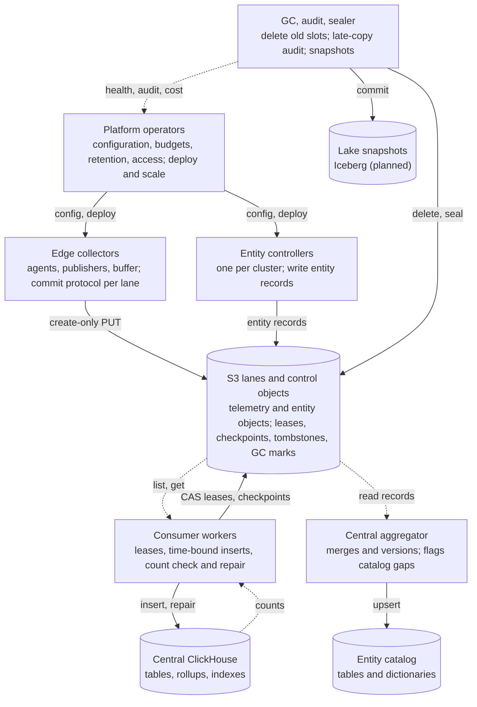
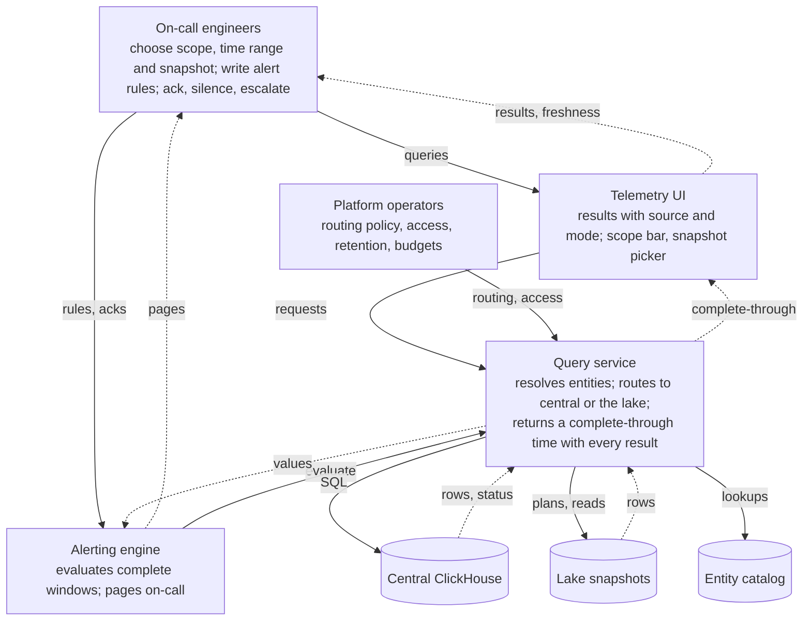
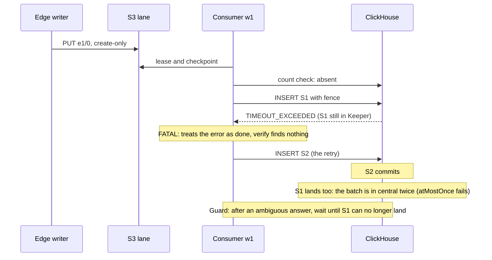
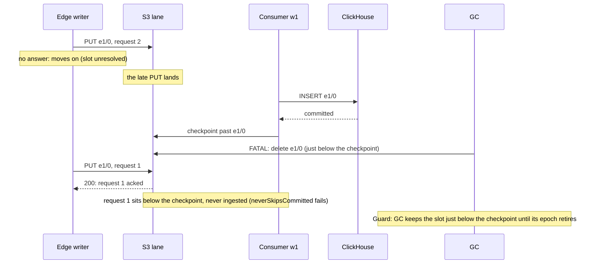

# STPA analysis

Exported 2026-09-27 from the PRD's "STPA analysis" tab (Telemetry UI PRD,
draft). The PRD's drawn diagrams are redrawn here as Mermaid. Related:
[DECISIONS.md](DECISIONS.md), [AMBIGUITY.md](AMBIGUITY.md) (the ambiguity
register that follows from the CAST below), [model/](model/).

A first-pass STPA of the telemetry pipeline and UI, extended with STPA-Sec for adversarial causes and STPA-Teaming for how on-call people and automation work together.

## Losses and hazards

Six losses cover safety, security and cost; seven hazards are the system states that lead to them.

| ID | Loss |
| --- | --- |
| L-1 | An incident is missed, misdiagnosed or prolonged because operators lacked correct telemetry |
| L-2 | Acknowledged telemetry is lost |
| L-3 | Telemetry shown to people or alerts is wrong: duplicated, missing, stale or on the wrong entity |
| L-4 | Sensitive data is disclosed (secrets or personal data in logs, one team's data to another) |
| L-5 | Telemetry or the catalog is tampered with, hiding or forging activity |
| L-6 | The pipeline harms production or budget: node pressure, full disks, runaway central or S3 cost |

| ID | Hazard | Losses |
| --- | --- | --- |
| H-1 | Acknowledged telemetry is in no store and cannot be recovered | L-2, L-1 |
| H-2 | A result is presented as complete while it is missing or duplicating data | L-3, L-1 |
| H-3 | Telemetry is attributed to the wrong entity, or to none | L-3, L-1 |
| H-4 | An alert condition holds but no page reaches on-call, or a page fires for a condition that does not hold | L-1 |
| H-5 | People act on a stale or wrong view without knowing it (snapshot, source or mode confusion) | L-1, L-3 |
| H-6 | An unauthorized party can read or write telemetry, the catalog or control objects | L-4, L-5 |
| H-7 | A pipeline component uses resources beyond its budget | L-6, L-2 |

## System-level constraints

Each constraint is the inverse of a hazard; most are already enforced by the pipeline's commit and consumer protocols, and the rest become requirements.

| ID | Constraint | Hazard | Enforced today by |
| --- | --- | --- | --- |
| SC-1 | Telemetry must not be acknowledged until it is durable, and must be ingested exactly once | H-1 | Create-only commits, durable buffer, leases, count check and repair (Quint-checked) |
| SC-2 | Every result must state its source and the time it is complete through; incomplete windows must be marked | H-2, H-5 | Nothing yet (new) |
| SC-3 | Entity attribution must be derived from the resource's own attributes and must fall back to them when the catalog is missing or late | H-3 | Leftover map and grace window in the entity spike |
| SC-4 | Alerts must evaluate only complete windows and must report their own failure to evaluate | H-4 | Nothing yet (new) |
| SC-5 | The UI must make its data source, snapshot and degraded mode visible on every view | H-5 | Nothing yet (new) |
| SC-6 | Every write path must be authenticated and authorized, and reads must be scoped by role | H-6 | Credential chain per edge; no reader-side controls yet |
| SC-7 | Every component must have a resource budget and must push back rather than exceed it | H-7 | Durable buffer cap with backpressure; memory limiters |

## Control structure

Two views of one hierarchy: the automated data plane, and the loop where people steer through the UI and alerts. Solid arrows are control actions, dashed arrows feedback; the stores are the controlled processes.

**A. Data plane.** Every store has automated controllers and no person acts on it directly; operators act only through configuration and deploys, and see aggregate feedback.

**B. People and automation.** On-call people steer through two automated teammates, the UI and the alerting engine. Their only view of the data is what the query service returns, so its complete-through time is the feedback that keeps their mental model correct.

## Unsafe control actions

Each row is one way a control action becomes unsafe, using STPA's four types: not provided (NP), provided when unsafe (P), wrong timing or order (T), stopped too soon or applied too long (D).

| ID | Controller | Control action | Type | Unsafe when | Hazards |
| --- | --- | --- | --- | --- | --- |
| UCA-1 | Edge collector | Acknowledge a request | P | Before the batch is durable in the buffer or committed | H-1 |
| UCA-2 | Edge collector | Resend a batch | P | With a new receive time, after its original committed long before | H-2 |
| UCA-3 | Edge collector | Push back on senders (503) | NP | When the buffer is full, so senders think data was accepted | H-1, H-7 |
| UCA-4 | Consumer worker | Insert a statement | T | After its lease window closed, racing the new holder | H-2 |
| UCA-5 | Consumer worker | Repair missing rows | P | While the original statement can still land | H-2 |
| UCA-6 | GC | Delete a slot | T | Before every reader (consumer groups, sealer) has passed it | H-1 |
| UCA-7 | Entity controller | Write an entity record | NP | For a pod that is running and producing telemetry | H-3 |
| UCA-8 | Entity controller | Write an entity record | P | With another cluster's or a stale identity | H-3 |
| UCA-9 | Query service | Route a query to a source | P | To a source that does not cover the requested range, without saying so | H-2, H-5 |
| UCA-10 | Query service | Return a result | P | Without its complete-through time, or with a wrong one | H-2, H-5 |
| UCA-11 | Alerting engine | Evaluate a rule | T | Over a window that is not yet complete | H-4 |
| UCA-12 | Alerting engine | Page on-call | NP | When evaluation failed because a source was down | H-4 |
| UCA-13 | On-call engineer | Pick a snapshot or source | P | An old snapshot while believing it is live | H-5 |
| UCA-14 | On-call engineer | Silence an alert | D | Longer than the incident, hiding a later one | H-4 |
| UCA-15 | Platform operator | Change retention | P | Shorter than the longest edge outage the buffer rides out | H-1 |
| UCA-16 | Platform operator | Grant access | P | Wider than the role needs, across clusters or namespaces | H-6 |

## Loss scenarios

Several scenarios were already found and fixed through the Quint models and the fault runs; the open ones become requirements.

| ID | UCA | Scenario (why it could happen) | Status |
| --- | --- | --- | --- |
| LS-1 | UCA-2 | The edge crashed after a commit landed but before the buffer's ack; on replay it stamped a new receive time, so the copy fell outside the check horizon | Fixed: receive time kept through the buffer; horizon audit as backstop |
| LS-2 | UCA-5 | ClickHouse answered a timeout, but the insert committed up to 29 s later; the consumer's process model said "failed" | Fixed: error answers waited out; 20 s margin enforced at start |
| LS-3 | UCA-6 | A writer that never learned its write succeeded retried into a slot GC had already deleted, below the checkpoint | Fixed: GC keeps the slot below the checkpoint until the epoch retires |
| LS-4 | UCA-4 | A worker paused past its lease; its clock said it still held the lane | Guarded: monotonic lease clock plus server-side fence |
| LS-5 | UCA-7 | The entity controller was down or lagging; agents kept producing telemetry for pods the catalog lacked | Guarded by the grace window; the announcement lane is not built |
| LS-6 | UCA-9, UCA-10 | Central was degraded; the query service fell back to the lake but the UI kept its "live" look | Open: needs SC-2 and SC-5 |
| LS-7 | UCA-11 | A lane was lagging; the alert window closed on partial data and read as "no errors" | Open: evaluate only up to the complete-through time |
| LS-8 | UCA-12 | The alerting engine could not reach any source and treated "no data" as "OK" | Open: a failed evaluation must page |
| LS-9 | UCA-3 | The buffer volume filled before the size cap; the publisher crash-looped | Measured; cap kept well below the volume, alert on it |
| LS-10 | UCA-15 | Retention was cut while an edge site was offline for days; its replay landed in expired partitions | Open: retention must exceed the buffer's longest outage; check at config time |

## STPA-Sec

The same control structure, with an adversary as a cause: the biggest exposure is that S3 and the entity lanes accept any writer holding a valid key.

| ID | Adversary action | Unsafe control action or feedback | Hazards | Mitigation |
| --- | --- | --- | --- | --- |
| SEC-1 | A compromised pod or node forges telemetry or entity records for other workloads | Entity controller or edge writes wrong identity (UCA-8) | H-3, H-6 | Per-cluster write prefixes and keys; the aggregator rejects records whose cluster does not match the writer |
| SEC-2 | A stolen edge key overwrites or deletes lane objects | Corrupts the process the consumer reads | H-1, H-6 | Create-only writes; no delete permission at the edge; object lock or versioning on lane prefixes |
| SEC-3 | An attacker writes a lease or checkpoint to stall or skip lanes | Forged feedback to consumer workers | H-1, H-2 | Control prefixes writable only by consumer roles; audit on unexpected writers |
| SEC-4 | Secrets or personal data in log bodies and attributes | UI returns data wider than its reader's role (UCA-16) | H-6 | Redaction at the edge; role-scoped reads by cluster and namespace; query audit log |
| SEC-5 | A crafted query exhausts central or the lake readers | Query service provides load beyond budget | H-7 | Per-user and per-query limits; cost estimate before running cold queries |
| SEC-6 | An insider silences alerts or edits rules to hide activity | Alerting control actions (UCA-14) | H-4, H-5 | Change history on rules and silences; two-person rule for silences over a set length |
| SEC-7 | Log injection makes the UI or proxy run unintended SQL | Rewrite proxy or query service executes attacker text | H-6 | Parse and rebuild SQL from an AST; never splice user text; read-only ClickHouse users |
| SEC-8 | Tampered time on an edge node shifts receive times | Wrong partition and check range (UCA-2) | H-2 | Clock checks at the edge; the horizon audit flags implausible gaps |

## STPA-Teaming

On-call people and the automation (UI, query service, alerting, pipeline controllers) form one team; the teaming hazards are gaps in shared awareness, handoffs and trust between them.

| ID | Teaming issue | What goes wrong | Hazards | Requirement |
| --- | --- | --- | --- | --- |
| TM-1 | Mode awareness | The UI silently switches from central to the lake; the engineer reads 40 s-old data as live | H-5 | A persistent source and freshness badge; a visible banner on any mode change |
| TM-2 | Shared understanding of completeness | The engineer reads "no errors" where the window was only half ingested | H-2, H-5 | Incomplete windows drawn as such; counts marked partial |
| TM-3 | Automation's limits known to people | Alerts are trusted after the alerting engine lost a source | H-4 | The alerting engine reports its own health and pages on failed evaluation |
| TM-4 | Handoff between shifts | A silence or a pinned snapshot outlives the person who set it | H-4, H-5 | Silences and pins carry an owner and an expiry, shown to the next person |
| TM-5 | Trust calibration | The pipeline had a late-copy or gap event; people keep trusting the numbers | H-2 | Pipeline-health warnings shown on affected views, not only on a separate page |
| TM-6 | Entity model mismatch | The engineer filters by a workload; the catalog is behind a rollout, so new pods are missing | H-3, H-5 | Views show catalog lag and count rows without an entity match |
| TM-7 | Workload and attention | Many near-duplicate pages from the same cause flood on-call | H-4 | Grouping by entity and cause; one page per incident, not per series |
| TM-8 | Future AI assistant | An assistant answers from stale or partial results with confidence | H-5 | Assistants see the same freshness and completeness metadata and must state it |

## Derived requirements

Ten requirements come out of this pass; all are P0 unless marked, and each traces to the scenarios above.

| ID | Requirement | From |
| --- | --- | --- |
| R-S1 | Every result carries its source and complete-through time for its own scope (the clusters and signals it reads, named in the result; D29), and which event time that settles (D26); the UI shows them on every view | SC-2, LS-6, TM-1 |
| R-S2 | Windows not yet complete are drawn as incomplete, and counts over them are marked partial | TM-2, UCA-10 |
| R-S3 | Alerts evaluate only up to the complete-through time of the rule's own scope (D29), plus the lateness bound (D26); a failed or unevaluable window pages | LS-7, LS-8, TM-3 |
| R-S4 | Silences and pinned snapshots have an owner and an expiry, shown at handoff | TM-4, UCA-14 |
| R-S5 | Views show catalog lag and rows without an entity match | LS-5, TM-6 |
| R-S6 | Retention changes are refused if shorter than the longest configured edge-buffer outage (custody age; see DECISIONS.md D19) | LS-10, UCA-15 |
| R-S7 | Writes are scoped by cluster prefix and role; edge keys cannot delete; the aggregator rejects mismatched clusters. Scheme (proposed, not built): cluster-first keys; publishers and entity controllers may only create under their own cluster's prefix, keyed on a cluster principal tag in the session credentials; only consumer roles can write or delete control objects. Recorded in [DECISIONS.md](DECISIONS.md) D18 | SEC-1, SEC-2, SEC-3 |
| R-S8 | Reads are role-scoped by cluster and namespace; every query is audit-logged | SEC-4, UCA-16 |
| R-S9 | The query service and rewrite proxy build SQL only from a parsed tree, with per-user limits (P1) | SEC-5, SEC-7 |
| R-S10 | Alerts group by entity and cause, one page per incident (P1) | TM-7 |

## CAST: issues already found

Most of the defects found so far share one control flaw: a controller treated an ambiguous outcome (no answer, an error, a timeout, a restart) as a definite one, and its process model drifted from reality. [AMBIGUITY.md](AMBIGUITY.md) turns this into a register of every boundary call's outcomes.

| # | Issue | Found by | Hazard | Controller and flawed process model | Why it made sense at the time | Fix | Lesson |
| --- | --- | --- | --- | --- | --- | --- | --- |
| 1 | Replay stamped a new receive time | Horizon audit design, then a crash/replay test | H-2 | Edge: "the time I see the request is when it arrived" | Without a buffer that was true | Keep the buffer's ingestion time (patch 0003, queue metadata) | Identity and time must come from the first durable custody, not the latest handler |
| 2 | An error answer that still committed | Replicated-central soak with Keeper faults | H-2 | Consumer: "an error means nothing was written" | ClickHouse docs and single-node behaviour | Only pre-write errors settle a statement; others are waited out; mutant `errorSettles` | Classify outcomes as definite or ambiguous; model the ambiguous ones |
| 3 | Retry after a lost answer re-inserted rows | Quint model (`releaseInFlight` family) | H-2 | Consumer: "verify now, the statement is over" | Local inserts return fast | Lanes with an unanswered statement are left alone until it cannot land | A check is only valid after the thing checked can no longer change |
| 4 | GC deleted a slot a writer later retried into | Quint model at short lease with writer faults | H-1 | GC: "below the checkpoint nothing will be written again" | Writers were assumed to know their outcome | Keep the slot below the checkpoint until the epoch retires; mutant `gcReopens` | Deleting needs the writers' view, not only the reader's |
| 5 | 10 s margin too short | Directed Keeper-overrun test (19 s past the limit) | H-2 | Consumer: "a commit lands within max_execution_time + 10 s" | Keeper's operation timeout is 10 s | 20 s margin, checked against the Keeper session at start; mutant `keeperOverrun` | Derive margins from the real bound (session timeout), and check them at runtime |
| 6 | Audit read a lagging replica | Replicated run | H-2 | Audit: "any replica is current" | Single node had no lag | Sync the replica first; fail over; fail visibly | Feedback from a replica needs its freshness attached |
| 7 | Unescaped quote broke every insert | Edge-deploy agent's run | H-1 (availability) | Consumer SQL builder | String built by hand | One quoting helper; a test that the SQL parses | Build SQL from a tree, never by splicing |
| 8 | RefCell borrow held across an await | Clippy in the CI spike | H-1 (availability) | Consumer runtime | Borrow looked short-lived | Read first, borrow after; lint made fatal | Turn known-dangerous lints into errors |
| 9 | One 1 MiB value made an object 40× larger | Hostile conformance data | H-7 | Go writer: "statistics are small" | Normal data has short values | Truncate statistics to 64 bytes, as parquet-rs does | Test with hostile data, not just realistic data |
| 10 | Load-balancer retries were not byte-identical | Gateway kill tests | H-2 | Upstream exporter: map order | Order did not matter before content keys | Sort pieces (patch 0001, U20) | Anything that re-cuts a request must be deterministic |
| 11 | Configs carried static keys that shadowed IRSA and Pod Identity | Edge config audit | H-6 | Edge config | Convenient for local runs | Credentials only from the environment | Local convenience must not ship in shared configs |
| 12 | Tests ran against binaries built from a different tree | Our own agent coordination | H-2 (for results) | Development process: a shared build directory | Faster builds | Separate build directories per checkout; rebuild before trusting a run | Evidence needs provenance: record what was tested |

**Systemic factors**

- **Ambiguous outcomes treated as definite** (issues 2, 3, 4, 5, 6). The fix pattern is the same each time: name the ambiguous outcome, wait until it cannot change, and model it. The Quint models found three of these before production would have.
- **Time as identity** (issues 1, 5). Anything that decides placement or safety from a clock needs a stated bound and a runtime check.
- **Feedback without freshness or completeness** (issues 6, 13, 16, and the open LS-6 to LS-8). A controller acting on feedback must know how current it is; this is the same requirement the UI now carries as R-S1.
- **Test evidence without provenance** (issue 12, and the memory and disk exhaustion that broke runs). Results are only as good as knowing which build and which environment produced them; CI now records both.

### CAST: bugs found by deterministic simulation (2026-09-27)

Two consumer bugs survived the Quint models, the model-based tests and the fault soaks, and were found by the deterministic simulation ([otap-rs/DST.md](otap-rs/DST.md)). Both live in the gap between a model's instantaneous step and a real step that takes time.

| # | Issue | Found by | Hazard | Controller and flawed process model | Why it made sense at the time | Fix | Lesson |
| --- | --- | --- | --- | --- | --- | --- | --- |
| 13 | A worker took a lease that was still live | DST level 1, seeds 20 and 34; reproduces with no fault at all, one LIST answering 15 s late | H-2 (two workers insert on one lane: duplicates) | Consumer lease discovery: "every lease I list was observed when this round started" (`heartbeat_and_leases` read the clock once, then dated every listed ETag to the round's start) | Rounds take milliseconds on a healthy store; no test combined a slow round with a renewal inside it; the Quint model's list is atomic and instantaneous | Date each observation when its answer arrives (the LIST answer, `try_take`'s GET); regression test `a_slow_discovery_round_does_not_backdate_lease_observations` | Feedback is as old as the moment it was received, not the moment it was asked for; when "unchanged for long enough" grants authority, use the latest possible observation time |
| 14 | A backlog longer than the lease window livelocked a worker | DST level 1, about 10% of the first 200 seeds | H-2 and L-1 (ingestion stalls, views incomplete) | Consumer step scheduling: "a step is short compared with the lease" (up to 256 HEADs per lane, lane after lane, renewal only at insert) | The 256 cap was sized for throughput; steady-state backlogs are small; model actions cost no time; soaks recovered from short outages only | Renew between lanes and stop scanning a lane once its renewal is due, keeping the HEADs already made; regression test `a_backlog_longer_than_the_lease_window_is_still_ingested` | Bound work per step by time, not count, whenever a lease or deadline governs; schedule renewals independently of the work loop; test recovery from long outages, not only steady state |

**Systemic factors**

- **Models abstract away how long a step takes.** Quint actions are atomic and instantaneous, so a model cannot show a round that outlasts a lease or an observation that ages while in flight. The ambiguity audit found the same gap (the consumer model's lease and checkpoint writes are atomic). Remedies: add "slow observation" and "step duration" behaviours to the model template ([model/TEMPLATE.md](model/TEMPLATE.md)) and a mutant that dates observations at the request; keep DST as the check on real durations. **Done 2026-09-27** (commit 2573cfc): the consumer model now has slow lease discovery, per-HEAD step cost and request/effect/answer lease and checkpoint writes, with mutants `observeAtRequest`, `renewOnlyAtInsert` and `own412IsTakeover`; its first model-based test run found #20.
- **Slow is a different failure from failed.** Every soak injected errors, lost answers and kills against a store that answers in milliseconds; none injected a slow store with a large backlog. The DST fault menu now includes latency, held links and brownouts; the fault proxies should too.
- **Recovery paths are under-tested.** Both bugs appear after something slow or long (a slow round, an outage's backlog). Tests should include a long outage followed by recovery at fleet scale.

### CAST: bugs found by the ambiguity audit (2026-09-27)

Two more consumer bugs, found by the audit behind [AMBIGUITY.md](AMBIGUITY.md) (rows S3 and C2), both fixed in 034f577 with tests.

| # | Issue | Found by | Hazard | Controller and flawed process model | Why it made sense at the time | Fix | Lesson |
| --- | --- | --- | --- | --- | --- | --- | --- |
| 15 | A 412 on the worker's own lease or checkpoint write dropped the lane | Audit item a2: a proxy that applies the `If-Match` PUT and then answers 500, 503 or 409; object_store's retry carries the old ETag and gets 412 against our own new object | L-1 (the lane stalls for TTL + margin, 95 s) and a misreported `lanes_lost_cas`; safe for data | Consumer `write_lease` / `write_ckpt`: "a 412 means another worker changed the object" | The code handled a lost answer by reading back, but a 412 is a definite-looking answer; the client library's own retry was invisible to it; the model's CAS is atomic | A 412 is read back and compared, like no answer; test `a_412_for_our_own_lease_or_checkpoint_write_keeps_the_lane` (fails before the fix) | A definite-looking error can be produced by our own retry; the outcome class depends on the whole call, including the library's retries, not on the last status code |
| 16 | The count check could silently return short counts | Audit item b: the consumer's own query through a ClickHouse profile with `read_overflow_mode = 'break'` returned 3,932 instead of 8,000 per key with HTTP 200 | H-2 (a short count makes the worker "repair" rows central already holds: duplicates) | Consumer `sql.rs`: "HTTP 200 means a complete answer" | The consumer's settings never set a break mode, and a server or user profile it doesn't control can | Every consumer and audit query pins the eleven `*_overflow_mode` settings to `throw` (`NO_PARTIAL_RESULTS`), so a limit becomes an error; two tests | Feedback the controller acts on must be complete by construction, not by default; pin anything the environment could change. The same flaw exists in HyperDX (AMBIGUITY.md row X7) |

### CAST: bugs found by Hegel and the model extension (2026-09-27)

Four more bugs. Three are in upstream otel-arrow's OTAP conversion, found by Hegel property tests ([otap-rs/HEGEL.md](otap-rs/HEGEL.md)) and fixed locally by patch 0005 (U24, not proposed upstream, awaiting owner review). One is in the consumer, found by the model-based tests after the model gained non-atomic lease writes.

| # | Issue | Found by | Hazard | Controller and flawed process model | Why it made sense at the time | Fix | Lesson |
| --- | --- | --- | --- | --- | --- | --- | --- |
| 17 | A span's Duration was dropped when its start or end time was 0 | Hegel property "OTAP rows match OTLP rows", shrunk to one span with start 0, end 1; confirmed end to end through the Rust edge (`otlp_path: via_otap`) into ClickHouse `s3()`: Duration 0 instead of 1000 | H-2 | Upstream OTLP→OTAP encoder: "a time field is either present or meaningless" | proto3 leaves a zero off the wire, so a zero time looks absent; real spans rarely start at the epoch | Treat an absent time as 0, subtract with `wrapping_sub`; regression `regression_otap_duration_with_a_zero_time` | Encoding defaults are values, not absence; a round-trip property over the whole value space catches what corpora don't |
| 18 | A log body of integer 0 or double 0 read back as empty; an attribute's −0.0 read back as 0 | Same property, shrunk to one record with body `IntValue(0)`; end to end: body `""` instead of `0`, `-0` became `0` | H-2 | Upstream logs view: "a missing value column means no value"; encoder: "`==` identifies the default" | The encoder omits a column whose values are all the default, and other readers treat that as the default; −0.0 == 0.0 under `==` | The view returns the type's default; the double column no longer drops defaults; regression `regression_otap_zero_values` | Two components must share one meaning for "column absent"; compare floats by bits when identity matters |
| 19 | Half-precision floats inside arrays and maps read back as null | Same property, shrunk to one attribute `[0.0]`; end to end: `[1.5, 7]` became `[null, 7]` | H-2 | Upstream CBOR reader: "only f32 and f64 occur" | serde_cbor writes the shortest exact float, so 0, 1.5, 65504 and NaN arrive as f16; upstream's own unit test pinned f16 as Empty | Decode CBOR half floats exactly, and fix that test; regression `regression_otap_nested_half_float` | A test that pins current behaviour can pin a bug; check encoders' real output, not the spec's common case |
| 20 | A lost lease-renewal or checkpoint write dropped a lane that was still ours | Model-based test after the model gained non-atomic lease writes (designSlow, seed 0x29e8aebd) | L-1 (the lane idles until our own lease expires; safe for data) | Consumer `write_lease` / `write_ckpt`: "a read-back that isn't our new document means someone else wrote" | Before #15's fix, only a 412 was read back; the read-back then compared against our new document, so "our write never applied" looked like a takeover | When the object still has the version we wrote on, keep the lane and write again (commit 7b0f28f); regression `a_lost_lease_or_checkpoint_write_keeps_the_lane` | An ambiguous outcome has three results, not two: ours, someone else's, and nothing happened; each needs its own handling |

**Why the conformance checks missed #17–#19.** `correctness.py` compares the `via_otap` path with the Go reference row by row, but the hostile corpus was rejected on the OTAP path (invalid UTF-8 in CBOR), and that rejection was accepted as a known OTAP loss, so the corpus with zero-start spans and nested 0 or ±1 doubles never reached a row comparison there. The Go-vs-Rust comparison uses the Rust edge's direct path, which never runs upstream's encoder. The deployed publisher uses the direct path too, so production was not affected; the bugs are reached through `via_otap` or an OTAP receiver fed by a Rust otap-dataflow producer.

**Systemic factors**

- **A comparison that silently skips a rejected input is not coverage.** Record rejected inputs as failures of coverage, and generate each shape on its own, small enough to be accepted.
- **Properties over the whole value space find what corpora miss.** Zeros, negative zero and half floats are exactly the values realistic generators avoid and encoders special-case.
- **The model extension paid off at once.** Making lease writes non-atomic in the model (systemic factor 1 of the DST CAST) found #20 on its first model-based test run.

### CAST: format v2 (2026-09-28)

Two more issues from implementing format v2 ([FORMAT.md](FORMAT.md)): a design flaw that the completeness model shared, and a test script that destroyed shared data.

| # | Issue | Found by | Hazard | Controller and flawed process model | Why it made sense at the time | Fix | Lesson |
| --- | --- | --- | --- | --- | --- | --- | --- |
| 21 | The lane watermark could pass a request still in flight in a later-named epoch | Mapping `model/completeness.qnt` onto the code, before any test ran | H-2, H-4 (a window treated as complete while data is missing; an alert evaluates too early) | Consumer lane watermark, as modelled: "objects ordered by (epoch, seq) are in custody order", so the highest low over the ingested prefix is safe | The model has one writer per edge, and D3 says one epoch per lane per incarnation; a publisher with `lanes: N` writes several epochs at once | Lane watermark = min(highest low passed before the LIST, lowest `received_at` of pending data slots), which needs no ordering between epochs; model instance `completenessImpl` (`PENDING`); the randomized soundness test uses 2 writer lanes per signal and catches the `WmIgnoresPending` mutant | Model instances must include the deployed parallelism, not the simplest topology |
| 22 | A test script deleted the shared `otel` bucket, with every agent's test data in it | Happened during the format-v2 run of `conformance/go_replay.sh` with `BUCKET=otel` | H-1-like (test data lost; no real data existed); results already committed were unaffected | The script's cleanup: "my bucket is mine" (its default was private) and "deleting a non-empty bucket fails", as on AWS | The default bucket was dedicated to the script; S3 refuses that delete; SeaweedFS does not | The script purges only its own run prefix (`consume purge`); no other script deletes a bucket | Cleanup must act only on what its own run created; do not rely on a store to refuse a destructive call, since stores differ |

**Systemic factor.** Both are assumptions about the environment that held in the setting where they were written: a single writer in the model, a private bucket in the script. #21 is the same lesson as #13 and #14: the model is only as good as the topology and timing its instances allow.

### CAST: the entity announcement lane (2026-09-28)

| # | Issue | Found by | Hazard | Controller and flawed process model | Why it made sense at the time | Fix | Lesson |
| --- | --- | --- | --- | --- | --- | --- | --- |
| 23 | An unanswered announcement insert was not waited out, so it could land after the lane's lease changed hands | `dst_consumer`, 2 of 40 seeds ("statement lands after its lease epoch changed hands"), before the code was committed | H-2 (a statement outside its lease: the fencing that prevents duplicates no longer holds) | Consumer worker: "announcement inserts are idempotent, so a failed or unanswered one needs no settle wait" | A late duplicate announcement is harmless to the data, and the announcement table folds copies; but a TIMEOUT_EXCEEDED can still commit after the lease moved, which breaks the invariant every statement must hold | An unanswered announcement statement is waited out like any data insert (the D9 rule); `dst_consumer` 300 seeds and `hegel_dst` clean | Idempotence of the effect does not exempt a statement from the lease discipline; safety rules apply per statement, not per table |

This is the first bug the simulation caught before it reached the history, which is where it should be caught: the DST runs in the normal test suite.

### CAST: the query service (2026-09-28)

| # | Issue | Found by | Hazard | Controller and flawed process model | Why it made sense at the time | Fix | Lesson |
| --- | --- | --- | --- | --- | --- | --- | --- |
| 24 | The entity aggregator pasted S3 object key, cluster and lane names into the text of its `ingest_log` and `lane_progress` INSERTs; a key with a quote under cluster `c1` forged a `c2` `ingest_log` row (`put_at` 2100), `c2` was never ingested, and every pass stopped at that object | Code reading while adding catalog lag (R-S5) to the query service; `TestHostileKeysAreData` failed before the fix | H-6 (one cluster's controller credentials write another cluster's catalog rows); H-5 (a stale cluster's catalog lag reads as fresh); H-3 (the catalog stalls for every cluster after the bad object) | Entity aggregator: "key names are our own well-formed `{epochMs}-{instance}/{seq}.delta.ndjson.gz` and safe in SQL"; "a failing object succeeds on retry, so stopping the pass is safe" | Our own lane writer makes those keys; D18 confines each controller to its prefix; `clusterFilter` already checked record bodies, so bodies looked like the only attack surface; tests used only well-behaved writers | Rows go as JSONEachRow data; gap-record times are parsed and re-rendered (unreadable ones skipped); a failing lane no longer stops other lanes or clusters (errors collected). `TestHostileKeysAreData` (real ClickHouse + SeaweedFS), `TestGapTimesAreParsed`; commit d96e32d. Remaining: a malformed body still fails its own lane each pass, now confined to that lane | Names a less-trusted writer chooses are data, like bodies: prefix ABAC limits *where* a writer writes, not what its key names say. One tenant's bad object must not stop the pipeline for the others |

The same theme as rows 21 and 22 — a component trusting a property of input it did not produce — now on the security side, which is why R-S7's write-side ABAC is necessary but not sufficient.

| # | Issue | Found by | Hazard | Controller and flawed process model | Why it made sense at the time | Fix | Lesson |
| --- | --- | --- | --- | --- | --- | --- | --- |
| 25 | The plan service's documented minimum URL lifetime (`url_ttl_s` 60) with the default `replan_margin_s` (60) gave `replan_after` equal to the signing time; a larger margin put it before signing. Every plan was stale when issued, so a client obeying X8 re-planned until its limit and never read | Building the lake UI's browser test, which runs with a 60 s lifetime | R-S1/R-S2 side: the lake UI can never show data (it fails visibly, not silently); a re-plan storm on the query service | Plan service config: "the margin is always smaller than the lifetime" | The defaults (300 s / 60 s) are fine, and the 60–900 s clamp covered only the lifetime; the two knobs were validated separately | Margin capped at half the lifetime; `internal/lake/config_test.go` failed 5 of 7 cases before the fix; commit 55a5b6b | Parameters that combine into one derived deadline must be validated together, at their combined value, not each in its own range |

### CAST: the alert evaluator (2026-09-28)

| # | Issue | Found by | Hazard | Controller and flawed process model | Why it made sense at the time | Fix | Lesson |
| --- | --- | --- | --- | --- | --- | --- | --- |
| 26 | The query service labels an event-time window `complete` as soon as `complete_through` (a bound on `received_at`, custody time) reaches the window's end (`completeness/watermark.go` `MakeLabel`: `w.ToNs > ct`). A row whose event time is in the window but that is received later is missing from a result labelled complete | The alert evaluator agent, designing its gate: its windows are event time, the watermark is custody time | H-4/R-S1: a result labelled complete is not; an alert rule sees "no rows" in a complete window and resolves or never fires (the hazard R-S3 exists to prevent) | Query service label: "event time and custody time are the same clock" — the watermark bounds when rows were received, the window bounds when they happened | D19 made custody time the ordering key for completeness and retention; the query service reused it, and every test published rows whose event time ≈ receive time, so the two never diverged | Policy `max_lateness` (default 60 s): `complete` only when `complete_through ≥ to + max_lateness`; the label reports `settled_through` (event time); a windowed `/v1/query` counts rows with `received_at > time + max_lateness` (`late` block, metrics); the plan marks late objects; the lake UI, HyperDX adapter and alert evaluator (its `lateness` is now an extra margin) follow. Rapid property with diverging clocks and an integration test with a late row through the real edge, both failing under the old rule; commit b302126 (D26). Remaining: rows later than `max_lateness` are counted, not prevented | Two timestamps that usually agree are still two clocks; a completeness claim must say which one it bounds, and tests must include data where they diverge |
| 27 | Near miss: agents sharing one checkout's git index. The alerts agent's staged edits landed in the lake UI agent's commit 9835f2f, and its own first commit, built from a private index on a stale base, would have reverted the coordinator's CAST commit 5f13738 | The alerts agent, checking its diff before pushing | H-7 (the safety record — STPA/CAST — silently reverted); history attributing work to the wrong change | Coordinator: "separate paths per agent are enough isolation"; agents: "my index holds only my changes" | Agents worked in disjoint directories, but shared files (DECISIONS.md, AMBIGUITY.md, nightly.yml, ci/README.md) and one index made the separation incomplete | Caught before push; the commit amended. Rule added for agents: check `git diff --cached --name-only` and `git diff origin/<branch> --stat` of the commit before pushing; concurrent agents get separate worktrees next time | Isolation must cover the shared state (the index and shared docs), not only the files each actor intends to touch; the check that caught it was a diff against the remote, so make it mandatory |

### CAST: the HyperDX adapter (2026-09-28)

| # | Issue | Found by | Hazard | Controller and flawed process model | Why it made sense at the time | Fix | Lesson |
| --- | --- | --- | --- | --- | --- | --- | --- |
| 28 | Fork patch 0001 (overflow modes pinned to throw) left a jest expectation in `clickhouse.test.ts` without the pins, so the suite failed; the patch had never had its tests run | Running common-utils' jest suites for the first time while building patch 0002 | No runtime hazard; a verification gap on X7 / H-2 (the control against silent partial results was unverified) | Fork patch author (an earlier agent): "every default-settings expectation was updated" | The full `yarn install` did not fit on disk, the patch applied and parsed, and it was reviewed by grep; "applies cleanly" stood in for "tested" | Expectation updated and carried in 0002 (0001's history left as is); the suite is the regression check (2,665 tests pass); commit adb427f | A patch series is unverified until its tests have run; when the full toolchain doesn't fit, a per-package type-check and test install (~230 MB) does |
| 29 | `@clickhouse/client` 1.23 replaces a per-query `Authorization` header with its own Basic header, so HyperDX's server-side queries (alerts, API, MCP) would reach the adapter with no token | The adapter's integration test driving the real client at HyperDX's pinned version | H-8 (availability: server-side queries refused; fail-closed, so no data exposure) | Fork patch: "a per-query header reaches the server as sent" | The client's type definitions accept a per-query `http_headers` map with `Authorization`; nothing said it would be overwritten | Token sent as the query's `auth: {access_token}`, with a jest test; found before the patch was committed | Check a client's wire behaviour with the real client, not its type definitions |

The adapter's own parameter decoder also had two differences from ClickHouse's (a raw tab or newline is an error; a backslash before a control byte is dropped). The differential test against the live server caught both before commit; the same class as row 24, caught by the right test at the right time.

### CAST: closing the validation gaps (2026-09-28)

| # | Issue | Found by | Hazard | Controller and flawed process model | Why it made sense at the time | Fix | Lesson |
| --- | --- | --- | --- | --- | --- | --- | --- |
| 30 | All four role policies in `deploy/iam` (`edge-publisher`, `entity-controller`, `consumer`, `gc`) granted `s3:ListBucket` only under an `s3:prefix` condition. A HEAD/GET carries no `s3:prefix`, so on AWS a missing key answers 403, not 404: the consumer cannot read a missing `format.json` and exits; edge slots stay unresolved after any ambiguous PUT (403 is correctly kept unknown) | The validation runbook's EKS-4 question; confirmed from AWS's HeadObject and IAM condition-operator documentation and a SeaweedFS experiment. Not yet run on AWS [D] | Liveness only, no safety loss (a 403 stays unknown): consumer start and first lease fail; lanes stall (R-S5 lag, stale `complete_through`); GC and the entity controller alike | Policy author (D18): "ListBucket on my prefix covers the 404 check" | The SeaweedFS ABAC demo showed "free slot 404" — but it granted ListBucket unconditionally, and SeaweedFS 4.47 answers 404 with no ListBucket at all and ignores `StringLikeIfExists`, so the demo could not see the rule | A `StringLikeIfExists` grant on the same prefixes in all four policies (a LIST of another cluster's prefix still denied; write-side ABAC unchanged); `ci/iam-lint.sh` fails on the old shape; Rust `a_403_on_head_is_an_error_not_a_free_slot`, Go `TestHeadOnlyA404IsFree`; EKS-4 now checks the free-slot 404; commit 09ed92e | A test store more permissive than the target cannot validate an authorisation rule; label such results [D] until they run on the real store |
| 31 | A ClickHouse SYNTAX_ERROR answer echoes the raw statement text, including the `s3()` access key, secret (and now session token); the consumer kept such errors in its logs and state unredacted | Measuring secret handling while adding session credentials to `s3()` (the server log shows `[HIDDEN]`; the error body does not) | STPA-Sec: a credential disclosed to whoever reads consumer logs (H-6 path: another cluster's data readable with it) | Consumer: "ClickHouse hides secrets in `s3()`", generalised from its server log to its error answers | The server log does mask them, and errors were logged for diagnosis; no test ever produced a syntax error with credentials in the statement | `sql.rs` `redact` strips key, secret and token from every kept error; `refused_credentials_are_unsettled_and_redacted` against real ClickHouse + SeaweedFS; commit 09ed92e. `--ch-s3-auth server` keeps secrets out of statements entirely | A redaction guarantee holds only on the channel it was measured on; check every path a secret-bearing string can travel, errors included |
| 32 | The query service's `metadata` scope (D25) served `SELECT * FROM system.tables` whole: `data_paths`, `metadata_path` (real server paths), `uuid`, `storage_policy`, sizes, and `system.databases.engine_full`, to any caller with the `query` role | Coordinator review of the adapter report (the agent's own limits noted the paths); confirmed by a probe on ClickHouse 26.10 | STPA-Sec / R-S8: information disclosure to every query caller; DDL columns could carry credentials (ClickHouse masks them today [M]) | Query service `sqlscope`: "restricting which rows (tables) are visible also bounds which columns are" | The scope was designed around per-row predicates and grants already cut system tables to the served ones; the replay checked answers for equality with ClickHouse, not for what they disclosed | Every metadata read rewritten as a projection onto a per-table column allow-list (`*` expands to it; other columns error), re-checked on the rebuilt text (`metadata_unprojected`); `metadata_test.go` unit + rapid, the replay's column check; commit b302126 | A schema-read scope needs a column allow-list, not only a table allow-list; "equal to ClickHouse" is not "safe to show" |

### CAST: the Mosaic spike (2026-09-28)

| # | Issue | Found by | Hazard | Controller and flawed process model | Why it made sense at the time | Fix | Lesson |
| --- | --- | --- | --- | --- | --- | --- | --- |
| 33 | Mosaic 0.31 names its pre-aggregated cube tables by a hash of their SQL and creates them `IF NOT EXISTS`; reloading different rows under the same table names (a new plan, a new window) leaves the old cubes answering. A chart showed 9,000 where 3,000 was right | The spike's e2e check that every chart's total equals an independent SQL count after each brush | R-S1/H-4 class: a chart shows numbers from a previous load as current, with the current load's completeness label on it | Mosaic coordinator: "a table name identifies its contents" (true within one static dataset, Mosaic's design case) | Mosaic targets fixed datasets; our tables are reloaded per plan under stable names, which Mosaic's cache key does not include | The spike drops the cube schema and clears the query cache on every load; the total-equals-SQL check stays in the e2e (commit 20a6146). Found before any adoption (D28 still proposed) | A cache keyed on the query but not on the data version is wrong the moment the data is reloaded; every cache in the read path must key on the plan it came from |

### CAST: the basis (2026-09-28)

| # | Issue | Found by | Hazard | Controller and flawed process model | Why it made sense at the time | Fix | Lesson |
| --- | --- | --- | --- | --- | --- | --- | --- |
| 34 | The coordinator's spec (research/bitemporal.md §3) said a basis admits `received_at ≤ C`. The consumer promises only `received_at < complete_through`, and a pending object can carry `received_at` equal to it, so "same basis ⇒ same answer" would fail | The D30 agent's rapid property ("same basis ⇒ same answer while data arrives"); the `≤` mutant fails on its third case | H-4 / R-S1: an answer at a basis that later changes, under a label promising it won't | Coordinator: "`complete_through` is inclusive" — carried from prose, not from FORMAT.md §3's precise statement | The note was written from memory of the design, and "through" reads as inclusive | Implemented strictly (`<`) for rows and `oscope-received`; spec corrected; the mutant stays in the property suite (D30, 045929b) | A spec derived from prose inherits its ambiguity; boundary operators come from the formal statement (FORMAT.md §3, the Quint model), and a property with the off-by-one mutant settles them |
| 35 | The evaluator's late checks plus two replicas per identity exceeded the query service's default per-caller concurrency (4); the 429s counted as failed evaluations and paged "cannot evaluate" | The D30 alerts integration test | H-8 (false pages erode trust in real ones: the alert-fatigue path to missed hazards) | Evaluator: "the query service's capacity is not my concern"; service: "4 concurrent statements per caller is enough for anyone" | The two limits were set independently, before the late checks multiplied the evaluator's load | Documented; the integration test sets 16; owner to set the production value. Not fixed in code: a 429 is still a failure (fail-visible, by design) | Load a feature adds to a shared limit must be budgeted where the limit is set; a back-pressure answer should say so distinctly from a failure |
| 36 | Near miss: raising evaluator concurrency, the coordinator first added an `alert-evaluator` entry to queryd's `group_grants` (fleet scope) as well as to `limits`, and told team evaluators to join the group; a team identity would have gained fleet scope | The coordinator's own re-read before committing | H-6 / R-S8: a scope-restricted identity reads every cluster | Coordinator: "a group name in the config means one thing"; but group names key both grants and limits, and grants are unioned across a principal's groups | The example config had one group (`sre`) that was both a grant and a limits tier, so the two looked like one concept | Grant and limits groups separated (`alertd-fleet` grants fleet scope; `alert-evaluator` is limits-only and grants nothing); commit 1414bb4 | Where one name keys two policies and one of them is a union, adding a principal to a group for one reason grants the other; a test that a limits-only group never changes scope would make it structural |

## What the models showed

Each fixed bug has a shortest counterexample from the Quint model, drawn from its scripted run ([model/traces/](model/traces/)); the step marked FATAL is the one the design now blocks.

**errorSettles** — an error answer that still committed stored the batch twice.

**gcReopens** — GC deleted a slot the writer later reused; an acknowledged batch was never ingested.

| Trace | What goes wrong | Invariant broken | Guard that now blocks it |
| --- | --- | --- | --- |
| errorSettles | An error answer is taken as the end of a statement that still commits; the retry stores the batch twice | atMostOnce | Wait after an ambiguous answer until the statement can no longer land |
| gcReopens | GC deletes the slot just below the checkpoint; the writer's next batch re-creates it, acked and never ingested | neverSkipsCommitted | GC keeps that slot until the epoch retires |
| releaseInFlight | A worker gives its lane back with a statement in flight; the next holder inserts the same batch | atMostOnce | A release waits until the statement is past its settle time |
| keeperOverrun | A replicated commit hangs in Keeper past the margin and lands after another worker inserted the batch | atMostOnce | Keeper slack must not exceed the margin (20 s, checked at start) |
| noHorizon | A replay stamped with its restart day is checked only against that day and misses its original | atMostOnce | Check horizon at least the longest gap, and replays keep their receive time |
| restamp | After a two-day outage the old edge re-stamps the replay; the check misses day 0 | replayKeepsReceivedAt, atMostOnce | Receive time is stamped at custody (patch 0003, queue metadata) |

## Modelling the open issues

Four new Quint models cover the open scenarios; every design instance holds and every mutant breaks (82 rows in `model/open_models.sh`, 0 off expectation at seed 0x5eed; sampled, not proofs), and three of them changed the design.

| Model | Open issue | What holds in the design | Mutants that break it |
| --- | --- | --- | --- |
| `completeness.qnt` | LS-6, LS-7, LS-8 | A published complete-through time is sound; alerts never evaluate past it; every result carries its own source's watermark; no source always pages | Idle lane counted as caught up; watermark from the last receive time; highest object counted with an earlier gap; evaluation by wall clock; no data treated as OK; lake result labelled with central's watermark |
| `entityCatalog.qnt` | LS-5 | No row stays unattributable for ever, even through controller outages | No announcements; a lost announcement counted as sent; grace window shorter than controller delay plus dictionary lag |
| `retention.qnt` | LS-10, R-S6 | Every acknowledged request lands in a partition that still exists | Retention too short; a cut while an edge is offline; retention sized from buffer cap ÷ rate |
| `sealer.qnt` | Lake snapshots | Snapshots are monotone and repeatable; each object sealed at most once; the watermark never passes an unsealed slot | Blind overwrite; stale plan committed; watermark from the listing; no dedup |

**What the models changed**

- **Complete-through needs one new field.** It cannot be derived from what the consumer knows today. Each object must carry the oldest receive time still in the edge's custody when it was written. Two simpler rules the design notes proposed are unsound. An idle lane and an offline edge with a full buffer look the same from S3, so idle edges must commit heartbeat slots, and a lane that stops advancing pages as stale rather than being dropped.
- **The announcement lane closes the permanent gap, not the transient one.** In a separate lane, a row can be ingested before its announcement. Put the announcement ahead of its rows in the data lane to bound the gap to the dictionary lag. During a controller outage, rows can only be eventually exact.
- **The retention rule in D19 was wrong under backpressure.** A full buffer keeps its oldest requests, so their age equals the outage length whatever the size cap. R-S6 must bound custody age (backlog + outage with flaps + drain), not buffer size. Only drop-oldest bounds age by the cap, by losing acknowledged data.
- **The sealer's dedup set must outlive the longest custody age.** Now that replays keep their original receive time, a 3-day dedup window would seal a replay twice after a longer outage.
