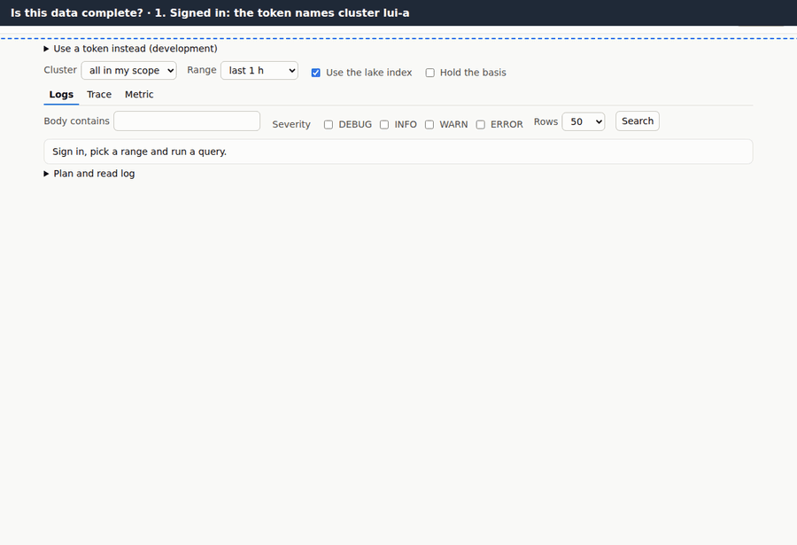
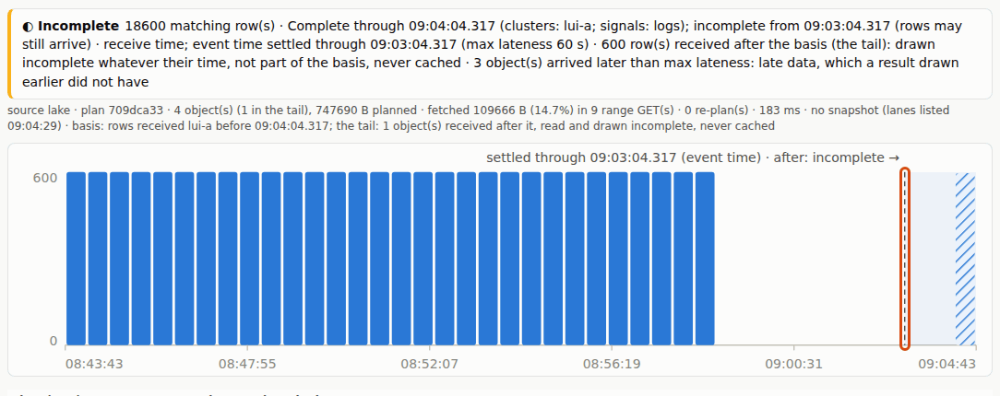
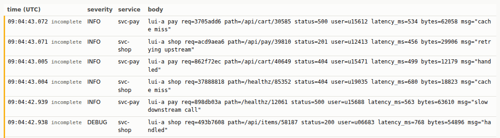
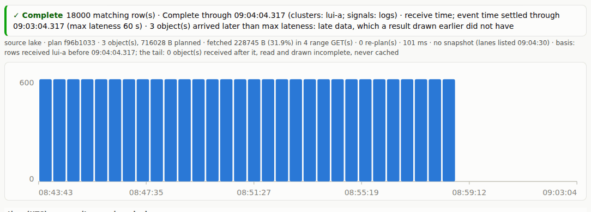
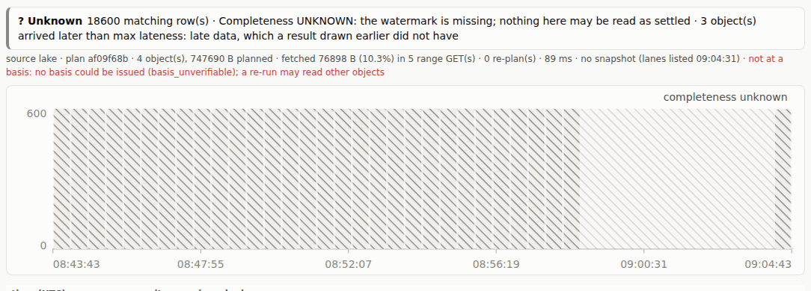

# 1. Is this data complete?

[All journeys](README.md) · test: [`lakeui/e2e/journeys/01-complete.spec.mjs`](../../lakeui/e2e/journeys/01-complete.spec.mjs)
· demonstrates STPA **R-S1**, **R-S2** (hazards H-2, H-5), D24, D26, D29,
D30 and its tail (AMBIGUITY #10 (b))

Alice is on call for cluster `lui-a`. She opens the lake UI and searches the
logs of the last twenty minutes. Before she reads a number she needs to
know whether that number can still change, and which part of the picture
she can already rely on. Every view in the lake UI answers that question on
its own, without a legend to look up: that is STPA requirement **R-S1**
("every result carries its source and complete-through time … and which
event time that settles; the UI shows them on every view") and **R-S2**
("windows not yet complete are drawn as incomplete, and counts over them
are marked partial"), which exist because of hazard **H-2**: a result
presented as complete while it is missing data.

## 1. Signing in

The page is static; it signs in with an OIDC authorization code and PKCE
(no client secret) and sends the access token to the query service with
every plan request. The header shows what the token says about her: user
`alice`, scope `clusters lui-a`. Everything that follows is limited to that
scope by the **service**, not by the page (journey 3 shows what happens
when she asks for more).

*Asserted:* the IdP flow completed and the page shows the token's claims.

## 2. A window that runs to now

Three things on this picture carry the answer to "can this change?":

- **The banner** says *incomplete*, with two times. **Complete through**
  is a *custody* time: the consumer promises that every row *received*
  before it is in the store ([FORMAT.md §3](../../FORMAT.md#3-what-the-consumer-promises-complete_through),
  per cluster and signal since [D29](../../DECISIONS.md#d29-complete_through-per-cluster-per-signal-and-per-lane)).
  **Settled through** is the *event* time that custody time settles:
  complete-through minus `max_lateness` (60 s by default,
  [D26](../../DECISIONS.md#d26-event-time-completeness-max_lateness-late-rows-counted-metadata-columns-allow-listed)).
  They are two clocks, and confusing them was a real bug (STPA CAST row 26):
  a window can be past complete-through by event time and still receive
  rows.
- **The stats line** names the **basis** the run read at
  ([D30](../../DECISIONS.md#d30-the-basis-answers-at-a-named-custody-time)):
  "rows received before T". A basis is a named custody time; everything
  received before it is the *basis part*, the same objects and the same
  rows however often the page asks again. What was received after it is
  the **tail**, read on every run and never cached (the owner's decision,
  [AMBIGUITY #10 (b)](../../AMBIGUITY.md)). Here the tail is the rig's late
  batch: 600 rows sent after the consumer published its watermark.
- **The histogram**: buckets wholly before *settled through* and holding
  no tail rows are solid; every other bucket is **hatched**, and the dashed
  line marks where settled ends. Colour is never the only signal: hatching,
  the line, its label and the banner's words say the same thing.

*Asserted:* status ok, completeness partial; the basis part equals
ClickHouse's count for the same scope and window (central has every row
received before complete-through); the tail is exactly the late batch
(600 rows); nothing received after the basis was left out; every solid
bucket starts before settled-through; exactly one settled-through marker.

## 3. The rows

The table shows the newest rows. All of them came in the tail, so each says
`incomplete`: the page does not only shade a region of the chart, it labels
each row it cannot vouch for.

*Asserted:* the 50 rows shown are tail rows, all incomplete.

## 4. Closing the window at settled-through

Alice moves the end of the window back to *settled through*. Now nothing in
the window can change: the banner says **complete**, every bucket is solid,
and the count is the one ClickHouse gives for the same window and cluster.
This is the claim the whole pipeline exists to make safely: "complete" is
said only when it is true.

*Asserted:* completeness complete; count = ClickHouse's; every bucket
complete.

## 5. When the service cannot tell

The rig removes the consumer's watermark document, as if the consumer had
never published one or its document could not be read. Without it the
service cannot say how far anything is settled, and it cannot issue a
basis either. The page says both: the banner is **unknown**, every bucket
and row is grey-hatched, and the stats line says the run was "not at a
basis: no basis could be issued (`basis_unverifiable`)", so a re-run may
read other objects. It does not fall back to calling the data complete.

*Asserted:* completeness unknown; planned unpinned with
`basis_unverifiable`; every row and bucket unknown. The watermark is put
back after the step.

## Where to read more

- The lake UI and how it reads the lake: [`lakeui/README.md`](../../lakeui/README.md), [D24](../../DECISIONS.md#d24-lake-ui-first-slice-plan-range-read-in-the-page-completeness-on-every-view)
- The plan call and its label: [`query/README.md`](../../query/README.md) §2.2–§2.4
- Why completeness is a safety requirement: [STPA.md](../../STPA.md) (R-S1, R-S2, H-2, CAST rows 26 and 34)
- Bitemporal reasoning behind the basis: [`research/bitemporal.md`](../../research/bitemporal.md)
