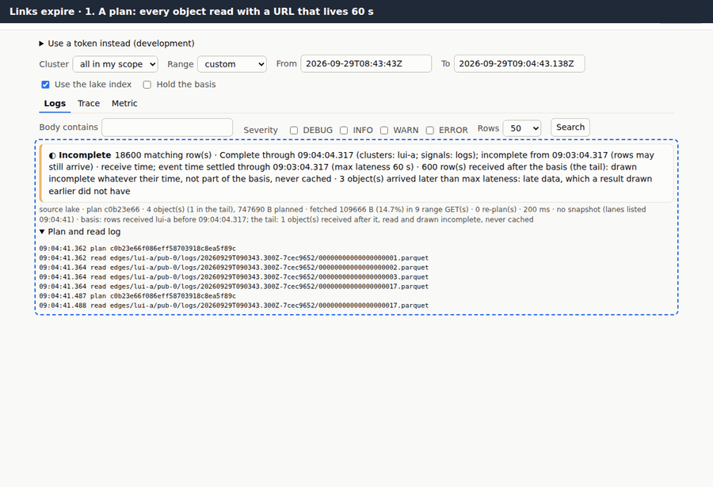
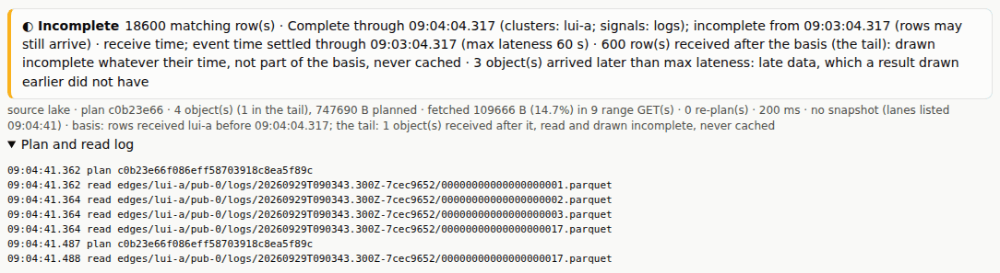
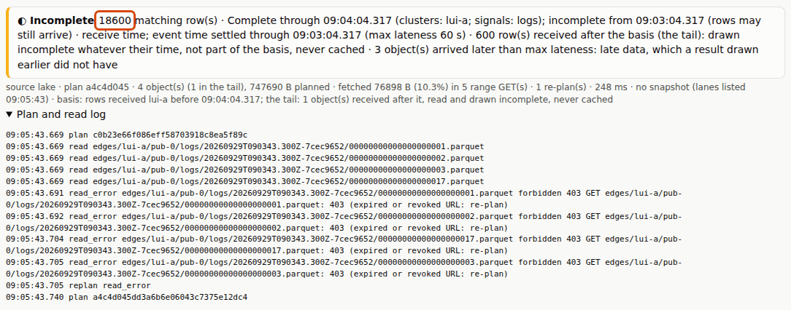
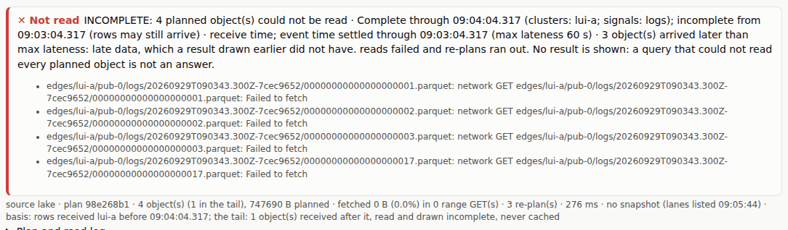

# 4. Links expire

[All journeys](README.md) · test: [`lakeui/e2e/journeys/04-expiry.spec.mjs`](../../lakeui/e2e/journeys/04-expiry.spec.mjs)
· demonstrates AMBIGUITY **X8** (presigned URL expiry), D24, D30, R-S2, H-2

The lake UI reads objects with **presigned URLs** the query service signs
for each plan. A URL is a capability with a lifetime: 300 s by default,
60 s on the rig so the test does not wait long. The question in
[AMBIGUITY.md X8](../../AMBIGUITY.md) was what a browser does when it holds
a plan longer than that. An object store answers an expired URL with
`403 Forbidden`, and a naive reader turns an error on an object into
"that object has no rows", which is a wrong answer that looks right.

X8's rules, which every plan carries in its `rules` field and the page's
re-plan state machine (`lakeui/src/runner.js`) obeys:

1. a plan is reused only before its `replan_after`, and no read *starts*
   after it;
2. a failed read (a 403 above all) means **re-plan**, never "no data";
3. a query that could not read every planned object shows **which objects
   it lacks and no result**.

## 1. A plan and its reads

A normal run. The "Plan and read log" at the bottom of the page lists the
plan request and every range read, with the object keys.

*Asserted:* status ok with no re-plan; the plan answer carries
`expires_at`.

## 2. Held past expiry

The test waits until every URL of that plan has **really** expired at the
store, then gives the page that same plan answer again, with its
`replan_after` pushed an hour out, the way a browser whose clock is behind
would still believe it valid. Nothing is kept from before, so the page
reads every object with its expired URL. SeaweedFS answers each with 403
(the counting pass-through in front of it sees them too). The page does
not report missing rows: it re-plans at the **same basis**
([D30](../../DECISIONS.md#d30-the-basis-answers-at-a-named-custody-time)),
gets fresh URLs for the same objects, reads them, and the count is exactly
the one from step 1.

*Asserted:* at least one read error with status 403, seen by the store as
well; one re-plan, for `read_error`; status ok; the same count, the same
tail rows, the same basis; a new plan request id.

## 3. The store stays unreachable

Now every read is reset at the network (the object store down, a proxy
misbehaving). The page re-plans, as rule 2 says, but not forever: after
three re-plans (four plan calls) it stops and shows **no number at all**,
only the list of the objects it could not read and why. A partial read is
never drawn as an answer.

*Asserted:* status failed after 3 re-plans and 4 plan calls; every planned
object listed as missing; no count element.

## Where to read more

- X8 and its status: [AMBIGUITY.md](../../AMBIGUITY.md) (X8), [`query/README.md`](../../query/README.md) "The rules the plan carries"
- The re-plan state machine and its property test (1,500 random runs of lifetimes, 403s and refusals): [`lakeui/README.md`](../../lakeui/README.md) "Tests"
- CAST row 25 (every plan was stale when issued, until the margin was capped): [STPA.md](../../STPA.md)
