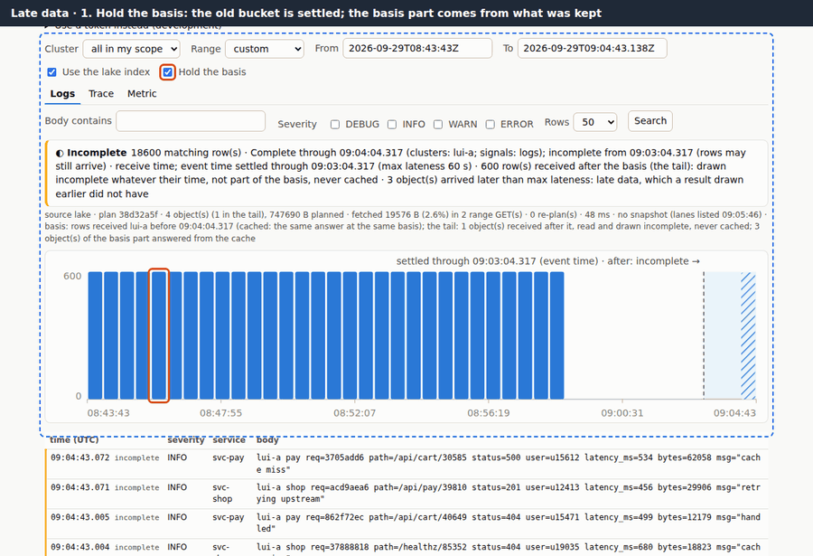
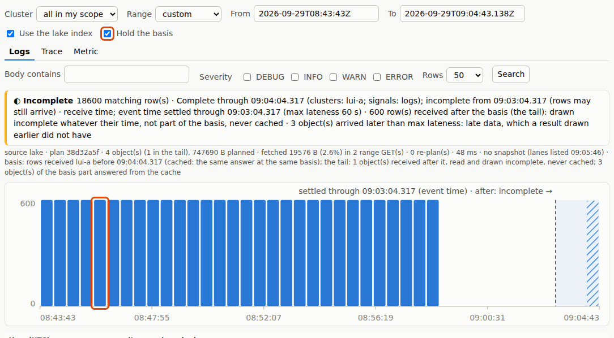
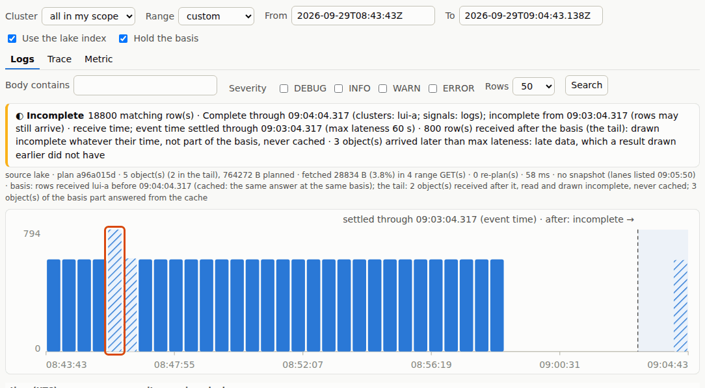
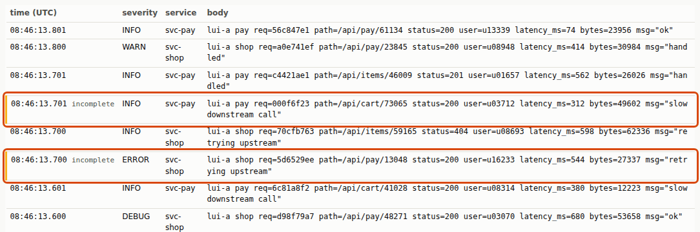

# 5. Late data

[All journeys](README.md) · test: [`lakeui/e2e/journeys/05-late.spec.mjs`](../../lakeui/e2e/journeys/05-late.spec.mjs)
· demonstrates D26, D30 and its tail (AMBIGUITY #10 (b)), D31, STPA R-S1,
R-S2, H-5, CAST row 26

Every telemetry row has two times: when it **happened** (event time, the
row's `Timestamp`) and when the pipeline **received** it (custody time).
They usually agree to within a second, which is why they are easy to
confuse. They stop agreeing when a pod is cut off from the network for a
while and then delivers its buffer, or when an edge restarts and replays
what it had not yet handed over. STPA CAST row 26 is the bug this caused
before: a window was labelled complete by custody time while rows with
event times inside it were still on their way.

In this journey Alice is writing up an incident and wants her numbers not
to move under her: she ticks **Hold the basis**. Then rows stamped
eighteen minutes ago arrive.

## 1. A held basis

With the basis held, each re-run asks the query service for the same
[basis](../../DECISIONS.md#d30-the-basis-answers-at-a-named-custody-time):
the same set of objects received before one custody time. The page kept
what it read of those objects under that basis, so the basis part is
answered from memory and only the tail is read again. The outlined bucket,
two minutes into the window, is solid: its event time is long past
*settled through*, and it holds no tail rows.

*Asserted:* the same basis and `objects_hash` as the run before; every
object of the basis part answered from what was kept; the only objects
fetched again (counted by the pass-through) are tail objects; the basis
part equals ClickHouse; the outlined bucket is complete.

## 2. Rows stamped long ago arrive now

The rig sends 200 `lui-a` rows whose event times fall two minutes into
the window (`POST /rig/more`). They land in a new object of
their own: objects in the lake are create-only, so nothing already there is
rewritten, and an edge puts a request's late rows in a separate object
([D31](../../DECISIONS.md#d31-late-rows-in-their-own-object-the-edges-split-a-request-by-event-time),
[FORMAT.md §2.2](../../FORMAT.md#22-late-rows-in-their-own-object-traces-and-logs-d31))
so an old row does not stretch a current object's time range.

Alice runs the same query at her held basis. Two things are true at once,
and the page shows both:

- **Her answer did not change** where it promised not to: the basis part is
  the same objects (`objects_hash`), the same 18,000 rows, equal to
  ClickHouse, which has not ingested the new rows yet.
- **The new rows are not hidden**: they were received after her basis, so
  they are the **tail** ([AMBIGUITY #10 (b)](../../AMBIGUITY.md)), read on
  every run, counted in the banner ("… row(s) received after the basis"),
  and the old bucket they fall into is now **hatched**, although its event
  time was settled long ago. A late row makes its bucket incomplete by
  what it *is* (received after the basis), not by when it claims to have
  happened.

*Asserted:* the same basis and `objects_hash`; the basis part still equals
ClickHouse (18,000) and every object of it came from what was kept; the
tail is the rig's 600 late rows plus the 200 new ones, in more tail objects
than before; the outlined bucket, before settled-through by event time, is
incomplete; ClickHouse still has none of the new rows.

## 3. Zoomed in

Alice narrows the window to the thirty seconds the late rows cover. Rows
of the basis and late rows share the same event times, interleaved in the
table. The late ones, outlined, are tagged `incomplete`; the others are
complete. The page labels rows, not only regions of time.

*Asserted:* at the same basis, the tail in this window is exactly the 200
new rows; the rest equals ClickHouse's count for the window; every tail row
shown is incomplete and every other row complete.

## Where to read more

- Two clocks and `max_lateness`: [D26](../../DECISIONS.md#d26-event-time-completeness-max_lateness-late-rows-counted-metadata-columns-allow-listed), CAST row 26 in [STPA.md](../../STPA.md)
- The basis, the tail, and why the tail is never cached: [D30](../../DECISIONS.md#d30-the-basis-answers-at-a-named-custody-time), [AMBIGUITY #10](../../AMBIGUITY.md), [`research/bitemporal.md`](../../research/bitemporal.md)
- Late rows in their own objects: [D31](../../DECISIONS.md#d31-late-rows-in-their-own-object-the-edges-split-a-request-by-event-time), and in central's partitions, [D34](../../DECISIONS.md#d34-centrals-partition-key-todatereceived_at-late_part-late-parts-in-partitions-of-their-own)
