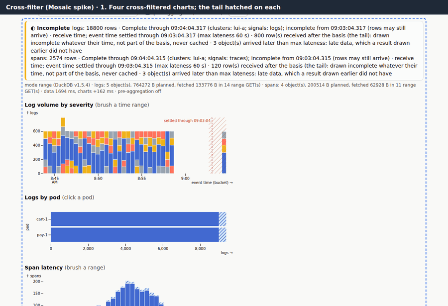
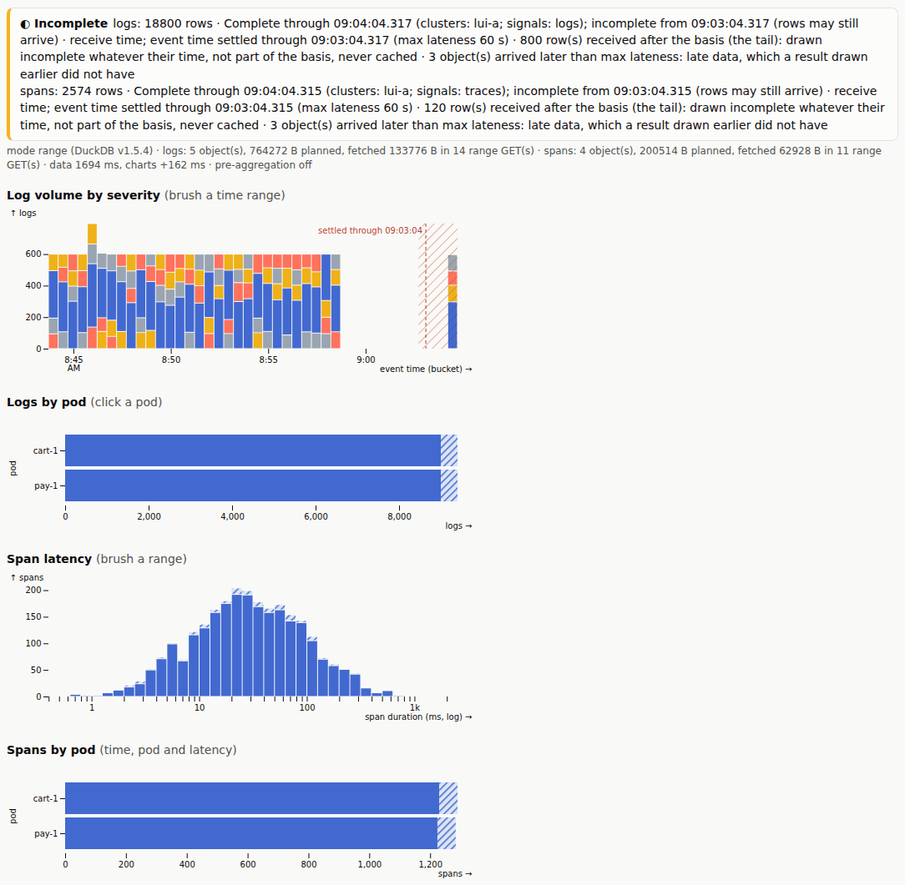
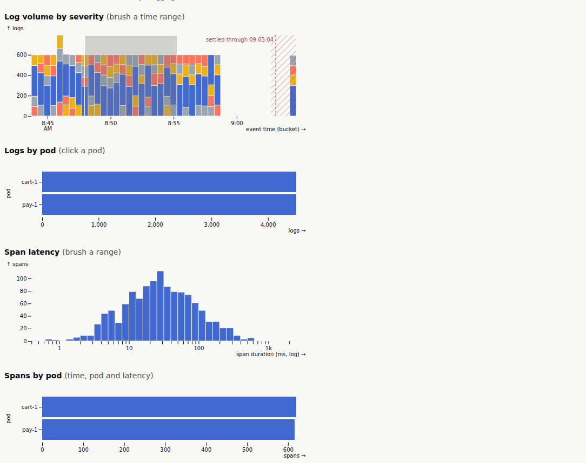
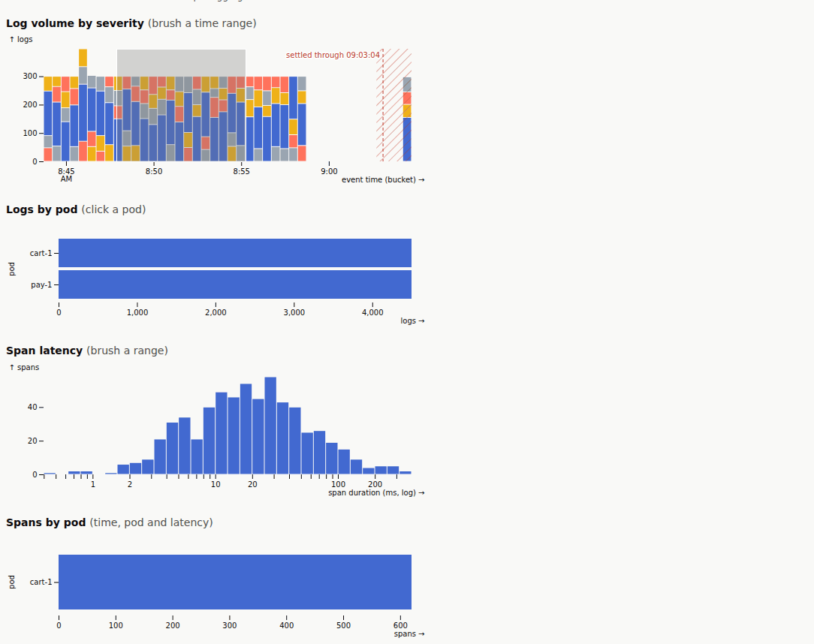

# 6. Cross-filter, with the completeness marks (a spike)

[All journeys](README.md) · test: [`lakeui/e2e/journeys/06-mosaic.spec.mjs`](../../lakeui/e2e/journeys/06-mosaic.spec.mjs)
· demonstrates D28 (**proposed, not adopted**), R-S1, R-S2, H-2, AMBIGUITY
#10 (b); uses the exactness check CAST row 33 added (the stale-cube
regression itself is the spike's own nightly e2e)

> **This is a spike, not the product.** The page is
> [`lakeui/mosaic/`](../../lakeui/mosaic/README.md), built to answer one
> question: can [Mosaic](https://github.com/uwdata/mosaic) (vgplot,
> DuckDB-WASM, cross-filtering) serve the lake UI's analytical views
> without giving up what journeys 1–5 show? The evaluation and the
> recommendation are in [`research/mosaic.md`](../../research/mosaic.md);
> the decision, [D28](../../DECISIONS.md#d28-mosaic-vgplot--duckdb-wasm-for-the-lake-uis-analytical-views-fed-by-the-range-reader-proposed),
> is still proposed.

This journey runs after [journey 5](late.md) on the same rig, so the tail
holds both the late batch and the late rows journey 5 added.

## 1. Four charts, loaded through the range reader

The page asks `/v1/plan` for logs and spans at a basis with its tail
(exactly as the lake UI does), range-reads the columns it needs with the
lake UI's own reader, and loads the rows into DuckDB-WASM as Arrow. The
state of every row and bucket (settled, tail, unknown) is decided in
JavaScript by the lake UI's `completeness.js` **before** DuckDB sees it,
and each chart draws it: a hatched band and a "settled through" rule on
the time chart, hatched parts of the bars on the others.

*Asserted:* the basis part equals ClickHouse's count; the incomplete rows
are exactly the tail's rows; the band, the rule and hatched bars are drawn;
every chart's total equals an independent SQL count.

## 2. Brush a time range

Brushing the time chart filters the other three. After the brush, each
chart's drawn total is compared with an independent `count(*)` under that
chart's filter; they must be equal. The check exists because of a real
failure the spike found: Mosaic's pre-aggregated tables were keyed on
their SQL, not on the data, and answered with the previous load's rows
after a reload (STPA CAST row 33). Pre-aggregation is off in this journey
so the counts are exact; with it on, a brush's edges are rounded to the
pixel.

*Asserted:* chart B is filtered by the brush; every total equals its
independent count.

## 3. Click a pod

Clicking a pod on "Logs by pod" narrows the span charts too (both tables
share the pod and time-bucket columns): the spans chart is now filtered by
time, pod and latency together.

*Asserted:* the spans chart's filter names the pod; every total still
equals its independent count.

## Where to read more

- [`research/mosaic.md`](../../research/mosaic.md): range reads against DuckDB reading the URLs, brush latency up to 11 M rows, memory, the server-connector question
- [`lakeui/mosaic/README.md`](../../lakeui/mosaic/README.md): how the page is built, `?mode=`, `?preagg=`
