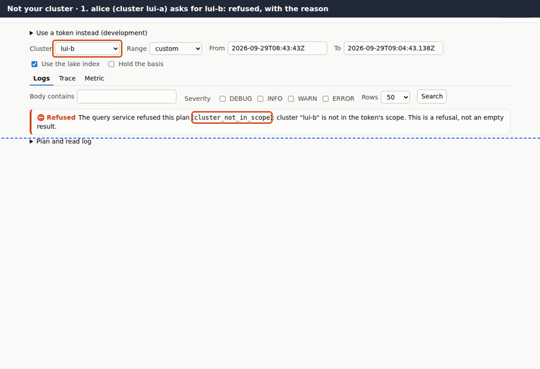
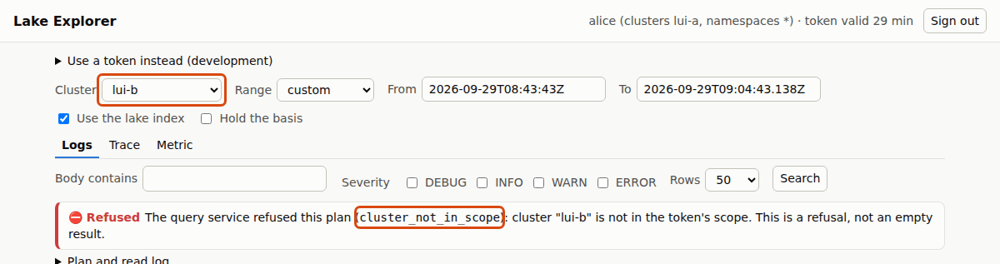
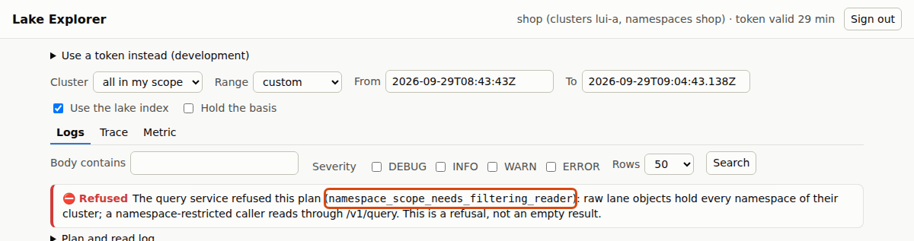
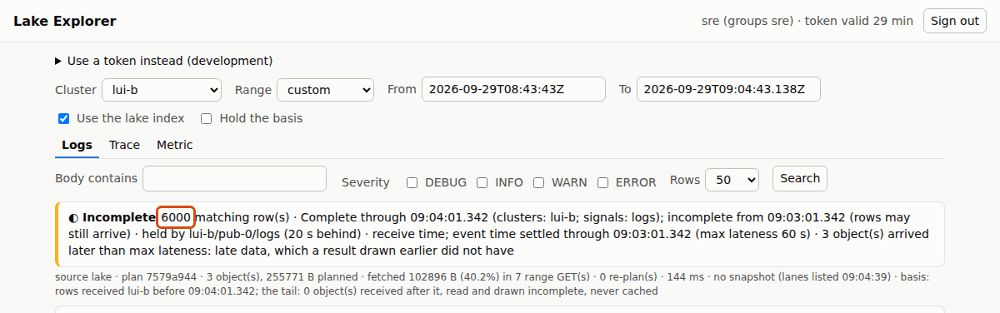

# 3. Not your cluster

[All journeys](README.md) · test: [`lakeui/e2e/journeys/03-scope.spec.mjs`](../../lakeui/e2e/journeys/03-scope.spec.mjs)
· demonstrates STPA **R-S8** (hazard H-6), H-2, D22, D38

Alice's token names one cluster, `lui-a`. The cluster list on the page
offers `lui-b` too: the page's configuration lists the deployment's
clusters, and the page does not decide who may read what. The query
service does, from the token, for every plan and every query
([D22](../../DECISIONS.md#d22-query-service-sql-rebuilt-from-the-tree-scope-as-table-filters-labels-on-every-result);
grants as (role, cluster, namespace) tuples since
[D38](../../DECISIONS.md#d38-grants-as-explicit-role-cluster-namespace-tuples-environments-as-buckets-cedar-as-the-source-compiled-to-tuples-and-prefixtag-iam-partly-built)).

There are two ways to get this wrong. One is to show her `lui-b`'s data
(hazard **H-6**, an unauthorised read). The other is quieter: narrow her
request to what she may see and answer it, which for `lui-b` is nothing. A
view that says "0 rows, complete" about a cluster she cannot see is a lie
about that cluster (hazard **H-2**), and during an incident it reads as
"nothing happened there".

## 1. Refused, with the reason

She picks `lui-b` and searches. The service answers `403
cluster_not_in_scope`: a named cluster outside the scope is **refused,
never silently dropped** ([`query/README.md`](../../query/README.md) §2.2).
The page draws a refusal, names the reason, and says in words that this
is not an empty result. There is no count on the page, and no chart.

*Asserted:* status refused, reason `cluster_not_in_scope`; the banner in
the refused state saying "not an empty result"; no count element and no
chart.

## 2. A namespace-scoped user

`shop` may read one namespace of `lui-a`. The lake's raw objects hold every
namespace of a cluster, and a presigned URL cannot hand out a part of an
object, so the service refuses to plan raw objects for a namespace-scoped
token (`namespace_scope_needs_filtering_reader`) rather than sign URLs to
rows she may not see. Such users read through `/v1/query`, which filters
server-side (not wired into this UI yet).

*Asserted:* status refused with that reason; no count.

## 3. The fleet user

`sre` belongs to the `sre` group, which grants every cluster. The same
request for `lui-b` is answered, and the count is the one ClickHouse holds
for `lui-b`.

*Asserted:* status ok; count = ClickHouse's count for `lui-b`.

## Where to read more

- The scope rules and refusals: [`query/README.md`](../../query/README.md) §2 and [D22](../../DECISIONS.md#d22-query-service-sql-rebuilt-from-the-tree-scope-as-table-filters-labels-on-every-result)
- Grants, Cedar, environments: [D38](../../DECISIONS.md#d38-grants-as-explicit-role-cluster-namespace-tuples-environments-as-buckets-cedar-as-the-source-compiled-to-tuples-and-prefixtag-iam-partly-built), [`research/grants.md`](../../research/grants.md)
- The security requirements: [STPA.md](../../STPA.md) R-S7, R-S8
