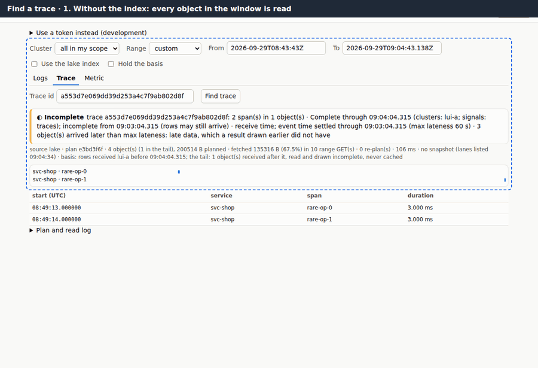
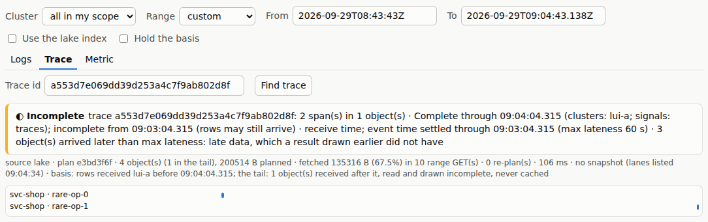
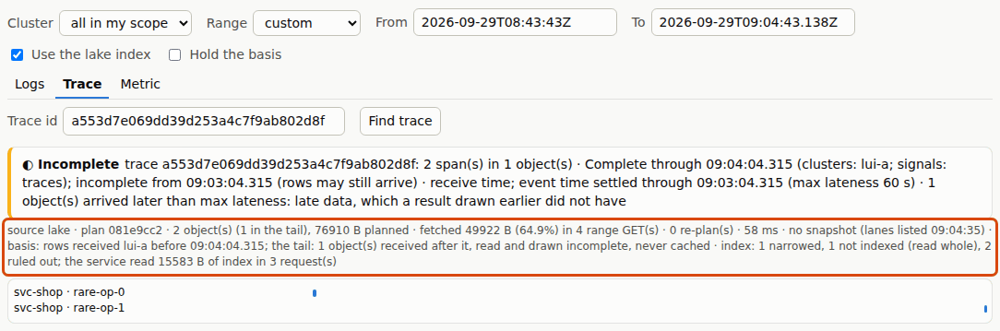
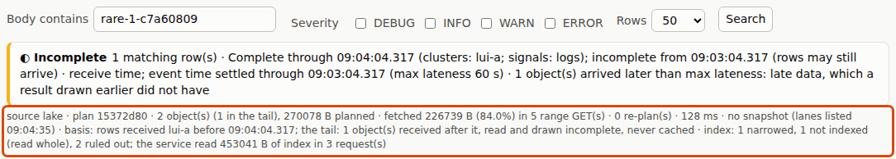
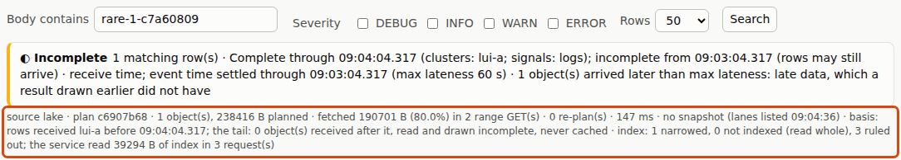

# 2. Find a trace

[All journeys](README.md) · test: [`lakeui/e2e/journeys/02-trace.spec.mjs`](../../lakeui/e2e/journeys/02-trace.spec.mjs)
· demonstrates D27 (the lake index), [FORMAT.md §7](../../FORMAT.md#7-index-objects-d27),
R-S1

A support ticket carries a trace id. Alice pastes it into the Trace tab.
The lake UI has no server that searches for her: the query service
**plans** (which objects, with presigned URLs), and the page **range-reads**
only the parts of those Parquet objects it needs, straight from the object
store. So the cost of finding a trace is the bytes the page reads, and the
lake index ([D27](../../DECISIONS.md#d27-lake-index-first-slice-per-cluster-segments-resolved-by-the-query-service))
exists to make that smaller without ever changing the answer.

The trace in this journey lives in one object of the three that the
window holds for `lui-a`.

## 1. Without the index

With "Use the lake index" off, the plan lists every trace object of the
window. For each, the page reads the Parquet footer, then the `TraceId`
column chunks whose row-group statistics can hold the id, then the span
columns only where it matched. The waterfall and the span table are the
answer; the stats line is the cost: objects planned, bytes planned, bytes
fetched, range GETs.

*Asserted:* the span count equals ClickHouse's for the id; no index was
used; at least three objects were planned; the bytes the page counted
equal the bytes the counting pass-through in front of the store saw, and
every read was a `206` range read.

## 2. With the index

With the index on, the page sends the trace id with its plan request. The
query service resolves it against the lake index (per-cluster segments of
exact terms, [FORMAT.md §7](../../FORMAT.md#7-index-objects-d27)) and leaves
out the objects that **cannot** hold the id; for the rest it names the row
groups that can. The stats line says what the index did: how many objects
it narrowed, how many it ruled out, how many were not indexed, and how
many bytes of index the *service* read to decide.

The answer is the same waterfall. The index removes objects from the plan,
never rows from the answer: a false positive costs bytes, a false negative
would be a wrong answer, and segments are exact per object for that reason
([FORMAT.md §7.3](../../FORMAT.md#73-what-a-reader-may-conclude)).

On the rig the window also holds a tail object of spans received after
the basis (the late batch), which the indexer has not seen yet: the stats
line counts it as "not indexed (read whole)" and it is read, as step 3
explains.

*Asserted:* the same span count (= ClickHouse); objects ruled out > 0;
strictly fewer bytes and fewer range GETs than without the index; page and
pass-through agree on the bytes.

## 3. A search the index has not caught up with

The index is built by a separate pass over objects that are already in the
lake, so it is always behind the newest objects. Here Alice searches the
logs for a word that lives in one batch. The rig's late batch (see
[journey 1](complete.md)) arrived after the indexer's last pass. The
service does not guess about it: an object the index has not covered is
planned as **scan** and the page reads its column in full. The stats line
says so ("not indexed (read whole)"). Skipping it would be fast and wrong.

*Asserted:* the count equals ClickHouse's; objects not indexed > 0 and
objects ruled out > 0 in the same plan.

## 4. After an indexer pass

The rig runs one more indexer pass (`POST /rig/index`) and Alice searches
again. Now every object is covered; the late object is ruled out too,
and the same count costs fewer bytes.

*Asserted:* the same count; nothing planned as scan; bytes fetched no more
than before.

## Where to read more

- D27 and its measurements (how much each query saves on the rig): [`lakeui/README.md`](../../lakeui/README.md) "With the lake index"
- The index format: [FORMAT.md §7](../../FORMAT.md#7-index-objects-d27)
- How the page reads Parquet with range requests: [`lakeui/README.md`](../../lakeui/README.md) "Plan → range reads", [`research/lake-ui.md`](../../research/lake-ui.md)
