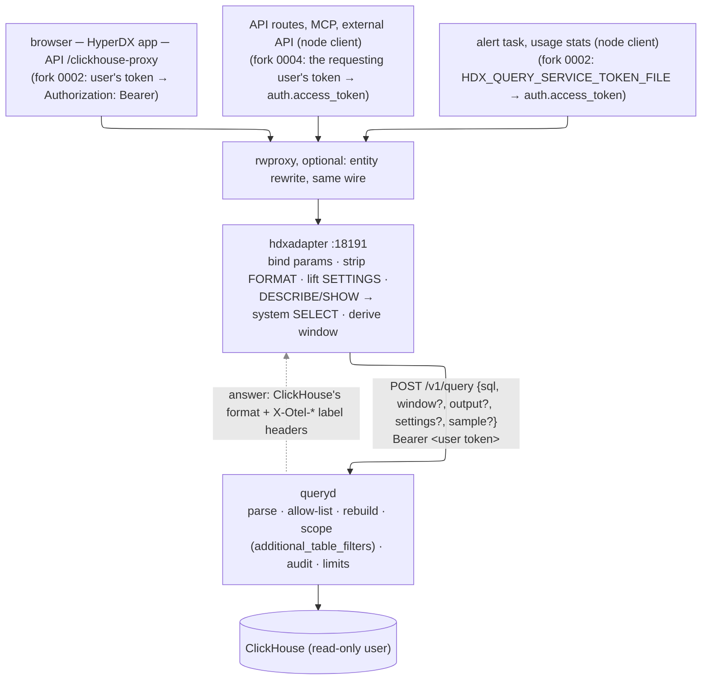

# query: the query service both UIs sit on

The first slice of the service that the HyperDX fork and the lake-first UI
share ([`../research/lake-ui.md`](../research/lake-ui.md) §3, "Shared pieces";
[`../DECISIONS.md`](../DECISIONS.md) "Owner decisions, 2026-09-27" and D22):

- **`POST /v1/query`**: SQL on central ClickHouse, constrained to our tables,
  parsed and rebuilt from the tree, scoped to the caller's clusters and
  namespaces, with the caller's limits and every overflow mode pinned to
  `throw`;
- **`POST /v1/plan`**: the lake's plan call: the objects of a signal and
  window in the caller's clusters, each with a presigned GET URL, its size
  and its time range;
- every answer carries its **source** and that source's
  **`complete_through`** (custody time), the **`max_lateness`** policy that
  bridges it to event time, and marks what extends past it (STPA R-S1, R-S2,
  CAST row 26); a windowed answer counts its **late rows** (received more than
  `max_lateness` after their event time);
- every answer names its **basis** (D30, §2.4): per cluster, a custody time
  C below that cluster's `complete_through`. A request may send a basis back
  (or ask for `"latest"`): it then reads only rows received before C, and the
  same request at the same basis answers the same however much data arrives
  meanwhile; `basis_from` gives the rows received between two bases (late
  data, for the alert evaluator);
- **OIDC** bearer tokens (RS256, the issuer's JWKS), claims mapped to
  clusters, namespaces and roles, **deny by default**; every decision is
  **audited** before anything runs (R-S8);
- `/metrics` and `/healthz`.

What these look like from a user's seat (the label as a banner, a refusal,
an expired URL, the basis and its tail), step by step with screenshots from
tests: [`../docs/journeys/`](../docs/journeys/README.md).

Labels as elsewhere: **[M]** measured here (the shared 4-vCPU box, SeaweedFS
4.47 and ClickHouse 26.10.1 on localhost), **[D]** read in a source, **[E]**
estimate.

**Why Go.** The rewrite proxy ([`../entities/rwproxy/`](../entities/rwproxy/))
already chose the ClickHouse-grammar parser
[`github.com/AfterShip/clickhouse-sql-parser`](https://github.com/AfterShip/clickhouse-sql-parser)
v0.5.6: it parses 799 of 799 of HyperDX's statements where Rust's
`sqlparser` parses 229 (rwproxy README §2). This service uses the same parser
and version, the AWS SDK the controller uses, `golang-jwt/jwt/v5` for token
checks, and `pgregory.net/rapid` v1.2.0 for property tests.

## 1. Running it

```
go build ./cmd/queryd
QS_CH_PASSWORD=… ./queryd -config queryd.example.json
```

[`queryd.example.json`](queryd.example.json) is the whole configuration.
Endpoints and secrets can be set or overridden in the environment:
`QS_LISTEN`, `QS_OIDC_ISSUER`, `QS_OIDC_AUDIENCE`, `QS_OIDC_JWKS_URL`,
`QS_AUDIT_PATH`, `QS_CH_URL`, `QS_CH_USER`, `QS_CH_DATABASE`, the password
in `QS_CH_PASSWORD` (or the variable `central.password_env` names),
`QS_S3_ENDPOINT`, `QS_S3_PUBLIC_ENDPOINT`, `QS_S3_BUCKET`, `QS_S3_REGION`,
`QS_S3_KEY` / `QS_S3_SECRET` (otherwise the AWS SDK's default chain: web
identity, instance role, `AWS_*`), `QS_LAKE_ROOT`, `QS_LAKE_CTL`,
`QS_CATALOG_DB`, `QS_LAKE_ENABLED`, and the completeness policy
`central.recovered` (default false: serve `{table}_recovered` to requests
with `"recovered": true`, D35, §2.1), `QS_MAX_LATENESS_S` (`watermark.max_lateness_s`, default 60) and
`QS_COUNT_LATE` (`watermark.count_late`, default true), §2.1, and the basis
keys `QS_BASIS_KEYS` (`kid:base64,…`, at least 32 bytes each, the same on
every replica; `basis.keys_env` names another variable) and
`QS_BASIS_KEY_CURRENT` (`basis.current`), with `basis.retention_s` (default
90 days) and `basis.skew_s` (300), §2.4. Without keys the service mints with
a random per-process key and says so in its log: bases then die with the
process. On AWS the basis key is a KMS HMAC key instead (§2.4, "The
signer"): `QS_BASIS_SIGNER=kms` (`basis.signer`, default `static`),
`QS_BASIS_KMS_KEYS` (`basis.kms_keys`), `QS_BASIS_KMS_REGION`,
`QS_BASIS_KMS_ENDPOINT` (an emulator), `QS_BASIS_START_WITHOUT_SIGNER`
(`basis.start_without_signer`), with `basis.kms_timeout_s` (2),
`basis.verify_cache_s` (600) and `basis.mint_reuse_s` (5 with KMS, 0 with
static keys). An audit path and a bucket are
required: the service does not start without somewhere to record decisions,
or without `{ctl}/watermark.json` to label results with.

**The ClickHouse user** is read-only and can read only the served tables:

```sql
CREATE USER otel_query_ro IDENTIFIED WITH sha256_password BY '…' SETTINGS readonly = 2;
GRANT SELECT ON otel.otel_logs TO otel_query_ro;
GRANT SELECT ON otel.otel_traces TO otel_query_ro;
-- catalog-scoped tables and R-S5: the catalog's resources view (and what it reads), ingest_log
GRANT SELECT ON entities.resources TO otel_query_ro;
GRANT SELECT ON entities.ingest_log TO otel_query_ro;
-- the metadata tables (scope "metadata", §3), for the HyperDX adapter (§8).
-- 26.10 needs a grant for data_skipping_indices; the rest are readable by
-- every user, and every one of them shows only what the user may see
GRANT SELECT ON system.tables, system.columns, system.data_skipping_indices, system.settings,
  system.table_engines, system.databases TO otel_query_ro;
-- HyperDX finds a rollup through its materialized view's definition: SHOW, not SELECT
GRANT SHOW TABLES ON otel.otel_logs_attr_kv_rollup_15m_mv TO otel_query_ro;
GRANT SHOW TABLES ON otel.otel_traces_kv_rollup_15m_mv TO otel_query_ro;
-- the key/value rollups, scoped by their cluster column (D33; kvrollupmigrate first, §8.5)
GRANT SELECT ON otel.otel_logs_kv_rollup_15m TO otel_query_ro;
GRANT SELECT ON otel.otel_traces_kv_rollup_15m TO otel_query_ro;
-- the entity catalog for the rewrite proxy (D33): resource_kv, and dictGet per
-- allow-listed dictionary (never ON entities.*: a dictionary outside the list stays unreadable)
GRANT SELECT ON entities.resource_kv TO otel_query_ro;
GRANT dictGet ON entities.d_res TO otel_query_ro;   -- and d_pod, d_wl, d_node, d_ns, d_cluster
```

**D33's configuration** (all in [`queryd.example.json`](queryd.example.json),
none of it in code): `central.dictionaries` (the catalog's dictionaries a
statement may read, each attribute's type and default, the root's cluster
and namespace expressions, §3), `central.performance_settings` (what a
caller may set per statement, §3) and `sample` (`default_rows`,
`max_rows`: labelled samples, §2.1; `max_rows` 0 refuses them).

`readonly = 2` lets the service set settings per statement (the limits, the
filters) and nothing else; `readonly` itself cannot be changed [M]. The
grants are the second fence behind the allow-list (§3).

## 2. API

Every endpoint under `/v1/` takes `POST` with a JSON body and an
`Authorization: Bearer <OIDC token>` header, answers JSON with
`Cache-Control: no-store`, and answers CORS preflights for the configured
origins (`cors_origins`). Every answer has a `request_id`, which is the audit
record's and ClickHouse's `query_id`.

### 2.1 `POST /v1/query` (role `query`)

```json
{"sql": "SELECT ServiceName, count() FROM otel_logs GROUP BY ServiceName",
 "window": {"from": "2026-09-28T12:00:00Z", "to": "2026-09-28T13:00:00Z"}}
```

`window` is optional; `from`/`to` are RFC 3339 or integer nanoseconds. When
it is given, every table read with a `time_column` is restricted to
`[from, to)` by the service (§3), so the completeness label describes the
rows the statement could see.

`clusters` is optional (D29): a subset of the token's clusters the
statement is narrowed to. Rows are filtered to them and the label is their
`complete_through`; a named cluster outside the token is **403
`cluster_not_in_scope`**, a name outside FORMAT.md's pattern **400
`bad_cluster`**. Default: every cluster in the token's scope. (A fleet
caller that names clusters becomes a restricted caller: `fleet`-scoped
tables are then refused, as for any restricted caller.)

`output` is optional: output-format settings that change how values are
written, never which rows, from an allow-list (`OutputSettings`: today only
`date_time_output_format` = `simple` | `iso` | `unix_timestamp`, which HyperDX
needs as `iso`). Any other name or value is **400 `bad_output`** and nothing
runs.

`settings` is optional (D33): ClickHouse settings for this statement, each
in the configured **performance-settings allow-list**
(`central.performance_settings`: settings that change how fast a statement
runs, never what it reads or answers, e.g. `use_skip_indexes_on_data_read`,
`query_plan_optimize_lazy_materialization`). Values are checked per rule
(`bool`, `uint` in a range, `enum`). Anything else is **400 `bad_setting`**,
audited, and nothing runs; the classes that could widen scope, read other
data, change results or raise limits (`max_*`, overflow modes, `readonly`,
`additional_table_filters`, formats, the query cache, `final`, …) are
refused by the code whatever the configuration says. The answer echoes the
settings applied (`settings`).

`sample` is optional (D33): **a labelled sample**, for suggestion lists
(HyperDX's typeahead), never for counts, charts or alerts. `{"rows": N}`
(or `{}` for `sample.default_rows`) makes ClickHouse stop reading at N rows
(at most `sample.max_rows` and the caller's `max_rows_to_read`):
`read_overflow_mode = break` at that bound, every other overflow mode still
`throw`. The answer's `completeness` is **`sample`** (never `complete`),
`partial: true`, `late.status: "sample"` (not counted), and

```json
"sample": {"sample": true, "rows_read": 3000123, "max_rows_to_read": 3000000,
           "reached_bound": true, "data_completeness": "complete"}
```

`reached_bound` is `rows_read ≥ max_rows_to_read` (ClickHouse checks per
block, so it can read past it); `data_completeness` is what the rows' label
would have been. A sample that read everything is still a sample.

`recovered` is optional (D35 (3), FORMAT.md §3.1): **the recovered
tables**, the rows `consume admit` took out of a quarantine (objects of a
retired lane received below its bound, which the consumer never ingests).
Served only with `"recovered": true` and `central.recovered: true` in the
configuration (else **400 `recovered_unavailable`**); the statement may
then name only `{table}_recovered` tables (a main table is **403
`table_not_allowed`**), and without the flag no recovered table can be
named: the two are never mixed. Scope, window and filters apply as to the
main table. The answer says **`source: "recovered"`**, `completeness:
"unknown"`, `partial: true`, no `complete_through`, `watermark.status:
"not_applicable"` with the reason in `watermark.note`, `late.status:
"recovered"`; no basis is minted. With `basis`, `basis_from` or `sample`
it is **400 `recovered_alone`**. The read-only user needs `SELECT` on the
recovered tables (they appear when `consume admit` first runs). The alert
evaluator never reads them: nothing is re-evaluated automatically; the
operator re-checks the windows `consume admit` reports.

```json
{"request_id": "5c0f…",
 "source": "central",
 "complete_through": "2026-09-28T12:59:31.2Z", "complete_through_ns": 1790…,
 "max_lateness_s": 60, "settled_through": "2026-09-28T12:58:31.2Z", "settled_through_ns": 1790…,
 "completeness": "partial", "partial": true,
 "incomplete_from": "2026-09-28T12:58:31.2Z", "incomplete_from_ns": 1790…,
 "watermark": {"status": "ok", "key": "edges/_consumer/watermark.json", "age_s": 12.1, "lag_s": 28.8,
               "fetched_at": "…", "holding": [{"lane": "prod-eu-1/pub-0/logs", "wm_ns": 1790…, "lag_s": 28.8}],
               "scope": {"clusters": ["prod-eu-1"], "signals": ["logs"],
                         "by_cluster": [{"cluster": "prod-eu-1", "complete_through_ns": 1790…, "basis": "cluster_signals", "doc_age_s": 12.1}]}},
 "catalog": {"status": "ok", "clusters": {"prod-eu-1": {"last_put": "…", "lag_s": 41.0, "status": "ok"}}},
 "late": {"max_lateness_s": 60, "status": "counted", "rows": 0, "tables": {"otel.otel_logs": 0}},
 "query": {"hash": "9e1d…", "tables": ["otel.otel_logs"], "sql": "SELECT ServiceName, count() FROM otel.otel_logs GROUP BY ServiceName",
           "scoped": true, "window": {"from_ns": …, "to_ns": …}, "rows_read": 5120, "elapsed_ms": 18.2},
 "result": { ClickHouse's FORMAT JSON: meta, data, rows, statistics }}
```

- **Two clocks** (STPA CAST row 26, D26). `complete_through` is **custody
  time**: every row *received* (`received_at`, the edge's custody stamp)
  before it is in central. A `window` is **event time** (the rows'
  `Timestamp`). `max_lateness_s` is the policy that bridges them: a row is
  assumed received within `max_lateness` of its event time, so event time
  is settled through `settled_through` = `complete_through − max_lateness`.
- **`completeness`**: `complete` (the window ends at or before
  `settled_through`, i.e. `complete_through ≥ to + max_lateness`, and the
  watermark is current), `partial` (it extends past it: draw from
  `incomplete_from` = `settled_through`, clamped to the window, on as
  incomplete, count over it as partial), or `unknown` (the watermark is
  missing, unreadable or stale: **nothing in the result may be read as
  settled**). A statement without a window runs up to now, so it is always
  `partial` or `unknown`. Until 2026-09-28 a window was `complete` once
  `complete_through ≥ to`: a row with its event time in the window, still at
  an edge when the window closed, was missing from a result labelled complete.
- **`late`**: rows later than the policy are **counted, not hidden**. For a
  windowed statement the service runs one more statement after it, under the
  same filters (scope and window) and limits: per table read that has a
  `received_column` (table config; `received_at` in the consumer's schema,
  every central table has it per row), `count()` of rows with `received_at > time_column +
  max_lateness`. `status`: `counted` (`rows`, per table in `tables`;
  `uncounted` lists tables without a received column), `no_window` (an
  unbounded statement is not counted), `not_measured` (no table read has
  both columns), `disabled` (`watermark.count_late: false`), `error` (the
  count failed; the result stands, `rows` is null). Late rows are *in* this
  result; a non-zero count on a `complete` window means a result over it
  served before they came lacked them, and that `max_lateness` is too
  short for this data (the policy to change, not the code).
- **`watermark`**: the document's own freshness: `status` (`ok`, `stale`:
  the consumer last published more than `watermark.max_age_s` ago, `missing`,
  `error`: unreadable, or the last good copy is older than `max_age_s`),
  `age_s` (now − the document's `wall_ms`), `lag_s` (now −
  `complete_through`), and the lanes holding it back or stale, **cut to the
  statement's scope** (another cluster's lane names are not disclosed).
- **Whose `complete_through`** (D29, `watermark.scope`): the minimum, over
  the statement's clusters (the token's, narrowed by `clusters`; every
  cluster, `["*"]`, for a fleet caller or a `fleet`-scoped table), of each
  cluster's value for the signals of the tables it reads (the table's
  `signals` in the configuration: `["logs"]` for `otel_logs`; a table
  without them counts as every signal, `["*"]`). Each cluster's value is the
  highest the consumer published for a superset of its lanes (FORMAT.md
  §3): `by_cluster[].basis` is `cluster_signals` (its document, per
  signal), `cluster` (its value, from its document or the fleet
  document), `unlisted` (none of its lanes existed at the consumer's last
  LIST: the list cap) or `fleet` (no per-cluster value: a consumer before
  D29, or its document unreadable, `error` then says why). So one cluster's
  stalled lane holds its own cluster's results and the fleet's, never
  another cluster's. `status` and `age_s` stay the fleet document's.
- **`catalog`** (R-S5): per cluster in the caller's scope, the newest entity
  object the aggregator has ingested (`ingest_log`) and its age; `lagging`
  past `catalog.lag_max_s`, `missing` for a cluster with no entry,
  `unavailable` when it cannot be read, `not_configured` without a catalog.
- **Errors**: `{"error": reason, "detail": …, "request_id": …}`:

  | status | `error` | when |
  |---|---|---|
  | 401 | `no_token`, `bad_token` | no bearer token; a bad signature, issuer, audience, expiry, algorithm, or no subject |
  | 403 | `role_missing`, `empty_scope`, `bad_scope_value` | the token grants no `query` role / no cluster / a name outside FORMAT.md's pattern |
  | 403 | `table_not_allowed`, `table_function`, `settings_clause`, `format_clause`, `denied_function`, `in_table`, `not_select`, `scope_unenforceable` | the statement is outside the allow-list (§3) |
  | 400 | `parse_error`, `statement_count`, `too_long`, `bad_window`, `query_param`, `bad_identifier` | malformed |
  | 400 | `bad_setting`, `sample_disabled`, `bad_sample` | a setting outside the performance-settings allow-list (or of a forbidden class, or a bad value); a sample when `sample.max_rows` is 0; a negative sample size (D33) |
  | 403 | `dict_key` | a derived dictionary read with a key that is not an allow-listed key attribute of another dictionary (a literal probe, D33) |
  | 422 | `limit_exceeded:<NAME>` | a pinned limit fired (TOO_MANY_ROWS, TIMEOUT_EXCEEDED, MEMORY_LIMIT_EXCEEDED, …): **the statement failed; nothing was shortened** |
  | 429 | `too_many_concurrent` | the caller's `max_concurrent` statements are running |
  | 503 | `audit_unavailable`, `catalog_unavailable` | the decision could not be recorded, so nothing ran; a catalog-scoped table and no catalog answer |
  | 403 | `central_access_denied` | ClickHouse's grants refused what the allow-list passed: the two disagree (alert on it) |
  | 502 | `central_error` | ClickHouse unreachable or another error |
  | 400 | `basis_invalid`, `basis_scope`, `basis_unservable`, `basis_from_needs_basis` | not a basis this service issued (tampered, another deployment's key, a rotated-out key); the request reads clusters or signals the basis does not cover; a table read has no received column (or no cluster expression under a per-cluster basis); `basis_from` without `basis` (§2.4) |
  | 403 | `basis_not_in_scope` | the basis names a cluster outside the token (or is a fleet basis and the token is not): **refused, never intersected** |
  | 409 | `basis_ahead`, `basis_regressed` | a bound above the scope's current `complete_through` (an answer there would not be stable); `basis_from` above `basis` for a cluster |
  | 410 | `basis_expired` | a bound older than retention, a window starting before it, or (plans) GC deleted slots the answer at the basis held: **never answered with less data** |
  | 503 | `basis_unverifiable` | no watermark to mint or check a basis with (or `gc.json` unreadable, plans) |
  | 503 | `basis_signer_unavailable` | the basis signer (KMS) could not mint the basis the request asked for (`"latest"`, `POST /v1/basis`) or check a token this replica has not verified before: retry; **never answered as if valid**. A request without `basis` is still answered (§2.4) |

`basis` / `basis_from` (optional, D30): see §2.4. The answer then says
`"at_basis": true` and names the basis in `basis` and `basis_info`; with
`basis_from` it also carries `delta` (`status`, `rows`, `tables`: the rows
the delta admits, counted under the same filters). Without `basis`, the
answer reads up to now (`"at_basis": false`) and `basis` is the current
basis of its scope, to pin later requests to (null when the watermark is
unknown).

### 2.2 `POST /v1/plan` (role `plan`)

```json
{"signal": "logs", "from": "2026-09-28T12:00:00Z", "to": "2026-09-28T13:00:00Z", "clusters": ["prod-eu-1"]}
```

`clusters` is optional (default: every cluster in the token's scope); a
named cluster outside the scope is **refused (403 `cluster_not_in_scope`),
never silently dropped**. `signal` is a lane namespace (FORMAT.md §1).

```json
{"request_id": "…", "source": "lake", "signal": "logs", "clusters": ["prod-eu-1"],
 "from": "…", "to": "…", "complete_through": "…", "max_lateness_s": 60, "settled_through": "…",
 "completeness": "partial", "partial": true, "incomplete_from": "…", "late_objects": 0,
 "watermark": {…},
 "snapshot": null, "snapshot_note": "no sealer snapshots exist yet: planned from a LIST of the v2 lanes at listed_at",
 "listed_at": "…", "start_complete": true,
 "expires_at": "2026-09-28T13:05:00Z", "replan_after": "2026-09-28T13:04:00Z", "url_ttl_s": 300,
 "objects": [{"url": "https://lake.example.com/otel/edges/prod-eu-1/pub-0/logs/20260928T…Z-1a2b3c4d/00000000000000000042.parquet?X-Amz-…",
              "size": 498123, "key": "…", "cluster": "prod-eu-1", "producer": "pub-0", "epoch": "…", "seq": 42,
              "last_modified": "…", "min_time_ns": …, "max_time_ns": …, "rows": 10000, "refined": true}],
 "total_bytes": 498123, "unrefined": 0, "mismatched": 0, "objects_hash": "…",
 "rules": ["…"]}
```

**How it plans (no sealer yet).** The sealer and its snapshots don't exist
([`../research/central-optional.md`](../research/central-optional.md) §5), so
the planner **lists the v2 lanes directly**: for each cluster,
`{root}/{cluster}/` → producers → `{root}/{cluster}/{producer}/{signal}/`
(cluster-first keys, FORMAT.md §1, so a cluster's objects are exactly a
prefix). It skips empty slots (heartbeats, tombstones) and objects written
before `from − skew_s` (an event is received no earlier than its time minus
the skew: this bounds *early* receipt; late receipt never drops an object,
which is kept by its rows' event-time range), then HEADs the rest (up to `max_heads`, 16 at a time) for
`oscope-kind`, `oscope-min-time`, `oscope-max-time`, `oscope-rows`,
`oscope-cluster` and `oscope-received`, and keeps data objects whose rows
overlap the window. An object received more than `max_lateness` after its
earliest row is marked `late` (and counted in `late_objects`): late data,
visible in the lake too. Since D31 the edges put a request's rows more
than `late_split_after` (15 min) older than its newest row in their own
object, so one old row no longer stretches a bulk object over every window
in between; such objects carry `part: "bulk"` or `"late"` in the plan
(`oscope-part`, FORMAT.md §2.2). Nothing in the planner depends on it: the
split only makes each object's range honest for its own rows
(`TestPlanSupersetOnSkewedData`: the plan is a superset of the brute-force
answer on skewed data, split or not, with any HEAD budget). An
object whose `oscope-cluster` names another cluster than its prefix is never
planned (`mismatched`, and a metric). Past the HEAD budget, objects are
planned on their LIST entry alone (`refined: false`: a superset, never a
loss). More than `max_objects` objects is **413 `plan_too_large`**: narrow
the window or clusters, or use `/v1/query`. Windows are at most
`max_window_s` (24 h).

**`complete_through` for the lake.** The plan reads the same
`{ctl}/watermark.json` **before** it lists: every request with
`received_at` below it was committed before the document was written, so
before the LIST, which is strongly consistent on SeaweedFS and AWS
(AMBIGUITY.md S6). **GC** deletes slots the consumer has ingested (D12): when
`{ctl}/gc.json` shows deletions in a planned lane and the window starts
before that lane's oldest remaining object, the plan says
`start_complete: false`, names the lanes in `gc_truncated_lanes`, and is
`partial`: the older rows are in central. The label is the same function as
`/v1/query`'s: event time settles at `complete_through − max_lateness`.

**Namespaces.** A raw lane object holds every namespace of its cluster, and
a presigned URL grants the whole object (research/lake-ui.md §6.1), so a
**namespace-restricted token is refused** (403
`namespace_scope_needs_filtering_reader`) and reads through `/v1/query`,
whose scope is per row. Namespace-partitioned compacted files (lake-ui §6.4)
would lift this for older data.

**The rules the plan carries (AMBIGUITY.md X8)**, in every plan's `rules`:

1. Each URL is valid until `expires_at`. **Re-plan before `replan_after`**
   (`expires_at` − `replan_margin_s`, 60 s, cut to half the URL lifetime so a
   plan is never stale when issued); never start reading an object
   whose URL expires within the margin.
2. **A 403 (or any error) on a planned object means re-plan, never "no
   data"**: a query that could not read every planned object is incomplete
   and must say which objects it lacks.
3. Rows with an event time at or after `incomplete_from`
   (`complete_through − max_lateness`) may still arrive: draw that region as
   incomplete, and count over it as partial. Objects marked `late` arrived
   after that policy.
4. `snapshot` is null: this plan lists lanes directly; a later plan may
   include objects this one did not.

URL lifetime is `url_ttl_s` (default 300 s, clamped to 60–900 s): there is
no revocation before expiry (lake-ui §6.5). A URL presigned for GET answers
**HEAD with 403** (SigV4 binds the method: [M] in the integration test, and
lake-ui finding 2); the plan carries `size` so a range reader never needs a
HEAD, and engines that HEAD need lake-ui's shim. The bucket needs CORS for
the UI's origin: `GET`, `HEAD`, header `Range`, exposing `Content-Range`,
`Content-Length`, `ETag` (lake-ui §2.2). Presigned URLs are signed for
`s3.public_endpoint` (the host the browser reaches; SigV4 signs the host).

**Index filters (D27).** A plan may carry `"trace_id": "<32 hex>"` (signals
`traces` and `logs`) and/or `"terms": ["…"]` (signal `logs`: each a
case-insensitive substring of `Body` in JavaScript's `toLowerCase` sense;
all must match; at most 8, each 1–256 bytes). The service resolves them
against the lake index of the plan's clusters (FORMAT.md §7; §9 below):
objects the index rules out are **not planned**; a covered object that may
match is planned with `"index": "hit", "row_groups": [0, …]`; every other
object (not indexed yet, index unreadable or corrupt, over the per-plan
index budget) with `"index": "scan"`: read it whole, as without a filter.
The plan's `index` block says what happened:

```json
"index": {"trace_id": "…", "constraints": ["suffix:timeout", "prefix:acct"], "segments": 1, "requests": 3,
          "bytes": 13698, "cache_hits": 0, "covered": 3, "scan": 1, "pruned": 2, "errors": [], "elapsed_ms": 4,
          "rule": "Objects marked index=hit hold matches only in row_groups; …"}
```

An index can only remove what cannot match; the page still tests every row.
Config `lake.index`: `disabled`, `max_mb_per_plan` (64), `cache_mb` (128).
Metrics `qs_plan_index_objects_total{outcome}`, `qs_plan_index_errors_total`,
`qs_plan_index_bytes_total`. Refusals: 400 `bad_trace_id`, `bad_filter`.

**At a basis** (`"basis": "<token>"` or `"latest"`, D30, §2.4) the plan
lists only objects received before the bound of their cluster, so a
re-plan at the same basis lists the same objects (fresh URLs, the same
`objects_hash`) however much data arrives: an object whose HEAD gives
`oscope-received` at or above the bound is left out (`after_basis`
counts them); an object written (S3's `LastModified`) more than two
`skew_s` after the basis was issued is left out without a HEAD (a row below
the bound was ingested before the watermark that allowed it was written,
so before the basis existed); an object the plan cannot date (over the HEAD
budget, a failed HEAD, no `oscope-received`) is planned on its
`LastModified` when that proves it in (`LastModified + skew_s` below the
bound: custody precedes the PUT), and otherwise with **`"basis_check":
true, "received_before_ns": C`**: the reader reads its Parquet footer first
and drops it unread unless the footer's `oscope-received` is below C (data
objects repeat it there, FORMAT.md §2; no key is an error, never a keep).
`basis_unverified` counts those. GC truncation of a planned lane is `410
basis_expired` (the older rows are in central: `/v1/query` at the same
basis), `gc.json` unreadable `503 basis_unverifiable`. The last rule of the
plan's `rules` is replaced by the two basis rules. A plan without a basis
still names the current one in `basis`.

**The tail** (`"tail": true` with a basis; D30 amendment, AMBIGUITY.md #10
(b)). The plan above is then the **basis part** (`objects`, unchanged: the
same objects and `objects_hash` at the same basis however much arrives),
and what it would leave out is listed apart, in **`tail_objects`** (each
marked `"tail": true`, with URLs): the objects received at or after the
bound of their cluster, up to `listed_at`, including those written long
after the basis was issued (not HEADed). An object the planner cannot date
is **never** put in the basis part on a guess: it goes to the tail with
`basis_check` and `received_before_ns`, and a reader moves it into the basis
part only when its footer's `oscope-received` is below the bound. So
`after_basis` and `basis_unverified` are 0; `objects_hash`, `total_bytes`,
`late_objects` and `unrefined` describe the basis part only. The `tail`
block labels the rest: `completeness: "incomplete"` (always: more may
arrive, whatever the rows' event time), `cache: "never"`, `objects`,
`bytes`, `rows` / `min_time_ns` / `max_time_ns` (over refined tail
objects), `unrefined`, `unplaced`, `late_objects`, `received_from` (per
cluster: the basis's bound), `received_through` (`listed_at`) and its own
`objects_hash` (audit only, never a cache key). Two rules are added to
`rules`. The HEAD budget goes to basis candidates first, oldest first, so a
later arrival never takes the HEAD of an object an earlier plan at the
same basis dated. `max_objects` counts both parts. `"tail"` without a
basis is `400 tail_needs_basis`. The audit record lists basis keys, then
tail keys, with `tail_objects`, `tail_bytes` and `tail_objects_hash`;
metrics `qs_plan_tail_objects_total`, `qs_plan_tail_unplaced_total`.

No Iceberg-REST `loadTable` yet: it needs the sealer's metadata.

### 2.3 `POST /v1/basis` (role `query` or `plan`)

```json
{"clusters": ["prod-eu-1"], "signals": ["logs"]}
```

Mints the current basis for a scope without running anything (both fields
optional: the token's clusters, a fleet basis for a fleet caller; every
signal, which is valid for any table and is the lowest value). A dashboard
pins one per refresh and sends it with every panel (the HyperDX adapter's
basis groups, §8.3). Answer: `request_id`, `basis`, `basis_info`, and the
watermark block. Audited like the other endpoints.

### 2.4 The basis (D30)

A basis is **a named custody time per cluster**: `{cluster: C}` (or `{"*":
C}` for a fleet caller), the signals it was taken for, and the
`max_lateness` in force, as an opaque token plus a readable `basis_info`:

```json
"basis": "b1.eyJ2IjoxLCJrIjoi….xTIfilKxbSp…",
"at_basis": true,
"basis_info": {"version": 1, "issued_at": "…", "issued_ns": …, "signals": ["logs"], "max_lateness_s": 60,
               "clusters": [{"cluster": "prod-eu-1", "received_before": "2026-09-28T12:59:31.2Z", "received_before_ns": 1790…}],
               "rule": "An answer at this basis reads, per cluster, only rows with received_at < received_before; …"}
```

- **Minted** from the watermark of the request's scope (D29's per-cluster,
  per-signal values, `Reader.For`): each C is at or below its cluster's
  `complete_through`, so every row with `received_at < C` was in central
  when the basis was issued, and none can be added later. An answer at the
  basis therefore **never changes** while new data arrives (until retention
  removes rows).
- **Strictly below.** The filter is `received_at < C`, not `≤`: the
  consumer promises "every request with `received_at < wm` is ingested"
  (FORMAT.md §3), and a pending object may carry `received_at == wm`. (The
  rapid property below fails with `≤` on its first run.)
- **Applied** through the per-table filter the service already injects
  (`additional_table_filters`, §3): `((cluster = 'a' AND received_at <
  C_a) OR (cluster = 'b' AND received_at < C_b))`, or `received_at < C` for
  a fleet basis. Every table read needs its `received_column`, and a
  per-cluster basis its cluster expression (`cluster_expr`, now also read
  for `catalog` and `fleet` tables); a table without them is **refused**
  (`basis_unservable`), never read unbounded. Metadata tables are schema and
  are not filtered. The late-row count runs under the same filters (and the
  basis's `max_lateness`), so it is reproducible too.
- **Checked on every use**: the token's MAC (`basis_invalid`); every
  cluster it names must be the caller's, a fleet basis needs a fleet caller
  (`basis_not_in_scope`: a basis never widens scope, and one for other
  clusters is refused, not intersected); the request's clusters must be
  covered (`basis_scope`; without `clusters` a request at a per-cluster
  basis runs over the basis's clusters) and its tables' signals too; each C
  at or below the scope's current `complete_through` (`basis_ahead`, 409:
  defence in depth, since a basis the service issued can only fall behind);
  C and the window's start (minus `skew_s`) not older than retention
  (`basis_expired`, 410).
- **The label** at a basis is D26's rule with the basis's lowest C in place
  of `complete_through` and the basis's own `max_lateness`: `complete` once
  C ≥ the window's end + `max_lateness`, else `partial` from C −
  `max_lateness`; never `unknown` (the basis was checked). The `watermark`
  block still reports the watermark as it is now.
- **`"basis": "latest"`** mints the basis from the watermark now and
  answers at it (one round trip); `basis_from` must be a token.
- **Deltas** (`basis_from` with `basis`): the rows with `C_from ≤
  received_at < C_to` per cluster, in the window and scope; both tokens are
  checked like `basis`, must cover the same clusters and signals, and a
  `basis_from` above `basis` for any cluster is `409 basis_regressed` (a
  delta never re-counts rows). The answer's `delta.rows` counts them per
  table; in a window evaluated at `C_from` past its end + `max_lateness`,
  they are exactly the window's late rows.
- **The token**: `b1.` + base64url(JSON payload) + `.` + base64url(HMAC-SHA256
  under the key its payload names). An HMAC, not a signature: only this
  service mints and verifies bases (every replica holds the keys), and
  clients get the readable form beside it. The MAC is not what keeps scope
  (every use is re-checked against the token and the watermark); it makes a
  basis in an audit record, an alert's state or a dashboard URL one the
  service issued, with the policy it was issued under. Keys rotate by kid:
  mint with the new one, keep the old one in `QS_BASIS_KEYS` while its bases
  matter.
- **The signer** (D30 amendment 2026-09-28). `basis.signer: static` (the
  default: on-prem, Nutanix, tests) MACs with the shared keys above.
  `basis.signer: kms` MACs with an AWS KMS `HMAC_256` key through the
  service's own AWS chain (IRSA, Pod Identity, the Lambda role; the same
  chain the presigned URLs use, `store.AWSConfig`), so no replica holds key
  material and every replica computes the same MAC:

  ```json
  "basis": {"signer": "kms", "kms_keys": [
    {"id": "2026b", "key": "arn:aws:kms:eu-west-1:111122223333:key/…", "current": true},
    {"id": "2026a", "key": "arn:aws:kms:eu-west-1:111122223333:key/…"}]}
  ```

  or `QS_BASIS_KMS_KEYS=2026b=arn…*,2026a=arn…` (`*` marks the current key;
  default the first). The token format is unchanged (`b1.`); a KMS token's
  kid is `k:` + a configured `id` (a static kid never contains `:`), so KMS
  and static tokens coexist: with `signer: kms`, keys still in
  `QS_BASIS_KEYS` verify only, which is the migration. **Only configured
  keys are ever used**: the kid selects among `kms_keys` and is never sent
  to KMS, so a token cannot make the service call `VerifyMac` on a key of
  its choosing; an unconfigured kid is `basis_invalid` with no KMS call.
  KMS MACs `SHA-256("b1." + payload)`, domain-separated, because
  `GenerateMac`/`VerifyMac` take at most 4,096 bytes and a token may carry
  16 KiB.
  - **Startup**: every key is checked with `DescribeKey` (enabled,
    `GENERATE_VERIFY_MAC`, `HMAC_256`, `HMAC_SHA_256`); a key that cannot be
    reached or is not one fails startup, unless
    `basis.start_without_signer` (then requests needing a basis are 503).
    An alias is resolved to its key ARN at startup; prefer key ARNs, since
    re-pointing an alias makes restarted replicas refuse the old key's
    bases under that id. The region is `basis.kms_region`, else the key
    ARNs' (all keys in one region), else `s3.region`.
  - **Rotation**: KMS rotates only symmetric encryption keys; HMAC keys
    rotate manually (AWS KMS Developer Guide, "Rotate AWS KMS keys":
    "Neither automatic nor on-demand key rotation is supported for …
    HMAC KMS keys"). Create a new key, add it as `current`, keep the old one
    verify-only while its bases matter (≤ `retention_s`), then drop it (and
    its IAM grant: `deploy/iam/query-basis-kms.json` grants `VerifyMac` only
    on previous keys).
  - **Caches**: a verified token is not re-verified for `verify_cache_s`
    (600; tokens are immutable, so a verified MAC stays verified; the TTL
    bounds how long a dropped key keeps working in a running replica), and
    a token minted here counts as verified; a MAC mismatch is cached for
    10 s; a signer error is never cached. Both caches are bounded LRUs
    (10,000 entries). Every plain answer names its scope's current basis,
    so minting is per answer, not per basis: an equal basis (same bounds,
    signals, `max_lateness`) minted less than `mint_reuse_s` ago returns
    that token and its `issued_ns`. Measured against moto server 5.2.3 on
    localhost (`ci/kms-emulator.sh`, 30 tokens, a box at load ~60): mint
    p50 3.0 ms / p95 3.8 ms, uncached verify 3.1 / 3.8 ms, cached verify
    27 / 56 µs. On AWS a mint or an uncached verify is one KMS round trip
    (not measured: `deploy/validation/eks-aws.md` EKS-13). The request
    quota KMS shares across the account is AMBIGUITY X17. moto leaves
    `DescribeKey`'s `MacAlgorithms` empty, so the startup check refuses
    only a list that omits `HMAC_SHA_256`.
  - **Outage**: a request with `"basis": "latest"` or `POST /v1/basis` is
    `503 basis_signer_unavailable`; a token this replica verified or minted
    within `verify_cache_s` keeps working; any other token is 503, never
    valid and never `basis_invalid`. **A request without `basis` is still
    answered**, with `"basis": null` and `"basis_unavailable":
    "basis_signer_unavailable: …"` beside it (the answer reads up to now and
    does not depend on a basis; `basis: null` alone already means "no
    watermark", so the reason is named). Counted in
    `qs_basis_unavailable_total{endpoint}`; every signer call in
    `qs_basis_signer_calls_total{op,result}`.
  - **IAM**: `deploy/iam/query-basis-kms.json` (the service role:
    `GenerateMac`+`VerifyMac` on the current key, `VerifyMac` on previous
    ones, `DescribeKey` on both, by key ARN, `kms:MacAlgorithm` =
    `HMAC_SHA_256`) and `deploy/iam/query-basis-kms-key-policy.json` (the
    key: the account administers it but cannot delegate its use; only the
    service role MACs). `ci/iam-lint.sh` refuses wildcard KMS resources or
    actions and key policies that let `*` or the account root use the key.
  - **Tests**: `internal/basis/kms_test.go` (a fake KMS: replicas verify
    each other's tokens, tampering, unconfigured kids refused with no call,
    the outage, rotation and migration, reuse, the 4 KiB limit, the startup
    check), `internal/server/basis_signer_test.go` (the outage through the
    API), `internal/app/basis_test.go` (config), and
    `internal/app/kms_emulator_test.go` against moto server
    (`ci/kms-emulator.sh`, nightly).
- **Audit**: decisions at a basis record its bounds (`basis`, and
  `basis_from` for a delta).

### 2.4a `POST /v1/persons` (role `resolve_person`; yourself without it)

Entra object ids (the `user.id` the ingress stamps, D37) to display names, from
the D32 person events table (`persons` in the config: `database`, `table`
default `person_events`, `tenant`, `max_oids` default 100; `claims.sub` should
be `oid` so a caller resolves themselves). Body: `{"oids": [...],
"valid_at_ms"?, "as_of_ms"?}` (defaults: now). An oid resolves for the caller
themselves and for a holder of `resolve_person` on a `(cluster, namespace)`
the oid was seen in (research/grants.md §9.3); any other oid, and an unknown
one, answer the same `{"oid", "resolved": false}` (SEC-G7). **Departure
(O-G9, DECISIONS D38 items 11–17):** once a `pseudonymise` correction is
stored, the answer is the pseudonym (`"pseudonymised": true,
"pseudonymised_at"`) at every `as_of_ms`, also one before the correction;
the lifecycle state is unchanged. The audit records the oids asked
(`oids`), never a name or pseudonym.

`cmd/personctl` is the steward's command (`init`, `show`, `pseudonymise
-oid … -reason TICKET [-yes]`): it reads first, prints the name it will
hide, writes the correction with a deterministic deduplication token, and
reads it back; no answer is never taken for "not applied" (exit 3: unknown,
run the same command again; AMBIGUITY G6). The pseudonym is
`departed-` + 16 base32 characters of HMAC-SHA256(key, tenant/oid), stored in
the correction; the first correction wins.

### 2.5 `/healthz`, `/metrics`

`GET /healthz` is liveness: 200 with the watermark's status and age (a stale
watermark labels results; it does not stop them). `GET /metrics`
(Prometheus text):

| metric | |
|---|---|
| `qs_requests_total{endpoint,code}` | every answer |
| `qs_denials_total{endpoint,reason}` | 401, 403, 400, 413, 429 by reason |
| `qs_planned_objects_total`, `qs_planned_bytes_total` | what plans handed out |
| `qs_plan_mismatched_objects_total` | objects whose metadata names another cluster than their prefix (never planned; should stay 0) |
| `qs_query_rows_read_total` | rows central read for allowed statements |
| `qs_clickhouse_errors_total{code}` | ClickHouse errors (limits included), `transport` for no answer |
| `qs_audit_errors_total{event}` | audit writes that failed (a failed `decision` refused its request) |
| `qs_results_total{source,completeness}` | results by label: a rising `unknown` is the pipeline's watermark failing |
| `qs_late_results_total{source,completeness}` | results holding rows (query) or objects (plan) later than `max_lateness`: rising on `complete`, the policy is too short |
| `qs_late_count_errors_total` | late-row counts that failed (the result was served with `late.status: error`) |
| `qs_max_lateness_seconds` | the policy the labels are made with |
| `qs_watermark_age_seconds`, `qs_complete_through_seconds`, `qs_watermark_status{status}` | the watermark as the service sees it |

No credentials appear in any answer except the presigned URLs themselves.

## 3. SQL: parsed, checked, rebuilt; scope as table filters (R-S9)

`internal/sqlscope`:

1. **Parse** with the ClickHouse grammar. Exactly one statement, and it must
   be a `SELECT` (with `WITH`, subqueries, joins, `UNION`/`EXCEPT`/`INTERSECT`).
2. **Check** every node, found by a reflective walk over the whole tree (so
   a node kind the parser's own walker skips is still seen):
   - every table is an allow-listed `db.table` or a CTE visible at that
     point (the SELECT's own `WITH` and its ancestors'; a set-operation
     branch does not see the first branch's `WITH`, so an ambiguous name is
     refused, never read as a table); **no table functions** (`s3`, `url`,
     `merge`, `remote`, `cluster`, `numbers`, …);
   - no `SETTINGS` (anywhere, subqueries included) and no `FORMAT`: limits and
     output are the service's;
   - no functions that read objects by name or stall the server
     (`dictGet*`, `joinGet*`, `file`, `getSetting*`, `sleep*`, …), except
     `dictGet(name, 'attr', key)` / `dictHas(name, key)` on a configured
     dictionary and attribute named by plain literals (D33, "Dictionaries"
     below); no `x IN table_name`; no query parameters; no quoted identifier
     with a backslash (ClickHouse and the parser lex those differently).
3. **Rebuild** the statement from the tree (the parser's formatter), with
   every table qualified (`otel_logs` → `otel.otel_logs`, so ClickHouse's
   default database never decides). Comments do not survive. The rebuilt
   text is **parsed and checked again** and must be a fixed point of
   format-then-parse and read the same tables; otherwise the statement is
   refused (`roundtrip`).
4. **Scope.** For each table read, a predicate built as a tree from the
   token's attributes and the table's configured expressions:
   - `columns`: `<cluster_expr> IN ('prod-a', …) AND <namespace_expr> IN (…)`
     (e.g. ClickStack's `` `__hdx_materialized_k8s.cluster.name` `` on
     `otel_logs`, `ResourceAttributes['k8s.cluster.name']` on `otel_traces`);
   - `catalog`: `resource_id IN (…)` over the ids the entity catalog resolves
     for the caller's clusters and namespaces (`resources.attrs`); an empty
     answer reads no row, no answer refuses the statement;
   - `fleet`: no per-row scope; only a caller with every cluster and
     namespace may read the table;
   - `metadata`: a table of the `system` database whose rows are schema, not
     telemetry (`system.tables`, `columns`, `data_skipping_indices`,
     `settings`, `table_engines`, `databases`); no per-row scope, any caller
     with the `query` role. ClickHouse cuts what they show to the tables the
     read-only user may see (the served ones). Configuring a table outside
     `system`, or one with a time column, as `metadata` is refused at start.
     **Only allow-listed columns** are served: each metadata table has
     `columns` (default `sqlscope.MetadataColumns`: what HyperDX reads), and
     every read of it, anywhere in the statement, is rebuilt as `(SELECT
     <columns> FROM system.t) AS t`, so `SELECT *` expands to the allow-list
     and naming `data_paths`, `metadata_path`, `uuid` or any other column is
     ClickHouse's `UNKNOWN_IDENTIFIER` (400 `central_rejected`). The rebuilt
     text is checked to read each metadata table only as the FROM of its
     projection (`metadata_unprojected` otherwise). `system.tables` serves
     `database, name, table, engine, is_temporary, create_table_query,
     engine_full, as_select, partition_key, sorting_key, primary_key,
     sampling_key, total_rows, comment` (ClickHouse masks the secrets in the
     DDL columns: `[HIDDEN]` [M]); `system.databases` `name, engine,
     comment` (not `data_path`, `metadata_path`, `engine_full`).
     **For a caller without every cluster and namespace**, `total_rows` is
     served as `toUInt64(total_rows > 0)` (D33; a table's
     `restricted_columns` overrides it): it counts every cluster's rows.
     HyperDX reads it in one place, the onboarding checklist's "is there
     data" (`sum(total_rows) > 0` over the sources' tables,
     `useOnboardingCompletion.ts`), which 0/1 answers; a restricted caller
     who writes the fleet projection out gets it projected again;
   - with a `window`, `time_column >= … AND time_column < …`.
   Cluster names must match FORMAT.md's `[a-z0-9]([a-z0-9._-]{0,61}[a-z0-9])?`
   and namespaces Kubernetes' label pattern, or the token is refused.

   The predicate is **not spliced into the statement's `WHERE`**. It is
   passed as ClickHouse's `additional_table_filters` setting, per table.
   Measured on 26.10 [M]: ClickHouse applies it to **every read of that
   table**: in subqueries, CTEs, both sides of a self-join, `IN (SELECT …)`,
   through a view, with projections (the filtered count stays right when a
   projection could have answered), and as a `PREWHERE` that uses the
   primary key. A `SELECT` alias cannot shadow it (`SELECT 'qb' AS
   `` `__hdx_materialized_k8s.cluster.name` `` … still reads only `qa`'s
   rows, in the integration test), which a `WHERE` predicate would not
   survive. It does not apply to `merge()` (the allow-list refuses table
   functions). The caller's text cannot reach the setting: `SETTINGS` is
   refused and settings travel in the URL.
5. **Run** as the read-only user with the caller's limits
   (`max_execution_time`, `max_rows_to_read`, `max_bytes_to_read`,
   `max_result_rows`, `max_result_bytes`, `max_memory_usage`; `default`,
   raised by any group in `limits.groups`) and **all eleven
   `*_overflow_mode` settings pinned to `throw`** (the HyperDX fork's patch
   0001 pins the same eleven: AMBIGUITY.md X7, C2), so a limit fails the
   statement (422) instead of shortening it. `wait_end_of_query=1`: an
   error is an HTTP status, never a 200 followed by an exception (C7).
   `query_id` is the request id and `log_comment` names the caller, so
   `system.query_log` joins the audit log. At most `max_concurrent`
   statements per subject run at once (429).

**Dictionaries** (D33, `dict.go`). The entity catalog's dictionaries
(`entities/sql/dictionaries.sql`) are read by the rewrite proxy's value
expressions. They are allowed by name (`central.dictionaries`), attribute by
attribute, each with its type and declared default. A key is a hash
(`resource_id` hashes a resource's attributes), so a caller who knows another
cluster's attributes can compute one and probe; the rows are scoped, a
literal key is not. For a caller without every cluster and namespace every
lookup whose value reaches the result is rebuilt as

```sql
if((<key's cluster> IN ('qa') AND <key's namespace> IN (…)), dictGet('entities.d_pod', 'name', k), CAST('', 'String'))
and((<guard>), dictHas('entities.d_res', k))
```

so an out-of-scope key reads exactly as an absent one. The root dictionary
(`d_res`) has `cluster_expr` / `namespace_expr` over `{key}` (through `d_pod`
to `d_cluster`'s and `d_ns`'s names); every other dictionary is **derived**:
read only with a key that is an allow-listed key attribute (`ref`) of
another lookup, and guarded with that lookup's guard. A literal key on a
derived dictionary is `dict_key` for everyone. Fleet callers' statements are
unchanged. The guard's own lookups are the service's, from configuration.
The integration test probes `qb`'s entities with a `qa` token (§8.4).

**Performance settings** (D33, `central/perf.go`): the request's
`settings`, checked against `central.performance_settings` (each entry says
why it cannot change the rows), sent in the URL next to the pinned ones
(never over one: the forbidden classes include every setting the service
sets).

**Three fences.** The allow-list is the first. The second is ClickHouse's
grants: the user can read only the served tables (in the integration test
it can neither write nor read `system.users` [M]). The third is the table
filter, which holds even if the parser and ClickHouse read a text
differently: a statement that somehow reaches an allowed table still reads
only the caller's rows.

Cost: parse, check, rebuild, re-parse and filter build take **~99 µs** per
statement (`BenchmarkPrepareFinish`, a 150-byte aggregate) [M].

**Known refusals of valid SQL** (fail closed): `x IN (WITH … SELECT …)`
does not parse in v0.5.6 (found by the property test); a CTE used in a
later `UNION` branch is refused as an unknown table.

## 4. Authentication and authorization (R-S8)

- **Tokens**: RS256 (RS384/RS512 if configured; never `none` or HMAC),
  checked against the issuer's JWKS (from `jwks_url` or the discovery
  document, whose `issuer` must match), `iss`, `aud`, `exp` (required),
  `nbf`, with `leeway_s`. Keys shorter than 2048 bits are ignored. The key
  set is re-read every `jwks_refresh_s` and on an unknown `kid` (at most
  once per `jwks_min_refresh_s`); a failed refresh keeps the previous set.
- **Claims → attributes** (`claims`): a subject claim (required), and
  clusters, namespaces and roles read from claims of those names (a list, or
  one string separated by commas or spaces) and from **groups**
  (`group_grants`: a group name → clusters, namespaces, roles, and
  optionally explicit `pairs` `[{cluster, namespace}]` and `tuples`
  `[{role, cluster, namespace}]`, which the Cedar compiler emits,
  [`../grants/`](../grants/README.md)). `"*"` means all. Only the roles
  `query` and `plan` exist; anything else in a roles claim is dropped.
- **Grants are tuples, combined as a union** (D38, CAST 52): each grant
  (a group's, or the token's own claims) is its roles × its clusters × its
  namespaces (plus its pairs and tuples); a principal holds the **union** of
  its grants' `(role, cluster, namespace)` tuples, never the product of their
  combined lists. A handler works on the view of its role (`Principal.For`):
  a plan grant never widens the query scope, or the reverse. Rows are cut by
  the view's pairs (`sqlscope.PairScope`: one `IN` pair of terms for one
  grant shape, an `OR` grouped by namespace set for several), as are the
  D33 dictionary guards and the catalog's resource ids (cached by the pairs);
  a plan reaches only clusters granted whole (`namespace "*"`). The audit
  record's `pairs` lists them; `clusters` and `namespaces` are their
  projections.
- **Deny by default**: a token that grants no role can do nothing; no
  cluster is `empty_scope`; no namespace grants no namespace (so every
  scoped read is refused) unless a claim or group grants `"*"`.
- **The read side of D18's ABAC.** The write-side attributes in
  [`../deploy/iam/`](../deploy/iam/) are per cluster (`${aws:PrincipalTag/cluster}`
  on AWS, one identity per cluster elsewhere); the read side keeps the same
  unit: a token's clusters are the `{cluster}` segments of FORMAT.md's keys
  and the values of `k8s.cluster.name`. Those must agree per deployment (the
  edge's `cluster` setting and the collector's `k8s.cluster.name`
  attribute). The service holds the only credentials that read the bucket;
  viewers get presigned URLs. Session-tagged STS signing (lake-ui §6.3) as
  defence in depth on AWS is not built.
- **Audit** (`internal/audit`): one JSON line per decision, `event:
  "decision"`, **written before anything runs or any URL is returned**; if
  it cannot be written the request is refused (503) and nothing runs. It
  carries the subject, groups, roles, the scope applied, the client address,
  the input's and the rebuilt statement's hashes, the rebuilt SQL (8 KiB),
  the tables and the number of filters; for plans the signal, the object
  count, bytes, a hash over every planned key and the first 50 keys, and the
  URLs' expiry. An `outcome` line follows each allowed statement (status,
  rows read, elapsed, error). The file is opened `O_APPEND`, mode 0600, and
  fsynced per record (`audit.fsync`). `Shipper` is the interface for
  sending records elsewhere (a SIEM, a separate bucket); `File.StartShipping`
  feeds it in batches with retries, and the file stays the record of truth.
  The store's own access log records each GET under the service's key; the
  plan's audit line (keys, expiry, subject) is what links them to a person
  (lake-ui §5.4).

## 5. Requirements

| | Requirement | Status |
|---|---|---|
| R-S1 | every result carries its source and complete-through | **met for this service's answers**: `source`, `complete_through`, the watermark's freshness; on every `/v1/query` and `/v1/plan` answer. **HyperDX**: the adapter (§8) returns the label in `X-Otel-*` headers and the fork's patch 0002 shows it as a banner (built and unit-tested; not run in a live HyperDX) |
| R-S2 | windows not yet complete drawn as incomplete, counts marked partial | **met at the API**: `partial`, `incomplete_from`, `completeness`, in event time (`complete_through − max_lateness`, CAST row 26); a missing, unreadable or stale watermark is `unknown`, never `complete` (unit tests for each); rows later than `max_lateness` are counted (`late`). Per-bucket marking is the UI's |
| R-S3 | alerts evaluate only up to complete-through; a failed evaluation pages | **not this service's**: the alert evaluator can use `completeness`/`incomplete_from` to pick its windows (X5) |
| R-S5 | views show catalog lag and rows without an entity match | **partly**: catalog lag per cluster from the aggregator's `ingest_log`; rows without an entity match are not counted yet |
| R-S8 | reads role-scoped by cluster and namespace; every query audit-logged | **met for this service**: deny by default, per-row scope on central, per-object (cluster) scope on the lake, namespace-restricted plans refused; every decision audited before it acts. HyperDX reaches it through the adapter (§8) with the user's own token once the fork's patch 0002 is deployed, and server-side queries a user started (MCP, the external API, the API's routes) with that user's token since patch 0004; the adapter holds no ClickHouse credentials |
| R-S9 | SQL only from a parsed tree, per-user limits | **met**: rebuilt from the tree and checked twice; scope as table filters; per-caller limits and concurrency; overflow modes pinned |
| X5 | alert evaluation | **open**; this service's labels are the input the evaluator needs |
| X6 | paging | **open** (no code) |
| X7 | UI queries: partial results with HTTP 200 | **handled for this service**: every overflow mode `throw`, `wait_end_of_query`, a limit is a 422; unknown completeness is labelled |
| X8 | presigned URL expiry | **partly**: the plan carries expiry, `replan_after` and the rules; the lake UI ([`../lakeui/`](../lakeui/README.md)) follows them, tested in Chromium against this service |

## 6. Tests

```
go test ./...                                    # unit + property tests (the integration test skips)
QS_IT_BIN=<dir with otelcol-s3pq and consume> go test ./integration -v
```

- **`internal/sqlscope`**: accepted statements and their rebuilt text; 28
  refusals (system tables, other databases, `s3`/`url`/`merge`/`remote`/
  `cluster`, `SETTINGS` in a subquery, `FORMAT`, DDL, DML, `SET`, two
  statements, `dictGet`/`joinGet`/`getSetting`/`sleep`/`file`, `IN table`,
  query parameters, a backslash identifier, CTE visibility across `UNION`
  and out of a subquery); filters for two tables and a join; catalog scope;
  fleet tables; bad scope values; windows; hashes. **Property tests**
  (`rapid`): random statements from allowed and forbidden pieces are
  accepted exactly when no forbidden piece was used, and an accepted one
  parses back to itself, reads only allow-listed tables (each qualified),
  has no table function or `SETTINGS`, has a filter per table and keeps
  every string literal byte for byte (20,000 cases in 2.5 s [M]); any string
  a token carries as a cluster is refused or lands as exactly that literal.
  Removing the table-function check fails the property on its first case.
- **`internal/sqlscope`** (`dict_test.go`, D33): the rewrite proxy's
  value expressions unchanged for the fleet; guarded for `qa` and
  `qa/shop` (the exact text); 25 refusals (unknown dictionary or attribute,
  names that are not plain literals, escapes, unqualified names, arity,
  `dictGetOrDefault`/`dictGetString`/`dictGetOrNull`/`dictGetAll`/
  `dictGetHierarchy`/`joinGet`, the `dictionary()` table function, literal
  and wrong-level keys on derived dictionaries); configuration refusals; a
  **rapid property**: for random compositions of lookups, a restricted
  caller's rebuilt statement has no dictionary value outside a guard, and a
  fleet caller's is the input (mutant: `dictHas` left unguarded, caught).
  `metadata_test.go`: `total_rows` as 0/1 for restricted callers, however
  named. `internal/central` (`perf_test.go`): every forbidden class refused
  at configuration and at request (59 names); the shipped allow-list
  validates and takes and refuses values per rule; a sample's settings.
  `internal/server` (`sample_test.go`): settings reach ClickHouse, every
  forbidden class and bad value is 400 and runs nothing, audited; a sample
  is `break` for reads only, `completeness: sample` with what it read,
  bounded by the caller's limit, no late count. `internal/hdxadapter`
  (`sample_test.go`): HyperDX's read sample becomes `sample`; allow-listed
  URL settings and the trailing `SETTINGS` go as `settings`, a nested one
  stays for the service to refuse.
- **`internal/auth`**: good token; wrong audience, issuer, expired, no
  `exp`, `nbf` in the future, forged with our `kid`, HS256 signed with a
  public-key-shaped secret, `alg: none`, garbage; key rotation refetches the
  JWKS once; claims mapping denies by default.
- **`internal/completeness`**: labels for closed, open, after and unbounded
  windows; caching; missing, unreadable, garbage and stale documents are
  `unknown`; a good copy ages out when the store stops answering. CAST row
  26's regression (`TestLateRowNotComplete`: a row received after its
  window's end keeps the window partial until `complete_through ≥ end +
  max_lateness`; with `max_lateness` 0, D22's rule, it was complete) and a
  **rapid property over rows whose receive time diverges from their event
  time** (from 5 s early to twice `max_lateness` late): a window labelled
  complete holds every row with its event time in it received before its end
  + `max_lateness`; a partial one every such row before `incomplete_from`.
  With the label computed as before the fix the property fails at once.
- **`internal/sqlscope`** (metadata, late): every read of a metadata table
  is projected to its allow-list (`*`, aliases, subqueries, joins, `IN`,
  idempotent), config refusals, and a rapid property that the rebuilt text
  reads metadata tables only through their projection; the late-row count
  statement (only tables with both columns, metadata excluded).
- **`internal/server`** (fakes for ClickHouse and S3, the local issuer): 401
  and 403 are audited and run nothing; the filter, overflow modes and limits
  reach ClickHouse; the label; refusals; an audit failure refuses both
  endpoints; a missing watermark; the concurrency limit; a limit error is
  422; plans: scope, heartbeats, old objects and a cross-cluster object
  excluded, expiry, rules, audit; cross-cluster and namespace plans denied;
  fleet plans and GC truncation; CORS; metrics. The label's
  `max_lateness_s`, `settled_through` and `incomplete_from`; a window
  ending 20 s before `complete_through` is partial, one ending
  `max_lateness` before it complete; the late count runs under the
  statement's filters, limits and `query_id`-late, reports per table and
  uncounted tables, `no_window`, `disabled` and a failed count (the result
  stands); plans mark late objects.
- **`internal/basis`**: tokens round-trip; tampered, foreign-key, rotated-
  out, oversized and malformed tokens are `basis_invalid`; a rapid property
  that any single-byte change is refused or decodes to the same basis;
  scope (never intersected, fleet bases), signals, `basis_ahead`,
  `basis_expired` (bound and window), deltas.
- **`internal/sqlscope`** (`basis_test.go`): the per-cluster filter, the
  delta's lower bound, a fleet bound, metadata unfiltered, and
  `basis_unservable` for a table without a received column or cluster
  expression.
- **`internal/server`** (`basis_test.go`, over a fake central that
  evaluates the `additional_table_filters` it is given on in-memory rows):
  the **rapid property** "the same basis gives the same answer while data
  keeps arriving" (rows arrive received at or after their cluster's
  `complete_through`, late event times included; the watermark moves per
  cluster; bases are pinned for the fleet, one cluster or two; every re-read
  equals the pin and every `latest` answer equals the rows received before
  the bounds); a basis never widens scope (8 cases, and every refusal
  audited); refusals (invalid, foreign key, ahead, expired, window before
  retention, a logs basis for traces, a table without a received column,
  `basis_from` alone or `latest`, no watermark) run nothing; deltas count
  exactly the rows between two bases and a regressed pair is 409. Mutant:
  `≤` in place of `<` fails the property. `basis_plan_test.go`: a plan at a
  basis keeps its `objects_hash` after a new object and a late object
  arrive, a newer basis has both; undated objects planned by
  `LastModified` or with `basis_check`; objects written long after the
  basis left out without a HEAD; scope, signal and GC refusals.
  `internal/lake` (`basis_test.go`): a rapid property over generated lanes,
  HEAD budgets and later arrivals: a plan at a basis, read as its rules say,
  holds exactly the objects received before their cluster's bound that
  overlap the window, before and after new data (mutants: dropping the
  custody check, a loose `LastModified` shortcut: both fail).
- **`integration`** [M] (97 s, 80 of them the late-row story): the Go edge (`otelcol-s3pq`,
  [`../conformance/go-edge.yaml`](../conformance/go-edge.yaml)) publishes
  logs and spans for clusters `qa` and `qb` (two namespaces each) to
  SeaweedFS; the Rust consumer ingests them into ClickHouse and publishes
  `watermark.json`; a read-only user and a stand-in catalog (the edges'
  announcements as `resources`) are created. Then: fleet 12 logs, `qa` 5,
  `qa` asking for `qb` 0, `qa` with an alias shadowing the scope column 5,
  through a CTE and a self-join 5, `qa/shop` 3; traces scoped by the catalog
  3 / 2 / 8; refusals; the read-only user cannot write; `max_result_rows =
  2` fails with 422; the label reads the real document (`ok`, lag ≈ 15 s) and
  a window closed before `complete_through − max_lateness` is `complete`,
  with its 5 rows counted late (the fixture stamps them 10 minutes before
  sending). **Late rows** (CAST row 26), with both edges beating between
  steps: `complete_through` passes `t0` (3 s past it) while a row with event
  time `t0 − 1 s` has not been sent: `[t0 − 1 min, t0)` is `partial` from
  `complete_through − 60 s` (D22's rule said `complete`, with 0 rows); the
  row goes through the real Go edge 20 s after its event time (within
  `max_lateness`): 1 row, still `partial`, `late.rows` 0; a row stamped
  15 minutes back lands in an old window that was `complete` with 0 rows:
  still `complete`, 1 row, `late.rows` 1 (counted, not silent); once
  `complete_through ≥ t0 + 60 s`: `complete`, 1 row. The plan returns only `qa/`
  objects, each GET 200 with the planned size and a Parquet header, HEAD
  with the same URL 403; `qa` asking for `qb` is 403, `qa/shop` is 403; the
  fleet plans both clusters; 42 audit lines. Everything is named `qs-…` /
  `qs_…` and removed. Nightly in CI (`query-integration`). **Scale-down
  and retirement** (D35, 2026-09-29, 114 s): clusters `qd` and `qe`, two
  publishers each; `qd/pub-1` stopped in order (its close), `qe/pub-1`
  killed: `qd`'s document names pub-1's seven lanes `retired`, its
  `complete_through` passes the scale-down and a window ending after it is
  `complete`; `qe` is held by the killed lanes (`partial`) until `consume
  retire-lane` (refused without `--volume-deleted`) retires them, then
  `complete`; a replay below R (a copied object under a new content key in a
  later epoch) is quarantined, not ingested; `consume admit` puts its 3
  rows in `otel_logs_recovered` only (a second admit: `already: 1`), and the
  service serves them only with `"recovered": true`, `source: "recovered"`,
  `completeness: "unknown"` (403 without the flag). **The basis**
(D30, 2026-09-28, 115 s in all): `qa`'s count over a closed window at
`latest` (5 rows, `complete`) and its plan; a late row into the same window
and current rows through both real edges, the consumer and the watermark;
at the same basis: 5 rows, the same label, the same `objects_hash`; at a
newer basis: 6 (all central holds); the delta between the two: 1 row, and
it is late; a regressed pair 409; the fleet's two-cluster basis 403 for
`qa`'s token, 200 for the fleet narrowed to `qb`.

## 7. What's next

1. **The HyperDX fork through the service**: built (§8, the fork's patches
   0002–0004; D33 closed the rewrite proxy, samples, performance settings,
   the rollups, the server-side token and `total_rows`). Left: what §8.5
   still lists (EXPLAIN estimates, text-index discovery, CSV, rollups for
   namespace-restricted callers), and a run of the patched HyperDX itself.
2. **The lake UI on `/v1/plan`**: first slice built in
   [`../lakeui/`](../lakeui/README.md) (hyparquet range reads with the plan's
   sizes, re-plan before `replan_after`, a 403 as re-plan, the incomplete
   region drawn after `incomplete_from`); next: snapshots, the maplet and term
   index in plans, namespace-scoped viewers through `/v1/query`.
3. **The alert evaluator** (X5, R-S3; built, D23): evaluate only windows
   labelled `complete` with `complete_through ≥ end + max_lateness +
   lateness` (D26), page on
   `unknown` for longer than a bound and on a failed evaluation, and never
   read "no data" as OK; paging per X6.
4. **The sealer's snapshots** replace the LIST (snapshot ids in plans, an
   Iceberg-REST `loadTable`), and per-file `resource_id` ranges make
   catalog-scoped lake plans possible. As-of reads by custody time exist
   without them since D30 (the basis, §2.4); a snapshot would make a basis
   plan a lookup instead of a LIST and HEADs.
5. **R-S5's second half**: count rows whose `resource_id` the catalog lacks
   (`resource_evidence`), per result or as a metric.
6. ~~**Per-cluster `complete_through`**~~ done (D29): per cluster and per
   signal (§2.1 "Whose `complete_through`"). Per namespace or service (the
   lanes of the nodes a scope's pods ran on) is not: the reference
   deployment's producers are publishers fed round-robin, not nodes
   (DECISIONS D29).
7. **Rate limits** beyond concurrency (statements per minute, bytes read per
   hour), and a cost estimate (`EXPLAIN ESTIMATE`) before cold statements
   (SEC-5).

## 8. The HyperDX adapter (`cmd/hdxadapter`, `internal/hdxadapter`)

The owner chose "HyperDX fork first" (DECISIONS.md, owner decisions
2026-09-27); D25 records this design. HyperDX talks to ClickHouse only over
the HTTP interface (`@clickhouse/client` in the API and alert task,
`@clickhouse/client-web` in the browser through the API's
`/clickhouse-proxy`) [D]. The adapter speaks enough of that interface for
those two clients and sends every statement to `POST /v1/query` **with the
caller's own bearer token**. It holds **no ClickHouse credentials**: what
reaches ClickHouse is what the service parsed, allow-listed, rebuilt, scoped
and audited.



Run: `go build ./cmd/hdxadapter && ./hdxadapter -config hdxadapter.example.json`
(`HDXA_LISTEN`, `HDXA_QUERY_URL`, `HDXA_TOKEN_HEADER` override;
`pass_settings` mirrors the service's `central.performance_settings`). HyperDX's
connection host is the adapter; its username/password are ignored (never
forwarded). `time_columns` mirrors the service's `central.tables`
(used only to derive windows, below); `token_header` lets the adapter take the
token from a header other than `Authorization` (oauth2-proxy's
`X-Forwarded-Access-Token`) when HyperDX runs without the fork's forwarding.

### 8.1 What it does with each kind of statement

| HyperDX sends | where | the adapter | why |
|---|---|---|---|
| `SELECT` / `WITH … SELECT` on the served tables | charts, search, traces, sessions, raw SQL, alerts | binds parameters, strips the trailing `FORMAT`, sends it; renders the answer in the requested format | the service's normal path |
| `SELECT … FROM system.tables / data_skipping_indices / settings / table_engines` | `metadata.ts` schema discovery, `getSettings`, `getServerVersion`-style probes | as a SELECT; the service serves these six system tables as scope `metadata` (§3) | schema, not rows; ClickHouse's grants cut them to the served tables |
| `DESCRIBE [TABLE] db.table` | `metadata.ts` `getColumns` | rewritten to `SELECT name, type, default_kind AS default_type, … FROM system.columns WHERE database = … AND table = … ORDER BY position` (DESCRIBE's column names and order; `ttl_expression` always `''`); **zero rows → UNKNOWN_TABLE (60)**, never an empty column list | the service takes SELECT only; answers compared equal to DESCRIBE on all 50 captured statements [M] |
| `SHOW DATABASES`, `SHOW TABLES FROM db` | the source form's pickers (`app/src/clickhouse.ts`) | rewritten to SELECTs on `system.databases` / `system.tables` | as above |
| `EXPLAIN …` (`ESTIMATE`, `indexes=1`) | row-count hint (`useExplainQuery`), MV choice (`testChartConfigValidity`), benchmark page | **refused** (403, ACCESS_DENIED) | its estimates count every cluster's granules; HyperDX already treats a failed EXPLAIN as "no estimate" / "not valid" (the raw table is used) [D] |
| `mergeTreeTextIndex(…)` (with `system.parts`) | map-key discovery through a text index | **refused by the service** (`table_function`) | the index's tokens are every cluster's, unscoped; the fork's patch 0002 falls through to the rollup / scan path instead of an empty key list |
| `cluster(…)`, `timeSeries…(…)`, other table functions | clustered metadata, metric tables | refused by the service | table functions are outside the allow-list |
| a statement with a trailing `SETTINGS` | a source's `querySettings` (`joinQuerySettings`) | **lifted** out of the text and sent as the request's `settings` (D33): allowed when every one is in the service's performance-settings allow-list, else 400 `bad_setting` (to HyperDX a `SYNTAX_ERROR`, 62, with the reason in `X-Otel-Refusal`); `SETTINGS` in a subquery stays in the text and is refused (`settings_clause`) | what a caller may tune is the service's policy |
| URL settings in the allow-list (`query_plan_optimize_lazy_materialization`, `use_skip_indexes_on_data_read`, `enable_full_text_index`, …) | every query (HyperDX's `processClickhouseSettings`) | passed as `settings` (D33), named in `X-Otel-Settings` | they change speed, not rows |
| `read_overflow_mode=break` with `max_rows_to_read=N` | HyperDX's flagged read sample (fork 0001 `allowSampledRead`: typeahead keys and values) | a **labelled sample** (D33): `sample: {rows: N}`; the answer is `X-Otel-Completeness: sample` with `X-Otel-Sample` | a sample, never a complete answer |
| other URL settings (`max_execution_time`, `max_rows_to_read` without the sample, overflow modes, `allow_experimental_analyzer`, …) | every query | **dropped**, named in `X-Otel-Dropped-Settings`; `date_time_output_format` goes on as the service's `output` | the caller's limits are the service's (R-S9); the overflow modes are pinned there |
| `INSERT`, a statement in both URL and body, `KILL QUERY`, other statements | (HyperDX never writes [M, earlier eval]) | refused | read-only |
| formats `JSON`, `JSONEachRow`, `JSONCompact`, `JSONCompactEachRow[WithNames[AndTypes]]` | all of HyperDX's but two | rendered from the service's FORMAT JSON answer (values byte-for-byte as ClickHouse wrote them, column order and duplicate names kept) | |
| `CSV`, `TabSeparated*`, `Null`, no FORMAT and no `default_format` | alert message samples (`checkAlerts/template.ts`), the connection test, the benchmark page | refused (UNKNOWN_FORMAT, 73) | the service answers JSON only; rendering CSV from JSON values is not exact |
| multipart bodies (`use_multipart_params_auto`), gzip bodies, `/ping` | the clients | handled | |
| no bearer token (a Basic header is not one) | | 401 AUTHENTICATION_FAILED (516) | deny by default |

Every refusal is a ClickHouse-shaped error (`Code: N. DB::Exception: … (NAME)`,
`X-ClickHouse-Exception-Code`) that `@clickhouse/client` parses into a
`ClickHouseError` with that code and type [M, node client in the integration
test]; the service's reason travels in the message and in `X-Otel-Refusal`.
A pinned limit keeps ClickHouse's code (158 TOO_MANY_ROWS, 159, 241, …).

### 8.2 Parameter binding

`{name:Type}` placeholders are found by a scanner that skips strings, quoted
identifiers and comments, **masked** by identifiers, the statement is parsed,
and each mask is **replaced in the tree** by a node built from the decoded
value; the text sent is the tree formatted. A value's text is never pasted
into the statement.

| type | decoded as | becomes | refused |
|---|---|---|---|
| `String` | ClickHouse's escaped format, as the client sends it (`DecodeString`) | a string literal (`\\`, `\'`, control bytes, DEL and invalid UTF-8 as `\xHH`) | `\x` without two hex digits (ClickHouse makes up a byte), a trailing `\`, a raw tab or newline (ClickHouse refuses) |
| `Identifier` | raw: **one** identifier (`a.b` is one name, as ClickHouse reads it [M]) | a backquoted identifier | empty, `` ` ``, `"`, `\`, NUL, CR/LF, invalid UTF-8 |
| `Int8…Int64`, `UInt8…UInt64` | `[+-]digits` | `toInt64(n)` etc. (the type kept) | anything else; **out of range** (ClickHouse wraps `99999999999` to an Int32 [M]; the adapter refuses) |
| `Float32`, `Float64` | decimal | `toFloat64('…')` | `inf`, `nan`, hex floats |
| anything else (`Array(…)`, `Nullable(…)`, `DateTime…`) | | | refused (HyperDX 2.39.1 sends only the six above [D, `chSql`]) |

A mask as a function name, a value type where only a name can stand
(`FROM {t:String}`), or a mask the walk could not replace is refused. The
scanner refuses what ClickHouse's lexer and the parser's read differently:
a quoted identifier with a backslash or a doubled quote (the parser reads
`` `a``b` `` as `a AS b`), `#` comments, `$heredoc$`, nested comments.
**Measured against ClickHouse 26.10:** every printable ASCII byte and every
control byte after a backslash, and 3,000 random values: the bound literal
reads, on the server, exactly as ClickHouse's own substitution
(`TestBindMatchesClickHouse`). This found two rules the first decoder had
wrong (a raw tab/newline is an error; a backslash before a control byte is
dropped) [M].

### 8.3 The label and the window

On every answer (except schema answers, `X-Otel-Source: metadata`):
`X-Otel-Source`, `X-Otel-Completeness` (`complete` | `partial` | `unknown`),
`X-Otel-Complete-Through`, `X-Otel-Incomplete-From`,
`X-Otel-Watermark-Status`, `X-Otel-Watermark-Lag-S`, `X-Otel-Watermark-Note`,
`X-Otel-Max-Lateness-S`, `X-Otel-Settled-Through` (event time:
`complete_through − max_lateness`), `X-Otel-Late-Rows` (a count, or
`no_window` / `not_measured` / `disabled` / `error`),
`X-Otel-Window-From` / `-To`, `X-Otel-Request-Id` (the audit record),
`X-Otel-Dropped-Settings`, and since D29 `X-Otel-Watermark-Scope`
(`clusters=…; signals=…`: whose `complete_through` this is) and
`X-Otel-Watermark-Holding` (the scope's lanes holding it, with their lag);
since D30 `X-Otel-Basis` (the token the answer was computed at, or the
current one), `X-Otel-At-Basis` (`true`/`false`) and `X-Otel-Basis-Info`
(`cluster<RFC 3339; …`); since D33 `X-Otel-Sample` (`rows_read=N;
max_rows_to_read=M; reached_bound=true|false; data_completeness=…`, with
`X-Otel-Completeness: sample`) and `X-Otel-Settings` (the performance
settings applied); exposed for CORS.

**One basis per dashboard refresh** (D30). The fork (patch 0003) sends
`X-Otel-Basis-Group: <id>` with every statement of a page load or refresh
(the id changes with the page load and the searched time range). The first
statement of a group asks the service for a basis (`POST /v1/basis`, the
caller's scope, every signal) and the adapter keeps it for the group,
keyed by the caller's token too (`basis_group_ttl_s`, 900; `basis_groups`,
10,000), so the refresh's concurrent statements all read at one basis; a
basis the service stops accepting (`basis_invalid` after a restart with a
per-process key, `basis_expired`) is re-minted once. `X-Otel-Basis:
<token>` is passed through as is (a shared, pinned view). A malformed
header is `BAD_ARGUMENTS` (36); a basis refusal from the service is
`BAD_ARGUMENTS` with its reason in `X-Otel-Refusal`. Tests
(`internal/hdxadapter/basis_test.go`): 12 concurrent statements of one
group read at one basis with one mint; another group, another caller, an
explicit basis, none; a refused group basis re-minted once, an explicit one
never. The fork records them per statement and shows the worst
on the page (fork README, patch 0002; the two D29 headers are not shown by
the patch yet).

**Window.** The service restricts every read of a table with a time column
to the window it is given, and labels against it. The adapter derives the
window from the statement's own bounds only when that restriction **changes
no row**: every SELECT that reads a served table directly reads exactly one
(no join), its top-level `WHERE` conjuncts bound the table's time column on
both sides (`>=`/`>`/`<=`/`<` `fromUnixTimestamp64Milli(n)`: `<= t` becomes
`to = t + 1 ns`), and every such SELECT has the same bounds; a table the
adapter has no time column for, an `OR`, one bound, different bounds in a
subquery: no window, and the label covers everything up to now (`partial` or
`unknown`, never `complete`). 350 of the 620 answered captured statements
get a window [M]. The label inherits the service's semantics: a derived
window is complete only once `complete_through ≥ its end + max_lateness`
(CAST row 26, D26), and its late rows are counted. Schema answers carry the
metadata scope's allow-listed columns only (§3): `SELECT * FROM
system.tables` answers 14 columns, not ClickHouse's 42.

### 8.4 Tests

- `internal/hdxadapter` (`go test`): decoding (every escape as measured);
  hostile strings (`'; DROP …`, `\' OR 1=1`, `{p:String}`, `*/`, NUL, invalid
  UTF-8, the mask name …) each land as exactly one literal that reads back as
  the value, in a statement of unchanged shape; hostile identifiers (`a.b`,
  `x; DROP TABLE y`, `otel_logs FINAL`, `(SELECT 1)`) stay one quoted name;
  integers (`1 OR 1=1`, overflow, hex, exponent) and floats; placeholder
  positions; FORMAT stripping (not from strings or comments); DESCRIBE/SHOW
  with hostile names; windows (15 cases); a property test (any bytes, sent as
  the client sends them, bind to one literal with that value); the HTTP
  handler against a fake service (token, multipart, gzip, settings dropped,
  every service refusal mapped to a code the client's own error pattern
  parses, DESCRIBE of an unknown table); the live differential test above
  (skips without ClickHouse); the 799 captured statements prepare or are
  refused only as EXPLAIN.
- `integration/hdxadapter` (`HDXA_IT=1 go test ./integration/hdxadapter`, 35 s
  on the shared box; nightly `hdxadapter-integration`): three databases with
  the capture's schema sides (pre-alignment, option 2, full ClickStack) and the
  same 20,000 logs and spans each (clusters `qa`/`qb`, the capture's values),
  the service wired as `queryd` wires it (real ClickHouse, read-only user,
  in-memory watermark), the adapter in front. **All 799 statements HyperDX
  2.39.1 sent** go through the adapter as `@clickhouse/client` sends them
  (`param_*`, HyperDX's settings, a fleet token), and each answer is compared
  with ClickHouse's own answer to the same statement and parameters [M]:

  | outcome | statements |
  |---|---:|
  | equal (meta, rows, order) | **613** (534 non-empty; all 50 DESCRIBEs) |
  | equal as row sets (order ties differ) | 7 (search pages whose `ORDER BY` leaves ties; since the replay stamps `received_at`, the rows span more partitions; the count moves between runs) |
  | refused: `EXPLAIN` | 77 |
  | refused by the service: `mergeTreeTextIndex` (table function) | 102 |
  | mismatch | **0** |

  (2026-09-28, D33, with the shipped performance-settings allow-list:
  HyperDX's own performance settings now reach ClickHouse through the
  service. `groupUniqArray`'s element order is not defined; an answer equal
  up to it counts as `equal-up-to-array-order`: 0 in this run.)

  Per statement: [`../hyperdx/results/adapter-replay.jsonl`](../hyperdx/results/adapter-replay.jsonl)
  (`HDXA_IT_OUT`). Schema answers are compared on the columns both have:
  the 77 `SELECT * FROM system.tables` answers withhold 29 of ClickHouse's
  columns (`data_paths`, `metadata_path`, `uuid`, `storage_policy`, byte
  and part counts, dependencies, …) and add the alias `table`, which a
  subquery's `*` includes; every served system table answers `SELECT *`
  with exactly its allow-list, and `data_paths` / `metadata_path` /
  `data_path` by name are errors [M]. The replay's rows carry `received_at`
  0–90 s after `Timestamp`: of the 350 windowed answers, 254 report late
  rows, 96 none; the 48 without a window say `no_window`.

  The same statements with a token for cluster `qa` only: **559 equal** to
  ClickHouse's answer with the service's scope filter applied by hand (140 of
  them narrower than the fleet's answer), **11 refused**
  (`scope_unenforceable`: the full-ClickStack side's rollups, ClickStack's
  own DDL without a cluster column), 0 different. Before D33: 532 equal, 38
  refused (option 2's 27 rollup statements too). `system.tables`' answers
  for `qa` equal ClickHouse's with `total_rows` as 0/1.
  Labels: 143 `complete` and 207 `partial` with a derived window, 48 `partial`
  without; each checked against the window's end + `max_lateness` and
  `complete_through`.
  Latency per statement through adapter and service p50 15.1 ms / p90 27.3 ms,
  ClickHouse direct 6.8 / 11.4 ms (in process, loaded shared box; the
  late-row count is one more statement per windowed answer; before it,
  9.9 / 16.9 ms) [M]. With
  `HDXA_IT_NODE_MODULES` (a `node_modules` holding `@clickhouse/client`
  1.23.0-head.fae5998.1, HyperDX's pin) the real node client runs against the
  adapter: ping, a typed-parameter query in JSON with the label headers and
  ISO timestamps, a streamed JSONCompactEachRowWithNamesAndTypes, a 20 KB
  parameter that forces multipart, and EXPLAIN / `system.parts` / no-token
  errors parsed as `ClickHouseError` 497 / 497 / 516 [M]. It found that the
  node client **overwrites a per-query `Authorization` header with its Basic
  header**; the token has to go in the query's `auth: {access_token}` (the
  fork does so).
- **The entity rewrite proxy through adapter and service**
  (`TestRwproxyChainThroughAdapter`, D33): the 82 statements rwproxy
  rewrote of the 799 (exact mode; `testdata/rwproxy-rewritten.jsonl`)
  against a two-cluster catalog built from `entities/sql` (dictionaries,
  `resources`, `resource_kv` with `cluster`/`namespace`) and variant-c
  tables, in `qhd_it_rwc*`. Per token, with the service before D33 (no
  dictionaries, no `resource_kv`) and after
  ([`../hyperdx/results/rwproxy-chain.json`](../hyperdx/results/rwproxy-chain.json)):

  | token | before | after |
  |---|---|---|
  | fleet | 0 of 69 (23 `denied_function`, 46 `table_not_allowed`) | **69 of 69 equal** to ClickHouse |
  | `qa` | 0 of 69 | **69 of 69 equal** to ClickHouse with the service's filters by hand (37 narrower than the fleet's) |
  | `qa/shop` | 0 of 69 | **69 of 69 equal** (37 narrower) |

  13 EXPLAIN refused in every case. Then **the leak probe**: with `qa`'s
  token, `qb`'s `resource_id` (computable by anyone who knows its
  attributes) reads as absent: `dictHas` 0, `pod_key` 0, the pod's name
  '', its namespace and cluster attributes `{}`, its uid the zero UUID; a
  sweep of all 12 ids finds `qa`'s 6 (`qa/shop`: 3; the fleet: 12); `qa`'s
  own ids read their values; a literal key on `d_pod` is 403 `dict_key`
  for everyone; every configured default equals the dictionary's answer for
  an absent key, type included.
- **The rollup migration** (`TestKVRollupMigration`): tables made with the
  old DDL, filled through the old views, migrated by `internal/rollupmig`:
  the fleet's sums unchanged, the table's structure equal to the new DDL's,
  per-cluster sums equal to the table's, new rows attributed by the new
  view, a second run changes nothing, a day only the rollup holds is kept.

### 8.5 HyperDX features under the service's rules

| feature | under the service | what it needs |
|---|---|---|
| search, charts, dashboards, traces, sessions, raw SQL, alerts' queries | work (the 620) | – |
| the row-count hint in search (`EXPLAIN ESTIMATE`) | not shown | a scoped estimate: the service could run `EXPLAIN ESTIMATE` over the rebuilt statement with the filters, or return `rows_read` of a `LIMIT 0` probe; or drop the hint |
| materialized-view choice by estimate (`testChartConfigValidity`) | every MV reads as "not valid": the raw table is used | as above; today HyperDX 2.39.1 has no MVs on metric sources, and the logs/traces rollups are the kv tables below |
| map-key discovery through a text index (option 2's `*_attr_items`, full ClickStack's `*_attr_key`) | refused; with patch 0002 falls through to the rollup / sampled scan (before 0002: an empty key list, silently) | a scoped key list: the key-value rollup with a cluster column, or keys per resource from the entity catalog |
| key/value rollups (`*_kv_rollup_15m`) | **since D33:** option 2's rollups have a `cluster` column and are served scoped (`columns`); cluster-restricted callers use them (27 statements of the replay). Existing tables: `kvrollupmigrate -ddl otap-rs/sql/otel_logs.sql -table otel.otel_logs` (and traces) with the consumer stopped | a namespace column for **namespace-restricted** callers (still refused: they fall back to the scan); ClickStack's own DDL (the replay's full side, 11 statements) has none |
| typeahead samples that stop at `max_rows_to_read` (`allowSampledRead`, patch 0001) | **since D33:** a labelled sample: `completeness: sample`, `X-Otel-Sample`, shown by patch 0004 on its own banner line | – (the dropdown itself does not say it is a sample; the banner does) |
| performance settings (lazy materialization, top-k skip indexes, `use_skip_indexes_on_data_read`, …) | **since D33:** passed when in `central.performance_settings` (14 shipped); others dropped and named | – |
| a source's `querySettings` | **since D33:** lifted from the text; answered when every setting is allow-listed, else 400 `bad_setting` | – |
| JSON-type columns (`getJSONKeys` puts `SETTINGS` in its SQL) | key discovery refused | not used by our schema (Map columns) |
| alert message sample rows (`format: 'CSV'`) | refused | ask for JSONEachRow in the fork, or let the service return CSV |
| the connection form's Test button (`/?query=SELECT 1` without a token) | fails (401) | none (use the service's `/healthz`) |
| the benchmark page (`EXPLAIN indexes=1`, `format: 'NULL'`) | fails | none |
| `cluster(…)` metadata (a cluster name on the connection) | refused | the service reads the local node's system tables |
| the entity rewrite proxy in front (`entities/rwproxy`) | **since D33: 69 of 69** non-EXPLAIN rewrites answer, for fleet and scoped tokens (before: 0; 23 refused for `dictHas`/`dictGet`, 46 for `resource_kv`); dictionary lookups guarded per caller (§3) [M, §8.4] | `resource_kv` needs its `cluster`/`namespace` columns (`setup.py kv`); 13 EXPLAIN stay refused |
| server-side queries (the API's own, MCP, external API) | **since fork patch 0004:** a query made while the API handles a request carries the requesting user's token (`HDX_QUERY_SERVICE_TOKEN_HEADER`; an MCP or external API client sends it beside its access key); without it the query fails, never runs as the service | the service identity (`HDX_QUERY_SERVICE_TOKEN_FILE`) stays for the alert task and usage stats only |
| the onboarding checklist's "is there data" (`sum(total_rows)` over `system.tables`) | **since D33:** answered 0/1 per table for restricted callers (the fleet's row counts are withheld), which is all it needs | – |

## 9. The lake index (`cmd/lakeindex`, `internal/lakeidx`)

D27; the format is [`../FORMAT.md`](../FORMAT.md) §7. The indexer follows
every lane of the configured clusters' `traces` and `logs`, reads each new
object once and writes create-only segments under the cluster's own
`{root}/{cluster}/_index/v1/`. The planner reads them (§2.2).

```
LAKEIDX_S3_KEY=… LAKEIDX_S3_SECRET=… lakeindex -endpoint http://127.0.0.1:18333 -bucket otel -root edges \
    [-clusters a,b] [-signals traces,logs] [-interval 30s] [-once] [-metrics :9464]
```

One process per cluster (with [`../deploy/iam/indexer.json`](../deploy/iam/indexer.json):
read its cluster, write only its `_index/`) or one for the fleet; any number
may run at once (segments are content-addressed, the progress document is a
CAS hint). Each pass: LIST the cluster's lanes; skip slots below the
progress document's per-epoch `next`; group the rest by the hour of their
`LastModified`; subtract what the hour's segments already cover; build one
L0 segment per ≤ 256 objects (`-max-segment-objects`); write it
`If-None-Match: *`; advance the progress; then merge each hour that ended
more than 10 minutes ago (`-merge-after`) into one L1 when no single segment
covers it. Metrics: `lakeidx_passes_total`, `lakeidx_segments_written_total`,
`lakeidx_objects_indexed_total`, `lakeidx_rows_indexed_total`,
`lakeidx_source_bytes_read_total`, `lakeidx_segment_bytes_total`,
`lakeidx_put_conflicts_total`, `lakeidx_errors_total`,
`lakeidx_lag_seconds{cluster,signal}`, `lakeidx_last_pass_ok`.

**Tokenizer.** Terms are what the lake UI's substring search sees:
JavaScript `toLowerCase`, then ASCII letters, digits and `_` are word
characters and everything else (any non-ASCII character too) separates.
Only U+0130 (İ → `i` + U+0307) and U+212A (Kelvin → `k`) lowercase to
anything ASCII in the browser, so Go folds without Unicode tables;
`../lakeui/test/fold.test.js` scans every code point in the engine to keep
that true and writes `internal/lakeidx/testdata/fold_vectors.json`, which
`TestTokensAgreeWithTheBrowserVectors` reads. No normalization (neither side
normalizes); invalid UTF-8 is U+FFFD, a separator, on both sides. A search
text becomes constraints (whole token, token prefix, token suffix, inside a
token) that every matching body satisfies (FORMAT.md §7.3).

**Tests** (`go test ./internal/lakeidx ./internal/lake`): rapid properties:
resolution ⊇ brute force (no false negatives) over generated segments with
tiny blocks, frequent-term cuts and long tokens, and over real Parquet
objects through the indexer; the constraint rule holds on every matching
body (20,000 cases [M]); a single flipped byte anywhere in a segment never
narrows an answer; a restarted indexer converges under lost requests and
lost answers with no duplicate keys; two concurrent indexers with objects
arriving in between; hour merges; unindexable objects; a corrupt segment is
refused, then rebuilt. Planner: filters narrow, unindexed objects scan, a
corrupt or unreadable segment scans and is reported, refusals, and a
superset property over generated lakes. `LAKEIDX_MEASURE=1 go test -run
Measure ./internal/lakeidx` prints sizes and build costs over the lake UI's
real edge objects.
