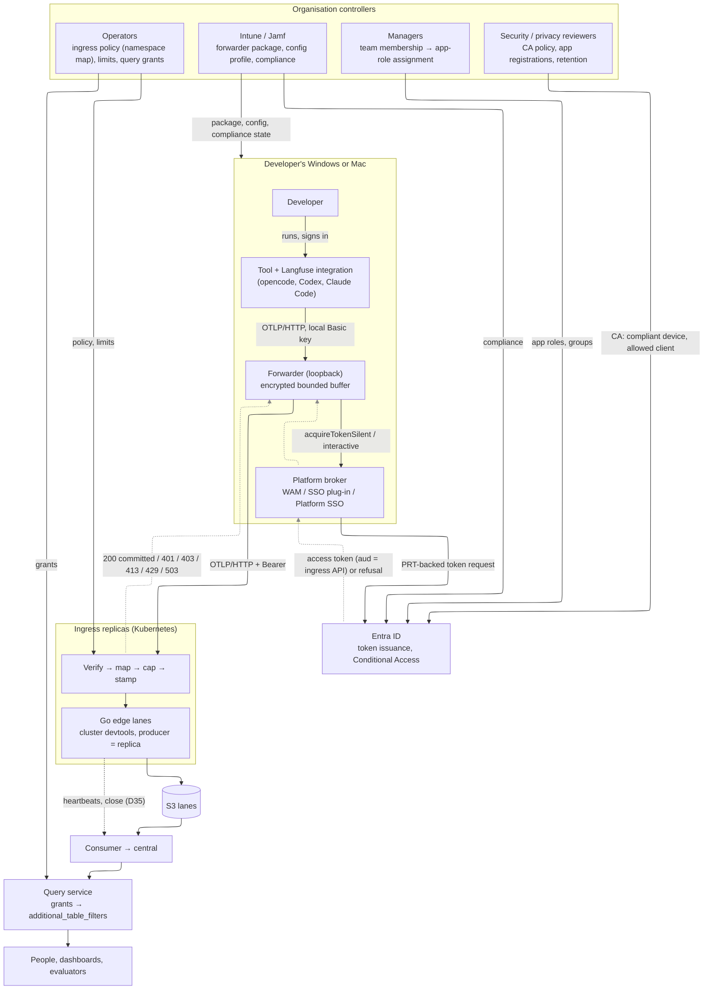
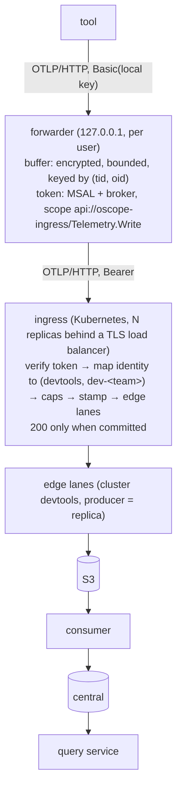

# research: the tenant from a user's Entra identity, for producers outside Kubernetes

Item 5 of the Langfuse LOE list (research/langfuse.md §6.1 addendum, DECISIONS.md D36): the
opencode, Codex and Claude Code integrations run on developers' Windows and Mac laptops and send
OTLP/HTTP to `{LANGFUSE_BASE_URL}/api/public/otel/v1/traces` with Basic-auth Langfuse project keys.
There is no pod, so the edge's resource detection (R-L1) cannot give the tenant. This note derives,
**STPA first**, how a person's Entra identity on a managed device becomes the tenant instead, and
proposes the design (DECISIONS.md D37, proposed). Later producers on the same path: serverless and
CI jobs, through workload identity federation (§9).

Evidence labels as elsewhere: [M] measured here, [D] read in documentation or source (with the
date the page was last updated, or the date it was read), [Q] model, [E] estimate.

## 0. Summary and recommendation

- **A device-side forwarder, an authenticated ingress, and nothing trusted from the producer.**
  The tools send to a forwarder on `127.0.0.1` (their `LANGFUSE_BASE_URL`); the forwarder gets an
  Entra access token for the ingress API **through the platform broker** (WAM on Windows, the
  Enterprise SSO plug-in / Platform SSO on macOS), keeps a bounded, encrypted buffer, and posts the
  request with the token. The **ingress** (Go, `otel-chdb/ingress/`, prototype built and tested)
  verifies the token, maps the identity to a tenant `(devtools, dev-<team>)` by operator policy
  only, **stamps** the tenant and the person's object id over whatever the producer claimed, and
  commits through the Go edge library with its own lanes, exactly as an in-cluster edge (D11
  copies, D35 close).
- **Forwarder language: MSAL.NET** (`Microsoft.Identity.Client.Broker` ≥ 4.73.1), one codebase with
  a supported broker on both platforms; MSAL Node's `NativeBrokerPlugin` is the fallback. Go has no
  MSAL broker (§4.1).
- **Two findings that change other components.** (1) The query service's grants are a
  **clusters × namespaces cross product** (`query/internal/auth/principal.go` `Grant`,
  `Principal`), not pairs: anyone granted devtools telemetry and a Kubernetes namespace in another
  cluster is also granted every pairing of the two (CAST theme 36). Proposed: grants as explicit
  `(cluster, namespace)` pairs (§6.2); until then the ingress policy forces a `dev-` prefix so no
  devtools namespace equals a Kubernetes one. (2) The consumer skips content-key copies (D11), so the
  ingress's stamping must be **deterministic**: a sender's retry of the same bytes, with a refreshed
  token and to another replica, must give the same object bytes. It does, and a test proves it
  (§5.5). The retry's `received_at` is the second replica's (the ingress holds no buffer), which the consumer's check covers within its 3-day copy horizon (D11); the exception is a retry more than 3 days after an attempt that landed — a laptop that went offline after a 503 — which is ingested twice and reported by the horizon audit (AMBIGUITY E8).
- **Built and tested [M]:** token validation against a fake multi-tenant Entra issuer (20 refused
  token shapes), mapping, stamping, per-user caps and rates, gzip-bomb and size caps, retries as
  copies across replicas, 503 on an unresolved commit, the D35 drain-and-close, heartbeats.
  **Not built:** the device forwarder (design only), the query-service pair grants. **Not
  verified:** anything against a real Entra tenant or a real device (runbook:
  `deploy/validation/entra-ingress.md`).

## 1. STPA

### 1.1 Losses

The system losses L-1..L-6 (STPA.md) and L-7 (research/langfuse.md §1.1) apply unchanged; one is
added for the people whose laptops run the forwarder.

| ID | Loss |
|---|---|
| L-4 | Sensitive data is disclosed: here, a developer's prompts and code to another team, to whoever holds a lost laptop, or to a non-member of the organisation |
| L-5 | Telemetry is tampered with or forged: here, activity attributed to a person who did not do it, or written into another team's scope |
| L-2 | Acknowledged telemetry is lost: here, acked by the forwarder to the tool and never committed |
| **L-E1** (new) | **The telemetry harms the developer's own work**: the tool blocks, slows, or prompts for sign-in repeatedly, and people disable it (which in turn is L-1 for the teams relying on it) |

### 1.2 Hazards

| ID | Hazard | Losses | ⊂ system hazard |
|---|---|---|---|
| H-E1 | Telemetry is committed under a tenant its sender is not entitled to write, or attributed to a person who did not send it | L-5, L-3 | H-3, H-6 |
| H-E2 | A party that is not an authenticated member of the organisation, on the organisation's terms (device compliance, the right client), can write telemetry | L-5, L-6 | H-6 |
| H-E3 | Device telemetry is readable beyond its owner's scope: in the device buffer (stolen or shared laptop), in transit, or at query time through a grant that over-reaches | L-4 | H-6 |
| H-E4 | Telemetry the forwarder acknowledged to a tool is dropped without the drop being counted and visible | L-2, L-1 | H-1 |
| H-E5 | One principal's volume or request rate exhausts the ingress, its lanes, central or the budget | L-6 | H-7 |
| H-E6 | A retry or a replay is counted twice | L-3 | H-2 |
| H-E7 | The ingress uses its own authority (its S3 credential, its lanes) for something the caller could not do itself (confused deputy) | L-5, L-4 | H-6 |
| H-E8 | People read ingress attribution as more than it proves (authorship of content, or a device), or trust a view with devtools data missing without knowing | L-3, L-1 | H-5 |
| H-E9 | Sign-in friction makes the tool unusable (prompts, blocking calls on the tool's path) | L-E1 | – |

### 1.3 Control structure

Feedback that exists: the ingress's status codes (and `Retry-After`) to the forwarder; the
broker's `interaction_required` / CA refusal to the forwarder; the forwarder's drop counters (sent
to the ingress as its own log records, §4.4); the ingress's outcome counters; the consumer's lane
watermarks. Feedback that does not exist today: nothing tells a developer their data is being held
because the device is non-compliant, beyond the forwarder's own tray/menu status (§4.4, TM-E1).

### 1.4 Unsafe control actions

| ID | Controller: action | Not provided | Provided unsafely | Wrong timing / order | Stopped too soon / too long |
|---|---|---|---|---|---|
| UCA-E1 | Ingress: accept a request | – | with a token for another audience, tenant or client; with a token whose signing key is bound to another tenant; alg none/HS (H-E2, H-E7) | before verification finishes (body read, parsed or buffered first: a DoS lever, H-E5) | – |
| UCA-E2 | Ingress: set the tenant | – | from anything the producer chose: `k8s.*` attributes, `langfuse.*`, the Langfuse keys, a header that grants (H-E1) | – | – |
| UCA-E3 | Ingress: stamp attribution | – | non-deterministically (a timestamp, token id or replica name in the bytes), so retries are not copies (H-E6) | – | – |
| UCA-E4 | Ingress: answer 200 | – | before every object committed (H-E4: the forwarder deletes the entry) | – | – |
| UCA-E5 | Ingress: close its lanes (D35) | on an orderly stop (lanes stay stale, `complete_through` held: H-5) | while a handler still runs (custody left: unsound, `closeUndrained`) | before heartbeats stop | – |
| UCA-E6 | Forwarder: send a buffered entry | while the device is compliant and signed in (H-E4 by TTL) | with a token of a user other than the one who produced it (H-E1) | – | retrying forever with re-cut bytes (H-E6) |
| UCA-E7 | Forwarder: delete the buffer | on sign-out, account switch, uninstall, TTL (H-E3) | silently, without counting (H-E4) | before a 200 | – |
| UCA-E8 | Forwarder: prompt the user | when silent acquisition fails (data held forever: H-E4) | on the tool's own call path, or in a loop (H-E9) | – | – |
| UCA-E9 | Manager/operator: grant a namespace | when a person joins (their data refused: 403, held, dropped) | a group that means something else (CAST 36), or a display name (not unique) | after the person left (not revoked) | – |
| UCA-E10 | Query service: scope a reader | – | as a clusters × namespaces product, so devtools grants combine with Kubernetes grants (H-E3) | – | – |
| UCA-E11 | Security: Conditional Access for the ingress API | device compliance not required (tokens from unmanaged devices, H-E2) | a policy that blocks the broker's refresh (H-E9) | changed without the runbook's re-check | – |

### 1.5 Loss scenarios

| ID | Scenario | UCA | Mitigation |
|---|---|---|---|
| LS-E1 | A developer in team A sets `k8s.namespace.name=prod-billing` in their tool's resource | E2 | every `k8s.*`, `user.id`, `enduser.*`, `oscope.*` resource key is removed and kept as `oscope.ingress.claimed.*`; the tenant comes from policy (tested: `TestAcceptedRequestIsStampedAndCommitted`) |
| LS-E2 | Two developers share a Mac; B's tool posts to A's forwarder on `127.0.0.1` | E6 | the forwarder is per user and requires its own random local key (the tool's Langfuse keys), unique per user and readable only by that user; a request without it is refused (§4.3) |
| LS-E3 | The forwarder re-batches its buffer on replay, the ingress replicas see different bytes | E3, E6 | the forwarder stores and resends each request's bytes unchanged; the ingress stamps deterministically; a copy has the same content key (tested: `TestRetryIsACopy`) |
| LS-E4 | A laptop is lost with a week of prompts in the buffer | E7 | AES-GCM with a key in DPAPI / the login keychain, a 7-day TTL and a size cap by default, remote wipe; the buffer holds no token (the broker does) (§4.4) |
| LS-E5 | A user signs out and another signs in; the old buffer is sent with the new token | E6 | entries are keyed by `(tid, oid)` at write; only entries whose key equals the current token's are ever sent; others are deleted and counted |
| LS-E6 | The device goes non-compliant for a week (a missed OS update) | E6, E7 | CA refuses the token; the forwarder holds, shows it, and drops at TTL with a counter it sends once it can (H-E4 made visible, not prevented) |
| LS-E7 | A token for Microsoft Graph, obtained by the forwarder's client, is presented to the ingress | E1 | audience check (tested); the forwarder only ever asks for the ingress scope |
| LS-E8 | An ingress replica is drained mid-request | E5 | draining refuses new requests (503) and waits for running ones before the close (tested: `TestDrainClosesLanes`, `TestDrainPastDeadlineWritesNoClose`) |
| LS-E9 | A reader granted `devtools/dev-payments` and `prod-eu-1/search` also reads `prod-eu-1/dev-payments` and `devtools/search` | E10 | pair grants (§6.2); meanwhile the `dev-` prefix and a disjoint cluster name keep the extra pairs empty |

### 1.6 STPA-Sec

| ID | Adversary action | Unsafe action or feedback | Hazards | Mitigation |
|---|---|---|---|---|
| SEC-E1 | **Token theft**: malware on the device reads a token from memory, a log, or a cache; or steals the refresh token | replay as the user until expiry | H-E1, H-E2 | the broker holds refresh tokens (device-bound PRT; Platform SSO keeps its keys in the Secure Enclave [D]); the forwarder never persists access tokens and never logs headers; access tokens live 60–90 min [D: access-tokens doc, updated 2025-05-14]; per-user caps bound the damage; CA sign-in risk. **Not available:** Entra Token Protection (sign-in session binding) covers only Exchange, SharePoint and Teams resources, not a custom API [D: token protection doc, updated 2026-08-14], so a stolen access token for the ingress is a bearer token for its lifetime. Owner decision O-E4 (mTLS with a device certificate later) |
| SEC-E2 | **Spoofed attribution** through the payload: `user.id`, `enduser.id`, `langfuse.user.id`, `k8s.*`, `oscope.ingress.*` | H-E1 | stamped over; producer claims kept only under `oscope.ingress.claimed.*` (a pre-seeded `oscope.*` is dropped, not kept) [M] |
| SEC-E3 | **Spoofed attribution** through another local user or a web page: a request to the loopback forwarder | H-E1 | per-user local key; refuse any request carrying `Origin` or a non-loopback `Host` (DNS rebinding); OTLP content types only (a browser's simple POST is `text/plain`, refused: tested at the ingress, same rule in the forwarder) |
| SEC-E4 | **Cross-tenant writes**: a token from another Entra tenant (our API made multi-tenant, or a guest), or `iss` and `tid` that disagree, or a key bound to another tenant | H-E2 | tenant allow-list of GUIDs (never `common` or a domain); `iss` must equal `{authority}/{tid}/v2.0`; a key's `issuer` property, if present, must match the token's tenant [D: claims-validation doc]; the API registered single-tenant (O-E1) [M: tests] |
| SEC-E5 | **Replay** of a captured request | H-E6 | TLS; a replay with the same bytes is a content-key copy (skipped); a replay with different bytes needs the token (SEC-E1) |
| SEC-E6 | **Stolen-laptop buffer** | H-E3 | LS-E4; the buffer's contents are no more than the tools already keep on disk (their own transcripts), but they are kept no longer than the TTL |
| SEC-E7 | **Confused deputy**: a token for another API accepted by the ingress; or the caller choosing where the ingress writes (a namespace header that grants, an S3 key segment) | H-E7 | audience and `azp` allow-lists; `X-Oscope-Namespace` only chooses among grants (tested); keys are built from policy names validated as key segments at start (CAST 24) |
| SEC-E8 | Algorithm confusion (`none`, HS256 keyed with the public key), forged signature with a real `kid`, key-set poisoning | H-E2 | RS256 only; keys only from the configured JWKS URL over TLS, RSA ≥ 2048; unknown `kid` refreshes at most once per 30 s [M: tests] |
| SEC-E9 | Resource exhaustion: huge bodies, gzip bombs, many requests, many principals | H-E5 | identity before the body; compressed and decoded caps; items per request; per-principal request and byte buckets; bounded principal table [M] |
| SEC-E10 | A compromised forwarder build pushed through MDM | all | signed packages (Authenticode, Apple notarisation), reviewed like code; the forwarder has no authority beyond the user's own token |

### 1.7 STPA-Teaming

| ID | Actor | What goes wrong | Hazards | Requirement |
|---|---|---|---|---|
| TM-E1 | **Developers** | they do not know data is being held (non-compliant device, signed out) or dropped, or they think the forwarder watches them beyond the tools they configured | H-E4, H-E9 | a status item (tray / menu bar): signed in as whom, sending or holding, buffer size, drops; a one-page notice of what is sent (only what the tools send to it) and what is stamped (their object id, not their name) |
| TM-E2 | **Developers** | sign-in prompts interrupt work | H-E9 | silent acquisition through the broker first; an interactive prompt only from the status item, never on the tool's call; the forwarder answers the tool from the buffer at once (the tool never waits for Entra) |
| TM-E3 | **Managers** | they add a person to a team group for another reason and grant write into the team's namespace; they believe the namespace proves authorship | H-E1, H-E8 | app roles on the ingress API per team, assigned deliberately (not reusing mail groups); the views say "sent by (object id) through the device forwarder", not "written by" |
| TM-E4 | **Security / privacy reviewers** | they approve "telemetry" without seeing that prompts and code leave the device; retention differs from the tools' own | H-E3 | the review packet names the content (D36 offload and `llm_content` right), the retention, the buffer TTL, the device controls, and the fact that Token Protection does not cover this API |
| TM-E5 | **Operators** | they edit the namespace map or grants and a devtools name collides with a Kubernetes one; they read a gap in devtools data as an outage | H-E3, H-E8 | policy validated at start (prefix, GUIDs); pair grants (§6.2); devtools completeness shown separately: laptops are offline for days, so `complete_through` for cluster `devtools` means the ingress's custody, not the devices' (H-5, CAST 26) |
| TM-E6 | Operators ↔ security | a CA change blocks refresh for everyone on a Friday | H-E9, H-E4 | CA changes to the ingress API follow the runbook's re-check with one Windows and one Mac device |

### 1.8 Derived requirements

| ID | Requirement | From |
|---|---|---|
| R-E1 | The tenant and the person are asserted by the ingress from a verified Entra token and operator policy only; every producer claim is removed from the tenant keys and kept, if at all, as a label | SEC-E2, UCA-E2, R-L1 |
| R-E2 | Tokens: v2.0, RS256, allowed tenant GUIDs, `iss` = `{authority}/{tid}/v2.0`, tenant-bound keys honoured, audience = the ingress API, `azp` in an allow-list, delegated scope for users, app role for workloads | SEC-E4, SEC-E7, SEC-E8 |
| R-E3 | Identity and admission before the body; compressed, decoded and item caps; per-principal budgets | SEC-E9 |
| R-E4 | Stamping is a pure function of (request bytes, attribution): no time, token id or replica in the bytes | UCA-E3, D11 |
| R-E5 | 200 only after the edge's commit verdict; 503 with `Retry-After` when unresolved; the D35 close only with no handler running | UCA-E4, UCA-E5 |
| R-E6 | The forwarder resends each request's bytes unchanged, only under the token of the person who produced it, and never prompts on the tool's path | UCA-E6, UCA-E8, LS-E5 |
| R-E7 | The forwarder's buffer is per user, encrypted at rest with an OS-held key, bounded in bytes and age, deleted on sign-out, switch and uninstall; every drop is counted and reported | UCA-E7, SEC-E6, H-E4 |
| R-E8 | Query grants are explicit `(cluster, namespace)` pairs; a devtools namespace never equals a Kubernetes namespace until then | UCA-E10, CAST 36 |
| R-E9 | Conditional Access for the ingress API requires a compliant device and allows only the forwarder and workload clients | UCA-E11, SEC-E1 |

### 1.9 How the CAST themes of STPA.md rows 1–49 are avoided

| Row | Theme | Here |
|---|---|---|
| 1 | identity and time from the first durable custody | the ingress has no buffer: `received_at` is its edge's clock at custody, once; the forwarder never stamps a time into the bytes. A retry gets the retrying replica's `received_at`, within D11's 3-day horizon unless the device was offline longer: AMBIGUITY E8 |
| 2 | definite vs ambiguous outcomes | 200 = committed, 4xx = definite refusal, 503 = unknown: retry the same bytes (R-E5) [M] |
| 3 | check only after the thing checked can no longer change | the close is written only after the gate is shut and handlers have returned [M] |
| 4, 44, 47 | deletion needs the writers' view; "dead" by effects; multi-incarnation | the ingress uses the edge library's lanes unchanged (create-only slots, epochs per process), so its zombie PUTs follow the D35 rules already proved |
| 5, 25 | margins from real bounds; combined parameters validated together | leeway 60 s vs token lifetimes; `decoded_bytes_per_minute ≥ max_decoded_bytes` and `max_decoded ≥ max_body` checked together at start [M] |
| 6, 13 | feedback freshness | the JWKS is re-read hourly and on an unknown `kid` (rate-limited); the broker, not the forwarder, decides token freshness |
| 7, 24 | no splicing; producer names are data | no producer string reaches a key or SQL; policy names are validated key segments; claims are attribute values only |
| 8, 17–19, 40, 46 | encoder and library details | the ingress encodes through the edge library unchanged; its tests read the committed Parquet back by column name |
| 9 | hostile data | gzip bomb, oversize body and oversized attribute tests [M] |
| 10 | anything that re-cuts must be deterministic | R-E4, R-E6; `TestRetryIsACopy` [M] |
| 11 | local convenience must not ship | the ingress takes S3 credentials only from the SDK chain (IRSA/pod identity), no keys in its config; the forwarder's local Langfuse keys are generated per user, never shared |
| 12, 28, 41, 43 | evidence provenance; tests actually run; skips are unknowns | `go test` run for this commit (§10); everything against real Entra is labelled NOT VERIFIED with the command to run |
| 14, 39 | bounded retries | the edge's append is bounded (row 39) and hands back 503; the forwarder backs off with `Retry-After` and a cap |
| 15, 20 | ambiguous outcomes have three results | an unresolved commit may have landed: the retry is then a copy (same content key), handled by D11 |
| 16, 42 | feedback complete by construction; loud fences | a 403 names the reason class; the forwarder's drop counters are sent, not inferred |
| 21 | model with deployed parallelism | several ingress replicas, each its own producer id and lanes; the retry test uses two replicas on one store [M] |
| 22, 38 | shared resources, one owner | per-principal buckets (not a shared team pool); tests use in-memory stores only |
| 23 | lease discipline per statement | not applicable: the ingress writes only lane slots through the library |
| 26, 34 | two clocks; boundaries from the formal statement | devtools completeness is custody time at the ingress, not device time; stated in the views (TM-E5) |
| 27 | isolation of shared state | built in a separate worktree; pushed with the diff-against-remote check |
| 29 | real client wire behaviour | the runbook sends from the real integrations to the real forwarder (O-E3), not from a mock client |
| 30 | a permissive test store proves nothing about authorisation | the fake issuer is labelled; the runbook repeats the refusal matrix against real Entra |
| 31 | secrets on every channel, errors included | tokens are never logged or echoed; 401 bodies say only "invalid token"; the detail goes to the server log without the token |
| 32 | show only what is safe | 403 bodies name the reason class and the caller's own grants, never others' |
| 33 | caches keyed on what they depend on | the JWKS cache is keyed by `kid` and bounded by `issuer`; no response cache |
| 35 | budget shared limits where they are set | per-user limits sized for an agent session (120 req/min, 256 MiB/min) and validated; 429 is distinct from failure |
| 36 | one name keying two policies | the ingress's namespace map, its limits (per principal) and the query grants are separate tables; the cross-product grant finding and its fix (§6.2) |
| 37, 49 | early claims and custody order | stamps are facts about the sender, not about event time; scores' precedence stays the writer's (R-L6) |
| 45 | checks derive from schemas | the stamped keys are constants shared by code and tests |
| 48 | a new "passed but not ingested" state | none added |

## 2. The traffic

The three integrations (research/langfuse.md §6.1 addendum [D]) all send OTLP/HTTP protobuf to
`{LANGFUSE_BASE_URL}/api/public/otel/v1/traces` with `Authorization: Basic base64(pk:sk)` and
`x-langfuse-*` headers; media upload goes to `/api/public/media` unless
`LANGFUSE_MEDIA_UPLOAD_ENABLED=false`. They read the base URL and keys from the environment at
process start, so **a header that expires (a bearer token) cannot be put in their configuration**:
a Claude Code session outlives a 60–90 minute token. This is what rules out the "credential
helper headers" alternative for these producers (§8) and puts a local forwarder in the path.

## 3. Design overview

## 4. The device forwarder

### 4.1 MSAL with a platform broker: support per language (read 2026-09-29)

| MSAL | Windows (WAM) | macOS broker | Notes | Sources |
|---|---|---|---|---|
| **.NET** (`Microsoft.Identity.Client` + `.Broker`) | GA, the longest-standing broker integration | **4.73.1 or later** (Company Portal's Enterprise SSO extension) [D, page updated 2026-01-28] | on macOS: calls on the main thread; the executable must be a signed app bundle (a bare signed executable is refused by the extension) | [macOS broker (.NET)](https://learn.microsoft.com/en-us/entra/msal/dotnet/acquiring-tokens/desktop-mobile/macos-broker-dotnet-sdk), [WithBroker](https://learn.microsoft.com/en-us/dotnet/api/microsoft.identity.client.broker.brokerextension.withbroker?view=msal-dotnet-latest) |
| **Python** (`msal[broker]`) | `enable_broker_on_windows`, msal ≥ 1.20 [D, page updated 2025-04-24] | `enable_broker_on_mac`, msal ≥ 1.31 [D, page updated 2024-09-06] | needs a Python runtime on the device | [WAM (Python)](https://learn.microsoft.com/en-us/entra/msal/python/advanced/wam), [macOS broker (Python)](https://learn.microsoft.com/en-us/entra/msal/python/advanced/macos-broker) |
| **Node** (`@azure/msal-node` + `@azure/msal-node-extensions` `NativeBrokerPlugin`) | yes | yes, and Linux [D, pages updated 2026-06-05] | **no fallback to the browser** when the broker is unavailable; native addon | [Windows](https://learn.microsoft.com/en-us/entra/msal/javascript/node/brokering), [macOS](https://learn.microsoft.com/en-us/entra/msal/javascript/node/brokering-macos) |
| **Go** (`microsoft-authentication-library-for-go`) | **none** | **none** | broker support request closed as not planned | [AzureAD/microsoft-authentication-library-for-go#284](https://github.com/AzureAD/microsoft-authentication-library-for-go/issues/284) |

On macOS the broker is Microsoft's Enterprise SSO plug-in, delivered with Company Portal and
enabled by an MDM profile; **Platform SSO** (macOS 13+) additionally ties the Entra registration
to the local account and keeps the device keys in the Secure Enclave; MSAL reaches either through
the same extension [D: [Platform SSO](https://learn.microsoft.com/en-us/entra/identity/devices/macos-psso),
[troubleshooting the SSO extension](https://learn.microsoft.com/en-us/entra/identity/devices/troubleshoot-mac-sso-extension-plugin), read 2026-09-29].

**Pick: MSAL.NET.** One codebase with a documented broker on both platforms, no runtime to
install (self-contained single file on Windows; a signed, notarised `.app` with a LaunchAgent on
macOS), native MDM packaging (MSIX or `.intunewin`; `.pkg` for Jamf and Intune). Node is the
fallback if the team prefers the integrations' own runtime; Python is ruled out by the runtime
dependency; Go by the missing broker. The forwarder's OTLP handling is small (store bytes, forward
bytes), so the language's OTel ecosystem does not matter.

### 4.2 App registrations and Conditional Access

- **Ingress API** (single-tenant): App ID URI `api://oscope-ingress`, `requestedAccessTokenVersion`
  2, delegated scope `Telemetry.Write`, app roles `Team.<name>` (users and groups) and
  `Telemetry.Write.App` + `Telemetry.CI.<name>` (applications), optional claim `idtyp`,
  "assignment required" on.
- **Forwarder** (public client): broker redirect URIs (`ms-appx-web://microsoft.aad.brokerplugin/{client_id}`
  on Windows, `msauth.{bundle_id}://auth` on macOS), pre-authorised for `Telemetry.Write`.
- **Conditional Access** on the ingress API: compliant device (Intune, or Jamf through its Intune
  compliance partnership), the forwarder and CI clients only; device-code flow blocked.

### 4.3 The local endpoint

Per user, bound to `127.0.0.1` (and `::1`), a port in the user's config. The installer (or first
run) generates a random public/secret pair and writes the tools' environment:
`LANGFUSE_BASE_URL=http://127.0.0.1:<port>`, `LANGFUSE_PUBLIC_KEY`, `LANGFUSE_SECRET_KEY`,
`LANGFUSE_MEDIA_UPLOAD_ENABLED=false`. The forwarder accepts only requests with that Basic pair, no
`Origin` header, a loopback `Host`, and an OTLP content type. The Langfuse keys thereby become a
**local** secret between the tool and the forwarder; nothing Langfuse-shaped leaves the device.
Paths: `/api/public/otel/v1/{traces,logs}` and `/v1/{traces,logs}`. The tool gets its answer when
the request is in the buffer (fsync), never waiting for Entra or the network.

### 4.4 The buffer, and its fate

- **Format:** one file per request: the request's exact bytes (as received, re-encoded never),
  content type, the first-enqueue time, and the `(tid, oid)` of the account signed in at enqueue.
  AES-256-GCM; the key in DPAPI (CurrentUser) on Windows, a login-keychain item readable only by the
  forwarder's code signature on macOS.
- **Bounds (MDM config, defaults):** 256 MiB and 7 days; oldest dropped first when full.
- **Sending:** oldest first, the same bytes, with a token from `AcquireTokenSilent` for the
  entry's `(tid, oid)` only. 200: delete. 401: refresh once, then hold. 403: hold and show the
  reason (no team); after the TTL, drop. 413/400: drop (definite) and count. 429/503: back off per
  `Retry-After`, capped.
- **Fates:** sign-out (the account gone from the broker): delete that account's entries. Account
  switch: entries of another `(tid, oid)` are never sent; deleted. Non-compliant device or CA
  refusal: hold, show, drop at TTL. Uninstall: delete the directory. Remote wipe: covered by MDM.
- **Visibility:** every drop increments a per-reason counter; the forwarder sends its counters as a
  log record (`oscope.forwarder.dropped{reason}`, `held_bytes`, `oldest_age_s`) with the next
  successful batch, so drops appear in the user's namespace (H-E4 counted, TM-E1 shown).

### 4.5 Distribution

Intune: Win32 app (`.intunewin`) or MSIX for Windows, `.pkg` for macOS, with a configuration
profile (ingress URL, client id, tenant, bounds); the macOS SSO extension profile and Company Portal
as prerequisites. Jamf: the same `.pkg` and profile; compliance through the Jamf–Intune
integration so CA sees it. Updates through the same channel; the forwarder refuses to run if its
config names a tenant or ingress not in its signed defaults (a tampered profile cannot redirect it).

## 5. The ingress (built: `otel-chdb/ingress/`)

### 5.1 Pipeline, in order

1. `Authorization: Bearer` required (Basic Langfuse keys get 401 with a pointer to the forwarder).
2. Token verified (R-E2); detail logged, not returned.
3. Tenant resolved from policy: rules `(entra tenant, app role | group object id) → namespace`; one
   grant is used; several require `X-Oscope-Namespace` naming one of them; a groups overage with no
   role grant is refused (no Graph call on the hot path).
4. Per-principal request bucket; content type; `Content-Length` cap; body read under the
   compressed cap, gunzipped under the decoded cap; per-principal byte bucket; item cap.
5. Decode (protobuf or JSON), stamp, `edge.PushTraces/PushLogs`, 200 only on the commit verdict;
   503 + `Retry-After` when unresolved; 400 when the edge says permanent.

### 5.2 Token validation

Entra's v2 endpoint serves one key set for all tenants
(`/common/discovery/v2.0/keys`); keys may carry an `issuer` property, templated with `{tenantid}`
or bound to one tenant. The multi-tenant rule is therefore: the token's `iss` must equal
`{authority}/{tid}/v2.0`, `tid` must be an allowed GUID, and if the signing key is bound, its
issuer must be the token's [D: [claims validation](https://learn.microsoft.com/en-us/entra/identity-platform/claims-validation),
[access tokens](https://learn.microsoft.com/en-us/entra/identity-platform/access-tokens)]. Users are
told apart from applications by `idtyp` (emitted as an optional claim) or, absent it, by `scp`.

### 5.3 What is stamped

Resource: `k8s.cluster.name` = the policy's cluster, `k8s.namespace.name` = the resolved
namespace, `user.id` = the object id, `oscope.ingress.auth` = `entra`,
`oscope.ingress.entra_tenant`, `oscope.ingress.principal_type`, `oscope.ingress.client_app`.
Removed from the resource and kept as `oscope.ingress.claimed.<key>`: every `k8s.*`, `user.id`,
`enduser.*`; dropped: `oscope.*`. On spans, span events and log records: `user.id`, `enduser.*`,
`langfuse.user.id` moved to `oscope.ingress.claimed.*` (a score's author is the resource's
`user.id`, SEC-L6). The object id, not the UPN, is stamped: it is stable and not directly personal;
the views resolve it to a name only for readers entitled to (O-E5).

### 5.4 An edge with its own lanes; the D35 close

Each replica is an edge (`parquetgo/edge`) with cluster `devtools` and producer id = its pod name,
so its lanes are its own and the consumer treats it like any other publisher. Heartbeats keep idle
lanes alive (`Heartbeats`, as `s3pqexporter`). On SIGTERM, `Drain` refuses new requests (503: the
load balancer's retry goes to another replica), waits for running handlers, stops the heartbeats,
then `edge.Close` commits the close slots (D35), so a scaled-down replica does not hold
`complete_through` for cluster `devtools`. The ingress has no buffer: custody is empty exactly when
no handler runs (a 503'd request is the sender's again, and the lane resolves any slot it touched
before a later one), which is the close's precondition. Past the drain deadline it writes no close
(safe: stale, paged).

### 5.5 Retries are copies (D11)

The stamp is a pure function of the request and the attribution: claims moved in key order, stamps
appended in a fixed order, no time, token id or replica. A retry of the same bytes with a refreshed
token to another replica gives the same content key, so the consumer's check skips it. Tested with
two replicas on one store and a token minted a second later (`TestRetryIsACopy`); a different user
sending the same bytes gets a different key (the stamp differs), as it must.

## 6. Tenant key and query scoping

### 6.1 The key

`(cluster, namespace)` = `(devtools, dev-<team>)`. `devtools` must not be a Kubernetes cluster's
name; namespaces must start with the policy's prefix (validated at start). The lane key is
`root/devtools/<replica>/<signal>/…`, so devtools data is partitioned like any cluster and its
completeness is its own.

### 6.2 Finding: grants are a cross product (CAST theme 36)

`query/internal/auth/principal.go`: `Grant{Clusters, Namespaces, Roles}` and
`Principal{Clusters, AllClusters, Namespaces, AllNamespaces}`; the scope predicate is
`cluster ∈ Clusters AND namespace ∈ Namespaces`. A person granted their devtools namespace
(`devtools/dev-payments`) and a Kubernetes one (`prod-eu-1/search`) — the natural need of someone
whose tools and services differ — is thereby granted `prod-eu-1/dev-payments` and `devtools/search`
as well. Today those extra pairs are empty only by naming (the prefix and a disjoint cluster name);
a group that grants devtools write for one reason can grant Kubernetes reads for another (the
theme of row 36). **Proposed (R-E8):** `Grant.Scopes []struct{Cluster, Namespace string}` (with
`*` per field), the predicate an OR of pairs, the old fields kept as a deprecated shorthand that
expands to their product with a startup warning. Not built here (it is the query service's), a test
to add there: a principal with two pairs is refused the two crossed pairs.

### 6.3 The person as a scope

A "my sessions" view is a filter on `ResourceAttributes['user.id'] = <caller oid>`, set by the query
service from the caller's own token, never a parameter (O-E5).

## 7. Per-user caps

Per principal `(tid, oid)`, never per team (a shared pool lets one member starve the others, row
38): request and decoded-byte token buckets with a minute of burst, a body cap before reading, a
decoded cap (a gzip bomb stops at it), and an item cap; all validated together at start. Defaults:
120 requests/min, 256 MiB/min, 16 MiB compressed, 64 MiB decoded, 10,000 items. A team or
cluster-wide budget, if wanted, belongs in central's admission, not here.

## 8. Alternatives compared

| Option | Identity | Works for these tools? | Device posture | Cost / risk | Verdict |
|---|---|---|---|---|---|
| **Forwarder + broker (proposed)** | the user, via Entra; device via CA | yes: tools keep a static local base URL and keys | CA compliant-device | one signed app per platform, MDM rollout | **chosen** |
| Credential-helper headers (a command prints `Authorization` at start; Claude Code's own OTel export has a headers helper, the Langfuse integrations do not) | the user | **no**: headers fixed at process start expire in 60–90 min; each tool needs its own helper; no buffer offline | via CA on the helper's token | no install beyond a script | rejected for these tools; fine for short CI jobs |
| OTel Collector on the device with auth extensions (`oauth2clientauth`, `azureauth`) | client credentials, managed or workload identity; **no interactive user or broker** | no user identity | none | a Collector per laptop; a client secret on each device | rejected for devices; **used for CI/serverless** (§9) |
| Device-code flow in the forwarder | the user | yes | weak: phishable, commonly blocked by CA, no broker SSO | prompts on another device | rejected (fallback only on unmanaged Linux) |
| Intune client certificates + mTLS at the ingress | the **device** (cert subject), not the user | yes, with a forwarder | strong device binding, and binds the connection (theft-resistant) | a PKI, SCEP/PKCS profiles, cert-to-user mapping, revocation | **later, in addition** (O-E4): closes SEC-E1 where Token Protection cannot |
| Langfuse project keys per team at the ingress | the team (a shared secret) | yes | none | keys leak and are shared; no person; rotation by hand | rejected (R-L1, SEC-L1) |

**How the forwarder is built (asked 2026-09-29).** Two build choices were weighed [E, not measured]:

- **YARP** (Microsoft's reverse-proxy library for ASP.NET Core) would give the forwarding pass-through,
  header transforms (the bearer token injected per request), retries, and routing across ingress endpoints.
  That is the easy part: a few dozen lines of Kestrel and `HttpClient`. It does not give the hard,
  hazard-carrying part: **store and forward** — acknowledging to the tool only after a durable, encrypted,
  per-user write (H-E4), resending byte-identical requests later (H-E6), working offline, deleting on
  sign-out (SEC-E6). A reverse proxy answers the tool with the upstream's answer; the forwarder must answer
  with its own durable one. Using YARP for an "online fast path" beside the buffered path would create two
  paths with different acknowledgement meanings (CAST 40: divergence between implementations). *Superseded:
  with no disk buffer (D37, owner) the forwarder is exactly a pass-through, so **YARP is adopted**; its queue
  and retry must stay bounded and every drop counted (CAST 39).* Native AOT and trimming support for
  a small signed device binary would also have to be confirmed.
- **Our own Go edge distribution as the device forwarder**, with an otlphttp exporter, the persistent queue,
  and a custom auth extension that gets tokens from a tiny .NET **token helper** (MSAL.NET + broker, over a
  local named pipe / Unix socket, never a TCP port). This reuses verified code and its Go DST (VERIFICATION.md
  gap 4), and keeps .NET to the part only .NET (or Node/Python) can do. Against it: a much larger binary on
  every laptop, two processes to sign and ship, and the Go persistent queue's known ENOSPC loss (U22) must be
  fixed first. **To be compared in the build's step (1)** against the single .NET process, on the hazard
  table of §10a.

## 9. Later: serverless and CI

Workload identity federation: a GitHub Actions (or other OIDC) token exchanged for an Entra
app-only token for the ingress API (federated credential on a CI app registration) [D:
[workload identity federation](https://learn.microsoft.com/en-us/entra/workload-id/workload-identity-federation)].
The token carries `idtyp=app`, the app role `Telemetry.Write.App` and a team role
`Telemetry.CI.<team>`; the ingress's app path is built and tested (`TestTenantMapping`, the CI case;
the stamp says `principal_type=app` and `user.id` = the service principal). The sender is an OTel
Collector with the `azureauth` extension, or a short job that fetches the token per run. No buffer
beyond the Collector's own queue.

## 10. The prototype [M]

`otel-chdb/ingress/` (Go module): `entra.go` (verifier), `mapping.go` (policy), `stamp.go`,
`limits.go`, `server.go` (handler), `lifecycle.go` (heartbeats, drain, close),
`entratest/` (a fake Entra: the common key set with templated and tenant-bound keys, a v2.0 token
minter), `cmd/oscope-ingress` (config file, S3 from the SDK chain, SIGTERM → drain → close).
Tests (`go test ./...` in `otel-chdb/ingress`, pass, run 2026-09-29):

| Test | Proves |
|---|---|
| `TestAcceptedRequestIsStampedAndCommitted` | end to end into the Go edge and back out of the committed Parquet: tenant, person, labels, claims demoted |
| `TestTokensRefused` | 20 refusals: none, Basic, garbage, forged signature, unknown kid, alg none, HS256 confusion, Graph audience, other tenant, `iss`/`tid` mismatch, non-GUID tid, a key bound to another tenant, expired, no exp, nbf in the future, v1.0, other client, missing scope, app without role, no oid; nothing committed |
| `TestTenantMapping` | no grant, unmapped role, groups overage, two grants without a choice, a choice outside the grants → 403; a choice among grants, a group, a CI app token → the right namespaces |
| `TestRetryIsACopy` | same bytes, new token, other replica → the same content key; another user → another key |
| `TestUnresolvedCommitIsRetryable` | lost PUTs and failing HEADs → 503 + `Retry-After`; the retry elsewhere commits |
| `TestCapsAndRates` | body cap, gzip bomb, per-user rate (429 + `Retry-After`) not shared with a teammate, `text/plain` refused |
| `TestLogsAreStamped` | scores (log records) stamped; a claimed author demoted |
| `TestPolicyValidation` | bad cluster, no rules, non-GUID tenant, role and group, group display name, missing prefix, `common` tenant, empty client list, byte rate below one request |
| `TestKeyRotation` | one key-set read for many requests; a new `kid` picked up after the refresh gap |
| `TestDrainClosesLanes`, `TestDrainPastDeadlineWritesNoClose` | D35: close only with no handler running; draining answers 503 |

**Not verified:** a real Entra tenant, the broker on a real device, the forwarder (not built),
throughput. Command still to run: `deploy/validation/entra-ingress.md`.

## 10a. Forwarder build plan: verification first (owner, 2026-09-29)

> **Revised by the owner the same day (D37): no disk buffer.** The forwarder is a YARP pass-through with a
> bounded in-memory queue; drops are counted and never block the tool; the telemetry is best-effort. In the
> table below, H-E4 becomes "every drop is counted and visible, none silent", SEC-E6's buffer rows and the
> crash-consistency rows no longer apply (nothing persists on the device; test instead that nothing is
> written to disk), CAST 44's "asleep with a full buffer" becomes "the queue is dropped and counted on
> sleep", and the Quint model covers the in-memory queue and the token/account lifecycle. The Go edge +
> token helper option is withdrawn (its value was the durable queue). YARP (below) is adopted.

The forwarder is built **against its hazards**, as VERIFICATION.md does for the rest of the pipeline: the
hazard-to-test table and a Quint model of the buffer and token lifecycle come first; the code is written
against them; the scenarios below are the exit criteria. The .NET tooling (versions and maintenance status to
be confirmed when the build starts): **Coyote** (systematic concurrency testing: controlled task scheduling,
replayable interleavings) as the madsim counterpart; **`TimeProvider` / `FakeTimeProvider`** for time;
**System.IO.Abstractions** for the buffer; a fake `HttpMessageHandler` for the network; **CsCheck** (stateful
and parallel linearizability checks) or FsCheck's model-based commands as the Hegel counterpart; Quint traces
(ITF JSON) replayed into xUnit as the quint-connect counterpart; **Polly chaos strategies** for HTTP faults;
**SharpFuzz** for parsers.

| Hazard / CAST class | Must show | Technique |
| --- | --- | --- |
| H-E4 (acknowledged then dropped); CAST 8, VERIFICATION gap 8 | every byte acknowledged to a tool is committed or counted as a drop, across kill -9 mid-write and lost fsyncs | crash tests over a fault-injecting file layer; Quint model of the buffer with that invariant, replayed against the code |
| H-E6 (double counting); D11; CAST 50 | a resend after an ambiguous 503 is byte-identical, so it lands as a copy even when the first attempt applied late | stateful test with lost answers and late application; end-to-end differential test forwarder → ingress → edge: equal content keys across retries and replicas |
| H-E1 (wrong person); R-E6 | buffered data is sent only under the token of the person who produced it, across account switch, sign-out, sign-in as another person | CsCheck state machine over sign-in/out/switch/send |
| SEC-E6 (stolen or shared laptop); R-E7 | buffer unreadable by another OS user, deleted on sign-out and switch, capped in bytes and age | OS-level tests on GitHub's windows-latest and macos-latest runners (real DPAPI, real Keychain) |
| H-E9 (sign-in friction); R-E6 | the tool is never blocked or prompted: expired token, broker outage, offline — answered within a bound and queued | liveness bound in fake time; Coyote: no interleaving blocks the tool's path |
| CAST 39 (unbounded retries) | every retry loop bounded, with back-off, handing back | liveness property in the model and the simulation |
| CAST 26 / 34 (two clocks) | sleep, hibernate, clock jumps (backwards too) and skew break neither ordering, buffer age, nor the ingress's stamped receive time | fake-time jumps in the state machine |
| CAST 44 (dead by its effects) | a laptop asleep for days with a full buffer: aged-out drops counted; retries past the 3-day horizon counted by the audit (O-E8) | simulation plus the ingress integration test |
| CAST 38 (shared budget) | the device disk cap holds with many tools sending at once | parallel CsCheck test |
| SEC-E9 (hostile input) | the local OTLP endpoint survives malformed and huge bodies and gzip bombs | SharpFuzz on body and config parsing |

**Where it runs.** All of the above on Linux, Windows and macOS CI runners, with the broker mocked behind
`IPublicClientApplication`. The real broker (WAM, the macOS Enterprise SSO plug-in / Platform SSO) and
Conditional Access need a real tenant and enrolled devices: they stay in the validation runbook
([../deploy/validation/entra-ingress.md](../deploy/validation/entra-ingress.md), ENT-1..ENT-8), run by hand.

**Order.** (1) the hazard table and the Quint model (buffer, token, account lifecycle; invariants: acked ⇒
committed or counted; sent only under the producer's own identity; deleted on sign-out; liveness: the tool is
answered within a bound); (2) the simulation harness (fake time, fake file system, fake network, Coyote);
(3) the forwarder, test-first; (4) the OS matrix in CI; (5) the runbook on real devices.

## 11. Owner decisions

| ID | Decision | Recommendation |
|---|---|---|
| O-E1 | Ingress API registration single-tenant; guests? | single-tenant; guests refused (tenant allow-list = home tenant only) |
| O-E2 | Forwarder language | MSAL.NET (§4.1); Node as fallback |
| O-E3 | Buffer bounds and fate | 256 MiB, 7 days; delete on sign-out and switch; hold on non-compliance until TTL |
| O-E4 | mTLS with Intune device certificates | later, in addition, once the PKI exists (theft resistance Token Protection does not give a custom API) |
| O-E5 | What identifies the person in views | object id stamped; names resolved at read time for entitled readers; a "my sessions" filter from the caller's own token |
| O-E6 | Pair grants in the query service (R-E8) | yes, before the first devtools reader is granted anything alongside a Kubernetes scope |
| O-E7 | Team mapping by app role or group | app roles (no overage, deliberate assignment); groups allowed by object id |
| O-E8 | A retry beyond the consumer's 3-day copy horizon (AMBIGUITY E8) | the forwarder records whether an entry has had an attempt with an unknown outcome (503, no answer); such an entry older than the horizon minus a day is still sent (loss is worse than a counted copy) and the horizon audit reports the duplicate; do not trust a device time to place it |
