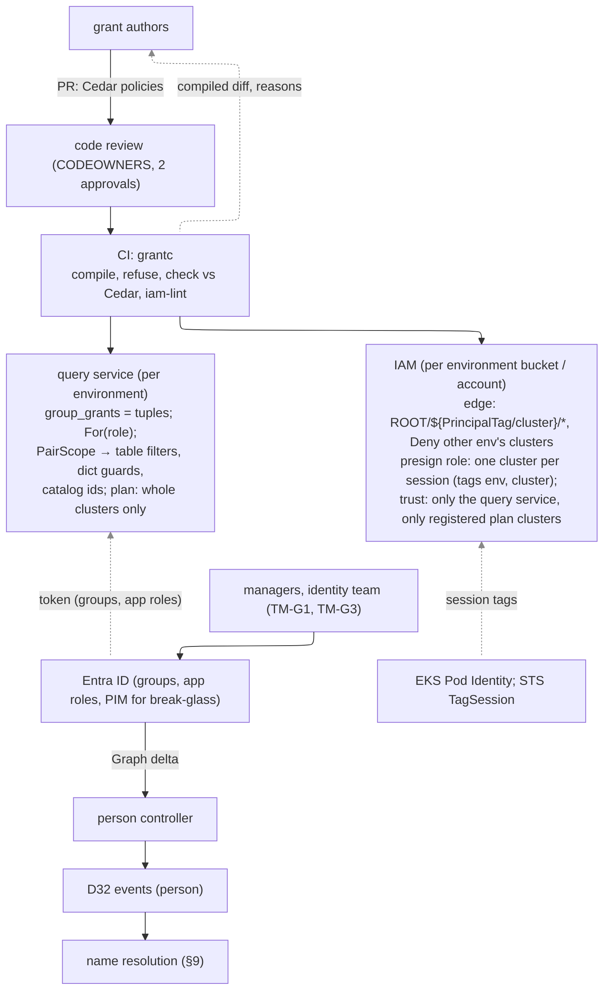

# research: grants as explicit tuples, an environment tier, and Cedar as their source

The owner's request of 2026-09-29 (DECISIONS.md D37, owner paragraph): fix CAST row 52 — the query
service's grants were a cluster set × a namespace set (`query/internal/auth/principal.go`), so grants
held together over-reached — and, while doing so, consider (1) an **environment tier** (dev / stg / prd)
in the scope hierarchy and (2) **Cedar** as the language grants are written in, limited to grants
expressible with our S3 prefixes and ABAC (IAM session tags, `${aws:PrincipalTag/…}`, D18). Also the
design of **person facts** (D32 owner decision of 2026-09-29: a `person` entity type) and how the same
grants scope them. This note is **STPA first**, then the CAST themes, then the design. Proposed as
DECISIONS.md **D38**.

Evidence labels as elsewhere: [M] measured here, [D] read in documentation or source (date read),
[Q] model, [E] estimate.

## 0. Summary and recommendation

- **Built: grants are explicit `(role, cluster, namespace)` tuples, combined as a union** [M]. A grant
  (a group's, or the token's own claims) is still its roles × clusters × namespaces *within itself*;
  a principal holds the **union** of its grants' tuples. A handler works on the view of its own role
  (`Principal.For`), so a plan grant never widens a query scope or the reverse (a second over-reach
  the product had: roles were pooled too). Rows are cut by the view's pairs in the table filter, the
  D33 dictionary guards and the catalog's resource ids; the lake plan (presigning) reaches only
  clusters granted whole. The old product is a caught mutant in three test layers (§3).
- **Environment tier: recommend (b) a bucket per environment** — and, where the account structure
  allows, an AWS account per production environment — with the environment an attribute of each
  cluster in a **cluster registry** that also gates writes. The key layout stays FORMAT v2 (no v3):
  D27 index paths and D29 watermark documents are unchanged inside each bucket, and per-environment
  retention, KMS keys, Object Lock and replication are bucket defaults. A dev principal reading prd is
  stopped by the storage layer, not only by the query service. (a) a `{root}/{env}/…` key tier is the
  fallback where buckets are not cheap; (c) an attribute only is not enough on its own (§5).
- **Cedar as the source of truth, compiled — not evaluated at request time.** Grants are written in
  Cedar against a schema (principals: users, groups/app roles, workloads; actions: query, plan,
  llm_content, write, admin; resources: environment ⊃ cluster ⊃ namespace). A compiler (`grantc`,
  `otel-chdb/grants/`, prototype built) accepts only policies expressible as (i) query-service tuples
  and (ii) IAM prefixes + principal tags for the plan and write paths, and **refuses every other
  policy at authoring time with a reason** (e.g. a namespace grant may give `query`, never `plan`:
  namespace is not a prefix tier). The output is **checked against Cedar's own authorizer**
  (cedar-go v1.8.0) on every request of the registry's finite universe; a generated-policy property
  found a compiler bug on its first run (§6.6). Policy changes go through code review with the
  compiled diff in the review (§6.8).
- **Person facts** reuse D32's event model and resolver with a `person` entity, sourced from Microsoft
  Graph delta queries (the controller), with the ingress's stamped object id as an announcement; names
  resolve only for readers holding a `resolve_person` right on the rows' namespace, through a
  dictionary keyed by `(namespace, object id)` so the D33 pair guard scopes it; erasure is a tombstone
  fact that, unlike every other fact, applies at every basis (§9).
- **Owner decisions** O-G1..O-G9 (§10). **Not built:** the environment tier in storage and the
  consumer, the presign session path (assume a role per plan cluster with session tags; §7), break-glass
  expiry in the query service (§8), the person catalog (§9). Nothing was run on AWS.

## 1. STPA

### 1.1 Losses

Those of STPA.md, chiefly **L-4** (disclosure: one team's data to another), **L-1** (an incident
prolonged: here, because a responder could not read what they needed), **L-5** (tampering, via a
write grant). New:

<!-- stpa:begin losses-grants (generated from otel-chdb/stpa; edit the records, not this section) -->
| ID | Loss |
| --- | --- |
| L-G1 | The organisation cannot say who could read what, when (an auditor's or a data subject's question goes unanswered or is answered wrongly) |
<!-- stpa:end losses-grants -->

### 1.2 Hazards

<!-- stpa:begin hazards-grants (generated from otel-chdb/stpa; edit the records, not this section) -->
| ID | Hazard | Losses | ⊂ system hazard |
| --- | --- | --- | --- |
| H-G1 | **Over-grant**: a principal can read or write beyond what any one grant intended (a product of grants, a role borrowed from another grant, an environment crossed) | L-4, L-5 | H-6 |
| H-G2 | **Under-grant during response**: a responder cannot read the cluster, environment or plan they need, or learns it only mid-incident | L-1 | H-5 |
| H-G3 | **Drift**: the query service's check and the storage layer's (IAM) disagree, so one path grants what the other refuses, or a policy change reaches one and not the other | L-4, L-G1 | H-6 |
| H-G4 | **Escalation through authoring**: a grant author (or a compromised author account) widens their own or another's scope, or writes a policy whose meaning differs from its reading | L-4, L-5 | H-6 |
| H-G5 | **Confused deputy**: the query service, holding read on every cluster, presigns or reads for a caller something the caller may not read | L-4 | H-6, H-E7 |
| H-G6 | **Break-glass**: emergency access is unavailable when needed, or outlives the emergency, or is used without a record | L-1, L-4, L-G1 | H-5, H-6 |
| H-G7 | **Environment crossover**: a dev (or stg) principal, workload or credential reads or writes prd, or prd data lands in a dev store | L-4, L-5 | H-6 |
| H-G8 | **Person data disclosed**: an object id resolved to a name, or a person's team history, for a reader not entitled to it; or kept after erasure | L-4, L-G1 | H-6, H-E3 |
<!-- stpa:end hazards-grants -->

### 1.3 Control structure



Controllers and their process models: the **query service** believes "a token's groups are what Entra
says now" (true only up to the token lifetime, AMBIGUITY G3) and "the tuples are the Cedar policies"
(true only for the compiled version it loaded, G1). **IAM** believes "the session's tags name the
workload's cluster" (true when the tag comes from EKS Pod Identity or the query service's own
`TagSession`, never from a caller). **grantc** believes "the registry is the set of clusters and their
environments" (true only if registration also gates writes, which the compiled edge policy makes so).

### 1.4 Unsafe control actions

| ID | Controller: action | Not given | Given | Wrong timing / order | Too long / short |
| --- | --- | --- | --- | --- | --- |
| UCA-G1 | Query service: scope a reader | – | as the product of its grants' clusters and namespaces (**CAST 52**, H-G1); with a role borrowed from another grant (H-G1) | with a token issued before a removal (G3) | – |
| UCA-G2 | Query service: presign a plan | – | for a cluster the caller holds only a namespace of, or holds only for query (H-G5) | URLs outliving the grant (≤ 15 min, D24) | URL lifetime past the session's (G2) |
| UCA-G3 | grantc: compile a policy | refused though expressible (H-G2) | compiled wider or narrower than Cedar's meaning (H-G3); compiled in part | output of an older policy set deployed (G1) | – |
| UCA-G4 | Author/reviewer: approve a policy | the responder's grant not approved in time (H-G2) | self-granting; a namespace policy approved as if it gave plan (H-G4) | – | break-glass left in (H-G6) |
| UCA-G5 | IAM: allow a write | the edge's own cluster (loss of telemetry, H-1) | another cluster's or environment's prefix (H-G7) | – | – |
| UCA-G6 | Registry: place a cluster in an environment | a new cluster unregistered: its edge is refused (H-1, visible) | in the wrong environment (H-G7) | moved while data exists (G4) | – |
| UCA-G7 | Person controller: resolve a name | for an entitled reader (H-G2, minor) | for a reader without `resolve_person` on the row's namespace; after erasure (H-G8) | a stale membership (delta lag, G5) | – |

### 1.5 Loss scenarios

| ID | Scenario | UCA | Control |
| --- | --- | --- | --- |
| LS-G1 | Alice holds `devtools/dev-payments` (her tools) and `prod-eu-1/search` (her service); the product also gives `prod-eu-1/dev-payments` and `devtools/search` | G1 | tuples, union (built; §3) |
| LS-G2 | An SRE group grants `plan` on prod-b; a team group grants `query` on prod-a/*; a member of both could plan prod-a (roles pooled) | G1, G2 | `For(role)`; plan from whole-cluster plan tuples only (built) |
| LS-G3 | A namespace-scoped reader asks a plan; raw objects hold every namespace of the cluster | G2 | refused at authoring (`plan_namespace`) and at request (`namespace_scope_needs_filtering_reader`) |
| LS-G4 | A policy with `when { context.ticket != "" }` is read as "only during an incident" and compiled as unconditional | G3 | refused: `condition_not_expressible` |
| LS-G5 | A new prd cluster comes up; the env-wide SRE grant cannot read it until the registry lists it | G3, G6 | the registry also gates its edge's writes (Deny for an unregistered tag), so there is no unreadable data; registration is part of cluster creation (TM-G4) |
| LS-G6 | A dev cluster's edge role is reused in prd with a prd-looking tag | G5 | per-environment bucket; Deny for a tag not in that environment's registry list |
| LS-G7 | A reviewer approves a PR that changes one line of Cedar; the compiled diff shows it adds 40 tuples across two environments | G4 | the compiled output is committed and diffed in the PR (§6.8) |
| LS-G8 | A person is erased; an old basis still resolves their name | G7 | erasure applies at every basis (§9.4) |

### 1.6 STPA-Sec

| ID | Threat | Hazard | Control |
| --- | --- | --- | --- |
| SEC-G1 | A member of two groups gains their product | H-G1 | tuples (built) |
| SEC-G2 | A grant author grants themselves prd | H-G4 | CODEOWNERS on `grants/policies/`, two approvals, no self-approval; the principal is always a group (never a person by name: `principal_person`), and group membership is managed in Entra by another team (separation of duties) |
| SEC-G3 | A policy that reads narrower than it compiles (`forbid` expected to subtract; a condition expected to gate) | H-G3, H-G4 | the fragment has no forbid and no conditions except the write tag rule; both refused with reasons |
| SEC-G4 | The query service presigns a key outside the caller's scope (a planner bug; an index key) | H-G5 | tuples in the planner (built); index resolution only narrows the LISTed objects of granted clusters (D27, read); defence in depth: a presign session per cluster whose role reads only `ROOT/${PrincipalTag/cluster}/*` (§7, designed) |
| SEC-G5 | A stolen query-service credential reads everything | H-G5, H-G7 | one query service (and credential) per environment; the presign role is per environment |
| SEC-G6 | A caller forges session tags | H-G7 | tags are set by EKS Pod Identity or by the query service's `TagSession`; the trust policy admits only the query service's role and only registered clusters |
| SEC-G7 | Enumeration of person names by dictionary probing | H-G8 | the person dictionary is keyed `(namespace, oid)` and guarded by the caller's `resolve_person` pairs (§9.3) |
| SEC-G8 | The person controller's Graph credential leaks the directory | H-G8 | workload identity federation (no secret), least `User.Read.All`-class application permission with `$select` to the attributes kept; its lane is not presignable (§9.2) |

### 1.7 STPA-Teaming

| ID | Who | Mismatch | Hazard | Control |
| --- | --- | --- | --- | --- |
| TM-G1 | **Grant authors** | believe "I granted query on the namespace" also lets the team use the lake UI | H-G2 | the refusal says why (`plan_namespace`) and what to write instead; the lake UI shows the same denial reason |
| TM-G2 | **Reviewers** | review the Cedar text, not its effect | H-G4 | the compiled tuples and IAM are committed; the PR diff shows the effect per environment |
| TM-G3 | **On-call** under break-glass | does not know access expires mid-incident, or that it is recorded | H-G6 | PIM activation states the end time; every read under a break-glass group carries `breakglass` in the audit record and a banner (§8) |
| TM-G4 | **Platform team** creating a cluster | forgets registration; the cluster's data is refused | H-1 (visible), H-G2 | registration in the cluster-creation pipeline; the edge's 403 is an alert |
| TM-G5 | **Managers** | read "person X sent this" as authorship, or expect to see names outside their team | H-G8, H-E8 | names only with `resolve_person`; the view says "sent by (name) through the device forwarder" (D37) |

### 1.8 Derived requirements (proposed)

<!-- stpa:begin requirements-grants (generated from otel-chdb/stpa; edit the records, not this section) -->
| ID | Requirement | From | Enforced today by |
| --- | --- | --- | --- |
| R-G1 | A principal's scope for a role is the union of the `(role, cluster, namespace)` tuples of its grants; never a product across grants or roles. Rows, dictionary guards, catalog ids and plans are cut by it | H-G1, CAST-52, CAST-36 | Grants as (role, cluster, namespace) tuples combined as a union (a4c5470, D38) |
| R-G2 | A plan (presigned raw objects) is given only for clusters granted whole for `plan` | H-G5, LS-G3 | Plans only for clusters granted whole for `plan` (D38) |
| R-G3 | Grants are authored in one language (Cedar) and compiled; a policy outside the enforceable fragment is refused at authoring time with a reason, never compiled in part | H-G3, H-G4 | Cedar compiled to tuples and IAM, refused with reasons outside the fragment, checked against Cedar's authorizer (prototype, D38) |
| R-G4 | The compiled output equals Cedar's authorizer on every request of the registry's universe, checked in CI | H-G3 | Cedar compiled to tuples and IAM, refused with reasons outside the fragment, checked against Cedar's authorizer (prototype, D38) |
| R-G5 | Policy changes by code review (two approvals, CODEOWNERS), with the compiled effect in the diff; principals are groups, never persons by name | H-G4, TM-G2 | Nothing recorded |
| R-G6 | Environments are separated at the storage layer (a bucket, better an account, per environment); a cluster belongs to one environment, by a registry that also gates its writes | H-G7 | Nothing recorded |
| R-G7 | The query service's presign credentials read one cluster per session (defence in depth) | H-G5 | Nothing recorded |
| R-G8 | Break-glass is time-bound group membership (PIM), approved and recorded; grants themselves never expire silently or stay silently | H-G6 | Nothing recorded |
| R-G9 | A person's name resolves only for readers holding `resolve_person` on the row's namespace; erasure is a fact applied at every basis | H-G8 | Nothing recorded |
<!-- stpa:end requirements-grants -->

## 2. How the CAST themes are avoided

| CAST | Theme | Here |
| --- | --- | --- |
| **52** | A scope expressed as two independent sets means more than any grant intended | fixed: tuples; the product is a caught mutant in `sqlscope` (filter and dictionary guard), `auth` (effective scope; 365 of 1,000 generated scenarios separate the rules) and the server (rows and plans) |
| **36** | One name keys two policies, one of them a union: adding a principal to a group for one reason grants the other | roles no longer pool across grants (`For(role)`); in Cedar a group's permits are per action, and the compiled tuples carry their role; limits groups remain separate from grants |
| **32** | A table allow-list is not a column allow-list; "equal to ClickHouse" is not "safe to show" | the metadata projection keys on `Unrestricted()` (only `(*, *)`), not on the projections: a principal with every cluster and every namespace *as projections* but not as a pair is still restricted |
| **24** | Names a less-trusted writer chooses are data; prefix ABAC limits where, not what | cluster and namespace names from grants are validated against FORMAT §1's patterns before they reach a predicate (`bad_scope_value`) or an IAM document (`grantc` registry check); a Cedar entity id is data, never a prefix pattern (no `*` in ids) |
| **21, 22** | A component trusting a property of input it did not produce | the query service trusts the compiled tuples only because CI checked them against Cedar; IAM trusts tags only from Pod Identity or the query service's own `TagSession` |
| **26, 34** | Two clocks; boundaries from the formal statement | token lifetime vs. group membership (G3), compiled version vs. deployed version (G1): named as ambiguous outcomes, not assumed away |
| **37** | No storage engine decides which fact wins | person facts use D32's precedence rule, not a merge (§9) |

## 3. Built: tuples in the query service

Code: `query/internal/auth/principal.go` (`Tuple`, `Grant.Pairs`/`Tuples`, `Principal.Grants`, `For`,
`Pairs`, `Scope`, `WholeClusters`), `query/internal/sqlscope/pairs.go` (`Pair`, `PairScope`,
`NarrowClusters`, `Unrestricted`, `Allows`, `Key`, `scopeTerms`), `scope.go` / `dict.go` (filters and
dictionary guards from the pairs), `catalog/catalog.go` (resource-id cache keyed by the pairs: two scopes
with equal projections but different pairs no longer share an entry), `lake/planner.go` (whole-cluster
plan grants), `server/` (views per role; `NarrowClusters` for a request's or a basis's clusters;
`pairs` in every decision record), `audit/audit.go`.

The filter for one grant shape is the one the service always built (`cluster IN (…) AND namespace IN
(…)`), so every existing test and filter text is unchanged; for several it is one OR grouped by
namespace set, e.g. `((c IN ('devtools') AND n IN ('dev-alice')) OR (c IN ('prod-a') AND n IN
('shop')))`.

Tests [M] (`go test ./...` in `query`, all pass):

| Test | Property | Mutant caught |
| --- | --- | --- |
| `sqlscope` `TestPairScopeIsUnionNeverProduct` (rapid, 100 cases per run) | the filter ClickHouse receives, evaluated on every row of a 5 × 5 universe, admits exactly the union; so does every narrowing to clusters; only `(*, *)` is unrestricted | the product in `scopeTerms`: first case, `[{prod-a *} {* shop}]` admits `(prod-b, pay)` |
| `sqlscope` `TestPairDictionaryGuard` (rapid) | a dictionary lookup's guard (D33) admits a key exactly when its root's cluster and namespace are in the union | the same product mutant |
| `sqlscope` `TestProductMutantCaught`, `TestPairFilterText`, `TestScopeKeyDistinguishesPairs` | the old rule admits the crossed row; filter shapes; cache keys | – |
| `auth` `TestEffectiveScopeIsUnionOfTuples` (rapid) | per role, the view admits exactly what one held grant gives; `MayCluster` and the whole-cluster view agree | `For` ignoring the role: second case |
| `auth` `TestProductMutantCaughtByOracle` | the old combination separates from the union on 365 of 1,000 generated scenarios and on the D37 example | – |
| `server` `TestQueryGrantsAreUnionNotProduct` | end to end through HTTP and a fake central that applies the filters: 2 rows (the product: 4); narrowing; a plan-only cluster refused for query; the audit's `pairs` | product mutant: 4 rows |
| `server` `TestPlanUsesOnlyWholeClusterPlanGrants` | a plan covers only whole-cluster plan grants; a namespace plan grant is refused | the planner using the full view: plans prod-b too |
| `auth` `TestCompiledCedarGrantsLoad` | the Cedar compiler's `queryd-grants-*.json` loads as `group_grants` with the intended scopes | – |

CI: [ci run for `a4c5470`, `bb2e211` and the docs commit](#11-ci) (§11).

## 4. The hierarchy and the tuple

```
environment ⊃ cluster ⊃ namespace        (rows: cluster and namespace columns; objects: {root}/{cluster}/…)
tuple = (role, environment, cluster | *, namespace | *)
```

A tuple's environment is fixed (never `*` outside break-glass); the query service of environment E
holds only E's tuples, with E's clusters named explicitly (an environment-wide grant is expanded to
the registry's clusters of E at compile time, so the query service never needs to know environments).
`namespace = *` is the only form that reaches the lake plan and IAM; a namespace grant is query-only.
`signal` is not a tier of the grant: it is a table in the query service and a prefix segment below
`{producer}` in the lake, and no requirement so far asks to grant logs but not traces (O-G6).

## 5. The environment tier

### 5.1 Options

| | (a) key tier `{root}/{env}/{cluster}/…` (FORMAT v3) | **(b) a bucket (or account) per environment** | (c) an attribute from a cluster registry only |
| --- | --- | --- | --- |
| ABAC expressibility | `ROOT/${aws:PrincipalTag/env}/${aws:PrincipalTag/cluster}/*`; env must be a session tag of every role | the bucket ARN is the environment; env need not be a tag (or `oscope-${aws:PrincipalTag/env}`); a bucket policy can refuse every principal of another environment's account outright | none: IAM cannot see it; env grants would be query-only, like namespaces |
| Crossover (H-G7) | one bucket policy, one set of roles: a wrong tag or a wildcard in one statement crosses | separate bucket policies, KMS keys and (ideally) accounts: a crossover needs a wrong trust relationship, not a wrong string | only the query service stands between dev and prd |
| D27 index paths | move to `{root}/{env}/{cluster}/_index/…` | unchanged | unchanged |
| D29 watermark docs | `{ctl}` per environment, or keys by `{env}/{cluster}` | unchanged: one consumer, `{ctl}` and watermark per bucket | unchanged, but the fleet `complete_through` mixes environments |
| Cross-environment queries | possible in one statement (rarely wanted) | not in one statement: one central and one query service per environment; a cross-env view is two queries, labelled separately | possible |
| Retention, KMS, Object Lock, replication | per prefix: lifecycle rules by prefix work; a KMS key per prefix needs bucket-policy conditions on `x-amz-server-side-encryption-aws-kms-key-id` per prefix; Object Lock and replication are bucket-wide | bucket defaults per environment | shared |
| Format | v3 (nothing deployed, D34, so possible) | v2 unchanged | v2 unchanged |
| Cost | none | more buckets, one consumer / central / query service per environment (already the natural deployment) | none |

### 5.2 Recommendation: (b), with the environment an attribute of the cluster registry

- One bucket per environment (one account per production environment where the organisation's
  landing zone allows); FORMAT v2 inside each. The consumer, central, the query service, the lake
  indexer and alerting are per environment, so a D29 watermark, a D30 basis and a D27 index are
  per environment without a change.
- **The cluster registry** (environment → bucket, root, clusters) is the one place an environment's
  clusters are named. It is an input of the grants compiler and is enforced at write time: the compiled
  edge policy of environment E denies any session whose cluster tag is not one of E's clusters
  (`NoClusterOfAnotherEnvironment`). A cluster is registered in exactly one environment (`grantc`
  refuses otherwise). Registration is part of creating a cluster (TM-G4).
- Cluster names stay globally unique (they are FORMAT §1 identities and `k8s.cluster.name` values), so
  telemetry copied or mis-sent across environments is still attributable.
- `devtools` (D37) is a cluster of an environment like any other (dev in the examples); a separate
  `devtools` per environment is possible if prd tooling telemetry must stay in prd (O-G3).
- (a) remains the fallback where a bucket per environment is not available; the compiler's IAM would
  then put `${aws:PrincipalTag/env}` in every prefix. (c) alone is rejected: it leaves the storage
  layer environment-blind.

FORMAT.md and the READMEs are unchanged: (b) needs no format change. If the owner prefers (a), FORMAT v3
is the change (keys, §6's table, the index and watermark paths), not made here.

## 6. Cedar as the source of truth

### 6.1 cedar-go today (read 2026-09-29)

cedar-go **v1.8.0** (2026-06-01, the latest on the Go proxy) [D]: the core authorizer; policy parsing
(Cedar and JSON formats) and a public AST (`x/exp/ast`); entities as JSON; the datetime and duration
extensions; **schema parsing** and **experimental strict validation** (`x/exp/schema`,
`x/exp/schema/validate`: scope and type checking of a policy against a schema, entity and request
validation); `x/exp/batch`, batch authorization with variable substitution "via partial evaluation".
**Not in cedar-go:** policy templates, a general partial-evaluation API, the formatter, a CLI. The Rust
implementation has these (validation, templates, the formatter, the CLI, partial evaluation behind a
feature flag) [D, from the Cedar docs; not run here].

Choice: **cedar-go at build time** (the compiler is Go, like the rest of the repository; its
validator worked on our schema and caught a real schema mistake — an optional attribute read without
`has` — §6.6). The Rust CLI could be added to CI as a second validator and a formatter (O-G5). **No
Cedar evaluation at request time**: the fragment we accept is exactly tuples and prefix/tag IAM, and a
tuple check is what both layers can enforce identically; a richer runtime policy could not follow into
IAM, which is H-G3.

### 6.2 The schema

[`grants/schema.cedarschema`](../grants/schema.cedarschema):

```
namespace Oscope {
  entity Env;  entity Cluster in [Env];  entity Namespace in [Cluster];   // id "{cluster}/{namespace}"
  entity Group;  entity User in [Group];  entity Workload in [Group] { cluster: Cluster };
  action query, plan, llm_content  appliesTo { principal: [User, Workload], resource: [Env, Cluster, Namespace] };
  action write  appliesTo { principal: [Workload], resource: [Env, Cluster, Namespace] };
  action admin  appliesTo { principal: [User, Workload], resource: [Env] };
}
```

Groups are Entra groups or app roles (the name the query service's groups claim carries, e.g.
`approle:Team.Payments`, D37's app roles). Users and workloads are never named in a policy.

### 6.3 The fragment: what compiles to what

| Policy form | Compiles to |
| --- | --- |
| `permit (principal in Group::"g", action in [query, llm_content, plan], resource in Env::"e" \| Cluster::"c")` | tuples `(role, c, *)` for every registered c of the environment (or c); `plan` also makes c admissible in the environment's presign trust policy |
| `permit (principal in Group::"g", action in [query, llm_content], resource in \| == Namespace::"c/ns")` | tuples `(role, c, ns)` |
| `permit (principal is Workload in Group::"g", action == write, resource in Env::"e") when { resource in principal.cluster }` | `edge-{e}.json`: create under `ROOT/${aws:PrincipalTag/cluster}/*` in e's bucket (D18), and Deny any session whose tag is not one of e's clusters |
| `permit (principal is Workload in Group::"g", action == write, resource in Cluster::"c")` | `write-{g}-{e}.json`: create under c's literal prefix (e.g. the Entra ingress for `devtools`) |

Refused, with the reason printed by `grantc` (token: why):

| Token | Why |
| --- | --- |
| `plan_namespace`, `write_namespace` | namespace is not a prefix tier: raw lane objects hold every namespace of their cluster; a namespace grant may give query, never plan or write |
| `condition_not_expressible` | a `when`/`unless` over attributes or context cannot be an S3 prefix or a principal tag (the only compiled condition is `resource in principal.cluster`, for write) |
| `forbid_not_compiled` | grants are a union of permits; a forbid would have to be an IAM Deny *and* a query-service subtraction, and the two would drift (H-G3) |
| `principal_person`, `principal_unconstrained`, `principal_not_group` | grant people through groups or app roles, assigned deliberately (TM-E3); never every identity |
| `principal_type_not_compiled` | `is Workload` on a read: the query service grants a group to every token naming it, person or workload |
| `action_unconstrained`, `action_unknown` | a future action must not be granted by an old policy |
| `resource_unconstrained` | every environment: a dev principal reading prd (break-glass: §8) |
| `resource_eq_container`, `resource_type_only`, `resource_unregistered`, `resource_bad_namespace` | `== Env` names the entity, not its data; `is Cluster` is every cluster; an unregistered cluster has no environment or bucket |
| `write_person`, `write_env_literal`, `tag_write_needs_env` | writes are for workloads; an environment-wide literal write lets one cluster's edge forge another's (SEC-1) |
| `admin_not_compiled` | the consumer, GC and retirement roles are infrastructure policies in `deploy/iam/`, reviewed there |
| `schema` | cedar-go's strict validator |

### 6.4 Examples and their compiled IAM

[`grants/examples/policies.cedar`](../grants/examples/policies.cedar) (7 accepted) and
[`rejected.cedar`](../grants/examples/rejected.cedar) (12 refused, each with the reason its `@expect`
names). Compiled [M] into [`grants/examples/out/`](../grants/examples/out/):

- `queryd-grants-prd.json`: `sre` → `(plan|query, prod-eu-1|prod-us-1, *)`; `team-search` →
  `(query, prod-eu-1, search)`. `queryd-grants-dev.json`: `approle:Team.Payments` →
  `(llm_content|query, devtools, dev-payments)`, `team-search` → `(plan|query,
  dev-eu-1, *)` (`sre` has no dev grant).
- `presign-prd.json` (the role the query service assumes per plan cluster):

```json
{"Sid":"ReadOneClusterPerSession","Effect":"Allow","Action":"s3:GetObject",
 "Resource":"arn:aws:s3:::oscope-prd/lake/${aws:PrincipalTag/cluster}/*"},
 … ListBucket on the same prefix, StringLike and StringLikeIfExists (D18 amendment) …
{"Sid":"NoControlObjects","Effect":"Deny","Action":"s3:GetObject","Resource":"arn:aws:s3:::oscope-prd/lake/_*"},
{"Sid":"NoSessionOfAnotherEnvironment","Effect":"Deny","Action":"s3:*","Resource":"*",
 "Condition":{"StringNotEquals":{"aws:PrincipalTag/env":"prd"}}}
```

- `presign-prd-trust.json`: only `QUERY_SERVICE_ROLE`, `sts:AssumeRole` + `sts:TagSession`, tags
  exactly `env` and `cluster`, `env = prd`, `cluster ∈ {prod-eu-1, prod-us-1}` (the clusters a plan
  grant reaches).
- `edge-prd.json`: D18's edge policy in `oscope-prd`, plus `NoClusterOfAnotherEnvironment`: Deny `s3:*`
  when `aws:PrincipalTag/cluster` is not `prod-eu-1` or `prod-us-1`.
- `write-entra-ingress-dev.json`: create under `lake/devtools/*` of `oscope-dev` only.

`ci/iam-lint.sh otel-chdb/grants/examples/out/iam` [M]: all 7 documents pass (every prefix-scoped
`ListBucket` has its `IfExists` twin; trust policies have none). CI runs it on every push.

### 6.5 How grantc is checked

- **Against Cedar itself** (`Check`, run by `grantc` before writing anything): for every environment,
  every registered cluster and one unregistered, every known namespace and one unnamed, a person and a
  workload per group and one person holding every group, and the actions query, plan and llm_content,
  plus write by a workload of each cluster on every namespace, cedar-go's `Authorize` must equal the
  compiled output's decision (tuples; IAM as modelled). A tuple naming a cluster of another
  environment is refused too.
- `TestCheckCatchesCompilerMutants` [M]: 7 of 7 output mutants refused (a namespace widened to its
  cluster, a tuple dropped, a grant moved to another environment, plan added to a query grant, a role
  crossed, a tag write moved to another environment, a literal write widened).
- `TestCompiledIAMMatchesTheCheck` [M]: a small model of IAM evaluation (Deny wins, `*` globs, tag
  substitution, `Null` / `StringEquals` / `StringNotEquals` / `StringLike[IfExists]`; **not AWS**)
  evaluates the committed documents over every (session cluster, key cluster) pair of 5 clusters in 2
  environments: edge writes only its own registered cluster in its own environment; a presign session
  reads only its tagged cluster and never with another environment's tag; the trust policy admits
  exactly the clusters a plan grant reaches; nobody writes `_consumer`.
- `TestExamplesCompileAgreeAndAreCommitted`, `TestRejectedExamples` [M].

### 6.6 Found by the property (a compiler bug, before it shipped)

`TestGeneratedPoliciesAgreeWithCedar` (rapid; random sets of 1–6 policies over the grammar, accepted
and refused forms, 2,000 cases in 0.8 s) failed on its first case: `permit (principal is
Oscope::Workload in Oscope::Group::"sre", action in [query], resource in Env::"dev")` compiled to a
group-wide query tuple, but Cedar grants it to the group's *workloads* only, and the query service
cannot tell a workload's token from a person's by group. Fixed by refusing the form
(`principal_type_not_compiled`) and by probing reads with a workload as well as a person in `Check`.
The schema validator, separately, refused `resource in principal.cluster` while `cluster` was optional
("unable to guarantee safety of access to optional attribute") — the schema now makes it required.

### 6.7 What Cedar adds over tuples in a YAML file

The same text is readable as policy and checkable by a tool the authors did not write: the schema
validator, Cedar's authorizer as an oracle, and (later) Cedar's analysis tooling to answer "can any
member of X read prd?" over the policy set. The tuples are the enforceable subset; the refusals make the
subset explicit. What Cedar does not add here: request-time evaluation (by choice, §6.1).

### 6.8 Policy changes: code review, not a console (TM)

- Policies live in the repository (`grants/policies/*.cedar` when adopted; `examples/` now), owned by
  a CODEOWNERS entry of the platform-security reviewers; two approvals; an author cannot approve their
  own change.
- CI runs `grantc` (compile, refuse, check against Cedar, `iam-lint`) and **commits nothing**: the
  compiled output is regenerated by the author and committed with the policy, and
  `TestExamplesCompileAgreeAndAreCommitted`'s equivalent refuses a PR whose committed output is not what
  its policies compile to. The reviewer reads the tuple and IAM diff per environment (LS-G7).
- Deployment applies the compiled IAM (Terraform or the landing zone's pipeline) and the per-environment
  `group_grants` together, from one commit; the query service logs the compiled version it loaded
  (AMBIGUITY G1).
- Group membership stays in Entra (another team's control): Cedar decides what a group may do, Entra
  who is in it.

## 7. The confused deputy in presigning

Today the query service presigns with its own credentials, which read every cluster; the tuples (and
the whole-cluster rule) are the only thing between a caller and another cluster's objects. The index
resolution (D27) only narrows objects already LISTed under the granted clusters' lanes, so it cannot
inject a key [D, `query/internal/lake/index.go`].

Designed defence in depth (R-G7, not built): for each cluster of a plan, the query service assumes the
environment's presign role with session tags `env` and `cluster` (cached per cluster, ≤ 15 min, never
longer than the URL lifetime) and presigns that cluster's keys with that session. A planner bug that
builds a key under another cluster then yields a URL S3 refuses (403), and the trust policy refuses a
session for a cluster no plan grant reaches. The per-principal decision stays in the query service —
IAM cannot see the caller — but the blast radius of a bug is one cluster, and a stolen presign session is
one cluster for ≤ 15 minutes. A per-group role (`presign-{group}` with that group's literal prefixes)
would bind IAM to the grant too, at the cost of one role per group (O-G7).

## 8. Break-glass

Grants never change at incident time. Break-glass is **time-bound membership** of a pre-granted group
(`sre-breakglass-prd`: `query` and `plan` on `Env::"prd"`), activated through Entra **Privileged
Identity Management for groups** with a justification, an approver and a maximum duration (e.g. 4 h)
[D]; the membership reaches the query service in the next token (AMBIGUITY G3: up to the token lifetime
after deactivation, so activation durations should be short and the query service's accepted token age
bounded). The query service marks every decision made under a break-glass group (`breakglass: true` in
the audit record; a banner in the lake UI and HyperDX: TM-G3) — designed, not built. Cedar policies
cannot carry an expiry the query service enforces today; `@expires` annotations were considered and
rejected for the prototype because a grant that silently stays past its annotation is worse than no
annotation (O-G4).

## 9. Person facts (D32 `person`; owner decision 2026-09-29)

### 9.1 The model

A `person` entity in D32's event model, identified by the Entra object id (`oid`, stamped by the
ingress as `user.id`, D37):

| Fact | Valid time | Source (tier) |
| --- | --- | --- |
| `person(oid).name = displayName` | from the change | Graph `users/delta` (controller) |
| `person(oid).member_of(team)` — team = an app role or group that maps to a devtools namespace | from assignment to removal | Graph `groups/delta` with members / app role assignments (controller) |
| `person(oid) seen` (an announcement: the oid appeared in stamped telemetry at custody time) | the request's `received_at` | the ingress (evidence tier) |
| `person(oid) erased` | from the erasure | the erasure process (authority above the controller) |

D32's rules apply unchanged: the controller (Graph delta) is the authority, announcements only fill
gaps, a full sync (a new delta round after a `410 Gone` / expired delta token) retracts what it no
longer lists, and no merge decides a winner (CAST 37). Attributes are minimised: `displayName` and team
membership only (no mail, title, phone, manager chain), with `$select` on the delta query.

### 9.2 Where it lives

The person controller runs as a workload with federated credentials (no client secret) and the least
Graph application permissions that read those attributes (User.Read.All-class and group membership
read; to be confirmed against Graph's permission reference, O-G8). Its lane is under `{entities}`
(`{entities}/_directory/…`, one writer) and is **never presignable**: no grant compiles a plan on it;
the aggregator ingests it into the person events table in each environment's central that has devtools
telemetry.

### 9.3 Who may resolve a name: the same tuples

A new read action **`resolve_person`**, granted like `query` and compiled to tuples
`(resolve_person, cluster, namespace)` (query-service only; there is no IAM path, since names never
leave the query service):

- **Names through a scoped dictionary.** The query service serves a dictionary keyed
  `(namespace_key, oid)` whose Cluster/Namespace templates read the key itself; the D33 guard (now the
  pair guard, §3) admits a lookup only when the caller holds `resolve_person` on that
  `(cluster, namespace)`. A lookup of an oid outside those namespaces returns the default (the bare oid):
  no enumeration of the directory (SEC-G7).
- **Self**: the caller's own oid always resolves ("my sessions", O-E5), from the token, not a parameter.
- **A manager seeing their team**: a team's leads hold `resolve_person` on the team's devtools
  namespace through an app role or an Entra dynamic group of the manager's direct reports' leads; the
  grant is on the namespace, so a manager sees names of whoever sent telemetry into their team's
  namespace, not of their reports' other activity. Membership history is for the directory view and
  audit; scoping needs no history, because the tenant namespace was stamped at write time (D37).
- In Cedar: `permit (principal in Group::"approle:Team.Payments.Leads", action == Action::"resolve_person",
  resource in Namespace::"devtools/dev-payments");` — the compiler's rules for `query` apply
  (namespace-level allowed; query-service only).

### 9.4 Erasure and bases

Erasure is a tombstone fact (R-L10) with one deliberate difference from every other fact: it applies at
**every** basis, including bases issued before it (a D30 answer at an old basis changes: the name
becomes the bare oid). A basis reports the erasure epoch it was answered under, so the change is
visible, not silent. The events themselves are purged physically after the erasure (the purge recorded
as an epoch older bases report, R-L10); the oid in telemetry stays (pseudonymous, and the owner's
retention governs it).

### 9.5 STPA-Sec / PII implications

- The oid is personal data (pseudonymous); names more so. Every resolution is a query-service read,
  audited with the oids resolved (as `llm_content`, R-L2).
- Graph delta lag (minutes) means a renamed or departed person resolves to the old value until the next
  round (AMBIGUITY G5): acceptable for names; not used for access decisions.
- A departed person's facts: removal from the team closes membership; the name remains until erasure
  (the owner's retention policy decides when, O-G9).
- The controller's credential can read the whole directory's selected attributes: it runs in the
  platform account, not per environment, and writes only its lane.

## 10. Owner decisions

| # | Decision | Recommended |
| --- | --- | --- |
| O-G1 | Adopt tuples as built (query service) | yes (built, CI green) |
| O-G2 | Environment tier: (a) key tier, (b) bucket per environment, (c) attribute only | (b), with an account per production environment where possible; a cluster registry gating writes |
| O-G3 | `devtools` per environment, or one in dev | one in dev, unless prd tooling telemetry must stay in prd |
| O-G4 | Break-glass through PIM-for-groups and pre-granted groups (no expiring policies) | yes |
| O-G5 | Cedar as the source of truth, compiled with cedar-go; add the Rust CLI to CI as a second validator/formatter | yes / later |
| O-G6 | Signal as a grant tier | not now |
| O-G7 | Presign sessions per cluster (tags) vs. per-group roles | per cluster (fewer roles); per group only if IAM must bind to grants |
| O-G8 | Person controller: Graph permissions and attributes kept (displayName, team) | minimal, as §9 |
| O-G9 | Person retention after departure; erasure at every basis | the owner's privacy policy; yes |

## 11. CI

Recorded in the final report of this work (commits `a4c5470` tuples, `bb2e211` grants prototype, and
the docs commit), each run of `ci.yml` on `claude/brave-pascal-0fecgh`.
