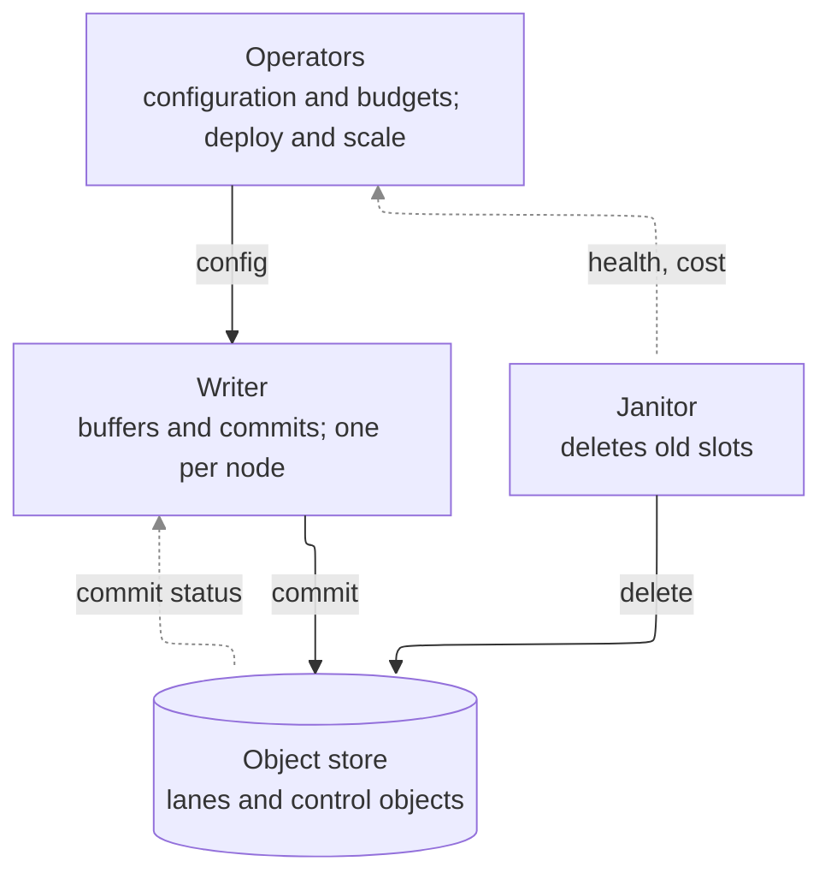

# A document with generated sections

### D1. A decision a requirement cites

<!-- stpa:begin ucas (generated from otel-chdb/stpa; edit the records, not this section) -->
| ID | Controller | Control action | Type | Unsafe when | Hazards |
| --- | --- | --- | --- | --- | --- |
| UCA-1 | Janitor | Delete a slot | T | Before every reader has passed it | H-1 |
<!-- stpa:end ucas -->

Prose between sections is the document's own.

<!-- stpa:begin structure (generated from otel-chdb/stpa; edit the records, not this section) -->

<!-- stpa:end structure -->
